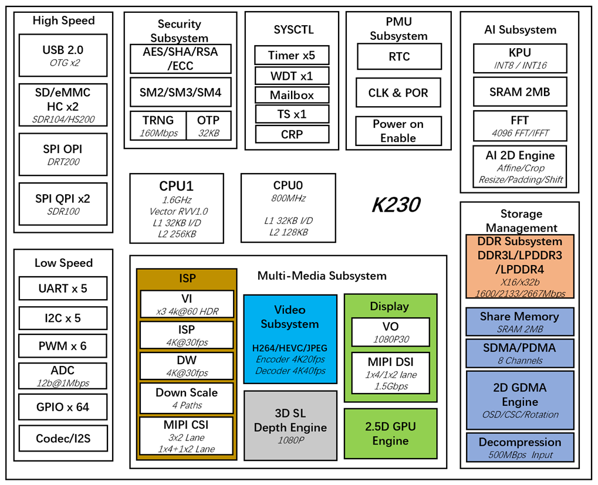
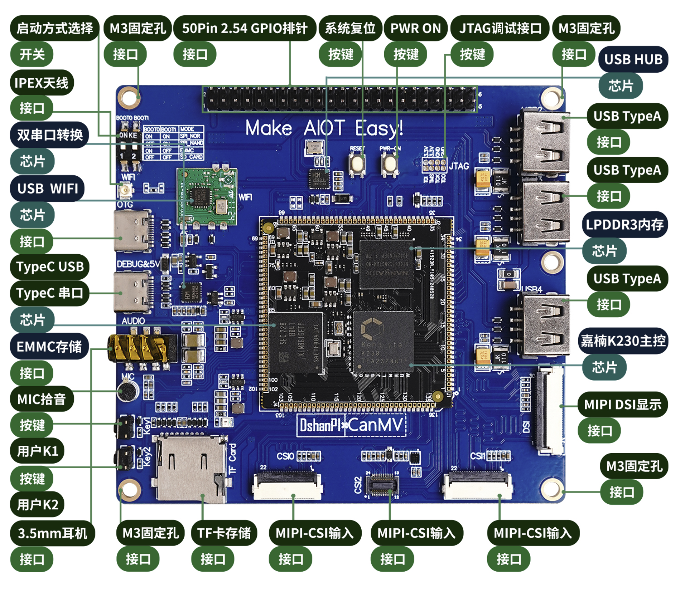

# 硬件资源简介

DshanPI-CanMV开发板是百问网针对AI应用开发设计出来的一个RSIC-V架构的AI开发板，主要用于学习使用嘉楠的K230芯片进行大小核项目开发和嵌入式AI应用开发等用途。DshanPI-CanMV开发板采用嘉楠科技Kendryte®系列AIoT芯片中的最新一代SoC芯片K230。该芯片采用全新的多异构单元加速计算架构，集成了2个RISC-V高能效计算核心，内置新一代KPU（Knowledge Process Unit）智能计算单元，具备多精度AI算力，广泛支持通用的AI计算框架，部分典型网络的利用率超过了70%。

该芯片同时具备丰富多样的外设接口，以及2D、2.5D等多个标量、向量、图形等专用硬件加速单元，可以对多种图像、视频、音频、AI等多样化计算任务进行全流程计算加速，具备低延迟、高性能、低功耗、快速启动、高安全性等多项特性。

DshanPI-CanMV开发板硬件资料：[DshanPI-CanMV开发板硬件原理图](https://dl.100ask.net/Hardware/MPU/DshanPIxCanMV/)

## 详细介绍

DshanPI-CanMV采用核心板+底板设计，扩展接口丰富，极大程度的发挥K230高性能的优势，可直接用于各种智能产品的开发，加速产品落地。

| 特征       | 描述                       |
| ---------- | -------------------------- |
| 处理器     | 嘉楠 勘智K230              |
| 内存       | 512MB/1GB/2GB LPDDR3       |
| 存储       | 8GB/32GB EMMC              |
| WIFI/蓝牙  | 天线：2.4GHz               |
| 视频输出   | MIPI显示(MIPI DSI)         |
| 视频输入   | 3路MIPI摄像头(MIPI CSI *3) |
| 音频输入   | MIC咪头                    |
| 音频输出   | 耳机                       |
| USB接口    | 3路USB-TypeA               |
| 其他连接器 | ·TF卡槽 · · JTAG调试口     |

### 开发板组成位置

 本章节介绍开发板中关键的元器件及位置功能介绍如下所示:

**开发板功能图：**

