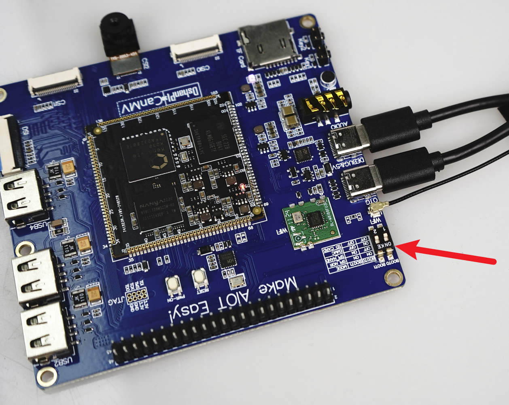
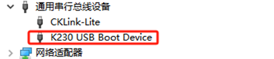
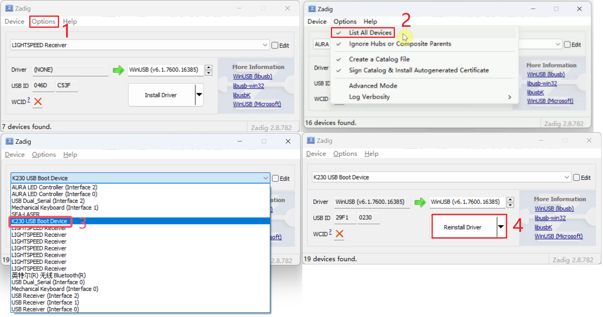
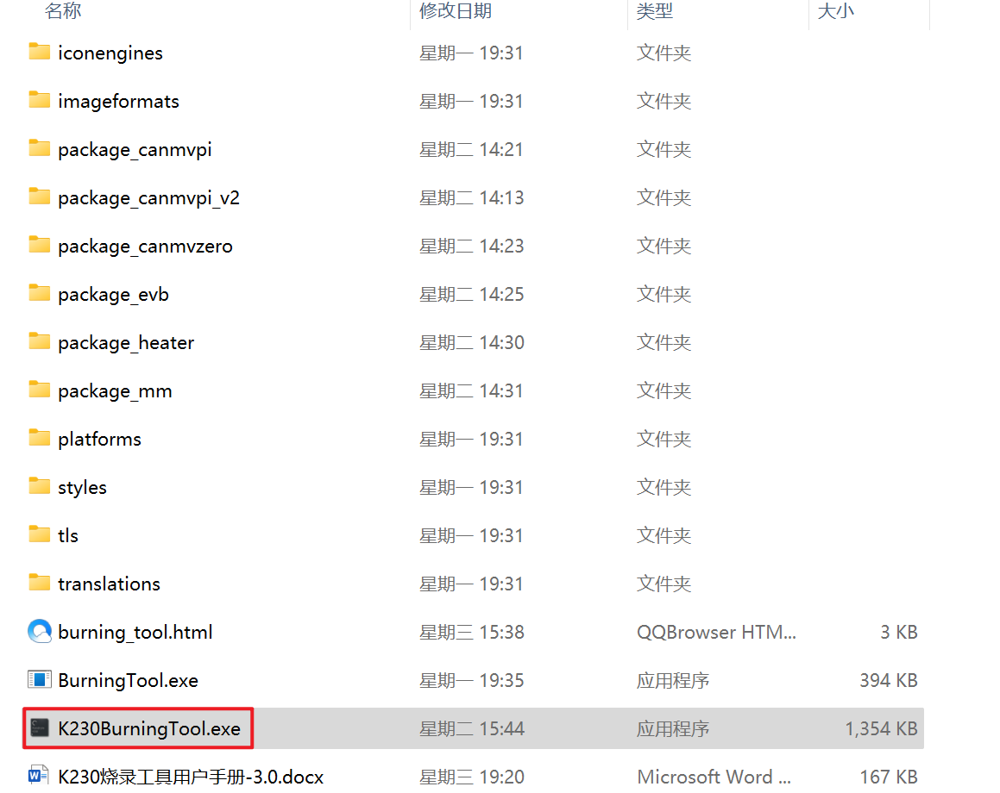
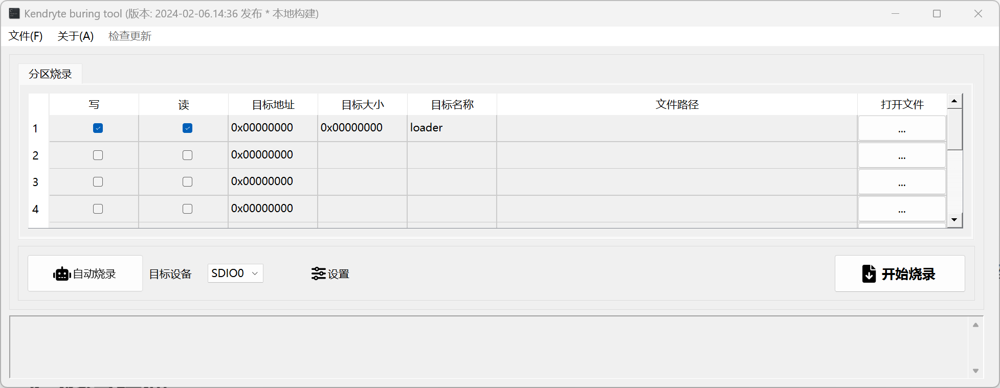
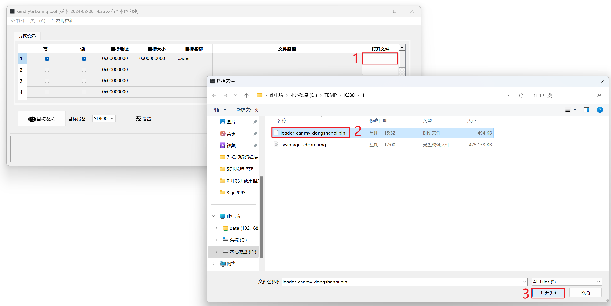
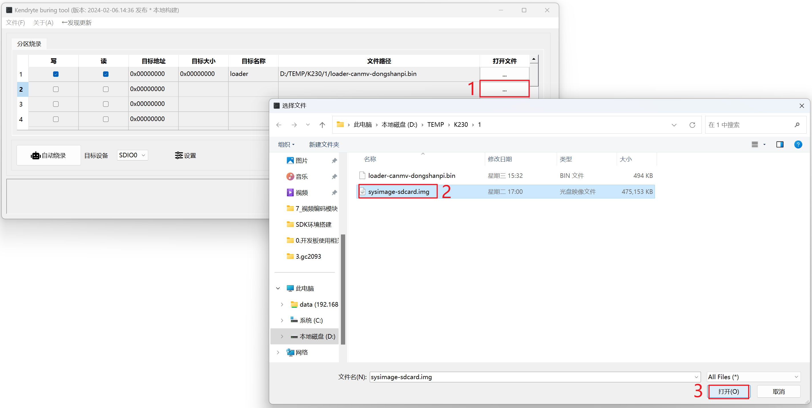
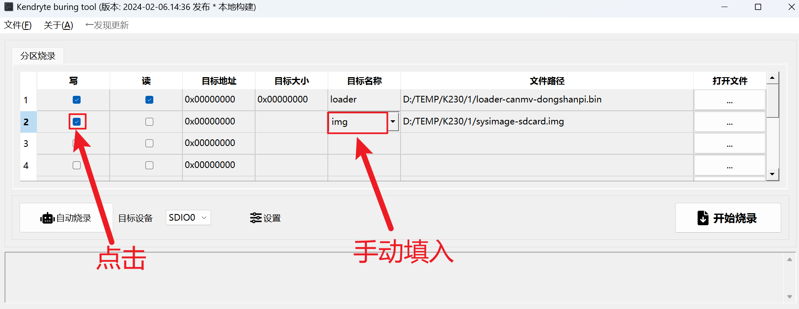
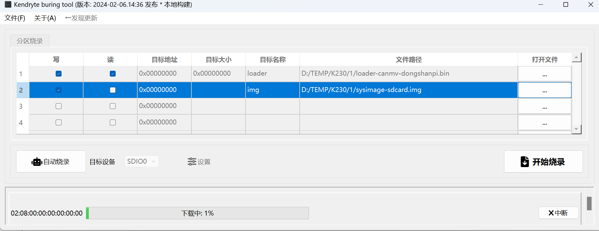
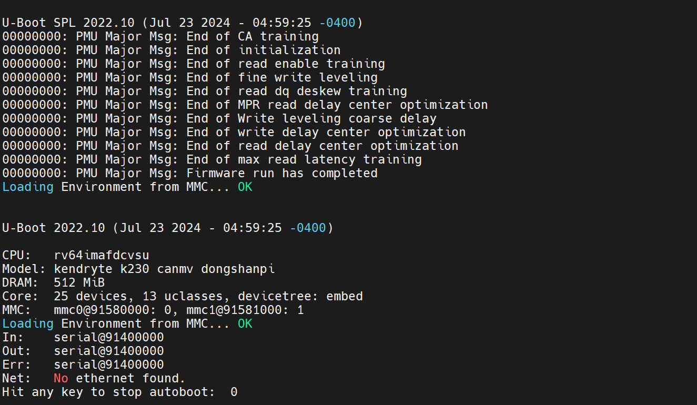

# 更新EMMC系统

 **硬件要求：**

- DshanPI-CanMV开发板

- Type-c数据线 x2

**软件要求：**

- DshanPI-CanMV开发板loader文件
- DshanPI-CanMV开发板系统镜像
- K230BurningTool烧录工具
- Zadig驱动安装软件

开始前请下载DshanPI-CanMV开发板系统镜像，并记住它在计算机中保存的位置。

## 1.1 硬件操作

 将下图中的拨码开关的boot0和boot1都向下拨，使开发板进入SD_CARD模式。使用两条Type-C线连接开发板端和电脑端，用于给开发板进行供电和使用OTG口进行烧录EMMC系统。

## 1.2 更新驱动

k230芯片上电从存储介质启动失败，且检查到连接了usb线，则会进入usb烧录模式。此时电脑上的设备管理器可以看到k230设备：

如果是下面这样的情况，则需要使用zadig-2.8.exe安装usb驱动：

打开Zadig软件，需要进行如下操作：

1. 选择**选项**
2. 勾选列出全部设备
3. 在下拉列表中选择K230 USB Boot Device
4. 选中K230设备后点击 Install Driver进行安装驱动

等待安装成功，安装成功后即可正常进行烧录操作。

## 1.3烧录镜像

下载EMMC镜像并记住它在计算机中的位置。打开K230BurningTool烧录工具，进入`KendryteBurningTool\bin`目录下，双击打开`BurningTool.exe`，如下所示的文件。

> 注意：在使用K230BurningTool烧录工具时需要关闭串口软件和虚拟机，防止串口被占用

打开`K230BurningTool`程序后会进入如下界面：

点击选择文件，选择下载好的loader文件。选择完成后点击保存，操作步骤如下所示：

点击选择文件，选择下载好的系统镜像文件。选择完成后点击保存，操作步骤如下所示：

对于系统镜像还需要手动选择**写**和填入目标名称，如下所示：

操作完毕后，点击**开始烧录**

软件就会自动烧录程序到开发板端，请耐心等待！！

> 注意：烧录完成后需要点击完成才能再次点击开始烧录

## 1.4 启动开发板

烧录成功后，需要将开发板端的Boot0调整为ON,Boot1调整为OFF，即使用EMMC方式启动。调整完成后按一下RST键，开发板将会使用烧录的系统启动。

