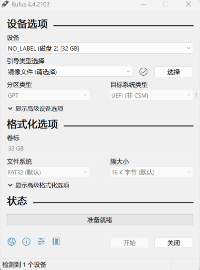
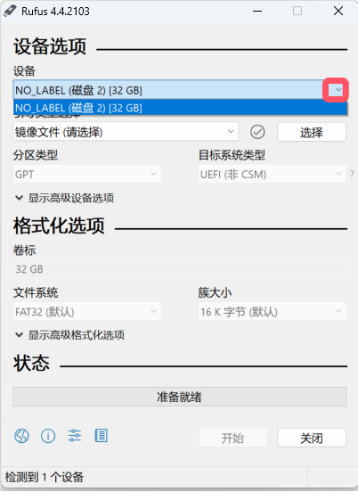
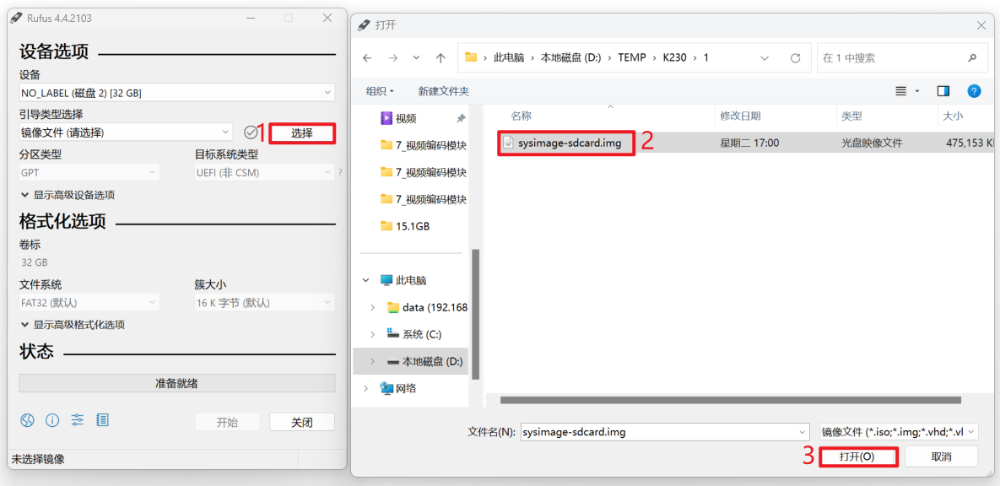
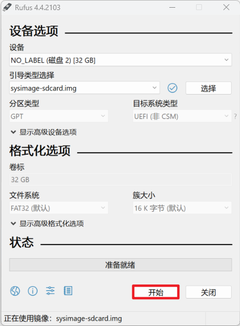
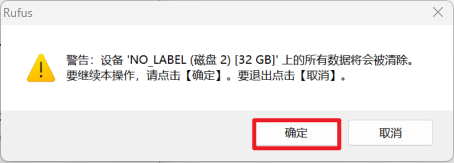
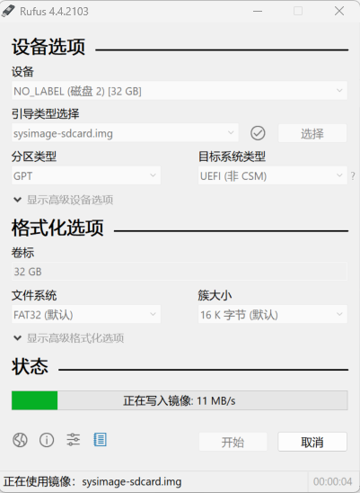
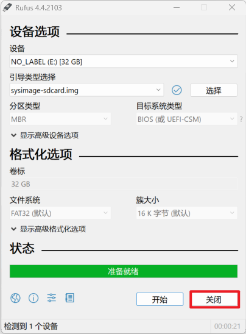
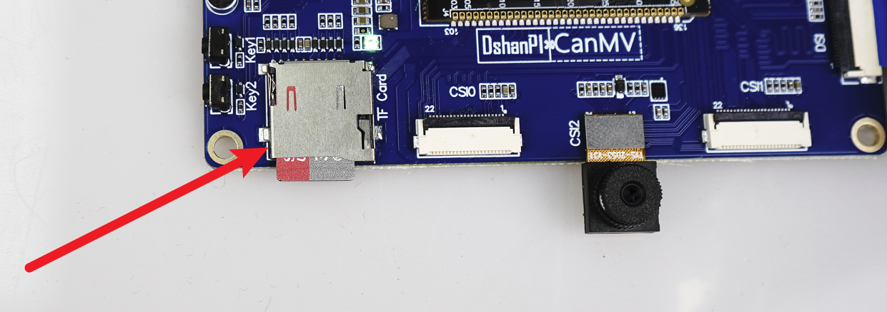
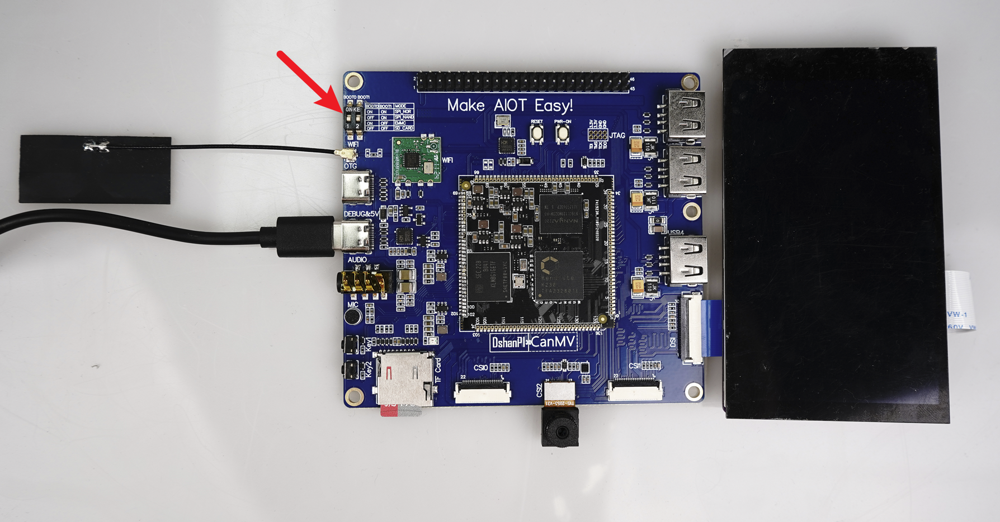

# 制作SD卡镜像

硬件要求：

- DshanPI-CanMV开发板
- microSD卡（建议最小8G）
- Type-c数据线 

软件要求：

- DshanPI-CanMV开发板SD卡镜像
- SD卡格式化工具：[SD Memory Card Formatter](https://www.sdcard.org/downloads/formatter_4/eula_windows/)
- SD卡刷机工具：[rufus](https://rufus.ie/zh/)

开始前请下载DongshanPI-Vision开发板SD卡镜像，并记住它在计算机中保存的位置。

## 1.格式化microSD卡

将您的SD卡使用读卡器通过USB口插入您的PC电脑，使用SD卡格式化工具[SD Memory Card Formatter在新窗口打开](https://www.sdcard.org/downloads/formatter_4/eula_windows/)格式化您的SD卡。点击下图中红框位置，开始格式化内存卡。

点击完成后会弹出下图所示的提示框，该提示警告我们格式化将清空卡中的所有数据，询问我们是否继续，这里点击`是`

等待格式化完成后，会弹出以下对话框，提示我们格式化后的文件系统为`FAT32`以及内存大小可用空间，点击确定即可完成SD卡的格式化。

## 2.使用rufus烧录镜像

 使用Etcher将DongshanPI-Vision开发板SD卡镜像写入您的microSD卡。

 下载[rufus](https://rufus.ie/zh/)烧写工具并安装它。启动Etcher应用程序，启动后界面如下图所示：

点击`设备的下拉列表`，如下图所示，点击下图红框处，选择插入的SD卡。

此时会弹出文件资源管理器，选择您刚刚下载的DongshanPI-Vision开发板SD卡镜像。

选择完成后会，显示下面的界面，点击下图中红框处`开始`。

点击开始后，会弹出警告，表示SD卡中的数据会被清理，点击`确定`。

点击确定后即可开始将系统烧录进SD卡中。

烧录完成后可点击关闭并在电脑端弹出SD卡。

## 3.启动SD卡系统

 将下图中的拨码开关的boot0拨为OFF和boot1拨为OFF，使开发板进入SD卡启动模式。将SD卡插入开发板的卡槽中，步骤如下图所示：

使用一条Type-C线连接开发板端和电脑端，用于给开发板进行供电和使用串口登录开发板控制台。

使用串口软件查看串口控制台，成功启动后会进入开发板控制台。