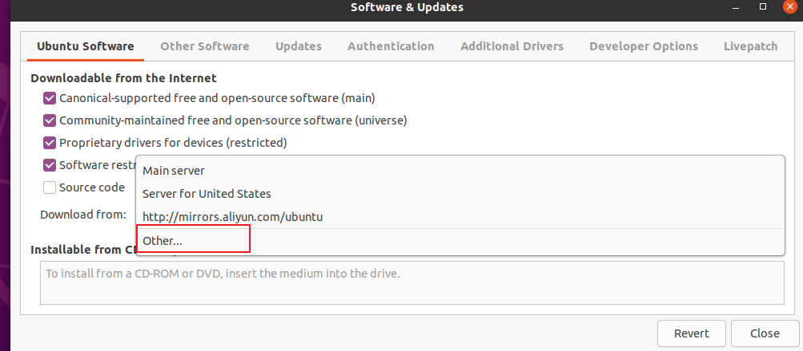
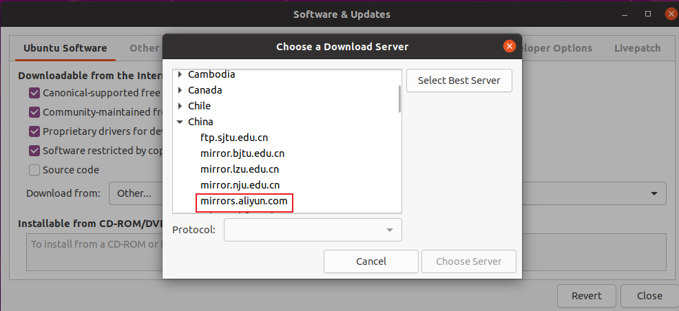
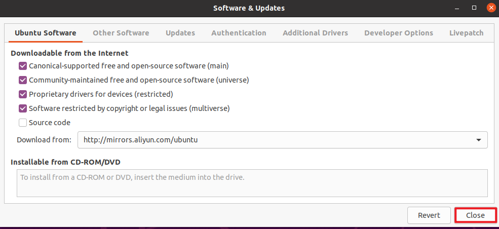
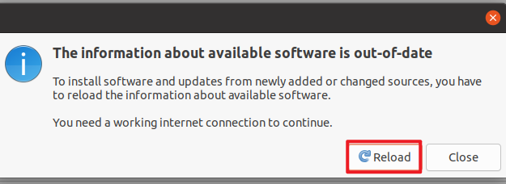

# K230 SDK环境搭建

## 前提条件

- Ubuntu20.04：[虚拟机下载地址，默认用户名为ubuntu,密码为ubuntu](https://www.linuxvmimages.com/images/ubuntu-2004/)

> 如果没有Ubuntu环境可以使用虚拟机，vmware下载链接：https://www.vmware.com/products/desktop-hypervisor.html


## 1.配置SDK环境

### 2.1 更新国内源

打开Ubuntu20.04系统自带的Software & Update软件


 点击Download from的下拉列表，找到Other选项。



找到国内的镜像源，这里以阿里云为例：



选择后输入虚拟机的密码(如果是通过文章开头获取的虚拟机，密码为ubuntu)。最后点击Close关闭选项框



关闭后会提示是否重新加载镜像源，点击Reload即可。

 

点击完成后会自动开始更新软件源！！！

### 2.2 使用apt安装软件包

更新apt软件源：

```
sudo apt update
```


安装软件包：

```
sudo apt-get install -y --fix-broken --fix-missing --no-install-recommends \
  sudo vim wget curl git git-lfs openssh-client net-tools sed tzdata expect mtd-utils inetutils-ping locales \
  sed make binutils build-essential diffutils gcc g++ bash patch gzip bzip2 perl tar cpio unzip rsync file bc findutils \
  dosfstools mtools bison flex autoconf automake \
  libc6-dev-i386 libncurses5:i386 libssl-dev \
  python3 python3-pip python-is-python3 \
  lib32z1 scons libncurses5-dev \
  kmod fakeroot pigz tree doxygen gawk pkg-config libyaml-dev libconfuse2 libconfuse-dev cmake
```

 

### 2.3 修改pip为清华源

编辑 `pip` 的配置文件，设置全局的 `pip` 配置选项

```
sudo vi /etc/pip.conf
```

 修改内容为：

```
[global]

timeout = 60

index-url = https://pypi.tuna.tsinghua.edu.cn/simple

extra-index-url = https://mirrors.aliyun.com/pypi/simple/ https://mirrors.cloud.tencent.com/pypi/simple
```

 

### 2.4 使用pip安装软件

```
python3 -m pip install -U pyyaml pycryptodome gmssl \
  numpy==1.19.5 protobuf==3.17.3 Pillow onnx==1.9.0 onnx-simplifier==0.3.6 onnxoptimizer==0.2.6 onnxruntime==1.8.0 cmake
```

 

### 2.5 安装微软软件包

1.使用wget下载一个名为 `packages-microsoft-prod.deb` 的文件，并将其保存到当前目录。

```
wget https://packages.microsoft.com/config/ubuntu/20.04/packages-microsoft-prod.deb -O packages-microsoft-prod.deb
```

2.使用 `dpkg` 工具安装软件包。

```
sudo dpkg -i packages-microsoft-prod.deb && rm packages-microsoft-prod.deb
```

3. 更新软件源

```
sudo apt-get update
```

 4.安装两个软件包.NET和 ICU（国际组件）的开发库

```
sudo apt-get install -y dotnet-runtime-7.0 libicu-dev
```


### 2.6 安装磁盘镜像工具

1.创建临时文件夹

```
mkdir tmp
```

2.获取磁盘镜像工具安装包

```
wget https://github.com/pengutronix/genimage/releases/download/v16/genimage-16.tar.xz -O ./tmp/genimage-16.tar.xz
```

3.进入临时文件夹

```
cd tmp/
```

4.解压安装压缩包

```
tar -xf genimage-16.tar.xz
```

5.进入工具源码目录

```
cd genimage-16
```

5.编译源码

```
./configure \
    && make -j \
```

6.安装程序

```
sudo make install && cd ../../
```


### 2.7 清理缓存

```
sudo rm -rf /var/lib/apt/lists/*
```


### 2.8 设置系统默认语言和字符编码

```
sudo localedef -i en_US -c -f UTF-8 -A /usr/share/locale/locale.alias en_US.UTF-8
```


### 2.9 创建工具链路径

```
sudo mkdir -p /opt/toolchain/
```


## 2.下载SDK

```
git clone https://e.coding.net/weidongshan/dshanpi-canmv/k230_sdk.git
```


## 3.编译SDK

### 3.1 进入SDK根目录

```
cd k230_sdk
```


### 3.2 下载toolchain

```
source tools/get_download_url.sh && make prepare_sourcecode
```


### 3.3 挂载工具链目录

```
sudo mount --bind $(pwd)/toolchain /opt/toolchain
```


### 3.4 编译SDK

```
make CONF=k230_canmv_dongshanpi_defconfig
```

> 注意： sdk不支持多进程编译，不要增加类似-j32多进程编译参数。

编译完成后，在`output/xx_defconfig/images`目录下可以看到编译输出产物。

```
.
├── big
│   ├── mpp
│   └── rt-smart
├── common
│   ├── big-opensbi
│   ├── cdk
│   └── little-opensbi
├── images
│   ├── big-core
│   ├── k230_canmv_dongshanpi_sdcard_v1.6_nncase_v2.8.3.img.gz -> sysimage-sdcard.img.gz
│   ├── little-core
│   ├── sysimage-sdcard.img
│   └── sysimage-sdcard.img.gz
└── little
    ├── buildroot-ext
    ├── linux
    └── uboot
```

`images`目录下镜像文件说明如下：

`sysimage-sdcard.img` ————-是sd和emmc的非安全启动镜像；

`sysimage-sdcard.img.gz` ——–是SD和emmc的非安全启动镜像压缩包(sysimage-sdcard.img文件的gzip压缩包)，烧录时需要先解压缩。

`sysimage-sdcard_aes.img.gz`是SD和emmc的aes安全启动镜像压缩包，烧录时需要先解压缩。

`sysimage-sdcard_sm.img.gz`是SD和emmc的sm安全启动镜像压缩包，烧录时需要先解压缩。

安全镜像默认不会产生，如果需要安全镜像请参考4.3.4使能安全镜像。

大核系统的编译产物放在`images/big-core`目录下。

小核系统的编译产物放在`images/little-core`目录下。
