# K230_SDK使用指南

## 1.概述

### 1. SDK软件架构概述

K230 SDK 是面向K230 开发板的软件开发包，包含了基于Linux&RT-smart 双核异构系统开发需要用到的源代码，工具链和其他相关资源。

K230 SDK 软件架构层次如图 1-1 所示：

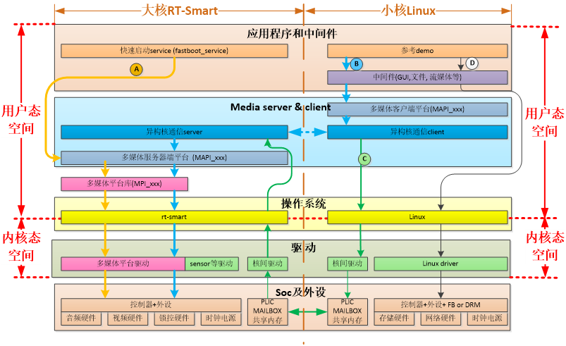

图1-1 K230 SDK 软件架构图

## 2.SDK 编译

### 1.SDK 编译介绍

K230 SDK支持一键编译大小核操作系统和公共组件，生成可以烧写的镜像文件，用于部署到开发板启动运行。设备上linux系统的用户名是root无密码；

### 2.SDK 配置

K230 SDK采用Kconfig作为SDK配置接口，默认支持的板级配置放在configs目录下。

K230 SDK采用Kconfig作为SDK配置接口，默认支持的板级配置放在configs目录下。

#### 2.1 配置文件说明

`k230_evb_defconfig` ：基于K230 USIP LP3 EVB的默认SDK配置文件
`k230_evb_usiplpddr4_defconfig` ：基于K230 USIP LP4 EVB的默认SDK配置文件
`k230d_defconfig` ：基于K230-SIP-EVB的默认SDK配置文件
`k230_evb_nand_defconfig` ：基于K230 USIP LP3 EVB会生成nand镜像的默认SDK配置文件
`k230_canmv_defconfig` ：基于K230-PI(canmv)的默认SDK配置文件

`k230_canmv_dongshanpi_defconfig`: 基于东山PI(canmv)的默认SDK配置文件

## 3. SDK产物介绍

SDK的编译请参考《SDK环境搭建》章节。

### 3.1 编译输出产物

编译完成后，在`output/xx_defconfig/images`目录下可以看到编译输出产物。

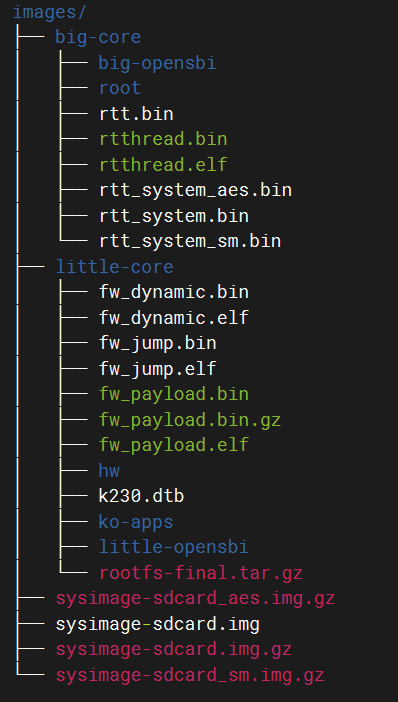

`images`目录下镜像文件说明如下：

`sysimage-sdcard.img` -------------是sd和emmc的非安全启动镜像；

`sysimage-sdcard.img.gz` --------是SD和emmc的非安全启动镜像压缩包(sysimage-sdcard.img文件的gzip压缩包)，烧录时需要先解压缩。

`sysimage-sdcard_aes.img.gz`是SD和emmc的aes安全启动镜像压缩包，烧录时需要先解压缩。

`sysimage-sdcard_sm.img.gz`是SD和emmc的sm安全启动镜像压缩包，烧录时需要先解压缩。

安全镜像默认不会产生，如果需要安全镜像请参考4.3.4使能安全镜像。

大核系统的编译产物放在`images/big-core`目录下。

小核系统的编译产物放在`images/little-core`目录下。

### 3.2 非快起镜像

sdk默认编译的是快起镜像(uboot直接启动系统，不会进入uboot命令行)，如果需要进入uboot命令行，请参考下面取消`CONFIG_QUICK_BOOT`配置：

在sdk主目录 执行 `make menuconfig` ，选择`board configuration`，取消`quick boot` 配置选项。

非快起系统变快起系统方法：进入uboot命行执行`setenv quick_boot true;saveenv;`

### 3.3 安全镜像

sdk默认不产生安全镜像，如果需要安全镜像，请参考下面增加CONFIG_GEN_SECURITY_IMG配置：

在sdk主目录 执行`make menuconfig` ，选择`board configuration`，配上`create security image` 选项。

### 3.4 debug镜像

sdk默认产生release镜像，如果需要调试镜像，请参考下面增加CONFIG_BUILD_DEBUG_VER配置：

在sdk主目录 执行`make menuconfig` ，选择`build debug/release version`，配上`debug` 选项。

## 5.SDK 镜像烧写

### 5.1 sd卡镜像烧录

#### 5.1.1 ubuntu下烧录

在sd卡插到宿主机之前，输入：

`ls -l /dev/sd\*`

查看当前的存储设备。

将sd卡插入宿主机后，再次输入：

`ls -l /dev/sd\*`

查看此时的存储设备，新增加的就是 sd 卡设备节点。

假设/dev/sdc 就是 sd卡设备节点，执行如下命令烧录SD卡：

`sudo dd if=sysimage-sdcard.img of=/dev/sdc bs=1M oflag=sync`

说明：`sysimage-sdcard.img`可以是`images`目录下的`sysimage-sdcard.img`文件，或者`sysimage-sdcard_aes.img.gz`、`sysimage-sdcard.img.gz`、`sysimage-sdcard_sm.img.gz`文件解压缩后的文件。

#### 5.1.2 Windows下烧录

Windows下可通过balena Etcher工具对sd卡进行烧录（[balena Etcher工具下载地址](https://www.balena.io/etcher/)）。

1）将TF卡插入PC，然后启动balena Etcher工具，点击工具界面的"Flash from file”按钮，选择待烧写的固件，如下图。

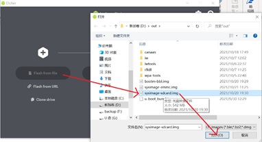

图5-1 选择固件

2）点击工具界面的“Select target”按钮，选择目标sdcard卡。

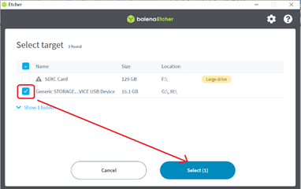

图5-2 选择SD卡

3）点击“Flash”按钮开始烧写，烧写过程有进度条展示，烧写结束后会提示Flash Finish。

4）当烧录完成后，将SD卡插入开发板卡槽，选择 BOOT为从SD启动，最后开发板上电即可从SD卡启动。

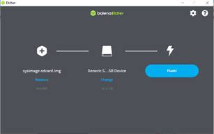

图5-3 开始烧录


图5-4 烧录完成

说明：使用`sysimage-sdcard_aes.img.gz`、`sysimage-sdcard.img.gz`、`sysimage-sdcard_sm.img.gz`文件时需要先解压缩，烧录解压缩后的文件。

### 5.2 Emmc镜像烧写参考

#### 5.2.1 Linux下烧写emm参考

1)把镜像的压缩包下载到sd卡

从sd卡启动linux，在linux下可以参考如下命令把镜像的压缩包下载到sd卡

```shell
ifconfig eth0 up;udhcpc;mount /dev/mmcblk1p4 /mnt;cd /mnt/;

scp wangjianxin@10.10.1.94:/home/wangjianxin/k230_sdk/output/k230_evb_defconfig/images/sysimage-sdcard.img.gz  .
```

2)把压缩包解压缩到emmc

`gunzip sysimage-sdcard.img.gz -c >/dev/mmcblk0`

3)切成emmc启动，重启板子

#### 5.2.2 Uboot下烧写emmc参考

1）把ssysimage-sdcard.img.gz镜像下载到内存。

```bash
usb start; dhcp;  tftp 0x900000010.10.1.94:wjx/sysimage-sdcard.img.gz;
 #注意：需要根据内存大小替换下0x9000000，比如内存只有128M的话，可以替换为0x2400000 
```

2）把镜像写到emmc

```bash
gzwrite mmc  0   0x${fileaddr}  0x${filesize};
```

3）重启板子

## 6.SDK内存配置

在k230_sdk下运行`make menuconfig->Memory configuration`可以配置各个区域使用的内存空间，也可以直接编译configs/k230_evb_defconfig修改，各区域说明如下

``` shell
CONFIG_MEM_TOTAL_SIZE="0x20000000"      #内存总体容量          不支持配置
CONFIG_MEM_PARAM_BASE="0x00000000"      #参数分区起始地址       不支持配置
CONFIG_MEM_PARAM_SIZE="0x00100000"      #参数分区大小           不支持配置
CONFIG_MEM_IPCM_BASE="0x00100000"       #核间通讯起始地址       不支持配置
CONFIG_MEM_IPCM_SIZE="0x00100000"       #核间通讯共享内存大小    不支持配置
CONFIG_MEM_RTT_SYS_BASE="0x00200000"    #大核RTT起始地址        支持配置
CONFIG_MEM_RTT_SYS_SIZE="0x07E00000"    #大核RTT使用的地址范围   支持配置
CONFIG_MEM_AI_MODEL_BASE="0x1FC00000"   #AI模型加载起始地址      支持配置
CONFIG_MEM_AI_MODEL_SIZE="0x00400000"   #AI模型加载地址区域      支持配置
CONFIG_MEM_LINUX_SYS_BASE="0x08000000"  #小核linux起始地址       支持配置
CONFIG_MEM_LINUX_SYS_SIZE="0x08000000"  #小核linux地址区域       支持配置
CONFIG_MEM_MMZ_BASE="0x10000000"        #mmz共享内存其实地址     支持配置
CONFIG_MEM_MMZ_SIZE="0x0FC00000"        #mmz 共享内存区域       支持配置
CONFIG_MEM_BOUNDARY_RESERVED_SIZE="0x00001000"  #隔离区         不支持配置
```

## 7.SDK单板调试

### 7.1 调试前准备

1.从 T-Head 公 司 的 [OCC 平 台](https://occ.t-head.cn/community/download)下载`T-Head-DebugServer`软件和《DebugServer User Guide v5.6》，并参考《DebugServer User Guide v5.6》在pc电脑上安装`T-Head-DebugServer`软件；

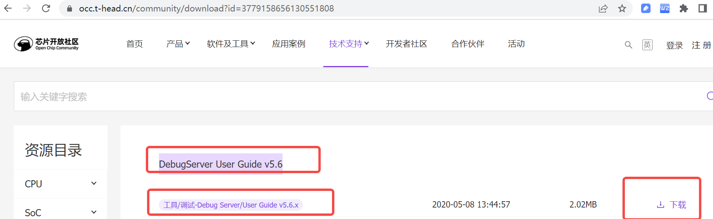

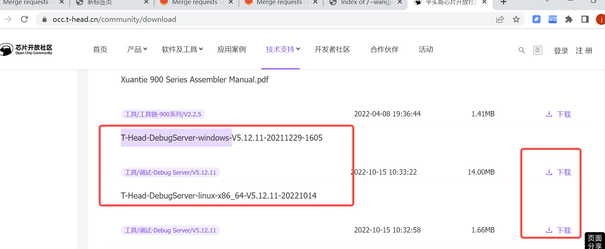

2.准备下图所示平头哥 cklink、usb线、k230 evb板

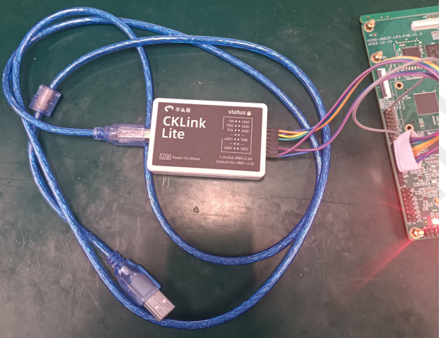

### 7.2 调试

1.参考下图把cklink 、k230 evb板子、pc电脑 连接起来，随后给evb上电。

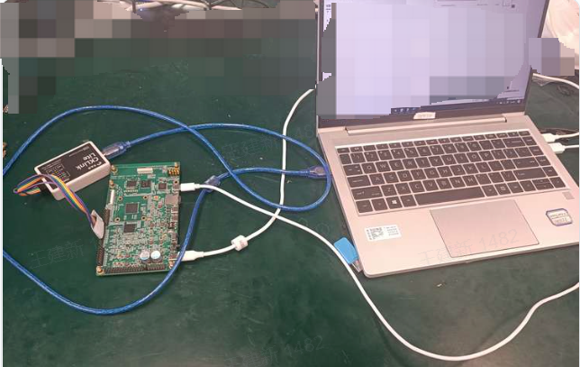

2.电脑上打开第1步安装的T-HeadDebugServer软件，看到类似如下图打印说明连接成功，如果连接失败请参考《DebugServer User Guide v5.6》排查失败原因。

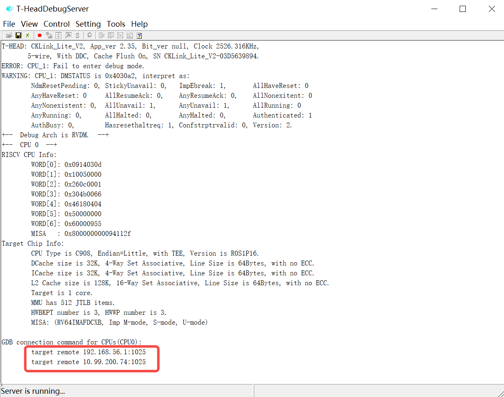

3.在编译代码的服务器上启动riscv64-unknown-linux-gnu-gdb执行target remote xx.xx.xx.xx1025 命令连接板子,连接成功后进行gdb调试。

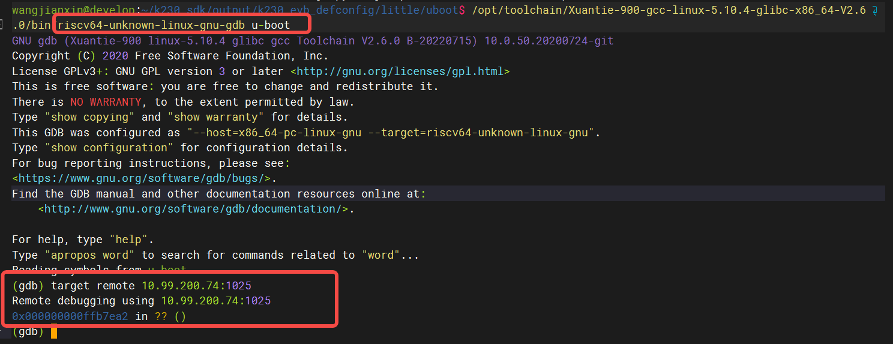

## 8.SDK启动

当前版本默认编译生成的镜像，烧录到板子上后，大核会自动运行一个程序。

SDK V0.7版本的自启动程序为基于OV9732摄像头的人脸检测程序，启动后可以在大核的控制台端输入'q'退出该程序。

若使用的EVB板没有连接OV9732，则该自启动程序会报错，同样在大核的控制台端输入'q'退出该程序。
若需要取消大核的自启动功能，需将 `k230_sdk/src/big/rt-smart/init.sh` 中的内容注释掉。

SDK V0.8版本的自启动程序是基于IMX335摄像头（板载晶振）的人脸检测程序，启动后在大核的控制台输入'q'可以退出程序。

同样的，如果没有连接IMX335，则自启动程序报错，程序自动退出。按回车即可回到控制台。

## 9.k230 debian和ubuntu 镜像说明

镜像及构建方法详见

> 上文有关Linux相关的内容不适用于RTT-only系统