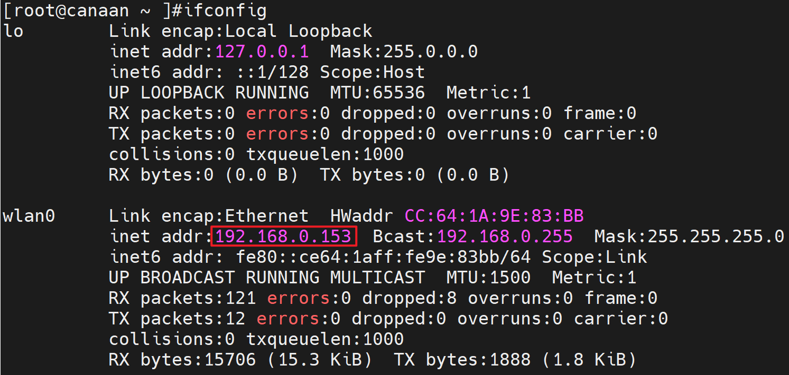
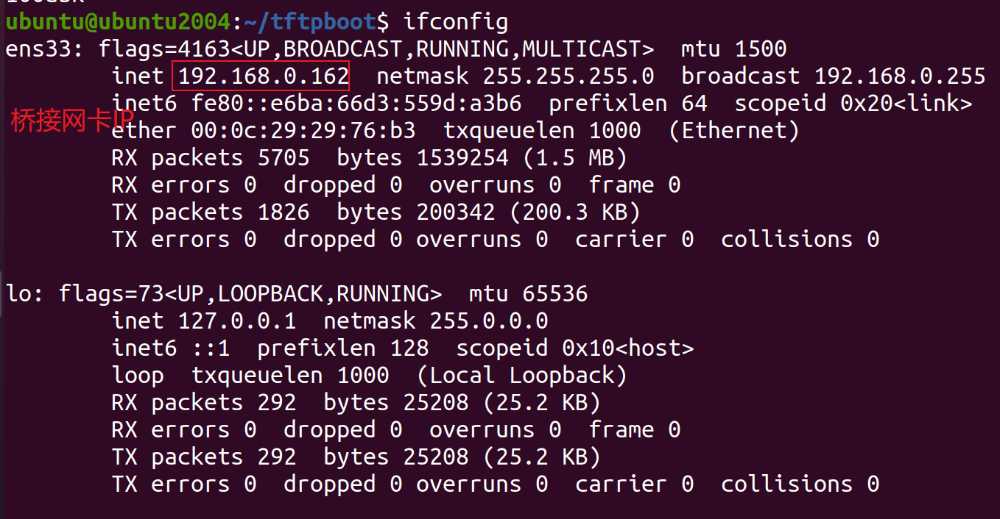

# 开发板文件传输

软件要求：

- Ubuntu20.04

硬件要求：

- DshanPI-CanMV开发板
- 天线 x1
- Type-C数据线 x2

在开始前请确保您的CanMV开发板已经成功连接至互联网。我们提供两种方法进行文件传输：

- SCP
- TFTP

您可以选择其中一种进行文件传输！！

## 1.设置Ubuntu虚拟机为桥接模式


## 2.使用SCP进行文件传输

在Ubuntu中，SCP（Secure Copy Protocol）是一种用于在本地和远程计算机之间安全复制文件的命令行工具。它基于SSH（Secure Shell）协议进行加密传输，确保数据在传输过程中不会被窃取或篡改。

### 2.1 确认开发板IP地址



这里我确认我的开发板的IP地址为：192.168.0.153，您需要在开发板端自行查看自己的开发板IP地址。

### 2.2 开发板通过SCP传输文件

> 注意：以下命令都需要在Ubuntu端执行！！

Ubuntu上传文件到开发板：

```
scp local_filename root@remote_ip:remote_folder
```

`remote_ip`填写开发板ip地址，`remote_ip`填写开发板的目录，例如根目录/home

Ubuntu从开发板下载文件：

```
scp root@remote_ip:remote_file_path local_path
```

`remote_ip`填写开发板ip地址，`remote_file_path`填写所要下载的文件的路径，`local_path`填写Linux本地路径


例如我需要将Ubuntu的home目录下的1.txt传输到开发板端的sharefs目录中：

```
ubuntu@ubuntu2004:~$ ls /home/ubuntu/
1.txt
buntu@ubuntu2004:~$ scp 1.txt root@192.168.0.153:/sharefs/
The authenticity of host '192.168.0.153 (192.168.0.153)' can't be established.
ECDSA key fingerprint is SHA256:iPcPuMuciiH7ckU+HvpWGIxmxGxLYE1wBgIrC+J2btI.
Are you sure you want to continue connecting (yes/no/[fingerprint])? yes
Warning: Permanently added '192.168.0.153' (ECDSA) to the list of known hosts.
1.txt                                                                   100%   15     0.5KB/s   00:00
```

> 注意：第一次传输时请输入yes，表示同意连接！！

如何从开发板下载文件到Ubuntu？比如我们现在开发板共享文件目录下有2.txt 的文本文件，传输命令为：

```
ubuntu@ubuntu2004:~$ scp root@192.168.0.153:/sharefs/2.txt ./
2.txt                                                                   100%   14     2.4KB/s   00:00 
ubuntu@ubuntu2004:~$ cat 2.txt 
100ask canaan
```


### 2.3 FAQ

1.主机密钥验证问题，报错信息为：

```
Please contact your system administrator.
Add correct host key in /home/ubuntu/.ssh/known_hosts to get rid of this message.
Offending ECDSA key in /home/ubuntu/.ssh/known_hosts:1
  remove with:
  ssh-keygen -f "/home/ubuntu/.ssh/known_hosts" -R "192.168.0.153"
ECDSA host key for 192.168.0.153 has changed and you have requested strict checking.
Host key verification failed.
lost connectio
```

解决办法：

```
ssh-keygen -f "/home/ubuntu/.ssh/known_hosts" -R "192.168.0.153"
```


## 3.使用TFTP进行文件传输

### 3.1 在Ubuntu下安装TFTP

在Ubuntu中执行以下命令安装TFTP服务：

```
sudo apt-get install tftp-hpa tftpd-hpa
```

然后，创建TFTP服务工作目录，并打开TFTP服务配置文件，如下:

```
mkdir -p /home/ubuntu/tftpboot
chmod 777 /home/ubuntu/tftpboot
sudo gedit /etc/default/tftpd-hpa
```

在配置文件/etc/default/tftpd-hpa中，将原来的内容删除，修改为：

```
TFTP_USERNAME="tftp"
TFTP_ADDRESS=":69"
TFTP_DIRECTORY="/home/ubuntu/tftpboot"
TFTP_OPTIONS="-l -c -s"
```

最后，重启TFTP服务

```
sudo service tftpd-hpa restart
```

查看tftp服务是否在运行,运行如下命令，即可查看是否在后台运行。

```
ubuntu@ubuntu2004:~/Desktop$ ps -aux | grep “tftp”
ubuntu 4555 0.0 0.0 9040 652 pts/0 S+ 02:33 0:00 grep --color=auto “tftp”
```


### 3.2 开发板通过tftp传输文件

首先确保Ubuntu或Windows的tftp服务目录内，有需要下载到板子上的文件，比如：

```
ubuntu@ubuntu2004:~$ ls /home/ubuntu/tftpboot/
1.txt
```

确认Ubuntu的网络IP，例如



比如下载Ubuntu服务器下的1.txt 文件，则在开发板上执行如下命令(Ubuntu的桥接网卡IP是 192.168.0.162)：

```
[root@canaan ~ ]$ tftp -g -r 1.txt 192.168.0.162
```


如何从开发板上传文件到Ubuntu？比如我们现在开发板家目录下创建一个2.txt 的文本文件，传输命令为：

```
tftp -p -l 2.txt 192.168.0.162
```

> 注意：TFTP中的上传/下载命令都需要在开发板中执行
