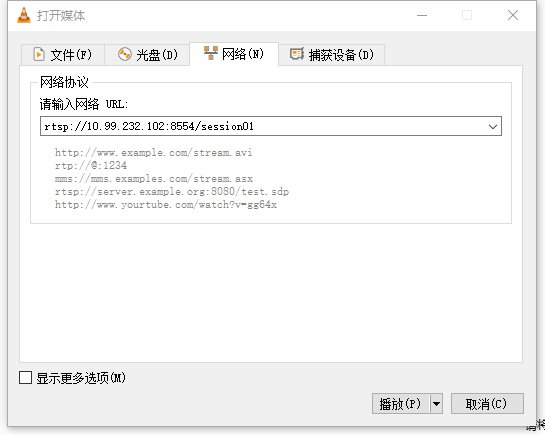

# K230 编码实战 - rtsp sever搭建和推流

## 1. 环境准备

### 1.1 硬件环境

- K230-USIP-LP3-EVB-V1.0/K230-UNSIP-LP3-EVB-V1.1
- Ubuntu PC 20.04
- Typec USB线 * 2。
  - 一根连接到UART0/3，用于串口收发，UART0对应小核，UART3对应大核。
  - 一根连接到DC:5V接口，用于供电。
- USB TypeC转以太网，连接到USB0。
- 网线一根
- SD卡(如果使用SD卡启动，或软件需要访问SD卡)
- 摄像头子板（IMX335，用于rtsp推音视频流）
- 耳机（用于语音对讲）
- 杜邦线一根，按下图连接USB0_OTG_EN和高电平


注意：音频对讲需要两套设备。

### 1.2 软件环境

- K230 SDK
- VLC播放器

### 1.3 运行准备

在EVB上执行rtsp程序需要启动网络服务，并保证PC和EVB板在同一个网段。

## 2. 源码介绍

### 2.1 源码位置

在SDK中包含的rtsp相关demo位于`k230_sdk/src/common/cdk/user/samples`目录下，其中

- `rtsp_demo`：语音推音视频流程序
- `rtsp`：语音对讲服务器端程序
- `backchannel_client`：语音对讲客户端程序

### 2.2 源码介绍

K230 SDK采用双核架构，小核运行linux系统，实现网络控制服务。大核运行RTT系统，实现对音视频硬件的控制。小核在启动过程中负责引导大核。大小核通过核间通信进行消息通信和内存共享。多媒体软件架构如下：


小核网络服务移植了live源码，路径为`k230_sdk/src/common/cdk/user/thirdparty/live`
音频使用G711编码。
音视频推流中，视频默认最大分辨率与配置的sensor_type相关，默认最大分辨率为1920x1080。

#### 2.2.1 程序主要步骤

##### 2.2.1.1 音视频推流程序

1. `new StreamingPlayer`
   - 初始化核间通信。
   - 配置video buffer。
1. `InitVicap`：初始化摄像头。
1. `CreateSession`：
   - 创建server session。
   - 创建并开启音频输入通道，音频采样率为44.1k，采样宽度16bit。
   - 初始化音频编码，音频采用G711A编码。
   - 创建视频编码通道，使能IDR帧。
1. `Start`：
   - 开启视频编码通道并绑定到vo。
   - 开启视频编码通道，并将视频输入绑定到视频编码。
   - 开始音视频推流。

##### 2.2.1.2 语音对讲程序

1. `Init`：
   - 创建server session。
   - 初始化核间通信。
   - 配置video buffer。
   - 创建并开启音频输入通道，音频采样率为8k，采样宽度为16bit。
   - 创建音频编码通道，音频采用G711U编码。
   - 创建音频输出通道和音频解码通道，并将音频解码绑定到音频输出。
1. `Start`：
   - 开始推音频流。
   - 开启视频编码通道，并将视频输入绑定到视频编码。

## 3.程序执行

### 3.1 rtsp推音视频流

#### 3.1.1 参数说明

| 参数名 | 描述 |参数范围 | 默认值 |
|:--|:--|:--|:--|
| help | 打印命令行参数信息 | - | - |
| n | session个数 | `[1, 3]` | 1 |
| t | 编码类型 | h264、h265、mjpeg | h264 |
| w | 视频编码宽度 | `[128, 1920]` | 1280 |
| h | 视频编码高度 | `[64, 1080]` |720 |
| s | sensor类型。| 0: ov9732；1: ov9286 ir；2: ov9286 speckle；3: imx335 2LANE 1920Wx1080H；4: imx335 2LANE 2592Wx1944H；5: imx335 4LANE 2592Wx1944H；6: imx335 2LANE MCLK 7425 1920Wx1080H；7: imx335 2LANE MCLK 7425 2592Wx1944H；8: imx335 4LANE MCLK 7425 2592Wx1944H | 7 |

#### 3.1.2 编译程序

在`k230_sdk`目录下执行`make cdk-user`，在`k230_sdk/src/common/cdk/user/out/little/`目录下生成`rtsp_demo`

程序源码目录`k230_sdk/src/common/cdk/user/samples/rtsp_demo`

#### 3.1.3 运行程序

支持音视频码流同时推流到rtsp server上，其中通过`mapi venc&aenc`接口实现对音视频的编码；推流之后通过url进行拉取，目前支持两路url推拉流。

1. 在大核上执行：`cd /sharefs; ./sample_sys_init.elf`
1. 在小核上执行：`./rtsp_demo`
1. 小核上运行rtsp_demo后，会打印出形如：`rtsp://ip:8554/session0` 和 `rtsp://ip:8554/session01` 的url地址，可通过vlc拉取对应的流进行播放。
   vlc拉流方式：媒体->打开网络串流->在打开的窗口中输入对应的url。
   

### 3.2 语音对讲

用于实现音频数据的双向传输和处理。
语音对讲涉及到两端，两端均能实时采集编码发送音频数据到对端，同时也能接收对端来的音频数据进行解码和输出。
当前实现参照了ONVIF，在rtsp协议的基础上扩展backchannel，从而支持从client向server发送音频数据；下文使用server和client分别代指语音对讲的两端。

1. 音频码流格式为G711 mu-Law；
1. sever端实现了实时的音频采集编码和发送，以及通过backchannel接收来自client的音频数据进行解码和输出；
1. client端实现了音频码流的接收,解码和播放，以及实时采集音频，G711 mu-Law编码，并通过backchannel发送到server端
1. 仅支持一对一的对讲（仅支持一路backchannel）；
1. 不支持回声消除等处理（设备侧需要音频输出到耳机，不能使用外放speaker）；

#### 3.2.1 编译程序

在`k230_sdk`目录下执行`make cdk-user`，在`k230_sdk/src/common/cdk/user/out/little/`目录下生成`rtsp_server`和`backclient_test`

程序源码目录:
`k230_sdk/src/common/cdk/user/samples/rtsp_demo/rtsp_server`
`k230_sdk/src/common/cdk/user/samples/rtsp_demo/backchannel_client`

#### 3.2.2 运行程序

两块EVB连到同一个网段，一个作为server，一个作为client。大小核完全启动后。

server端运行如下命令：

- 在大核上执行：`cd /sharefs; ./sample_sys_init.elf`
- 在小核上执行：`cd /mnt; ./rtsp_server`（运行rtsp_server后，会打印出形如：`rtsp://<server_ip>:8554/BackChannelTest` 的url地址）

client端运行如下命令：

- 在大核上执行：`cd /sharefs; ./sample_sys_init.elf`
- 在小核上执行：`./backclient_test rtsp://<server_ip>:8554/BackChannelTest`）

## 4. 运行sharefs

大核的`sample_sys_init.elf`默认没有装载到大核。可以通过下面两中方式将其在大核运行。

1. 修改`k230_sdk/Makefile`中`mpp-apps`的编译脚本，在`cd -;`前增加如下命令，并在`k230_sdk`目录下执行`make rt-smart;make build-image`，生成的镜像文件中，在大核的`/bin`目录下即包含`sample_sys_init.elf`

    ```sh
    cp userapps/sample/elf/sample_sys_init.elf $(RTSMART_SRC_DIR)/userapps/root/bin/; \
    ```

1. 启动大小核之后，通过sharefs和tftp将可执行程序传输到EVB板上运行。
   /sharefs用于在大小核之间共享文件，大小核均可以通过访问各自的/sharefs目录来实现共享文件系统的功能。大核的自身文件系统为只读模式。可以在小核将/sharefs目录mount到SD卡分区或者PC的nfs目录等，并可通过tftp实现文件传输功能。

    ```sh
    mount /dev/mmcblk1p4 /sharefs #将/sharefs mount到SD卡分区
    ```

    ```sh
    mount -t nfs -o nolock <ipaddr>:<nfs_path> /sharefs/ #将/sharefs mount到ipaddr的nfs_path目录
    ```

    tftp的命令如下：

    ```sh
    tftp -gr <filename> <ipaddr> #从ipaddr的主机上将文件<filename>传输到板卡上
    tftp -pl <filename> <ipaddr> #将文件<filename>从板卡传输到ipaddr的主机上
    ```
