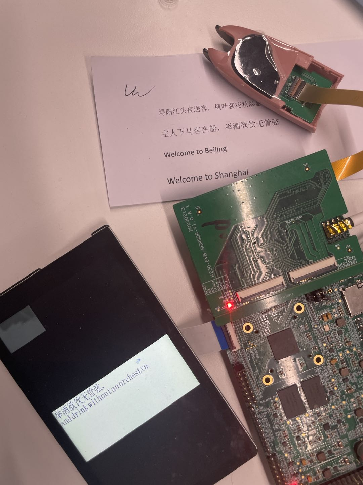
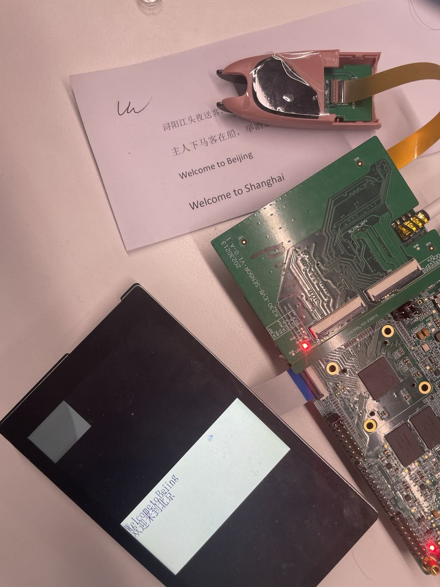

# K230 场景实战-词典笔POC

## 1.K230 词典笔

在K230平台开发的一套集成UI、文字识别、文字翻译功能的程序。

### 1.1 硬件环境

- K230-USIP-LP4-EVB-V1.0
- 配套的LCD模组
- K230-USIP-SC035-SENSOR-V1.1模组

### 1.2 概述

词典笔程序作为一个POC项目，提供给客户如何使用vicap采集数据、在做ai处理，最后推给显示功能的参考，程序主要在大核上运行，大核上完成了图像采集、图像转成文字、文字翻译的功能，在开发板通过sd卡启动，ddr大小需要使用2G。

### 1.3 备注

1.下电和reset之前，应现在小核串口端输入`halt`,保护文件系统不被损坏。

### 1.4 源码位置

程序源码路径位于`src/reference/business_poc/dictionary_pen_poc`，目录结构如下：

```
.
├── audio
│   ├── audio_buf_play.cc
│   ├── audio_buf_play.h
│   └── sample_audio.c
├── build.sh
├── CMakeLists.txt
├── main.cpp
├── README.md
├── include
│   ├── API
│   ├── det_ocr
│   └── stitch
│   └── tts
└── vo
    ├── vo.cc
    └── vo.h
```


其中include中的代码时算法同事提供的、每个kmodel和代码需要匹配使用。

#### 1.4.1 编译程序

K230-USIP-LP4-EVB-V1.0开发板编译程序： 在`k230_sdk`目录下执行`make prepare_sourcecode CONF=k230_evb_usiplpddr4_dictionary_pen_defconfig`，这个时下载词典笔的源码和komdel 。在`k230_sdk`目录下执行 `make CONF=k230_evb_usiplpddr4_dictionary_pen_defconfig` ，目录`k230_sdk/output/k230_evb_usiplpddr4_dictionary_pen_defconfig/images/big-core/app/`下生成程序目录`dictionary_pen`，其中执行程序是`dictionary_pen.elf`。

备注： 在`make prepare_sourcecode` 的时候必须加上`CONF=k230_evb_usiplpddr4_dictionary_pen_defconfig` 否则不会下载词典笔运行所需的kmodel。

#### 1.4.2 运行程序

词典笔demo在sd卡镜像中，默认时不启动的，需要手动运行。K230-USIP-LP4-EVB-V1.0开发板编译完成之后会在`output/k230_evb_usiplpddr4_dictionary_pen_defconfig/images/`目录下生成`sysimage-sdcard.img`镜像。运行开发板进入大核`sharefs\app\dictionary_pen`目录下运行`dictionary_pen.elf`,然后就可以通过词典笔的笔头去扫描文字做翻译。

备注： 1.当词典笔的笔头按下的时候开始扫描文字、松开词典笔的笔头开始做翻译，词典笔的显示会显示翻译的前文字和翻译后的文字。 2.目前词典笔的demo只支持中英文之间的翻译。

#### 1.4.3 功能演示

程序运行结果中文翻译成英文如下：

程序运行结果英文翻译成中文如下：
