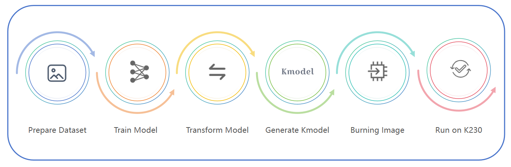

# 1. 介绍

K230芯片是嘉楠科技 Kendryte®系列AIoT芯片中的最新一代SoC产品。该芯片采用全新的多异构单元加速计算架构，集成了2个RISC-V高能效计算核心，内置新一代KPU（Knowledge Process Unit）智能计算单元，具备多精度AI算力，广泛支持通用的AI计算框架，部分典型网络的利用率超过了70%。 该芯片同时具备丰富多样的外设接口，以及2D、2.5D等多个标量、向量、图形等专用硬件加速单元，可以对多种图像、视频、音频、AI等多样化计算任务进行全流程计算加速，具备低延迟、高性能、低功耗、快速启动、高安全性等多项特性。

在CanMV-K230开发板进行AI开发需要完成数据准备、模型训练、模型转换、KModel生成、镜像烧录和板上运行等步骤。本文档总结了使用CanMV-K230进行AI开发的资源和工具，提供给用户不同场景的解决方案；同时本教程提供给用户对应工具的详细操作教程和AI应用开发代码教程，提高用户的开发效率。

针对不同用户，我们建议按需关注不同章节，循序渐进完成学习。

| 章节                           | 章节要点                                                     | 学习指南                                                     | 类型           | 学习难度 |
| ------------------------------ | ------------------------------------------------------------ | ------------------------------------------------------------ | -------------- | -------- |
| 第2章：开发基础                | 介绍了K230_SDK和nncase，是K230开发板部署的环境搭建和模型转换的基础。 | K230开发板AI应用开发的基础。                                 | 基础类         | Ⅰ        |
| 第3章：K230 AI Demo概述        | 介绍了不同场景下的50多个AI Demo示例，并提供了源码地址和运行教程。 | 适合对K230可运行AI Demo感兴趣，并有意进行其他场景Demo开发的用户阅读。 | 应用类         | Ⅱ        |
| 第4章：K230 Fancy POC概述      | 介绍了使用K230 开发板实现的POC，并提供了源码地址和运行教程。 | 适合对使用K230支持的POC感兴趣，并使用K230搭建实际应用验证的用户阅读。 | 应用类         | Ⅱ        |
| 第5章：快速入门K230 AI推理流程 | 本章节介绍了使用K230开发过程中多媒体相关内容，包括视频帧的获取，屏幕显示等，提供了C++和MicroPython源码教程。 | 适合对使用K230进行AI推理流程感兴趣，对多媒体部分不熟悉，具备自主编写调试代码能力的用户阅读。 | 教程类         | Ⅲ        |
| 第6章：深入解析AI开发流程      | 以人脸检测和人脸识别为例，详细介绍了使用第三方开源项目实现训练、模型转换、开发板代码编写、上板运行的流程。 | 适合已了解K230开发板，并有将其他开源模型在K230开发板上运行的需求，具备自主编写调试代码能力的用户阅读。 | 教程类         | Ⅳ        |
| 第7章：开发工具简介            | 介绍了嘉楠提供的多种开发工具，并说明了不同工具的优点和局限，以及适配的用户场景。 | 适合想了解K230开发工具的用户阅读。                           | 基础类         | Ⅰ        |
| 第8章：使用在线云训练平台开发] | 在线云训练平台是一个使用远端计算资源、界面化模型训练的工具，介绍了如何使用在线云训练平台完成图像分类和目标检测任务。 | 适合想使用嘉楠在线云训练平台训练模型并完成板上部署的用户阅读。 | 工具类         | Ⅱ        |
| 第9章：使用AI Cube开发         | AI Cube是一个使用本地计算资源、界面化模型训练的工具，介绍了如何使用AI Cube在Ubuntu和Windows平台完成任务并在K230开发板部署。 | 适合想使用嘉楠AI Cube训练模型并完成板上部署的用户阅读。      | 工具类         | Ⅱ        |
| 第10章：源码级应用开发         | 使用KTS(k230_training_scripts)完成了图像分类和目标检测任务，提供了训练和部署的源码，从源码操作层面告诉用户怎么做。 | 适合想从源码操作层面实现应用开发，完成板上部署，并想了解从代码层面各步骤都做了什么的用户阅读。 | 工具类、教程类 | Ⅲ        |
| 第11章：CanCollectorPlus       | 介绍了开发板数据采集工具CanCollectorPlus，提供了CanCollectorPlus快速上手使用的教程。 | 适合对CanCollectorPlus工具感兴趣或遇到因数据集问题导致训练和部署效果不一致的用户阅读。 | 工具类         | Ⅱ        |