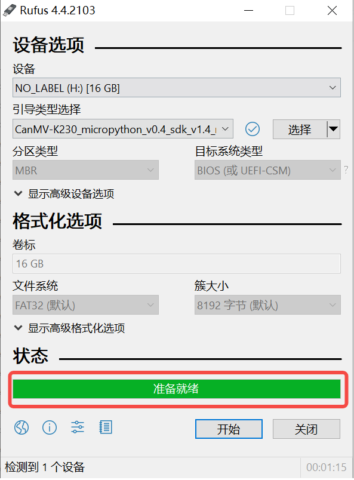

# 2 开发基础

本章帮助用户熟悉K230软件开发的基础底层工具，对K230_SDK和nncase进行简单介绍，帮助用户熟悉SDK环境搭建、镜像编译烧录、kmodel转换的过程。

## 2.1 K230 SDK

### 2.1.1. K230 SDK 简介

K230 SDK 是面向K230 开发板的软件开发包，包含了基于Linux&RT-smart 双核异构系统开发需要用到的源代码，工具链和其他相关资源。源码地址：[kendryte/k230_sdk: (github.com)](https://github.com/kendryte/k230_sdk) 或 [kendryte/k230_sdk: (gitee.com)](https://gitee.com/kendryte/k230_sdk)。


K230 SDK软件架构层次如图所示：


### 2.1.2. 配置软件开发环境

K230 SDK需要在Linux环境下编译，推荐使用Ubuntu Linux 20.04。

> 如需使用windows环境编译，建议使用WSL2 + Docker环境。

获取docker编译镜像 推荐在docker环境中编译K230 SDK，可直接使用如下docker镜像：

```
docker pull ghcr.io/kendryte/k230_sdk
```


可使用如下命令确认docker镜像拉取成功：

```
docker images | grep k230_sdk
```


> 说明： docker镜像中默认不包含toolchain，下载源码后，使用命令’make prepare_sourcecode’会自动下载toolchain至当前编译目录中。

如果不使用docker编译环境，而是希望使用原生Linux进行编译，可参考`tools/docker/Dockerfile`，安装相应的工具至您的Linux系统中即可。

如下载速度较慢或无法成功，可使用`tools/docker/Dockerfile`自行编译docker image，详情请参考K230 SDK使用说明

### 2.1.3. 编译K230 SDK

镜像的烧录与编译可参考《开发环境搭建指南》

#### 2.1.3.5. 镜像烧录

**Linux:**

在TF卡插到宿主机之前，输入：

```
ls -l /dev/sd\*
```


查看当前的存储设备。

将TF卡插入宿主机后，再次输入：

```
ls -l /dev/sd\*
```


查看此时的存储设备，新增加的就是TF卡设备节点。

假设/dev/sdc就是TF卡设备节点，执行如下命令烧录TF卡：

```
sudo dd if=sysimage-sdcard.img of=/dev/sdc bs=1M oflag=sync
```


**Windows:**

Windows下可通过rufus工具对TF卡进行烧录，[rufus工具下载地址](http://rufus.ie/downloads/)。

1）将TF卡插入PC，然后启动rufus工具，点击工具界面的”选择”按钮，选择待烧写的固件。


2）点击“开始”按钮开始烧写，烧写过程有进度条展示，烧写结束后会提示“准备就绪”。




## 2.2. nncase简介

### 2.2.1. nncase介绍

`nncase`是面向 AI 加速器的神经网络编译器，用于为 `Kendryte`系列芯片生成推理所需要的模型文件 `.kmodel`，并提供模型推理所需要的 `runtime lib`。

本教程主要包括以下内容：

1. 使用 `nncase`完成模型编译，生成 `kmodel`。
2. 在PC和开发板上执行 `kmodel`推理。

### 2.2.2. 模型编译和模拟器推理

#### 2.2.2.1. 安装nncase工具链

nncase工具链包括 `nncase`和 `nncase-kpu`插件包，两者均需正确安装才可以编译出CanMV-K230所支持的模型文件。`nncase`和 `nncase-kpu`插件包均在[nncase github release](https://github.com/kendryte/nncase/releases)发布，并且依赖dotnet-7.0。

- `Linux`平台可以直接使用pip进行 `nncase`和 `nncase-kpu`插件包在线安装，Ubuntu环境下可使用 `apt`安装 `dotnet`。

  ```
  pip install --upgrade pip
  pip install nncase
  pip install nncase-kpu
  # nncase-2.x need dotnet-7
  sudo apt-get update
  sudo apt-get install -y dotnet-sdk-7.0
  ```

  

  > Tips：如果使用官方提供的CanMV镜像，必须检查SDK中nncase的版本和使用pip安装的nncase版本是否一致。

- `Windows`平台仅支持`nncase`在线安装，`nncase-kpu`需要在[nncase github release](https://github.com/kendryte/nncase/releases)手动下载安装。

- 用户若没有Ubuntu环境, 可使用 `nncase docker`(Ubuntu 20.04 + Python 3.8 + dotnet-7.0)

  ```
  cd /path/to/nncase_sdk
  docker pull ghcr.io/kendryte/k230_sdk
  docker run -it --rm -v `pwd`:/mnt -w /mnt ghcr.io/kendryte/k230_sdk /bin/bash -c "/  bin/bash"  
  ```

  

  > Tips：目前仅支持py3.6-3.10，如果pip安装失败请检查pip对应的Python版本。

#### 2.2.2.2. 环境配置

使用pip安装软件包后,需将安装路径添加到PATH环境变量中。

```
export PATH=$PATH:/path/to/python/site-packages/
```


#### 2.2.2.3. 原始模型说明

`nncase`目前支持 `tflite`、`onnx`格式的模型，更多格式的支持还在进行中。

> Tips：
>
> 1. 对于TensorFlow的`pb`模型,请参考官方文档将其转换为`tflite`格式。注意不要设置量化选项,直接输出浮点模型即可。如果模型中存在quantize和dequantize算子,则属于量化模型，目前不支持。
> 2. 对于PyTorch的`pth`等格式模型,需使用`torch.export.onnx`接口导出`onnx`格式。

#### 2.2.2.4. 编译参数说明

进行模型编译前,您需要了解以下关键信息:

1. `KPU`推理使用定点运算。因此在编译模型时,必须配置量化相关参数,用于将模型从浮点转换为定点。详见 `nncase`文档中的PTQTensorOptions说明。
2. `nncase`支持将前处理层集成到模型中，这可以减少推理时的前处理开销。相关参数和示意图见 `nncase`文档的CompileOptions部分。

#### 2.2.2.5. 编译脚本说明

本[Jupyter notebook：(github.com)](https://github.com/kendryte/nncase/blob/master/examples/user_guide/k230_simulate-ZH.ipynb)或[Jupyter notebook：(gitee.com)](https://gitee.com/kendryte/nncase/blob/master/examples/user_guide/k230_simulate-ZH.ipynb)分步骤详细描述了使用nncase编译、推理kmodel的流程，notebook内容涵盖:

- 参数配置:介绍如何正确配置编译参数,以满足实际部署需求；

- 获取模型信息:说明从原始模型中获取网络结构、层信息等关键数据的方法；

- 设置校正集数据:阐述如何准备好校正集样本数据，包括单输入和多输入模型两种情况，以用于量化校准过程；

- 设置推理数据格式:讲解推理部署时如何配置输入数据，支持不同需求场景；

- 配置多输入模型:介绍处理多输入模型时,如何正确设置每个输入的形状、数据格式等信息；

- PC模拟器推理:说明如何在PC上利用模拟器推理`kmodel`，这是验证编译效果的关键步骤；

- 比较推理结果:通过与不同框架(TensorFlow、PyTorch等)的推理结果比较,验证kmodel的正确性；

  以上步骤系统地介绍了模型编译的全流程,既适合初学者从零开始学习,也可作为经验丰富用户的参考指南。