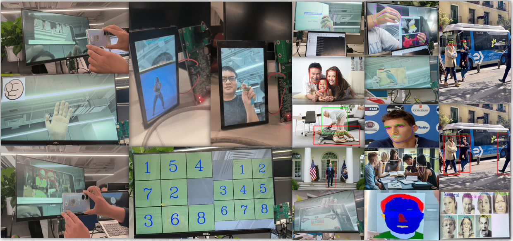

# 3. K230 AI Demo 概述

本章针对K230提供了50多个覆盖多模态的AI Demo应用示例，并开放了源码，提供了使用文档；用户可以通过本章概览AI Demo的应用场景，并在k230开发板上体验；同时参考源码开发基于其他场景的应用demo。

## 3.1 概述

K230 AI Demo集成了人脸、人体、手部、车牌、单词续写、语音、dms等模块，包含了分类、检测、分割、识别、跟踪、单目测距等多种功能，给客户提供如何使用K230开发AI相关应用的参考。

## 3.2 源码位置

源码路径位于k230 sdk根目录下的`src/reference/ai_poc`（[k230_sdk/src/reference/ai_poc at main · kendryte/k230_sdk (github.com)](https://github.com/kendryte/k230_sdk/tree/main/src/reference/ai_poc)或[src/reference/ai_poc · kendryte/k230_sdk - 码云 - 开源中国 (gitee.com)](https://gitee.com/kendryte/k230_sdk/tree/main/src/reference/ai_poc)），关于每个demo的介绍，请参考下表链接文档：

| Demo 子目录           | 说明                     | github链接                                                   | gitee链接                                                    | 备注         |
| --------------------- | ------------------------ | ------------------------------------------------------------ | ------------------------------------------------------------ | ------------ |
| anomaly_det           | 异常检测                 | [anomaly_det](https://github.com/kendryte/k230_sdk/tree/main/src/reference/ai_poc/anomaly_det) | [anomaly_det](https://gitee.com/kendryte/k230_sdk/tree/main/src/reference/ai_poc/anomaly_det) |              |
| bytetrack             | 多目标跟踪               | [bytetrack](https://github.com/kendryte/k230_sdk/tree/main/src/reference/ai_poc/bytetrack) | [bytetrack](https://gitee.com/kendryte/k230_sdk/tree/main/src/reference/ai_poc/bytetrack) |              |
| crosswalk_detect      | 人行横道检测             | [crosswalk_detect](https://github.com/kendryte/k230_sdk/tree/main/src/reference/ai_poc/crosswalk_detect) | [crosswalk_detect](https://gitee.com/kendryte/k230_sdk/tree/main/src/reference/ai_poc/crosswalk_detect) |              |
| dec_ai_enc            | h265解码器+AI+h265编码器 | [dec_ai_enc](https://github.com/kendryte/k230_sdk/tree/main/src/reference/ai_poc/dec_ai_enc) | [dec_ai_enc](https://gitee.com/kendryte/k230_sdk/tree/main/src/reference/ai_poc/dec_ai_enc) |              |
| demo_mix              | demo串烧合集             | [demo_mix](https://github.com/kendryte/k230_sdk/tree/main/src/reference/ai_poc/demo_mix) | [demo_mix](https://gitee.com/kendryte/k230_sdk/tree/main/src/reference/ai_poc/demo_mix) |  |
| distraction_reminder  | 分神提醒                 | [distraction_reminder](https://github.com/kendryte/k230_sdk/tree/main/src/reference/ai_poc/distraction_reminder) | [distraction_reminder](https://gitee.com/kendryte/k230_sdk/tree/main/src/reference/ai_poc/distraction_reminder) |              |
| dms_system            | 驾驶员监控系统           | [dms_system](https://github.com/kendryte/k230_sdk/tree/main/src/reference/ai_poc/dms_system) | [dms_system](https://gitee.com/kendryte/k230_sdk/tree/main/src/reference/ai_poc/dms_system) |              |
| dynamic_gesture       | 动态手势识别             | [dynamic_gesture](https://github.com/kendryte/k230_sdk/tree/main/src/reference/ai_poc/dynamic_gesture) | [dynamic_gesture](https://gitee.com/kendryte/k230_sdk/tree/main/src/reference/ai_poc/dynamic_gesture) |              |
| eye_gaze              | 注视估计                 | [eye_gaze](https://github.com/kendryte/k230_sdk/tree/main/src/reference/ai_poc/eye_gaze) | [eye_gaze](https://gitee.com/kendryte/k230_sdk/tree/main/src/reference/ai_poc/eye_gaze) |              |
| face_alignment        | 人脸对齐                 | [face_alignment](https://github.com/kendryte/k230_sdk/tree/main/src/reference/ai_poc/face_alignment) | [face_alignment](https://gitee.com/kendryte/k230_sdk/tree/main/src/reference/ai_poc/face_alignment) |              |
| face_detection        | 人脸检测                 | [face_detection](https://github.com/kendryte/k230_sdk/tree/main/src/reference/ai_poc/face_detection) | [face_detection](https://gitee.com/kendryte/k230_sdk/tree/main/src/reference/ai_poc/face_detection) |              |
| face_emotion          | 面部表情识别             | [face_emotion](https://github.com/kendryte/k230_sdk/tree/main/src/reference/ai_poc/face_emotion) | [face_emotion](https://gitee.com/kendryte/k230_sdk/tree/main/src/reference/ai_poc/face_emotion) |              |
| face_gender           | 性别分类                 | [face_gender](https://github.com/kendryte/k230_sdk/tree/main/src/reference/ai_poc/face_gender) | [face_gender](https://gitee.com/kendryte/k230_sdk/tree/main/src/reference/ai_poc/face_gender) |              |
| face_glasses          | 是否佩戴眼镜分类         | [face_glasses](https://github.com/kendryte/k230_sdk/tree/main/src/reference/ai_poc/face_glasses) | [face_glasses](https://gitee.com/kendryte/k230_sdk/tree/main/src/reference/ai_poc/face_glasses) |              |
| face_landmark         | 人脸密集关键点           | [face_landmark](https://github.com/kendryte/k230_sdk/tree/main/src/reference/ai_poc/face_landmark) | [face_landmark](https://gitee.com/kendryte/k230_sdk/tree/main/src/reference/ai_poc/face_landmark) |              |
| face_mask             | 是否佩戴口罩分类         | [face_mask](https://github.com/kendryte/k230_sdk/tree/main/src/reference/ai_poc/face_mask) | [face_mask](https://gitee.com/kendryte/k230_sdk/tree/main/src/reference/ai_poc/face_mask) |              |
| face_mesh             | 3D人脸网格               | [face_mesh](https://github.com/kendryte/k230_sdk/tree/main/src/reference/ai_poc/face_mesh) | [face_mesh](https://gitee.com/kendryte/k230_sdk/tree/main/src/reference/ai_poc/face_mesh) |              |
| face_parse            | 人脸分割                 | [face_parse](https://github.com/kendryte/k230_sdk/tree/main/src/reference/ai_poc/face_parse) | [face_parse](https://gitee.com/kendryte/k230_sdk/tree/main/src/reference/ai_poc/face_parse) |              |
| face_pose             | 人脸姿态估计             | [face_pose](https://github.com/kendryte/k230_sdk/tree/main/src/reference/ai_poc/face_pose) | [face_pose](https://gitee.com/kendryte/k230_sdk/tree/main/src/reference/ai_poc/face_pose) |              |
| face_verification     | 人脸身份验证             | [face_verification](https://github.com/kendryte/k230_sdk/tree/main/src/reference/ai_poc/face_verification) | [face_verification](https://gitee.com/kendryte/k230_sdk/tree/main/src/reference/ai_poc/face_verification) |              |
| falldown_detect       | 跌倒检测                 | [falldown_detect](https://github.com/kendryte/k230_sdk/tree/main/src/reference/ai_poc/falldown_detect) | [falldown_detect](https://gitee.com/kendryte/k230_sdk/tree/main/src/reference/ai_poc/falldown_detect) |              |
| finger_guessing       | 猜拳游戏                 | [finger_guessing](https://github.com/kendryte/k230_sdk/tree/main/src/reference/ai_poc/finger_guessing) | [finger_guessing](https://gitee.com/kendryte/k230_sdk/tree/main/src/reference/ai_poc/finger_guessing) |              |
| fitness               | 动作计数                 | [fitness](https://github.com/kendryte/k230_sdk/tree/main/src/reference/ai_poc/fitness) | [fitness](https://gitee.com/kendryte/k230_sdk/tree/main/src/reference/ai_poc/fitness) |              |
| head_detection        | 人头检测                 | [head_detection](https://github.com/kendryte/k230_sdk/tree/main/src/reference/ai_poc/) | [head_detection](https://gitee.com/kendryte/k230_sdk/tree/main/src/reference/ai_poc/head_detection) |              |
| helmet_detect         | 安全帽检测               | [helmet_detect](https://github.com/kendryte/k230_sdk/tree/main/src/reference/ai_poc/helmet_detect) | [helmet_detect](https://gitee.com/kendryte/k230_sdk/tree/main/src/reference/ai_poc/helmet_detect) |              |
| kws                   | 关键词唤醒               | [kws](https://github.com/kendryte/k230_sdk/tree/main/src/reference/ai_poc/kws) | [kws](https://gitee.com/kendryte/k230_sdk/tree/main/src/reference/ai_poc/kws) |              |
| licence_det           | 车牌检测                 | [licence_det](https://github.com/kendryte/k230_sdk/tree/main/src/reference/ai_poc/licence_det) | [licence_det](https://gitee.com/kendryte/k230_sdk/tree/main/src/reference/ai_poc/licence_det) |              |
| licence_det_rec       | 车牌识别                 | [licence_det_rec](https://github.com/kendryte/k230_sdk/tree/main/src/reference/ai_poc/licence_det_rec) | [licence_det_rec](https://gitee.com/kendryte/k230_sdk/tree/main/src/reference/ai_poc/licence_det_rec) |              |
| llamac                | 英文单词续写             | [llamac](https://github.com/kendryte/k230_sdk/tree/main/src/reference/ai_poc/llamac) | [llamac](https://gitee.com/kendryte/k230_sdk/tree/main/src/reference/ai_poc/llamac) |              |
| nanotracker           | 单目标跟踪               | [nanotracker](https://github.com/kendryte/k230_sdk/tree/main/src/reference/ai_poc/nanotracker) | [nanotracker](https://gitee.com/kendryte/k230_sdk/tree/main/src/reference/ai_poc/nanotracker) |              |
| object_detect_yolov8n | YOLOV8多目标检测         | [object_detect_yolov8n](https://github.com/kendryte/k230_sdk/tree/main/src/reference/ai_poc/object_detect_yolov8n) | [object_detect_yolov8n](https://gitee.com/kendryte/k230_sdk/tree/main/src/reference/ai_poc/object_detect_yolov8n) |              |
| ocr                   | ocr检测+识别             | [ocr](https://github.com/kendryte/k230_sdk/tree/main/src/reference/ai_poc/ocr) | [ocr](https://gitee.com/kendryte/k230_sdk/tree/main/src/reference/ai_poc/ocr) |              |
| person_attr           | 人体属性                 | [person_attr](https://github.com/kendryte/k230_sdk/tree/main/src/reference/ai_poc/person_attr) | [person_attr](https://gitee.com/kendryte/k230_sdk/tree/main/src/reference/ai_poc/person_attr) |              |
| person_detect         | 行人检测                 | [person_detect](https://github.com/kendryte/k230_sdk/tree/main/src/reference/ai_poc/person_detect) | [person_detect](https://gitee.com/kendryte/k230_sdk/tree/main/src/reference/ai_poc/person_detect) |              |
| person_distance       | 行人测距                 | [person_distance](https://github.com/kendryte/k230_sdk/tree/main/src/reference/ai_poc/person_distance) | [person_distance](https://gitee.com/kendryte/k230_sdk/tree/main/src/reference/ai_poc/person_distance) |              |
| pose_detect           | 人体关键点检测           | [pose_detect](https://github.com/kendryte/k230_sdk/tree/main/src/reference/ai_poc/pose_detect) | [pose_detect](https://gitee.com/kendryte/k230_sdk/tree/main/src/reference/ai_poc/pose_detect) |              |
| pphumanseg            | 人像分割                 | [pphumanseg](https://github.com/kendryte/k230_sdk/tree/main/src/reference/ai_poc/pphumanseg) | [pphumanseg](https://gitee.com/kendryte/k230_sdk/tree/main/src/reference/ai_poc/pphumanseg) |              |
| puzzle_game           | 拼图游戏                 | [puzzle_game](https://github.com/kendryte/k230_sdk/tree/main/src/reference/ai_poc/puzzle_game) | [puzzle_game](https://gitee.com/kendryte/k230_sdk/tree/main/src/reference/ai_poc/puzzle_game) |              |
| segment_yolov8n       | YOLOV8多目标分割         | [segment_yolov8n](https://github.com/kendryte/k230_sdk/tree/main/src/reference/ai_poc/segment_yolov8n) | [segment_yolov8n](https://gitee.com/kendryte/k230_sdk/tree/main/src/reference/ai_poc/segment_yolov8n) |              |
| self_learning         | 自学习（度量学习分类）   | [self_learning](https://github.com/kendryte/k230_sdk/tree/main/src/reference/ai_poc/self_learning) | [self_learning](https://gitee.com/kendryte/k230_sdk/tree/main/src/reference/ai_poc/self_learning) |              |
| smoke_detect          | 吸烟检测                 | [smoke_detect](https://github.com/kendryte/k230_sdk/tree/main/src/reference/ai_poc/smoke_detect) | [smoke_detect](https://gitee.com/kendryte/k230_sdk/tree/main/src/reference/ai_poc/smoke_detect) |              |
| space_resize          | 手势隔空缩放             | [space_resize](https://github.com/kendryte/k230_sdk/tree/main/src/reference/ai_poc/space_resize) | [space_resize](https://gitee.com/kendryte/k230_sdk/tree/main/src/reference/ai_poc/space_resize) |              |
| sq_hand_det           | 手掌检测                 | [sq_hand_det](https://github.com/kendryte/k230_sdk/tree/main/src/reference/ai_poc/sq_hand_det) | [sq_hand_det](https://gitee.com/kendryte/k230_sdk/tree/main/src/reference/ai_poc/sq_hand_det) |              |
| sq_handkp_class       | 手掌关键点手势分类       | [sq_handkp_class](https://github.com/kendryte/k230_sdk/tree/main/src/reference/ai_poc/sq_handkp_class) | [sq_handkp_class](https://gitee.com/kendryte/k230_sdk/tree/main/src/reference/ai_poc/sq_handkp_class) |              |
| sq_handkp_det         | 手掌关键点检测           | [sq_handkp_det](https://github.com/kendryte/k230_sdk/tree/main/src/reference/ai_poc/sq_handkp_det) | [sq_handkp_det](https://gitee.com/kendryte/k230_sdk/tree/main/src/reference/ai_poc/sq_handkp_det) |              |
| sq_handkp_flower      | 指尖区域花卉分类         | [sq_handkp_flower](https://github.com/kendryte/k230_sdk/tree/main/src/reference/ai_poc/sq_handkp_flower) | [sq_handkp_flower](https://gitee.com/kendryte/k230_sdk/tree/main/src/reference/ai_poc/sq_handkp_flower) |              |
| sq_handkp_ocr         | 手指区域OCR识别          | [sq_handkp_ocr](https://github.com/kendryte/k230_sdk/tree/main/src/reference/ai_poc/sq_handkp_ocr) | [sq_handkp_ocr](https://gitee.com/kendryte/k230_sdk/tree/main/src/reference/ai_poc/sq_handkp_ocr) |              |
| sq_handreco           | 手势识别                 | [sq_handreco](https://github.com/kendryte/k230_sdk/tree/main/src/reference/ai_poc/sq_handreco) | [sq_handreco](https://gitee.com/kendryte/k230_sdk/tree/main/src/reference/ai_poc/sq_handreco) |              |
| traffic_light_detect  | 交通信号灯检测           | [traffic_light_detect](https://github.com/kendryte/k230_sdk/tree/main/src/reference/ai_poc/traffic_light_detect) | [traffic_light_detect](https://gitee.com/kendryte/k230_sdk/tree/main/src/reference/ai_poc/traffic_light_detect) |              |
| translate_en_ch       | 英翻中翻译               | [translate_en_ch](https://github.com/kendryte/k230_sdk/tree/main/src/reference/ai_poc/translate_en_ch) | [translate_en_ch](https://gitee.com/kendryte/k230_sdk/tree/main/src/reference/ai_poc/translate_en_ch) |              |
| tts_zh                | 中文转语音               | [tts_zh](https://github.com/kendryte/k230_sdk/tree/main/src/reference/ai_poc/tts_zh) | [tts_zh](https://gitee.com/kendryte/k230_sdk/tree/main/src/reference/ai_poc/tts_zh) |              |
| vehicle_attr          | 车辆属性识别             | [vehicle_attr](https://github.com/kendryte/k230_sdk/tree/main/src/reference/ai_poc/vehicle_attr) | [vehicle_attr](https://gitee.com/kendryte/k230_sdk/tree/main/src/reference/ai_poc/vehicle_attr) |              |
| virtual_keyboard      | 隔空虚拟键盘             | [virtual_keyboard](https://github.com/kendryte/k230_sdk/tree/main/src/reference/ai_poc/virtual_keyboard) | [virtual_keyboard](https://gitee.com/kendryte/k230_sdk/tree/main/src/reference/ai_poc/virtual_keyboard) |              |
| yolop_lane_seg        | 路面车道线分割           | [yolop_lane_seg](https://github.com/kendryte/k230_sdk/tree/main/src/reference/ai_poc/yolop_lane_seg) | [yolop_lane_seg](https://gitee.com/kendryte/k230_sdk/tree/main/src/reference/ai_poc/yolop_lane_seg) |              |

kmodel、image及相关依赖路径位于`/mnt/src/big/kmodel/ai_poc`，目录结构如下：

```
.
│ # images目录下为demo推理的测试图片或测试数据
├── images
│ # kmodel目录下为demo所需的所有kmodel模型
├── kmodel
│ # utils目录下存放的是demo推理所用的工具文件
└── utils
```


## 3.3 编译及运行程序

**本章节基于[kendryte/k230_sdk: Kendryte K230 SDK (github.com)](https://github.com/kendryte/k230_sdk/tree/main)或[kendryte/k230_sdk - 码云 - 开源中国 (gitee.com)](https://gitee.com/kendryte/k230_sdk/tree/main)的最新版本源码实现。**

### 3.3.1. 自编译镜像上板流程

- 按照[kendryte/k230_sdk: Kendryte K230 SDK (github.com)](https://github.com/kendryte/k230_sdk/tree/main)或[kendryte/k230_sdk - 码云 - 开源中国 (gitee.com)](https://gitee.com/kendryte/k230_sdk/tree/main)构建docker容器，编译上板镜像；

  ```
  # 下载docker编译镜像
  docker pull ghcr.io/kendryte/k230_sdk
  # 可以使用以下命令确认docker镜像是否拉取成功
  docker images | grep ghcr.io/kendryte/k230_sdk
  # 下载sdk源码
  git clone https://github.com/kendryte/k230_sdk.git
  cd k230_sdk
  # 下载工具链Linux和RT-Smart toolchain, buildroot package, AI package等
  make prepare_sourcecode
  # 创建docker容器，$(pwd):$(pwd)表示系统当前目录映射到docker容器内部的相同目录下，将系统下的工具链目录映射到docker容器内部的/opt/toolchain目录下
  docker run -u root -it -v $(pwd):$(pwd) -v $(pwd)/toolchain:/opt/toolchain -w $(pwd) ghcr.io/kendryte/k230_sdk /bin/bash
  make CONF=k230_canmv_defconfig
  ```

  

- 请您耐心等待镜像编译成功后，在k230_sdk根目录/output/k230_canmv_defconfig/images中下载编译好的镜像，并将其烧录到SD卡中，烧录步骤参考[镜像烧录](https://developer.canaan-creative.com/k230_canmv/dev/zh/CanMV-K230快速入门指南.html#id5)：

  ```
  k230_canmv_defconfig/images
   ├── big-core
   ├── little-core
   ├── sysimage-sdcard.img    # SD卡启动镜像
   └── sysimage-sdcard.img.gz # SD卡启动镜像压缩包
  ```

  

- 在docker内部进入k230_sdk根目录，执行下述命令，编译ai demo部分：

  ```
  cd src/reference/ai_poc
  # 如果build_app.sh权限不足，执行chmod +x build_app.sh
  # 执行脚本前确保src/big/kmodel/ai_poc下已经有相应kmodel、images、utils
  ./build_app.sh
  ```

  

- 执行build_app.sh脚本后，会将kmodel、images、utils、shell、elf统一拷贝生成到k230_bin文件夹；

- 将整个文件夹拷贝到开发板，在大核上执行sh脚本即可运行相应AI demo；

  ***注：***

  1.sharefs是大小核共用目录，通过对大小核各自/sharefs目录的访问，提供了大核访问小核文件系统的功能。在实际使用中，通常会将大核的可执行程序存放在/sharefs目录下，大核通过sharefs功能执行这些程序，方便大核上应用程序的开发和调试；参考：[K230大小核通讯Sharefs使用简介](https://developer.canaan-creative.com/k230/dev/zh/02_applications/tutorials/K230_大小核通讯_sharefs用法介绍.html)。

  2.为了保证系统空间，最后一个disk的空间大小可能不足以存放所有文件；您可以使用下述命令修改最后一个分区大小；参考：[K230 SDK常见问题解答](https://developer.canaan-creative.com/k230/dev/zh/03_other/K230_SDK常见问题解答_C.html#linux) 问题9。

  ```
  umount /sharefs/
  parted   -l /dev/mmcblk1
  # 31.3GB大小请参考上一条命令输出的 Disk /dev/mmcblk1
  parted  -a minimal  /dev/mmcblk1  resizepart 4  31.3GB
  mkfs.ext2 /dev/mmcblk1p4
  mount /dev/mmcblk1p4 /sharefs
  ```

  

- 分区结束后，重启开发板，在小核sharefs下新建目录test_demo，选择读卡器拷贝或者scp拷贝，因传输较慢不推荐使用tftp拷贝；

- 若您只关注某一个demo，请首先将utils中的所有文件拷贝到开发板/sharefs/test_demo目录下，参照对应demo的shell脚本中使用的文件拷贝elf、kmodel、测试图片；文件准备好后可以在开发板上运行；

### 3.4.2. 免编译镜像上板流程

- 选择[嘉楠开发者社区](https://developer.canaan-creative.com/resource)->资料下载->K230->Images提供的镜像烧录，k230_sdk版本和nncase版本对应关系请点击链接查看：

  [**K230 SDK nncase版本对应关系 — K230 文档 (canaan-creative.com)**](https://developer.canaan-creative.com/k230/dev/zh/03_other/K230_SDK_nncase版本对应关系.html)

  镜像烧录请参考[镜像烧录](https://developer.canaan-creative.com/k230_canmv/dev/zh/CanMV-K230快速入门指南.html#id5)。

- 按照[kendryte/k230_sdk: Kendryte K230 SDK (github.com)](https://github.com/kendryte/k230_sdk/tree/main)或[kendryte/k230_sdk - 码云 - 开源中国 (gitee.com)](https://gitee.com/kendryte/k230_sdk/tree/main)构建docker容器；

  ```
  # 下载docker编译镜像
  docker pull ghcr.io/kendryte/k230_sdk
  # 可以使用以下命令确认docker镜像是否拉取成功
  docker images | grep ghcr.io/kendryte/k230_sdk
  # 下载sdk源码
  git clone https://github.com/kendryte/k230_sdk.git
  cd k230_sdk
  # 下载工具链Linux和RT-Smart toolchain, buildroot package, AI package等
  make prepare_sourcecode
  # 创建docker容器，$(pwd):$(pwd)表示系统当前目录映射到docker容器内部的相同目录下，将系统下的工具链目录映射到docker容器内部的/opt/toolchain目录下
  docker run -u root -it -v $(pwd):$(pwd) -v $(pwd)/toolchain:/opt/toolchain -w $(pwd) ghcr.io/kendryte/k230_sdk /bin/bash
  make mpp
  make CONF=k230_canmv_defconfig prepare_memory；
  ```

  

  mpp编译相对于镜像编译耗时要少很多；

- 在docker内部进入k230_sdk根目录，执行下述命令，编译ai demo部分：

  ```
  cd src/reference/ai_poc
  # 如果build_app.sh权限不足，执行chmod +x build_app.sh
  # 执行脚本前确保src/big/kmodel/ai_poc下已经有相应kmodel、images、utils
  ./build_app.sh
  ```

  

- 执行build_app.sh脚本后，会将kmodel、images、utils、shell、elf统一拷贝生成到k230_bin文件夹；

- 将整个文件夹拷贝到开发板，在大核上执行sh脚本即可运行相应AI demo；

  ***注：***

  1.sharefs是大小核共用目录，通过对大小核各自/sharefs目录的访问，提供了大核访问小核文件系统的功能。在实际使用中，通常会将大核的可执行程序存放在/sharefs目录下，大核通过sharefs功能执行这些程序，方便大核上应用程序的开发和调试；参考：[K230大小核通讯Sharefs使用简介](https://developer.canaan-creative.com/k230/dev/zh/02_applications/tutorials/K230_大小核通讯_sharefs用法介绍.html)。

  2.为了保证系统空间，最后一个disk的空间大小可能不足以存放所有文件；您可以使用下述命令修改最后一个分区大小；参考：[K230 SDK常见问题解答](https://developer.canaan-creative.com/k230/dev/zh/03_other/K230_SDK常见问题解答_C.html#linux) 问题9。

  ```
  umount /sharefs/
  parted   -l /dev/mmcblk1
  # 31.3GB大小请参考上一条命令输出的 Disk /dev/mmcblk1
  parted  -a minimal  /dev/mmcblk1  resizepart 4  31.3GB
  mkfs.ext2 /dev/mmcblk1p4
  mount /dev/mmcblk1p4 /sharefs
  ```

  

- 分区结束后，重启开发板，在小核sharefs下新建目录test_demo，选择读卡器拷贝或者scp拷贝，因传输较慢不推荐使用tftp拷贝；

- 若您只关注某一个demo，请首先将utils中的所有文件拷贝到开发板/sharefs/test_demo目录下，参照对应demo的shell脚本中使用的文件拷贝elf、kmodel、测试图片；文件准备好后可以在开发板上运行；

> **＠You**：
>
> AI Demo章节和Fancy POC章节旨在展示K230在AI领域的强大性能和广泛应用场景。虽然我们提供了相关源代码供用户参考，但这些源码多是基于特定Demo或POC任务场景的实现。
>
> 对于希望深入了解K230人工智能开发流程的用户，建议学习[第5章](https://developer.canaan-creative.com/ai_docs/zh/main/fast_learn)和[第6章](https://developer.canaan-creative.com/ai_docs/zh/main/K230_AI_Demo概述.html#teach_ai)。在这两章中，我们详细讲解了K230的多媒体应用、AI推理流程以及基于K230的人工智能开发流程，从代码层面全面解析了K230的AI开发知识。

## 3.4. Demo效果集锦

demo效果如下图所示，感兴趣的可以动手实践将demo跑起来。

