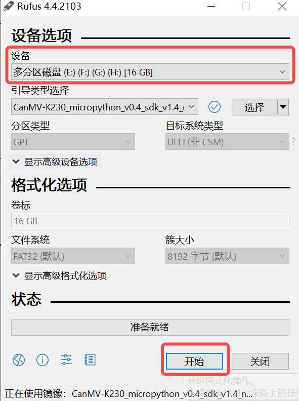
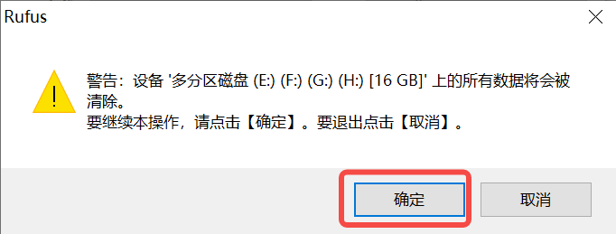
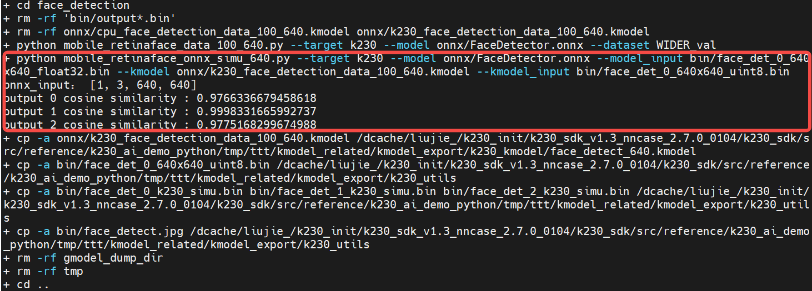

# 6.深入解析AI开发流程

> 本章教学视频：[勘智K230开发板教程-深入解析AI开发流程_哔哩哔哩_bilibili](https://www.bilibili.com/video/BV1um411k7qd/?spm_id_from=333.999.0.0&vd_source=44017c249f4b4c572672eb7cd1c45d17)

## 6.1 概述

### 1.常规AI开发流程

AI开发流程可分为**训练迭代**和**部署上线**两个方面：

- **训练迭代**，即从选定特定数据集、模型结构、损失函数和评价指标入手，通过模型参数的不断优化，致力于实现尽可能接近或超越领域内最先进技术（SOTA）的结果。
- **部署上线**，即把训练好的模型在特定环境中推理运行的过程，更多关注于部署场景、部署方式、吞吐率和延迟。

AI模型通常通过PyTorch、TensorFlow、飞桨等深度学习框架训练完成，但直接使用训练模型推理有两个问题：直接通过这些模型来进行推理需要依赖这些训练框架，用起来比较复杂；不同的硬件的对算子的底层优化方式可能不同，相同模型运行在不同硬件上效率并不高，特别是对延时要求严格的线上场景；由此，经过工业界和学术界数年的探索，AI开发流程有了一条主流的流水线。


这一条流水线解决了模型部署中的两大问题：使用对接深度学习框架和推理引擎的**中间表示**，开发者不必担心如何在新环境中运行各个复杂的框架；通过中间表示的网络结构优化、推理引擎对运算的底层优化，模型的运算效率大幅提升。

### 2.基于K230的AI开发流程


基于K230的AI开发流程与主流AI开发流程类似，也是先训练，再部署。训练时开发者可以使用**常见深度学习框架**，eg：Pytorch、TensorFlow、飞桨等来定义网络结构，并通过训练确定网络中的参数。之后，模型的结构和参数会被转换成一种只描述网络结构的**中间表示**，eg：onnx、tflite，一些针对网络结构的优化会在中间表示上进行。最终，将中间表示转换成特定的文件格式（kmodel），并利用面向K230的推理引擎（K230Runtime），在K230硬件平台上实现模型的高效运行。

相信大家都对训练过程非常熟悉，因此本文着重介绍部署过程。选择开源repo[人脸检测](https://github.com/biubug6/Pytorch_Retinaface)、[人脸识别](https://github.com/Xiaoccer/MobileFaceNet_Pytorch)（稍后会详细解释两者含义），这两个开源repo都提供了基于Pytorch训练好的模型；因此，本文以Pytorch模型为例，对AI模型在K230的部署过程展开叙述。


对于Pytorch模型来说，从训练好到部署到K230上，会经过三种文件格式：pth/ckpt->onnx->kmodel，每转成新的文件格式之后，我们都需要验证转换模型的正确性，以保证成功部署。

1. 已经训练好的Pytorch模型，我们会用pth推理脚本验证它的正确性；
2. 验证pth/ckpt没有问题后，转onnx；
3. 转onnx后，验证onnx模型的正确性，需要使用ONNXRuntime来验证，验证流程与Pytorch推理流程类似，包括加载onnx、读取图像/视频流、图像/视频帧预处理、onnx run、后处理、显示结果；
4. 验证onnx没有问题，将其转换为kmodel；
5. 此时使用K230Runtime来验证kmodel的正确性，验证流程与ONNXRuntime推理流程类似，包括加载kmodel、读取图像/视频流、图像/视频帧预处理、kmodel run、后处理、显示结果；
6. kmodel推理流程正确了，我们AI模型就可以成功部署了。

PyTorch模型从训练到在K230上部署经过三个阶段：pth/ckpt验证（通常已验证）、onnx验证（使用ONNXRuntime），最后是kmodel验证（使用K230Runtime）。每个阶段都需要确保模型的正确性，以保证成功部署。验证流程包括加载模型、处理输入数据、运行推理、处理输出结果，最终确保K230上的AI模型部署成功。

## 6.2 环境搭建

### 6.2.1 快速上手

以Windows环境为例，进行快速上手说明。

#### 6.2.1.1 CanMV-K230接口说明

说明：CanMV-K230主板电源和串口(与电脑通讯)共用一个TypeC口，如图中⑤所示：


#### 6.2.1.2 CanMV-K230连接示例

请准备如下硬件，然后按照下图连接：

- CanMV-K230
- TypeC USB线 至少1根
- 网线一根(可选)
- HDMI线一根
- SD卡（若是PC没有SD卡插槽，则需要SD卡读卡器）
- 支持HDMI的显示器


按照上图连接之后，需要在SD卡中烧录镜像，下一小节将会介绍如何烧录镜像。

#### 6.2.1.3 镜像烧录

**Linux:**

在TF卡插到宿主机之前，输入：

```
ls -l /dev/sd\*
```


查看当前的存储设备。

将TF卡插入宿主机后，再次输入：

```
ls -l /dev/sd\*
```


查看此时的存储设备，新增加的就是TF卡设备节点。

假设/dev/sdc就是TF卡设备节点，执行如下命令烧录TF卡：

```
sudo dd if=sysimage-sdcard.img of=/dev/sdc bs=1M oflag=sync
```


**Windows:**

Windows下可通过rufus工具对TF卡进行烧录，[rufus工具下载地址](http://rufus.ie/downloads/)。

1）将TF卡插入PC，然后启动rufus工具，点击工具界面的”选择”按钮，选择待烧写的固件。


2）点击“开始”按钮开始烧写，烧写过程有进度条展示，烧写结束后会提示“准备就绪”。






> 说明1：`sysimage-sdcard.img.gz`文件时最好先解压缩，烧录解压缩后的文件。

#### 6.2.1.4 串口驱动安装及上电验证

K230 主板通过USB提供两路调试串口，windows下使用调试串口，需要安装USB转串口驱动程序，驱动[下载链接](https://ftdichip.com/wp-content/uploads/2021/11/CDM-v2.12.36.4.U-WHQL-Certified.zip)。

安装驱动之后，如何验证驱动是否安装成功？先将CanMV-K230开发板按照6.2.1.2图示连接，然后将连接电源的type c连接线连接到PC USB口，可以发现两个USB串口设备，如下图所示：


同时HDMI连接的显示器会显示人脸检测结果。


#### 6.2.1.5 串口调试

安装完驱动之后，[下载](https://mobaxterm.mobatek.net/download.html)串口调试工具，安装之后，创建串口窗口。

**连接小核**：对于AI Demo来说，小核主要负责网络相关工作。


输入root登录，进入小核

**连接大核**：大核主要负责和AI相关工作


按q，回车，退出当前人脸检测demo。

**如何重新启动人脸检测demo?**


### 6.2.2 编译环境搭建

编译环境搭建涉及[sdk](https://github.com/kendryte/k230_sdk)、[nncase](https://github.com/kendryte/nncase)，sdk和nncase有一定的对应关系。我们今天以sdk v1.3.0，nncase v2.7.0为例，进行讲解。k230 sdk和nncase版本的对应关系请参考下述链接：

[**K230 SDK nncase版本对应关系 — K230 文档 (canaan-creative.com)**](https://developer.canaan-creative.com/k230/dev/zh/03_other/K230_SDK_nncase版本对应关系.html)

#### 6.2.2.1 docker容器构建

参考：[K230_SDK_使用说明.md](https://github.com/kendryte/k230_docs/blob/main/zh/01_software/board/K230_SDK_使用说明.md)

```
#以sdk v1.3为例，搭建软件环境
git clone -b v1.3 https://github.com/kendryte/k230_sdk
cd k230_sdk
make prepare_sourcecode
#手动构建名为v1.3_0219的docker image
docker build -f tools/docker/Dockerfile -t v1.3_0219 tools/docker
#创建名为v1.3_0219_lj的docker容器
docker run -u root --name v1.3_0219_lj -it -v $(pwd):$(pwd) -v $(pwd)/toolchain:/opt/toolchain -w $(pwd) v1.3_0219 /bin/bash
```


**注意：**

（1）`make prepare_sourcecode` 会自动下载Linux和RT-Smart toolchain, buildroot package, AI package等. 请确保该命令执行成功并没有Error产生，下载时间和速度以实际网速为准。

以CanMV-K230开发板为例，手动构建镜像（或直接用官网提供[v1.3 CanMV-K230镜像](https://kendryte-download.canaan-creative.com/developer/k230/k230_canmv_sdcard_v1.3_nncase_v2.7.0.img.gz)）：

```
make CONF=k230_canmv_defconfig            #生成镜像sysimage-sdcard.img.gz
```


```
#ls k230_sdk/output/k230_canmv_defconfig/images/
drwxr-xr-x 4 root root       169 Feb 21 14:57 ./
drwxr-xr-x 6 root root        79 Feb 20 11:53 ../
drwxr-xr-x 5 root root       138 Feb 21 14:57 big-core/
lrwxrwxrwx 1 root root        22 Feb 21 14:57 k230_canmv_sdcard_v1.3_nncase_v2.7.0.img.gz -> sysimage-sdcard.img.gz
drwxr-xr-x 7 root root      4096 Feb 21 14:57 little-core/
-rw-rw-rw- 1 root root 486556160 Feb 21 14:57 sysimage-sdcard.img
-rw-rw-rw- 1 root root  56831464 Feb 21 14:57 sysimage-sdcard.img.gz
```


#### 6.2.2.2 nncase安装

[nncase](https://github.com/kendryte/k230_docs/blob/main/zh/01_software/board/ai/K230_nncase_开发指南.md)是一个为 AI 加速器设计的神经网络编译器, 目前支持的AI设备（ target）有K230/k210/k510等。nncase主要由4部分组成：

- **编译模型APIs(Python)**：用于在PC上将神经网络模型（onnx、tflite等）编译为kmodel，即**生成kmodel**。
- **模拟器APIs(Python)**：用于在PC上模拟推理kmodel，验证nncase模拟推理结果和原模型（onnx、tflite）的推理结果是否一致，即**Simulator验证**。
- **KPU运行时APIs(C++)**：用于在AI设备加载kmodel，使用KPU Runtime进行推理， 获取输出数据等，即**上板推理验证**。
- **AI2D 运行时APIs(C++)**：用于在AI设备配置AI2D的参数，生成相关寄存器配置，执行AI2D计算等；常用AI2D计算包括Affine、Crop、Resize、Padding等，可以加速图像的预处理操作，即**上板预处理**。

```
#以sdk v1.3为例
#nncase发布版本：https://github.com/kendryte/nncase/releases
#在docker容器中，查看sdk对应的nncase版本
cat src/big/nncase/riscv64/nncase/include/nncase/version.h
#安装对应版本nncase
pip install -i https://pypi.org/simple nncase==2.7.0
pip install nncase-kpu==2.7.0
```


## 6.3 demo构建流程解析

上一章中，我们展示了人脸检测demo，那如何基于K230开发自己的AI Demo。接下来以人脸检测、人脸识别Demo为例，对基于K230的AI开发流程进行详细的描述。

由于我找的这两个Demo是基于Pytorch训练的，因此整体的流程以Pytorch为例，进行展开。针对Pytorch，基于K230的AI开发流程由训练和部署两个部分组成，其中训练包括Pytorch训练模型，部署包括PyTorch到ONNX转换、使用ONNXRuntime进行推理、ONNX到kmodel转换、使用K230Runtime进行推理。

1. **PyTorch训练模型：**
   - 使用PyTorch框架定义并训练人脸检测和人脸识别模型。训练完成后，保存模型参数到.pth文件。
2. **PyTorch到ONNX转换：**
   - 利用PyTorch工具，将训练好的模型转换为ONNX格式。这一步会针对网络结构进行一些优化。
3. **使用ONNXRuntime进行推理：**
   - 在PC上加载ONNX模型，并利用ONNXRuntime进行推理，以验证onnx模型的正确性和性能。ONNXRuntime推理的主要流程包括预处理、运行、后处理。
4. **ONNX到kmodel转换：**
   - 利用K230支持的转换工具，将ONNX模型转换为K230可用的kmodel格式。这一步会优化模型以适应K230，生成在K230上能高效运行的模型。
5. **使用K230Runtime进行推理：**
   - 在K230上加载kmodel，使用K230Runtime进行推理。这确保模型在K230的运行效果。K230Runtime推理的主要流程包括预处理、运行、后处理。


整个流程通过将PyTorch模型经由ONNX中间格式，最终优化为适合K230的kmodel格式，实现了从PC端到K230的无缝部署。从pth/ckpt->onnx->kmodel，模型文件有3种文件格式，各种文件格式推理流程一一对应，因此转换完成后，我们需要在对应的推理流程下，验证转换模型的准确性。

[demo构建的完整代码](https://github.com/JayL323/K230_AI_Demo_Development_Process_Analysis/)已发布到github上，感兴趣者可以自行下载。

```
#运行环境：常规pc环境
├── onnx_related               
    ├── onnx_export            #导出onnx
    │   ├── face_detection_convert_to_onnx.py       #对应3.1.1
    │   ├── face_recognition_convert_to_onnx.py
    │   └── readme.txt
    └── onnx_inference         #onnx推理流程
        ├── face_detection     #人脸检测onnx推理流程   #对应3.1.2
        └── face_recognition   #人脸识别onnx推理流程
# 编译环境：k230 docker编译环境，运行环境：K230开发板
├── kmodel_related     
│   ├── kmodel_export         #导出kmodel，
│   │   ├── build_model.sh    #生成kmodel脚本
│   │   ├── face_detection    #对应3.1.3+3.1.4.1（两者都是python写的，为了写起来简单，把两者放在一起，逻辑上放到3.1.4更好）
│   │   ├── face_recognition
│   │   ├── k230_kmodel       #生成kmodel
│   │   └── k230_utils        #生成其它辅助文件，bin、图片等
│   └── kmodel_inference      #kmodel推理             
│       ├── build_app.sh      #生成可执行文件脚本
│       ├── cmake
│       ├── CMakeLists.txt
│       ├── face_detection    #人脸检测kmodel推理流程，对应3.1.4.2+3.1.4.3（两者都是c++写的）
│       ├── face_recognition  #人脸识别kmodel推理流程
│       ├── k230_bin          #生成的可执行文件、kmodel，上板执行脚本等
│       ├── main_nncase       #kmodel上板验证工具
│       ├── shell
│       └── test_demo  
```


### 6.3.1 人脸检测demo

人脸检测是指对于任意一幅给定的图像，采用一定的策略对其进行搜索以确定其中是否含有人脸，如果有则返回人脸检测框、五官关键点。参考链接：[biubug6/Pytorch_Retinaface](https://github.com/biubug6/Pytorch_Retinaface)


#### 6.3.1.1 PyTorch到ONNX转换

选择人脸检测模型时，一般应选择轻量化的模型，backbone一般小于resnet50参数量较好。因此我们选择基于MobileNetV1的RetinaFace 作为人脸检测模型。

- 加载pth或ckpt模型到cpu
- 构建随机模型输入
- 导出onnx模型

**注**：pth、onnx都支持动态输入，而K230的模型暂时不支持动态输入，所以导出onnx时，onnx输入shape固定。


**执行步骤：**

将[代码](https://github.com/JayL323/K230_AI_Demo_Development_Process_Analysis/)clone到pc上，安装依赖库，执行转onnx脚本。

```
git clone https://github.com/JayL323/K230_AI_Demo_Development_Process_Analysis/ 
cd K230_AI_Demo_Development_Process_Analysis
cd onnx_related/onnx_export
git clone https://github.com/biubug6/Pytorch_Retinaface
cp face_detection_convert_to_onnx.py Pytorch_Retinaface/
cd Pytorch_Retinaface
#根据Pytorch_Retinaface说明文档下载预训练模型
python face_detection_convert_to_onnx.py
```


#### 6.3.1.2 使用ONNXRuntime进行推理

为了验证onnx正确性，我们需要使用ONNXRuntime对onnx进行推理，推理时保证读取图片、预处理、run、后处理、显示结果与pth/ckpt的推理流程一致。


##### 6.3.1.2.1 读取图像


```
#ori_img（1024,624,3）,opencv读入图片的默认格式为hwc,bgr
ori_img = cv2.imread('bin/test.jpg')
```


##### 6.3.1.2.2 图像预处理

预处理构建（常用的方法：padding_resize，crop_resize，resize，affine、normalization）：参考train.py，test.py、predict.py、现成的onnx推理脚本。

**构建人脸检测预处理代码：**


```
#face_detector.py
def pre_process(self,ori_img):
    max_ori_img = max(ori_img.shape[1], ori_img.shape[0])
    self.scale = [max_ori_img] * 4
    self.scale1 = [max_ori_img] * 10
    # (1) padding：将原图padding为正方形，pad_img(1024,1024,3)
    pad_img = pad_to_square(ori_img,self.normalize_mean,True)
    # (2) resize+tranpose+normalization：将padding之后的图像缩放到640，hwc转chw，并归一化，resize_img(3,640,640)
    resize_img = resize_subtract_mean(pad_img,self.in_size,self.normalize_mean)
    # (3) dequantize：将缩放的图像转换为float32,resize_img_float(3,640,640)
    resize_img_float = np.float32(resize_img)
    #（4）3维扩张为4维：input_data(1,3,640,640)
    input_data = np.expand_dims(resize_img_float, 0)
    return input_data
```


**参考：（与pth预处理流程一致）**人脸检测预处理代码参考train.py（k230模型的输入shape目前只支持固定输入，训练时都是批量固定输入的，因此可以借鉴）中调用的预处理，去掉不适合推理使用的crop、distort、mirror（数据增强），只留下onnx推理时必要的pad_to_square、resize_subact_mean处理，保证onnx与pth预处理一致。


##### 6.3.1.2.3 onnx run

将预处理好的数据，喂给模型，得到onnx推理结果

```
#onnx_model.py
def forward(self, image_tensor):
    '''
    image_tensor = image.transpose(2, 0, 1)
    image_tensor = image_tensor[np.newaxis, :]
    onnx_session.run([output_name], {input_name: x})
    :param image_tensor:
    :return:
    '''
    input_feed = self.get_input_feed(image_tensor)
    output = self.sess.run(self.out_names, input_feed=input_feed)
    return output

#face_detector.py
loc,conf,landms = self.model.forward(input_data)
```


##### 6.3.1.2.4 后处理

后处理构建（常用的方法：softmax、loc解码、nms等）：参考test.py或predict.py等测试脚本、现成的onnx推理脚本。

**构建人脸检测后处理代码**：包括解码、nms等，由于后处理较多，我们只截取部分代码进行说明，具体实现参考[源码](https://github.com/JayL323/K230_AI_Demo_Development_Process_Analysis/)。

```
#face_detector.py
def post_process(self,loc,conf,landms):
    loc, conf, landms = loc[0],conf[0],landms[0]
    boxes = decode(loc, self.priors_numpy, self.cfg['variance'])
    boxes = boxes * self.scale / 1                     #右、下padding
    ......
```


**参考：**人脸检测repo的detect.py，对模型输入结果：loc（检测框）、conf（得分）、landms（关键点）进行后处理，进而得到人脸检测框、得分、五官点。 

##### 6.3.1.2.5 显示结果

显示结果：将后处理之后的结果画到原图，具体实现参考[源码](https://github.com/JayL323/K230_AI_Demo_Development_Process_Analysis/)。

##### 6.3.1.2.6 编译执行

将[源码](https://github.com/JayL323/K230_AI_Demo_Development_Process_Analysis/)clone到pc上，安装依赖库，执行人脸检测推理流程，若是检测效果正确，则说明使用ONNXRuntime推理人脸检测的流程是正确的，转换的onnx也是正确的。

```
#若已下载code过，请忽略clone步骤
git clone https://github.com/JayL323/K230_AI_Demo_Development_Process_Analysis/ 
cd K230_AI_Demo_Development_Process_Analysis
cd onnx_related/onnx_inference/face_detection
python face_detector.py
```


#### 6.3.1.3 ONNX到kmodel转换

人脸检测onnx模型经过nncase编译之后，可以生成在k230上推理的模型kmodel，生成kmodel需要调用nncase的**编译模型APIs(Python)**。

**编译模型API**的接口如下图所示。若是在github无法看到[K230_nncase_开发指南.md](https://github.com/kendryte/k230_docs/blob/main/zh/01_software/board/ai/K230_nncase_开发指南.md)文档中目录结构，可以下载到本地，使用Typora工具打开。


##### 6.3.1.3.1 配置生成kmodel参数

###### 1.编译参数：CompileOptions

编译参数包括编译目标参数、预处理参数、后处理参数，编译目标参数指定编译目标, 如’cpu’, ‘k230’；常用预处理参数由Transpose参数、SwapRB参数、Dequantize参数、Normalization参数构成；后处理参数目前只支持Transpose参数。

| 参数类别     | 参数名称                                                     |
| ------------ | ------------------------------------------------------------ |
| 编译目标参数 | target                                                       |
| 预处理参数   | input_shape、input_layout、 swapRB、input_type、input_range、mean、std等 |
| 后处理参数   | output_layout                                                |

**编译目标参数：**

```
# 指定编译目标, 如'cpu', 'k230'
compile_options.target = args.target
```


（1）target = “cpu”，生成cpu上推理的kmodel，此时不进行量化；

（2）target = “k230”，生成在k230(kpu)上推理的kmodel，此时模型进行量化（默认uint8量化）；

**预处理参数**：由于预处理参数比较复杂，接下来我们着重介绍下常用预处理参数。

```
# 是否开启前处理，默认为False
compile_options.preprocess = True
```


（1）预处理参数（preprocess = False时，不进行任何预处理，kmodel ≈ onnx）

（2）预处理参数（preprocess = True时，kmodel ≈ 预处理 + onnx，此时kmodel包含设置的预处理，这些预处理会在KPU计算，KPU计算较快，因此最好将尽可能多预处理放到kmodel上）

| 预处理操作类型 | 相关参数                  |
| -------------- | ------------------------- |
| Transpose      | input_shape、input_layout |
| SwapRB         | swapRB                    |
| Dequantize     | input_type、input_range   |
| Normalization  | mean、std                 |

【onnx输入数据】的格式决定了【新的输入】的格式；

【kmodel实际输入】的格式决定了【kmodel输入】的格式；


**Transpose参数**：

```
# 指定输入数据的shape，input_shape的layout需要与input layout保持一致
compile_options.input_shape = [1, 3, 640, 640]
# 当按照字符串（`"NHWC"`、`"NCHW"`）形式配置 `input_layout`时，表示新的输入数据的layout
compile_options.input_layout = "NCHW"
```


- 相关参数：

  - `input_shape`：输入数据的shape，input_shape的layout需要与`input_layout`保持一致；**当 preprocess为 True时，必须指定**。
  - `input_layout`：支持字符串（`"NHWC"`、`"NCHW"`）和index。当按照字符串（`"NHWC"`、`"NCHW"`）形式配置 `input_layout`时，表示新的输入数据的layout；当按照index形式配置 `input_layout`时，表示输入数据会按照当前配置的 `input_layout`进行数据转置，即 `input_layout`为 `Transpose`的 `perm`参数；**当 preprocess为 True时，必须指定**。

- 分析说明（以字符串配置格式为例）：

  - 新的输入layout与input_layout一致；新的输入layout与onnx输入layout一致；**因此input_layout与onnx输入layout一致**；

  - 当input_layout与kmodel输入layout一致时，kmodel输入经过transpose之后，生成的新的输入仍是与kmodel输入layout一致；

  - 当input_layout与kmodel输入layout不一致时，kmodel输入经过transpose之后，变成与input_layout一致的新的输入。

  - 

    **实际推理时**，人脸检测onnx输入layout：`NCHW`，shape是`[1, 3, 640, 640]`，所以`input_layout = "NCHW",input_shape=[1, 3, 640, 640]`

**SwapRB参数：**

```
compile_options.swapRB = True
```


- 相关参数：
  - `swapRB`：是否在 `channel`维度反转数据，默认为False
- 分析说明：
  - **实际推理时**，人脸检测kmodel输入：`rgb`、onnx输入（新的输入）：`bgr`，两者顺序**不同**，所以需要反转`channel`维度，故`swapRB = True`

**Dequantize参数：**

```
# 当preprocess为 True时，必须指定为"uint8"或者"float32"
compile_options.input_type = 'uint8'            
# input_type=‘uint8’时反量化有效，反量化之后的数据范围
compile_options.input_range = [0, 255]
```


- 相关参数：
  - `input_type`：与kmodel实际输入数据类型一致；**当 preprocess为 True时，必须指定为”uint8”或者”float32**。
  - `input_range`：指定输入数据反量化后的**浮点数范围**；**当 `preprocess`为 `True`且 `input_type`为 `uint8`时，必须指定**。
- 分析说明：
  - 若kmodel `input_type`为float32，不进行反量化
  - 若kmodel `input_type`为uint8，range为[0,255]，当`input_range`为[0,255]时，则反量化的作用只是进行类型转化，将uint8的数据转化为float32
  - 若kmodel `input_type`为uint8，range为[0,255]，当`input_range`为[0,1]，则反量化会将定点数转化为[0.0,1.0]的浮点数
  - **实际推理时**，人脸检测kmodel实际输入从sensor中获取，数据类型为`uint8`，所以`input_type = 'uint8',input_range = [0,255]或[0,1]均可`

**Normalization参数**：

- 相关参数
  - `mean`：预处理标准化参数均值，默认为[0,0,0]
  - `std`：预处理标准化参数方差，默认为[1,1,1]
- 
- **实际推理时**，人脸检测onnx的`mean = [104,117,123],std = [1, 1, 1]`；显然上图左边的设置更加简洁，人脸检测kmodel的`input_range = [0,255],mean = [104,117,123],std = [1, 1, 1]`。

**后处理参数**：

```
# 后处理
compile_options.output_layout = "NCHW"
```


- 相关参数：
  - `output_layout`：指定输出数据的layout, 如’NCHW’, ‘NHWC’，默认为“”，不进行transpose。

与预处理参数的`input_layout`类似，若模型本身输出（oldKmodelOutput）的layout与`output_layout`相同，则transpose之后，newKmodelOutput layout仍与oldKmodelOutput layout一致；若模型本身输出（oldKmodelOutput）的layout与`output_layout`不同，则transpose之后，newKmodelOutput layout将变为与`output_layout`一致。


**生成的人脸检测kmodel：**


###### 2.导入参数：ImportOptions

ImportOptions类, 用于配置nncase导入选项，很少单独设置，使用默认参数即可。

```
# 2. 设置导入参数，import_options（一般默认即可）
import_options = nncase.ImportOptions()
model_file = onnx_simplify(args.model, dump_dir)
model_content = read_model_file(model_file)
compiler.import_onnx(model_content, import_options)
```


###### 3.训练后量化参数：PTQTensorOptions

训练后量化参数(Post Training Quantization，PTQ)，PTQ是一种通过将模型权重从float32映射uint8或int16方法，保持模型的准确性的同时，减少推理所需的计算资源；当target = “k230”，PTQ是必选参数，默认uint8量化。

使用uint8量化可以满足人脸检测精度要求，故使用默认uint8量化；校正集个数为100；假设使用100个校正集生成kmodel的时间很久，可以适当的减少校正集。

```
# 3. 设置训练后量化参数，ptq_options
ptq_options = nncase.PTQTensorOptions()
ptq_options.samples_count = 100
ptq_options.set_tensor_data(generate_data(input_shape, ptq_options.samples_count, args.dataset))
compiler.use_ptq(ptq_options)
```


##### 6.3.1.3.2 校正集准备

因为生成kmodel时，使用了后处理量化，因此需要准备校正集。使用少量校正集计算量化因子，可以快速得到量化模型。使用该量化模型进行预测，可在保证模型准确性的同时，减少计算量、降低计算内存、减小模型大小。

**校正集**一般选用**验证集**的**100张图片**即可，[人脸检测模型](https://github.com/biubug6/Pytorch_Retinaface)的**验证集**`WIDER_val`，故选用`WIDER_val`的100张图像作为校正集。

**注：**

（1）若是kmodel**生成时间很久**或者验证集数据很少，也可尝试少于100个数据

（2）`generate_data`函数，生成的数据格式，需要**尽量保证**与实际推理时喂给kmodel的数据格式一致，否则会导致生成kmodel有问题。

```
def generate_data(shape, batch, calib_dir):
    #获取所有校正集图片名称
    img_paths = [os.path.join(calib_dir, p) for p in os.listdir(calib_dir)]
    data = []
    for i in range(batch):
        assert i < len(img_paths), "calibration images not enough."
        #生成的数据需要做的预处理 ≈ onnx预处理 - 根据预处理参数设置的，包含在kmodel中预处理
        #onnx预处理：bgr,padding,reisze,transpose,normalization,dequantize,3维度转4维度
        #kmodel中包含的预处理：rgb->bgr,dequantize,normalization
        img_data = Image.open(img_paths[i]).convert('RGB')
        #为了省事，这里没有用padding
        img_data = img_data.resize((shape[3], shape[2]), Image.BILINEAR)  
        img_data = np.asarray(img_data, dtype=np.uint8)
        img_data = np.transpose(img_data, (2, 0, 1))
        data.append([img_data[np.newaxis, ...]])
    return np.array(data)

input_shape = [1, 3, 640, 640]
......
ptq_options = nncase.PTQTensorOptions()
    ptq_options.samples_count = 100
    # 校正集数据预处理，将原图处理为kmodel需要数据
    ptq_options.set_tensor_data(generate_data(input_shape, ptq_options.samples_count, args.dataset))
    # 使用100个校准数据计算量化因子
    compiler.use_ptq(ptq_options)
......
```


##### 6.3.1.3.3 生成kmodel

生成人脸检测kmodel完整代码示例：[mobile_retinaface_data_100_640.py](https://github.com/JayL323/K230_AI_Demo_Development_Process_Analysis/blob/main/kmodel_related/kmodel_export/face_detection/mobile_retinaface_data_100_640.py)

**生成环境**：6.2.2 构建的编译环境

**生成步骤**：

```
cd src/reference
#若已下载code过，请忽略clone步骤
git clone https://github.com/JayL323/K230_AI_Demo_Development_Process_Analysis/ 
cd K230_AI_Demo_Development_Process_Analysis
cd kmodel_related/kmodel_export
./build_model.sh
```


```
-rw-r--r-- 1 root root  715216 Feb 28 16:08 face_detect_640.kmodel     #人脸检测kmodel
```


**温馨提示**：生成kmodel时需要配置多个参数，正确理解和配置这些参数是确保成功生成kmodel的**关键**。我们深知参数配置的复杂性，但是为了给用户提供正确的参数配置，我们一次性提供了所有正确的配置，但对于不太熟悉kmodel生成的用户来说，仍然存在配置错误的可能性。错误的参数配置将导致生成的kmodel存在问题。

为了帮助大家更好地理解这一过程，**建议**尝试修改配置参数为不同值，观察生成的kmodel的变化和对最终推理结果的影响。通过这样的实践，可以更深入地理解各参数的作用和相互关系。这种方式将使用户更熟悉kmodel生成的流程，有助于更准确地配置参数以获得所需的结果。

#### 6.3.1.4 使用K230Runtime进行推理

为了验证kmodel正确性，我们需要使用K230Runtime对kmodel进行推理，推理时保证读取图片、预处理、run、后处理、显示结果与onnx的对应流程一致。


由于K230开发板调试起来比较复杂，因此我们提供一些辅助工具，并分享相关经验来帮助用户验证K230端推理的正确性。由于推理过程中，主要的部分是run、预处理、后处理，接下来我们分别对这3个部分调试的常用方法进行说明。

**run：**

- Simulator：在PC端模拟kmodel在k230的推理过程，用于对比kmodel和onnx输出是否一致；
- main_nncase：在K230端推理kmodel，用于对比模拟推理kmodel与实际推理kmodel结果是否一致；
- 若是两者都没有问题，则说明生成kmodel是正确的。

**预处理：**

- 原图预处理之后，dump预处理后的图像，查看预处理是否正确。

**后处理：**

- 在Simulator正确的情况下，将Simulator输出bin文件作为kmodel输出，喂给后处理，看后处理结果是否与ONNX后处理结果是否一致。

##### 6.3.1.4.1 使用Simulator验证kmodel

Simulator：在PC端模拟kmodel在k230的推理过程，用于对比kmodel和onnx输出是否一致；

###### 1.生成input.bin

在使用Simulator验证kmodel之前，需要先准备好输入文件。由于kmodel包括部分预处理，因此对于同一张图片，需要分别利用不同预处理生成`onnx_input.bin、kmodel_input.bin`。

| 名称               | onnx_input.bin构建流程                  | kmodel_input.bin构建流程              |
| ------------------ | --------------------------------------- | ------------------------------------- |
| **源->目标**       | **（uint8,hwc,bgr->float32,nchw,bgr）** | **（uint8,hwc,bgr->uint8,nchw,rgb）** |
| 原图               | （1024,624,3），uint8，hwc，bgr         | （1024,624,3），uint8，hwc，bgr       |
| padding            | （1024,1024,3）, uint8，hwc，bgr        | （1024,1024,3）, uint8，hwc，bgr      |
| resize             | （640,640,3）, uint8，hwc，bgr          | （640,640,3）, uint8，hwc，bgr        |
| dequantize         | （640,640,3）, float32，hwc，bgr        | —                                     |
| normalization      | （640,640,3），float32，hwc，bgr        | —                                     |
| bgr->rgb           | —                                       | （640,640,3）, uint8，hwc，rgb        |
| transpose          | （3,640,640），float32，chw，bgr        | （3,640,640），uint8，chw，rgb        |
| 维度扩展（非必须） | （1,3,640,640），float32，chw，bgr      | （1,3,640,640），uint8，chw，rgb      |

**注**：由于生成的kmodel中包含部分预处理，生成kmodel_input.bin需要的预处理 ≈ 生成onnx_input.bin需要的预处理 - kmodel中包含的预处理（人脸检测kmodel中预处理transpose、dequantize、normalization、swapRB）

（1）维度扩展可以省略（读取时bin文件可以用reshape，生成bin时可以省略）。

（2）kmodel_input.bin为什么无需进行dequantize、normalization操作？dequantize、normalization已放到kmodel中。

（3）为什么需要生成kmodel_input.bin需要bgr->rgb？生成人脸检测kmode时，由于实际需要，预处理打开了swapRB开关，用于rgb->bgr，对应的，生成kmodel_input.bin时，则需要先将数据转成rgb顺序；

（4）transpose也放到kmodel中，为什么生成kmodel_input.bin仍需transpose？由于生成kmodel，若是打开了预处理开关，transpose的相关参数必须设置，我们人脸检测kmodel的实际输入是`NCHW`，input_layout设置为`NCHW`，两者是一致的，因此transpose是NCHW2NCHW，实际上并没有转换。

**生成input.bin的过程**：（放在onnx推理的预处理方法中）


###### 2.Simulator验证

**模拟器APIs**的接口如下图所示。若是在github无法看到[K230_nncase_开发指南.md](https://github.com/kendryte/k230_docs/blob/main/zh/01_software/board/ai/K230_nncase_开发指南.md)文档中目录结构，可以下载到本地，使用Typora工具打开。


**Simulator流程：**

对于同一张图片，分别利用不同预处理生成不同的onnx_input.bin、kmodel_input.bin，

- 将onnx_input.bin喂给onnx，经过onnx推理得cpu_results；
- 将kmodel_input.bin喂给kmodel，经过Simulator推理得到nncase_results；
- 计算cpu_results和nncase_results的余弦相似度，通过相似度的大小来判断生成的kmodel是否正确。

```
# mobile_retinaface_onnx_simu_640.py
import os
import copy
import argparse
import numpy as np
import onnx
import onnxruntime as ort
import nncase

def read_model_file(model_file):
    with open(model_file, 'rb') as f:
        model_content = f.read()
    return model_content

def cosine(gt, pred):
    return (gt @ pred) / (np.linalg.norm(gt, 2) * np.linalg.norm(pred, 2))

def main():
    parser = argparse.ArgumentParser(prog="nncase")
    parser.add_argument("--target", type=str, help='target to run')
    parser.add_argument("--model", type=str, help='original model file')
    parser.add_argument("--model_input", type=str, help='input bin file for original model')
    parser.add_argument("--kmodel", type=str, help='kmodel file')
    parser.add_argument("--kmodel_input", type=str, help='input bin file for kmodel')
    args = parser.parse_args()

    # 1. onnx推理，得到cpu_results
    ort_session = ort.InferenceSession(args.model)
    output_names = []
    model_outputs = ort_session.get_outputs()
    for i in range(len(model_outputs)):
        output_names.append(model_outputs[i].name)
    model_input = ort_session.get_inputs()[0]
  
    model_input_name = model_input.name
    model_input_type = np.float32
    model_input_shape = model_input.shape
    print('onnx_input：',model_input_shape)
    model_input_data = np.fromfile(args.model_input, model_input_type).reshape(model_input_shape)
    cpu_results = []
    cpu_results = ort_session.run(output_names, { model_input_name : model_input_data })

    
    # 2. Simulator推理，得到nncase_results
    # create Simulator
    sim = nncase.Simulator()

    # read kmodel
    kmodel = read_model_file(args.kmodel)

    # load kmodel
    sim.load_model(kmodel)

    # read input.bin
    input_shape = [1, 3, 640, 640]
    dtype = sim.get_input_desc(0).dtype
    input = np.fromfile(args.kmodel_input, dtype).reshape(input_shape)

    # set input for Simulator
    sim.set_input_tensor(0, nncase.RuntimeTensor.from_numpy(input))

    # Simulator inference
    nncase_results = []
    sim.run()
    for i in range(sim.outputs_size):
        nncase_result = sim.get_output_tensor(i).to_numpy()
        # print("nncase_result:",nncase_result)
        input_bin_file = 'bin/face_det_{}_{}_simu.bin'.format(i,args.target)
        nncase_result.tofile(input_bin_file)
        nncase_results.append(copy.deepcopy(nncase_result))

    # 3. 计算onnx和Simulator相似度
    for i in range(sim.outputs_size):
        cos = cosine(np.reshape(nncase_results[i], (-1)), np.reshape(cpu_results[i], (-1)))
        print('output {0} cosine similarity : {1}'.format(i, cos))

if __name__ == '__main__':
    main()
```


上边的脚本可以满足大部分onnx及其kmodel的对比验证，一般不用太多修改。只需根据模型实际输入大小修改`input_shape`即可。

```
python mobile_retinaface_onnx_simu_640.py \
        --target k230 --model onnx/FaceDetector.onnx \
        --model_input bin/face_det_0_640x640_float32.bin \
        --kmodel onnx/k230_face_detection_data_100_640.kmodel \
        --kmodel_input bin/face_det_0_640x640_uint8.bin
```


```
#若已下载code过，请忽略clone步骤
git clone https://github.com/JayL323/K230_AI_Demo_Development_Process_Analysis/ 
cd K230_AI_Demo_Development_Process_Analysis
cd kmodel_related/kmodel_export
./build_model.sh
```


onnx和Simulator余弦相似度越高越好，一般0.99以上即可满足条件；若是达不到0.99，但是在0.95以上，可以通过进一步**上板验证**来判断生成的kmodel是否满足实际需求。



**注：**在执行simulator时，必须先添加以下环境变量（build_model.sh文件其中含有）

```
export NNCASE_PLUGIN_PATH=$NNCASE_PLUGIN_PATH:/usr/local/lib/python3.8/dist-packages/
export PATH=$PATH:/usr/local/lib/python3.8/dist-packages/
source /etc/profile
```


##### 6.3.1.4.2 使用main_nncase验证kmodel

Simulator推理kmodel和上板推理kmodel一般来说是一致的，但是不排除个别情况下Simulator与实际上板仍有一定差异，为了验证两者是否一致，需要使用main_nncase工具辅助验证Simulator推理kmodel与实际推理kmodel结果是否一致；使用这个工具需要调用nncase的**KPU运行时APIs(C++)**。

KPU运行时APIs提供kmodel上板推理的各种接口 ，接口如下图所示。若是在github无法看到[K230_nncase_开发指南.md](https://github.com/kendryte/k230_docs/blob/main/zh/01_software/board/ai/K230_nncase_开发指南.md)文档中目录结构，可以下载到本地，使用Typora工具打开。


**main_nncase验证流程**（对K230的KPU调用有个大概的印象）：

- 加载kmodel
- 设置kmodel输入：读取kmodel_input.bin文件
- 设置kmodel输出
- 推理kmodel
- 获取kmodel输出
- 对比Simulator推理kmodel、上板推理kmodel结果相似性

**注**：main_nncase工具可以适配所有kmodel的验证，无需自己修改。只需执行时，修改命令行的对应参数即可。

```
//main_nncase.cc
#include <chrono>
#include <fstream>
#include <iostream>
#include <nncase/runtime/runtime_tensor.h>
#include <nncase/runtime/interpreter.h>
#include <nncase/runtime/runtime_op_utility.h>

using namespace nncase;
using namespace nncase::runtime;
using namespace nncase::runtime::detail;

#define USE_CACHE 1

template <class T>
std::vector<T> read_binary_file(const char *file_name)
{
    std::ifstream ifs(file_name, std::ios::binary);
    ifs.seekg(0, ifs.end);
    size_t len = ifs.tellg();
    std::vector<T> vec(len / sizeof(T), 0);
    ifs.seekg(0, ifs.beg);
    ifs.read(reinterpret_cast<char *>(vec.data()), len);
    ifs.close();
    return vec;
}

void read_binary_file(const char *file_name, char *buffer)
{
    std::ifstream ifs(file_name, std::ios::binary);
    ifs.seekg(0, ifs.end);
    size_t len = ifs.tellg();
    ifs.seekg(0, ifs.beg);
    ifs.read(buffer, len);
    ifs.close();
}

template <typename T>
double dot(const T *v1, const T *v2, size_t size)
{
    double ret = 0.f;
    for (size_t i = 0; i < size; i++)
    {
        ret += v1[i] * v2[i];
    }

    return ret;
}

template <typename T>
double cosine(const T *v1, const T *v2, size_t size)
{
    return dot(v1, v2, size) / ((sqrt(dot(v1, v1, size)) * sqrt(dot(v2, v2, size))));
}

void dump(const std::string &info, volatile float *p, size_t size)
{
    std::cout << info << " dump: p = " << std::hex << (void *)p << std::dec << ", size = " << size << std::endl;
    volatile unsigned int *q = reinterpret_cast<volatile unsigned int *>(p);
    for (size_t i = 0; i < size; i++)
    {
        if ((i != 0) && (i % 4 == 0))
        {
            std::cout << std::endl;
        }

        std::cout << std::hex << q[i] << " ";
    }
    std::cout << std::dec << std::endl;
}

int main(int argc, char *argv[])
{
    std::cout << "case " << argv[0] << " build " << __DATE__ << " " << __TIME__ << std::endl;
    if (argc < 4)
    {
        std::cerr << "Usage: " << argv[0] << " <kmodel> <input_0.bin> <input_1.bin> ... <input_N.bin> <output_0.bin> <output_1.bin> ... <output_N.bin>" << std::endl;
        return -1;
    }

    interpreter interp;                             

    // 1. load model
    std::ifstream in_before_load_kmodel("/proc/media-mem");
    std::string line_before_load_kmodel;
    // 逐行读取文件内容，查看MMZ使用情况
    while (std::getline(in_before_load_kmodel, line_before_load_kmodel)) { 
        std::cout << line_before_load_kmodel << std::endl;
    }

    std::ifstream ifs(argv[1], std::ios::binary);
    interp.load_model(ifs).expect("Invalid kmodel");

    std::ifstream in_after_load_kmodel("/proc/media-mem");
    std::string line_after_load_kmodel;
    // 逐行读取文件内容，查看MMZ使用情况
    while (std::getline(in_after_load_kmodel, line_after_load_kmodel)) {  
        std::cout << line_after_load_kmodel << std::endl;  
    }

    // 2. set inputs
    for (size_t i = 2, j = 0; i < 2 + interp.inputs_size(); i++, j++)
    {
        auto desc = interp.input_desc(j);
        auto shape = interp.input_shape(j);
        auto tensor = host_runtime_tensor::create(desc.datatype, shape, hrt::pool_shared).expect("cannot create input tensor");
        auto mapped_buf = std::move(hrt::map(tensor, map_access_::map_write).unwrap());
#if USE_CACHE
        read_binary_file(argv[i], reinterpret_cast<char *>(mapped_buf.buffer().data()));
#else
        auto vec = read_binary_file<unsigned char>(argv[i]);
        memcpy(reinterpret_cast<void *>(mapped_buf.buffer().data()), reinterpret_cast<void *>(vec.data()), vec.size());
        // dump("app dump input vector", (volatile float *)vec.data(), 32);
#endif
        auto ret = mapped_buf.unmap();
        ret = hrt::sync(tensor, sync_op_t::sync_write_back, true);
        if (!ret.is_ok())
        {
            std::cerr << "hrt::sync failed" << std::endl;
            std::abort();
        }

        // dump("app dump input block", (volatile float *)block.virtual_address, 32);
        interp.input_tensor(j, tensor).expect("cannot set input tensor");
    }

    // 3. set outputs
    for (size_t i = 0; i < interp.outputs_size(); i++)
    {
        auto desc = interp.output_desc(i);
        auto shape = interp.output_shape(i);
        auto tensor = host_runtime_tensor::create(desc.datatype, shape, hrt::pool_shared).expect("cannot create output tensor");
        interp.output_tensor(i, tensor).expect("cannot set output tensor");
    }

    // 4. run
    auto start = std::chrono::steady_clock::now();
    interp.run().expect("error occurred in running model");
    auto stop = std::chrono::steady_clock::now();
    double duration = std::chrono::duration<double, std::milli>(stop - start).count();
    std::cout << "interp run: " << duration << " ms, fps = " << 1000 / duration << std::endl;

    // 5. get outputs
    for (int i = 2 + interp.inputs_size(), j = 0; i < argc; i++, j++)
    {
        auto out = interp.output_tensor(j).expect("cannot get output tensor");
        auto mapped_buf = std::move(hrt::map(out, map_access_::map_read).unwrap());
        auto expected = read_binary_file<unsigned char>(argv[i]);

        // 6. compare
        int ret = memcmp((void *)mapped_buf.buffer().data(), (void *)expected.data(), expected.size());
        if (!ret)
        {
            std::cout << "compare output " << j << " Pass!" << std::endl;
        }
        else
        {
            auto cos = cosine((const float *)mapped_buf.buffer().data(), (const float *)expected.data(), expected.size()/sizeof(float));
            std::cerr << "compare output " << j << " Fail: cosine similarity = " << cos << std::endl;
        }
    }

    return 0;
}
```


编译上述c++代码，将`k230_bin`目录下的`debug`目录拷贝到k230开发板。

```
#docker容器中，若已下载code过，请忽略clone步骤
docker exec -it v1.3_0219_lj /bin/bash
cd src/reference
git clone https://github.com/JayL323/K230_AI_Demo_Development_Process_Analysis.git
cd K230_AI_Demo_Development_Process_Analysis/kmodel_related/kmodel_inference/
./build_app.sh debug
```


```
# 在小核上：
# 大小核共用/sharefs/
cd /sharefs/
#示例：实际执行时，将源目录替换为自己的目录
scp liujie@10.10.1.22:/xxx/k230_bin/debug /sharefs/ 

# 大核上
cd /sharefs/k230_bin/debug
#./face_detect_main_nncase.sh
./main_nncase.elf face_detect_640.kmodel face_det_0_640x640_uint8.bin face_det_0_k230_simu.bin face_det_1_k230_simu.bin face_det_2_k230_simu.bin
```


通过执行结果，可以发现：

- 人脸检测kmodel**内存**：大概占用1M左右
- 人脸检测kmodel**推理速度**：26.6ms
- 人脸检测**Simulator和上板推理相似度**：输出0,2 pass，byte级别完全一致；输出1 fail，float级别余弦相似度为1。一般0.99以上即可以满足要求

人脸检测simulator结果大致满足要求，main_nncase的结果也满足要求，因此生成的人脸检测kmodel大概率是没有问题的。

##### 6.3.1.4.3 使用K230Runtime进行推理


[face_detection code](https://github.com/JayL323/K230_AI_Demo_Development_Process_Analysis/tree/main/kmodel_related/kmodel_inference/face_detection)

```
├── ai_base.cc                  #AI基类，封装KPU(K230)运行时API，简化kmodel相关操作
├── ai_base.h
├── anchors_640.cc              #人脸检测640分辨率输入对应anchor
├── CMakeLists.txt
├── face_detection.cc           #人脸检测demo，预处理，kmodel推理、后处理
├── face_detection.h
├── main.cc                     #人脸检测demo主流程
├── README.md
├── scoped_timing.hpp           #计时类
├── utils.cc                    #工具类，封装常用函数及AI2D运行时APIs，简化预处理操作
├── utils.h
└── vi_vo.h                     #封装sensor、display操作
```


使用K230Runtime推理kmodel需要详细了解K230Runtime的说明文档，为了简化推理流程，对K230Runtime的接口进行封装，其中`ai_base.cc、scoped_timing.hpp、utils.cc、vi_vo.h`是封装好的方法，无需修改；对于不同模型，用户无需关心K230Runtime相关操作，只需将`face_detection.cc`、`main.cc`拷贝一份，只修改对应构造函数、预处理（pre_process）、后处理（post_process）即可。

###### 1.读取图片或视频帧

（1）**读取图片**

```
cv::Mat ori_img = cv::imread(xxx);
```


（2）**读取视频帧**

**背景知识**：

（1）**vi_vo.h简介**：`vi_vo.h`主要封装了视频输入、视频输出相关配置。我们根据`vi_vo.h`构建了`test_vi_vo`示例，示例中讲解了如何使用vi，vo部分。

vi：视频输入，与sensor相关，详细介绍见[K230_VICAP_API参考.md](https://github.com/kendryte/k230_docs/blob/main/zh/01_software/board/mpp/K230_VICAP_API参考.md)、[K230_VICAP_SENSOR_参数分区参考.md](https://github.com/kendryte/k230_docs/blob/main/zh/01_software/board/mpp/K230_VICAP_SENSOR_参数分区参考.md)、[K230_Camera_Sensor适配指南.md](https://github.com/kendryte/k230_docs/blob/main/zh/01_software/board/mpp/K230_Camera_Sensor适配指南.md)。

- sensor启动
- 从sensor中dump一帧数据
- 将sensor中数据保存为png
- 释放sensor当前帧
- sensor停止

vo：视频输出，与display相关，详细介绍见[K230_视频输出_API参考.md](https://github.com/kendryte/k230_docs/blob/main/zh/01_software/board/mpp/K230_视频输出_API参考.md)

- 将框或文字画到cv::Mat，并插入到vo osd对应通道中
- 释放osd block

（2）**读取视频帧示例**：[test_vi_vo demo](https://github.com/JayL323/K230_AI_Demo_Development_Process_Analysis/tree/main/kmodel_related/kmodel_inference/test_demo/test_vi_vo)

###### 2.预处理

**背景知识**：

（1）**Uitls简介**：Uitls主要封装了常用函数、nncase AI2D相关操作，AI2D相关部分包括Affine、Crop、Resize、Padding预处理操作，可以加速图像的预处理操作。

（2）**预处理示例**：[test_utils demo](https://github.com/JayL323/K230_AI_Demo_Development_Process_Analysis/tree/main/kmodel_related/kmodel_inference/test_demo/test_utils)

若是**对AI2D 运行时APIs**感兴趣，详情请查看`K230_nncase_开发指南.md`，若是在github无法看到[K230_nncase_开发指南.md](https://github.com/kendryte/k230_docs/blob/main/zh/01_software/board/ai/K230_nncase_开发指南.md)文档中目录结构，可以下载到本地，使用Typora工具打开。


**人脸检测预处理**：

**背景知识**：参数不变的情况下，`ai2d_builder_`可以反复调用；参数改变则需要创建新的`ai2d_builder_`。

对于图像预处理：由于不同图像的尺寸不同，对于padding_resize方法来说，AI2D的参数每次都会改变，需要重新调用Utils::padding_resize_one_side创建新的`ai2d_builder_`来进行预处理。


对于视频流预处理：由于不同帧的尺寸相同，padding的数值也未改变；故对于`padding_resize`方法来说，AI2D的参数一直不变，将新一帧的图像拷贝给`ai2d_in_tensor_`后，只需`ai2d_builder_->invoke`（人脸构造函数中已经构造好`ai2d_builder_`）调用。

```
//face_detection.cc
// ai2d for image
void FaceDetection::pre_process(cv::Mat ori_img)
{
    ScopedTiming st(model_name_ + " pre_process image", debug_mode_);
    std::vector<uint8_t> chw_vec;
    Utils::bgr2rgb_and_hwc2chw(ori_img, chw_vec);
    Utils::padding_resize_one_side({ori_img.channels(), ori_img.rows, ori_img.cols}, chw_vec, {input_shapes_[0][3], input_shapes_[0][2]}, ai2d_out_tensor_, cv::Scalar(123, 117, 104));
    if (debug_mode_ > 1)  //验证预处理是否正确，看当前预处理与onnx预处理是否一致：dump预处理之后图像
    {
        auto vaddr_out_buf = ai2d_out_tensor_.impl()->to_host().unwrap()->buffer().as_host().unwrap().map(map_access_::map_read).unwrap().buffer();
        unsigned char *output = reinterpret_cast<unsigned char *>(vaddr_out_buf.data());
        Utils::dump_color_image("FaceDetection_input_padding.png",{input_shapes_[0][3],input_shapes_[0][2]},output);
    }
}

// ai2d for video
void FaceDetection::pre_process()
{
    ScopedTiming st(model_name_ + " pre_process video", debug_mode_);
    size_t isp_size = isp_shape_.channel * isp_shape_.height * isp_shape_.width;
    auto buf = ai2d_in_tensor_.impl()->to_host().unwrap()->buffer().as_host().unwrap().map(map_access_::map_write).unwrap().buffer();
    memcpy(reinterpret_cast<char *>(buf.data()), (void *)vaddr_, isp_size);
    hrt::sync(ai2d_in_tensor_, sync_op_t::sync_write_back, true).expect("sync write_back failed");
    ai2d_builder_->invoke(ai2d_in_tensor_, ai2d_out_tensor_).expect("error occurred in ai2d running");

    if (debug_mode_ > 1)  //验证预处理是否正确，看当前预处理与onnx预处理是否一致：dump预处理之后图像
    {
        auto vaddr_out_buf = ai2d_out_tensor_.impl()->to_host().unwrap()->buffer().as_host().unwrap().map(map_access_::map_read).unwrap().buffer();
        unsigned char *output = reinterpret_cast<unsigned char *>(vaddr_out_buf.data());
        Utils::dump_color_image("FaceDetection_input_padding.png",{input_shapes_[0][3],input_shapes_[0][2]},output);
    }
}
```


###### 3.kmodel run

**背景知识**：

（1）**AIBase简介**：AIBase主要封装了KPU相关操作，包括在AI设备（如k230）加载kmodel，设置kmodel输入数据，执行kpu/cpu计算， 获取kmodel输出数据等，AIBase的封装简化了KPU调用过程。

（2）**kmodel推理示例**（main_nncase修改为基于AIBase类的demo）：[test_aibase demo](https://github.com/JayL323/K230_AI_Demo_Development_Process_Analysis/tree/main/kmodel_related/kmodel_inference/test_demo/test_aibase)。

**KPU运行时APIs（KPU Runtime AIPS）**接口如下图所示。详情请查看`K230_nncase_开发指南.md`，若是在github无法看到[K230_nncase_开发指南.md](https://github.com/kendryte/k230_docs/blob/main/zh/01_software/board/ai/K230_nncase_开发指南.md)文档中目录结构，可以下载到本地，使用Typora工具打开。


**人脸检测kmode推理**：

```
//ai_base.cc
void AIBase::run()
{
    ScopedTiming st(model_name_ + " run", debug_mode_);
    kmodel_interp_.run().expect("error occurred in running model");
}

void AIBase::get_output()
{
    ScopedTiming st(model_name_ + " get_output", debug_mode_);
    p_outputs_.clear();
    for (int i = 0; i < kmodel_interp_.outputs_size(); i++)
    {
        auto out = kmodel_interp_.output_tensor(i).expect("cannot get output tensor");
        auto buf = out.impl()->to_host().unwrap()->buffer().as_host().unwrap().map(map_access_::map_read).unwrap().buffer();
        float *p_out = reinterpret_cast<float *>(buf.data());
        p_outputs_.push_back(p_out);
    }
}
//face_detection.cc
void FaceDetection::inference()
{
    this->run();
    this->get_output();
}
//main.cc，验证kmodel推理是否正确：我们使用simulator和main_nncase已经验证过
......
FaceDetection fd;
fd.inference();
......
```


###### 4.后处理

**onnx后处理：**


**c++后处理（详情见代码）**：

```
//face_detection.cc
void FaceDetection::post_process(FrameSize frame_size, vector<FaceDetectionInfo> &results)
{
    ScopedTiming st(model_name_ + " post_process", debug_mode_);
    if (debug_mode_ > 3)
    {
        //验证后处理流程是否正确：排除预处理、模型推理，直接拿Simulator kmodel数据，判断后处理代码正确性。
        ......
    }
    else
    {
        filter_confs(p_outputs_[1]);
        filter_locs(p_outputs_[0]);
        filter_landms(p_outputs_[2]);
    }

    std::sort(confs_.begin(), confs_.end(), nms_comparator);
    nms(results);
    transform_result_to_src_size(frame_size, results);
}
```


| onnx后处理流程                        | kmodel后处理流程                                      |
| ------------------------------------- | ----------------------------------------------------- |
| 1.解码loc、landms                     | 1.过滤conf、loc、landms（数量级：16800->数百）        |
| 2.过滤conf、loc、landms               | 2.根据conf对conf、loc、landms进行排序（降低排序耗时） |
| 3.根据conf对conf、loc、landms进行排序 | 3.nms + 解码loc、landms                               |
| 4.nms                                 | 4.将人脸检测结果变换到原图大小                        |
| 5.top_k                               |                                                       |

调整顺序之后的kmodel推理流程，更适合c++代码。

**人脸检测后处理代码**：

```
//face_detection.cc
void FaceDetection::post_process(FrameSize frame_size, vector<FaceDetectionInfo> &results)
{
    ScopedTiming st(model_name_ + " post_process", debug_mode_);
    if (debug_mode_ > 2)
    {
        //验证后处理流程是否正确：排除预处理、模型推理，直接拿Simulator kmodel数据，判断后处理代码正确性。
        vector<float> out0 = Utils::read_binary_file<float>("../debug/face_det_0_k230_simu.bin");
        vector<float> out1 = Utils::read_binary_file<float>("../debug/face_det_1_k230_simu.bin");
        vector<float> out2 = Utils::read_binary_file<float>("../debug/face_det_2_k230_simu.bin");
        filter_confs(out1.data());
        filter_locs(out0.data());
        filter_landms(out2.data());
    }
    else
    {
        filter_confs(p_outputs_[1]);
        filter_locs(p_outputs_[0]);
        filter_landms(p_outputs_[2]);
    }

    std::sort(confs_.begin(), confs_.end(), nms_comparator);
    nms(results);
    transform_result_to_src_size(frame_size, results);
}

/********************根据检测阈值kmodel数据结果***********************/
void FaceDetection::filter_confs(float *conf)
{
    NMSRoiObj inter_obj;
    confs_.clear();
    for (uint32_t roi_index = 0; roi_index < objs_num_; roi_index++)
    {
        float score = conf[roi_index * CONF_SIZE + 1];
        if (score > obj_thresh_)
        {
            inter_obj.ori_roi_index = roi_index;
            inter_obj.before_sort_conf_index = confs_.size();
            inter_obj.confidence = score;
            confs_.push_back(inter_obj);
        }
    }
}

void FaceDetection::filter_locs(float *loc)
{
    boxes_.clear();
    boxes_.resize(confs_.size());
    int roi_index = 0;
    for (uint32_t conf_index = 0; conf_index < boxes_.size(); conf_index++)
    {
        roi_index = confs_[conf_index].ori_roi_index;
        int start = roi_index * LOC_SIZE;
        for (int i = 0; i < LOC_SIZE; ++i)
        {
            boxes_[conf_index][i] = loc[start + i];
        }
    }
}

void FaceDetection::filter_landms(float *landms)
{
    landmarks_.clear();
    landmarks_.resize(confs_.size());
    int roi_index = 0;
    for (uint32_t conf_index = 0; conf_index < boxes_.size(); conf_index++)
    {
        roi_index = confs_[conf_index].ori_roi_index;
        int start = roi_index * LAND_SIZE;
        for (int i = 0; i < LAND_SIZE; ++i)
        {
            landmarks_[conf_index][i] = landms[start + i];
        }
    }
}

/********************根据anchor解码检测框、五官点***********************/
Bbox FaceDetection::decode_box(int obj_index)
{
    float cx, cy, w, h;

    int box_index = confs_[obj_index].before_sort_conf_index;
    int anchor_index = confs_[obj_index].ori_roi_index;

    cx = boxes_[box_index][0];
    cy = boxes_[box_index][1];
    w = boxes_[box_index][2];
    h = boxes_[box_index][3];
    cx = g_anchors[anchor_index][0] + cx * 0.1 * g_anchors[anchor_index][2];
    cy = g_anchors[anchor_index][1] + cy * 0.1 * g_anchors[anchor_index][3];
    w = g_anchors[anchor_index][2] * std::exp(w * 0.2);
    h = g_anchors[anchor_index][3] * std::exp(h * 0.2);
    Bbox box;
    box.x = cx - w / 2;
    box.y = cy - h / 2;
    box.w = w;
    box.h = h;
    return box;
}

SparseLandmarks FaceDetection::decode_landmark(int obj_index)
{
    SparseLandmarks landmark;
    int landm_index = confs_[obj_index].before_sort_conf_index;
    int anchor_index = confs_[obj_index].ori_roi_index;
    for (uint32_t ll = 0; ll < 5; ll++)
    {
        landmark.points[2 * ll + 0] = g_anchors[anchor_index][0] + landmarks_[landm_index][2 * ll + 0] * 0.1 * g_anchors[anchor_index][2];
        landmark.points[2 * ll + 1] = g_anchors[anchor_index][1] + landmarks_[landm_index][2 * ll + 1] * 0.1 * g_anchors[anchor_index][3];
    }
    return landmark;
}

/********************iou计算***********************/
float FaceDetection::overlap(float x1, float w1, float x2, float w2)
{
    float l1 = x1 - w1 / 2;
    float l2 = x2 - w2 / 2;
    float left = l1 > l2 ? l1 : l2;
    float r1 = x1 + w1 / 2;
    float r2 = x2 + w2 / 2;
    float right = r1 < r2 ? r1 : r2;
    return right - left;
}

float FaceDetection::box_intersection(Bbox a, Bbox b)
{
    float w = overlap(a.x, a.w, b.x, b.w);
    float h = overlap(a.y, a.h, b.y, b.h);

    if (w < 0 || h < 0)
        return 0;
    return w * h;
}

float FaceDetection::box_union(Bbox a, Bbox b)
{
    float i = box_intersection(a, b);
    float u = a.w * a.h + b.w * b.h - i;

    return u;
}

float FaceDetection::box_iou(Bbox a, Bbox b)
{
    return box_intersection(a, b) / box_union(a, b);
}

/********************nms***********************/
void FaceDetection::nms(vector<FaceDetectionInfo> &results)
{
    // nms
    for (int conf_index = 0; conf_index < confs_.size(); ++conf_index)
    {
        if (confs_[conf_index].confidence < 0)
            continue;

        FaceDetectionInfo obj;
        obj.bbox = decode_box(conf_index);
        obj.sparse_kps = decode_landmark(conf_index);
        obj.score = confs_[conf_index].confidence;
        results.push_back(obj);

        for (int j = conf_index + 1; j < confs_.size(); ++j)
        {
            if (confs_[j].confidence < 0)
                continue;
            Bbox b = decode_box(j);
            if (box_iou(obj.bbox, b) >= nms_thresh_) // iou大于nms阈值的，之后循环将会忽略
                confs_[j].confidence = -1;
        }
    }
}

/********************将人脸检测结果变换到原图***********************/
void FaceDetection::transform_result_to_src_size(FrameSize &frame_size, vector<FaceDetectionInfo> &results)
{
    // transform result to dispaly size
    int max_src_size = std::max(frame_size.width, frame_size.height);
    for (int i = 0; i < results.size(); ++i)
    {
        auto &l = results[i].sparse_kps;
        for (uint32_t ll = 0; ll < 5; ll++)
        {
            l.points[2 * ll + 0] = l.points[2 * ll + 0] * max_src_size;
            l.points[2 * ll + 1] = l.points[2 * ll + 1] * max_src_size;
        }

        auto &b = results[i].bbox;
        float x0 = b.x * max_src_size;
        float x1 = (b.x + b.w) * max_src_size;
        float y0 = b.y * max_src_size;
        float y1 = (b.y + b.h) * max_src_size;
        x0 = std::max(float(0), std::min(x0, float(frame_size.width)));
        x1 = std::max(float(0), std::min(x1, float(frame_size.width)));
        y0 = std::max(float(0), std::min(y0, float(frame_size.height)));
        y1 = std::max(float(0), std::min(y1, float(frame_size.height)));
        b.x = x0;
        b.y = y0;
        b.w = x1 - x0;
        b.h = y1 - y0;
    }
}
```


**扩展：**

检测后处理写起来比价复杂，因此对于常见的检测模型，我们给出了一些示例代码。

- **retinaface**：[人脸检测post_process](https://github.com/kendryte/k230_sdk/blob/main/src/reference/ai_poc/face_detection/face_detection.cc)
- **yolov5**：[摔倒检测post_process](https://github.com/kendryte/k230_sdk/blob/main/src/reference/ai_poc/falldown_detect/falldown_detect.cc)
- **yolov8**：[人头检测post_process](https://github.com/kendryte/k230_sdk/blob/main/src/reference/ai_poc/head_detection/head_detection.cc)

###### 5.显示结果

**显示结果示例**：[test_vi_vo demo](https://github.com/JayL323/K230_AI_Demo_Development_Process_Analysis/tree/main/kmodel_related/kmodel_inference/test_demo/test_vi_vo)

###### 6.编译、执行

将代码clone到已启动docker容器`src/reference/`目录，执行`build_app.sh`。

```
docker exec -it v1.3_0219_lj /bin/bash
cd src/reference
git clone https://github.com/JayL323/K230_AI_Demo_Development_Process_Analysis.git
cd K230_AI_Demo_Development_Process_Analysis/kmodel_related/kmodel_inference/
./build_app.sh debug         #若是无需debug目录，执行./build_app.sh
```


将`k230_bin`目录下的`face_detect`目录拷贝到k230开发板小核`/sharefs`目录。

```
k230_bin
├── debug            #调试用到的文件
│   ├── face_det_0_640x640_uint8.bin    #人脸检测kmodel输入文件
│   ├── face_det_0_k230_simu.bin        #人脸检测simulator第1个输出文件
│   ├── face_det_1_k230_simu.bin        #人脸检测simulator第2个输出文件
│   ├── face_det_2_k230_simu.bin        #人脸检测simulator第3个输出文件
│   ├── face_detect_640.kmodel          #人脸检测kmodel
│   ├── face_detect.jpg                 #人脸检测基于图像推理时的输入图像
│   ├── face_detect_main_nncase.sh      #人脸检测kmodel上板验证运行脚本
│   ├── face_detect_main_nncase_with_aibase.sh #人脸检测kmodel上板验证运行脚本
│   ├── face_recg_0_112x112_uint8.bin
│   ├── face_recg_0_k230_simu.bin
│   ├── face_recognize.kmodel
│   ├── face_recognize_main_nncase.sh
│   ├── main_nncase.elf                 #人脸检测kmodel上板验证可执行文件
│   ├── test_aibase.elf                 #test_aibase demo生成可执行文件
│   ├── test_scoped_timing.elf          #test_scoped_timing demo生成可执行文件
│   ├── test_utils.elf                  #test_utils demo生成可执行文件
│   └── test_vi_vo.elf                  #test_vi_vo demo生成可执行文件
├── face_detect     #人脸检测
│   ├── face_detect_640.kmodel
│   ├── face_detect_image.sh
│   ├── face_detection.elf
│   ├── face_detect_isp.sh
│   └── face_detect.jpg
└── face_recognize   #人脸识别，人脸检测可以不关注
    ├── db
    ├── face_detect_640.kmodel
    ├── face_recognition.elf
    ├── face_recognize_isp.sh
    └── face_recognize.kmodel
```


- (1) 预处理是否正确

将debug_mode设置为2，即可保存预处理之后的图像。

```
# 大小核共用/sharefs/
# 在小核上
cd /sharefs/
#示例：实际执行时，将源目录替换为自己的目录
scp liujie@10.10.1.22:/xxx/k230_bin /sharefs/ 

#在大核上（若是刚启动，先按q+Enter退去自启动程序）
cd /sharefs/k230_bin/face_detect
./face_detection.elf face_detect_640.kmodel 0.5 0.2 face_detect.jpg 2
#在小核上
cd  /sharefs/k230_bin/face_detect
scp FaceDetection_input_padding.png username@ip:dir
```


将生成`FaceDetection_input_padding.png`，拷贝到pc查看，预处理代码是否正确。若是有问题，则需要看sensor原图有没有问题，设置的预处理参数是否正确。


- (2) 后处理是否正确

将debug_mode设置为3，即可验证后处理正确。

```
# 大小核共用/sharefs/
# 在小核上
cd /sharefs/
#示例：实际执行时，将源目录替换为自己的目录
scp liujie@10.10.1.22:/xxx/k230_bin /sharefs/ 

#在大核上（先按q+Enter退去自启动程序）
cd /sharefs/k230_bin/face_detect
./face_detection.elf face_detect_640.kmodel 0.5 0.2 face_detect.jpg 3
#在小核上
cd  /sharefs/k230_bin/face_detect
scp face_detection_result.jpg username@ip:dir
```


将生成`face_detection_result.jpg`，拷贝到pc查看，预处理代码是否正确。若是不正确就需要对后处理部分代码进行仔细检查，打印调试。


- (3) 执行 在大核上执行`face_detect_isp.sh`即可执行基于视频流的推理流程。

```
#在大核上
cd /sharefs/k230_bin/face_detect
./face_detect_isp.sh
```


### 6.3.2 人脸识别demo

人脸识别是广泛使用的人脸任务，它将当前人脸与已知的人脸身份库进行比较，判断是否认识当前人脸。 人脸识别一般包含2个步骤：人脸注册和人脸识别，人脸注册用于构建人脸数据库，人脸识别用于识别存在数据库中的人脸。 **人脸注册**：图像采集->人脸定位->人脸对齐->特征提取->数据库保存 **人脸识别**：图像采集->人脸定位->人脸对齐->特征提取->特征比对->给出识别结果 **人脸对齐**：对于一张图像，人脸检测模型输出人脸目标框坐标和5个人脸关键点，在进行人脸识别前，需要对检测得到的人脸框进行对齐；即在2D平面将人脸转正，减少人脸旋转造成的差异，以便于后续更准确的人脸识别。


#### 6.3.2.1 PyTorch到ONNX转换

选择人脸识别模型时，一般应选择轻量化的模型，backbone一般小于resnet50参数量较好。因此我们选择基于MobileNet且精度较高MobileFaceNet作为我们的人脸识别模型。参考链接：[Xiaoccer/MobileFaceNet_Pytorch](https://github.com/Xiaoccer/MobileFaceNet_Pytorch)

- 加载pth或ckpt模型到cpu
- 构建随机模型输入
- 导出onnx模型

**注**：pth、onnx都支持动态输入，而K230的模型暂时不支持动态输入，所以导出onnx时，onnx输入shape固定。

```
#convert_to_onnx.py
import numpy as np
import torch
from core import model               #因模型而不同

def convert_onnx(net, path_module, output, opset=11):
    assert isinstance(net, torch.nn.Module)
    img = np.random.randint(0, 255, size=(112, 112, 3), dtype=np.int32)
    img = img.astype(np.float)
    img = (img / 255. - 0.5) / 0.5  # torch style norm
    img = img.transpose((2, 0, 1))
    img = torch.from_numpy(img).unsqueeze(0).float()

    ckpt = torch.load(path_module,map_location='cpu')
    net.load_state_dict(ckpt['net_state_dict'],strict=True)
    net.eval()
    torch.onnx.export(net, img, output, input_names=["data"], keep_initializers_as_inputs=False, verbose=False,
                      opset_version=opset)

if __name__ == '__main__':
    net = model.MobileFacenet()
    input_file = 'model/best/068.ckpt'
    output_file = 'model/best/MobileFaceNet.onnx'
    convert_onnx(net, input_file, output_file)
```


**执行步骤：**

将[代码](https://github.com/JayL323/K230_AI_Demo_Development_Process_Analysis/)clone到pc上，安装依赖库，执行转onnx脚本。

```
git clone https://github.com/JayL323/K230_AI_Demo_Development_Process_Analysis/ 
cd K230_AI_Demo_Development_Process_Analysis
cd onnx_related/onnx_export
git clone https://github.com/Xiaoccer/MobileFaceNet_Pytorch
cp face_recognition_convert_to_onnx.py MobileFaceNet_Pytorch/
cd MobileFaceNet_Pytorch
#安装依赖库
python face_recognition_convert_to_onnx.py
```


#### 6.3.2.2 使用ONNXRuntime进行推理

##### 6.3.2.2.1 人脸对齐

常用人脸识别训练集主要有：MS1MV2、MS1MV3、Glint360K，制作这些数据集一般需要对完整的人脸原图进行预处理，即先进行人脸检测，然后对每个人脸进行人脸对齐，然后保存对齐后的人脸图片。

**人脸对齐**：对于一张图像，人脸检测模型输出人脸目标框坐标和5个人脸关键点，在进行人脸识别前，需要对检测得到的人脸进行对齐；即在2D平面将人脸转正，减少人脸旋转造成的差异，以便于后续更准确的人脸识别。

x.png：原始图片，x_affine.png：对齐后的人脸


```
def st_image(ori_image, landmarks):
    #标准正脸人脸五官位置（112x112分辨率）
    le_g = [38.2946, 51.6963]
    re_g = [73.5318, 51.5014]
    nose_g = [56.0252, 71.7366]
    l_mouth_g = [41.5493, 92.3655]
    r_mouth_g = [70.7299, 92.2041]
    #实际人脸五官位置
    le = landmarks[0, :]
    re = landmarks[1, :]
    nose = landmarks[2, :]
    l_mouth = landmarks[3, :]
    r_mouth = landmarks[4, :]
    landmark_get = np.float32([le, re, nose, l_mouth, r_mouth])
    landmark_golden = np.float32([le_g, re_g, nose_g, l_mouth_g, r_mouth_g])
    #计算从实际人脸->标准正脸需要经过的变换
    tform = trans.SimilarityTransform()
    tform.estimate(np.array(landmark_get), landmark_golden)
    M = tform.params[0:2, :]
    #得到变换后的人脸
    affine_output = cv2.warpAffine(ori_image, M, (112, 112), borderValue=0.0)
    return affine_output
```


##### 6.3.2.2.2 图像预处理

预处理构建（常用的方法：padding_resize，crop_resize，resize，affine、normalization）：参考train.py，test.py、predict.py、现成的onnx推理脚本。

**构建人脸识别预处理代码：**


```
#mobile_face_net.py：MobileFaceNet
def pre_process(self,img,to_bin = True):
    # bgr->rgb,uint8,(112,112,3)
    img = img[..., ::-1]
    # Dequantize,float32,(112,112,3)
    img = np.array(img, dtype='float32')
    #Normalization ，float32,(112,112,3)
    for i in range(3):
        img[:, :, i] -= self.normalize_mean
        img[:, :, i] /= self.normalize_std
    # transpose，hcw->chw,float32,(3,112,112)
    img = np.transpose(img, [2, 0, 1])
    # 3维扩张为4维，input_data,float32,(1,3,112,112)
    input_data = np.expand_dims(img, 0)
    return input_data
```


**参考：**人脸识别预处理代码参考train.py中调用的dataloader，去掉不适合推理使用的flip（数据增强），只留下onnx推理时必要的bgr->rgb（[scipy](https://so.csdn.net/so/search?q=scipy&spm=1001.2101.3001.7020).misc.imread 读取的图片数据是 RGB 格式）、Normalization（减mean除std）、hwc->chw（transpose）。


##### 6.3.1.2.3 onnx run

将预处理好的数据，喂给模型，得到onnx推理结果

```
#onnx_model.py
def forward(self, image_tensor):
    '''
    image_tensor = image.transpose(2, 0, 1)
    image_tensor = image_tensor[np.newaxis, :]
    onnx_session.run([output_name], {input_name: x})
    :param image_tensor:
    :return:
    '''
    input_feed = self.get_input_feed(image_tensor)
    output = self.sess.run(self.out_names, input_feed=input_feed)
    return output

#mobile_face_net.py
def farward(self, input_data):
    embedding = self.model.forward(input_data)
    return embedding[0]
```


##### 6.3.1.2.4 后处理

模型提取完特征后，放到数据库中，以备后续人脸对比使用。为了简化代码，我们暂时不写准备数据库的过程了，把它放在人脸对比的过程中。

##### 6.3.1.2.5 人脸对比结果

读取多张人脸，对每个人脸提取特征，并将Normalization之后的特征保存到列表中。最后对比当前列表的第一个人脸和列表的相似度。

```
face_recg = MobileFaceNet()

embeddings = []
for i,img_file in enumerate(img_lists):
    ori_img = cv2.imread(img_file)
    input_data = face_recg.pre_process(ori_img)
    embedding = face_recg.farward(input_data)
    # 模型特征归一化，然后放到数据库中
    embedding_norm = preprocessing.normalize(embedding)
    embeddings.append(embedding_norm)       #模拟构建数据库过程

# 获取第一个人脸特征，和其它人脸特征进行对比   
embedding_one = embeddings[0]
scores = np.array([np.sum(embedding_one * emb_database) / 2 + 0.5 for emb_database in embeddings])
print("scores:",scores)
```


`img_lists`：


假如阈值设置为0.75的话，说明第0、1是同一个人脸，第0、2是不同人。


#### 6.3.2.3 ONNX到kmodel转换


##### 6.3.2.3.1 配置kmodel生成参数

###### 1.编译参数：CompileOptions

具体为什么这样设置，请参照6.3.1.3.1中的编译参数设置方法。

```
# 1. 设置编译参数，compile_options
compile_options = nncase.CompileOptions()
# 指定编译目标, 如'cpu', 'k230',cpu生成cpu上推理的kmodel,k230生成在k230(kpu)上推理的kmodel
compile_options.target = args.target
# 预处理
compile_options.preprocess = True
# （1）预处理---Transpose相关参数
# 当 preprocess为 True时，必须指定
input_shape = [1, 3, 112, 112]
compile_options.input_shape = input_shape
# 输入数据的layout，默认为""
# compile_options.input_layout = "NCHW"
compile_options.input_layout = "0,1,2,3"

# （2）预处理---SwapRB相关参数
compile_options.swapRB = False

# （3）预处理---Dequantize（反量化）相关参数
# 开启预处理时指定输入数据类型，默认为"float"；当 preprocess为 True时，必须指定为"uint8"或者"float32"
compile_options.input_type = 'uint8'            
# input_type=‘uint8’时反量化有效，反量化之后的数据范围
compile_options.input_range = [0, 255]

# （4）预处理---Normalization相关参数
compile_options.mean = [ 127.5,127.5,127.5]
compile_options.std = [128.0, 128.0, 128.0]

# 后处理
# compile_options.output_layout = "NCHW"
#Compiler类, 根据编译参数配置Compiler，用于编译神经网络模型
compiler = nncase.Compiler(compile_options)
```


###### 2.导入参数：ImportOptions

ImportOptions类, 用于配置nncase导入选项，很少单独设置，使用默认参数即可。

```
# 2. 设置导入参数，import_options（一般默认即可）
import_options = nncase.ImportOptions()
model_file = onnx_simplify(args.model, dump_dir)
model_content = read_model_file(model_file)
compiler.import_onnx(model_content, import_options)
```


###### 3.训练后量化参数：PTQTensorOptions

训练后量化参数(Post Training Quantization，PTQ)，PTQ是一种通过将模型权重从float32映射uint8或int16方法，保持模型的准确性的同时，减少推理所需的计算资源；当target = “k230”，PTQ是必选参数，默认uint8量化。

使用uint8量化可以满足人脸识别精度要求，故使用默认uint8量化；校正集个数为100；假设使用100个校正集生成kmodel的时间很久，可以适当的减少校正集。

```
# 3. 设置量化参数，ptq_options
ptq_options = nncase.PTQTensorOptions()
ptq_options.samples_count = 100
ptq_options.set_tensor_data(generate_data(input_shape, ptq_options.samples_count, args.dataset))
compiler.use_ptq(ptq_options)
```


##### 6.3.2.3.2 校正集准备

使用少量校正集计算量化因子，可以快速得到量化模型。使用该量化模型进行预测，可以减少计算量、降低计算内存、减小模型大小。

**校正集**一般选用**验证集**的**100张图片**即可。该[人脸识别模型](https://github.com/Xiaoccer/MobileFaceNet_Pytorch)的验证集为`LFW`，故选用`LFW`的100张图像作为校正集。

**注：**

（1）若是kmodel**生成时间很久**或者验证集数据很少，也可尝试少于100个数据

（2）`generate_data`函数，生成的数据格式，需要**大致保证**与实际推理时喂给kmodel的数据格式一致，否则会导致生成kmodel有问题。

```
def generate_data(shape, batch, calib_dir):
    # 生成的数据和实际kmodel输入数据保持一致，因为生成kmodel时，只会做参数中设置的预处理
    # 生成的校正集数据需要做的预处理 ≈ onnx预处理 - 根据预处理参数设置的，包含在kmodel中预处理
    # onnx预处理：bgr->rgb,transpose,normalization,dequantize,3维度转4维度
    # kmodel中包含的预处理：dequantize,normalization
    img_paths = [os.path.join(calib_dir, p) for p in os.listdir(calib_dir)]
    data = []
    for i in range(batch):
        assert i < len(img_paths), "calibration images not enough."
        # 读取图像，并转为RGB
        img_data = Image.open(img_paths[i]).convert('RGB')
        # transpose 
        img_data = np.transpose(img_data, (2, 0, 1))
        data.append([img_data[np.newaxis, ...]])
    return np.array(data)

input_shape = [1, 3, 112, 112]
......
ptq_options = nncase.PTQTensorOptions()
    ptq_options.samples_count = 100
    # 校正集数据预处理，将原图处理为kmodel需要数据
    ptq_options.set_tensor_data(generate_data(input_shape, ptq_options.samples_count, args.dataset))
    # 使用samples_count个校准数据计算量化因子
    compiler.use_ptq(ptq_options)
......
```


##### 6.3.2.3.3 生成kmodel

**生成环境**：6.2.2 构建的编译环境

**生成步骤**：

```
cd k230_sdk/src/reference
#若已下载code过，请忽略clone步骤
git clone https://github.com/JayL323/K230_AI_Demo_Development_Process_Analysis/ 
cd K230_AI_Demo_Development_Process_Analysis
cd kmodel_related/kmodel_export
#python mobile_face.py --target k230 --model onnx/MobileFaceNet.onnx --dataset lfw
./build_model.sh
```


```
-rw-r--r--+ 1 root root 1319744 Feb 29 14:56 face_recognize.kmodel
```


#### 6.3.2.4 使用K230Runtime进行推理

##### 6.3.2.4.1 Simulator验证kmodel

生成人脸识别kmodel之后，为了验证kmodel的准确性，需要在使用Simulator对比kmodel的输出和onnx的输出是否一致，这时就需要调用**模拟器APIs(Python)**。

###### 1.生成input.bin

使用simulator验证kmodel之前，需要先准备好输入文件。由于kmodel包括部分预处理，因此对于同一张图片，需要分别利用不同预处理生成不同的onnx_input.bin、kmodel_input.bin。

| 名称               | onnx_input.bin构建流程                  | kmodel_input.bin构建流程              |
| ------------------ | --------------------------------------- | ------------------------------------- |
| **源->目标**       | **（uint8,hwc,bgr->float32,nchw,bgr）** | **（uint8,hwc,bgr->uint8,nchw,rgb）** |
| 原图               | (112,112,3) ,uint8, hwc,bgr             | (112,112,3) ,uint8,hwc,bgr            |
| bgr->rgb           | （112,112,3），uint8，hwc，rgb          | （112,112,3），uint8，hwc，rgb        |
| dequantize         | （112,112,3），float32，hwc，rgb        | —                                     |
| normalization      | （112,112,3），float32，hwc，rgb        | —                                     |
| transpose          | （3,112,112），float32，chw，rgb        | （3,112,112），uint8，chw，rgb        |
| 维度扩展（非必须） | （1,3,112,112），uint8，chw，rgb        | （1,3,112,112），uint8，chw，rgb      |

**注**：生成的kmodel中包含部分预处理，生成kmodel_input.bin需要的预处理 ≈ 生成onnx_input.bin需要的预处理 - kmodel中包含的预处理（人脸识别kmodel中预处理transpose、dequantize、normalization）

（1）维度扩展可以省略（读取时bin文件可以用reshape，生成bin时可以省略）

（2）transpose也放到kmodel中，为什么生成kmodel_input.bin仍需transpose？由于生成kmodel，若是打开了预处理开关，transpose的相关参数必须设置，我们人脸识别kmodel的实际输入是`NCHW`，input_layout设置为`NCHW`，两者是一致的，因此transpose是NCHW2NCHW，实际上并没有转换。


```
-rw-r--r-- 1 root root 147K Feb 26 16:37 face_recg_0_112x112_float32.bin
-rw-r--r-- 1 root root  37K Feb 26 16:37 face_recg_0_112x112_uint8.bin
```


###### 2.Simulator验证

模拟器APIs的接口如下图所示。若是在github无法看到[K230_nncase_开发指南.md](https://github.com/kendryte/k230_docs/blob/main/zh/01_software/board/ai/K230_nncase_开发指南.md)文档中目录结构，可以下载到本地，使用Typora工具打开。


**Simulator流程**：（与人脸检测流程基本一致，只需修改input_shape、input_bin_file即可）

- 对于同一张图片，分别利用不同预处理生成不同的onnx_input.bin、kmodel_input.bin；
- 将onnx_input.bin喂给onnx，经过onnx推理得cpu_results；
- 将kmodel_input.bin喂给kmodel，经过Simulator推理得到nncase_results；
- 计算cpu_results和nncase_results的余弦相似度，通过相似度的大小判断kmodel的模拟推理和onnx的推理结果是否一致。

```
import os
import copy
import argparse
import numpy as np
import onnx
import onnxruntime as ort
import nncase

def read_model_file(model_file):
    with open(model_file, 'rb') as f:
        model_content = f.read()
    return model_content

def cosine(gt, pred):
    return (gt @ pred) / (np.linalg.norm(gt, 2) * np.linalg.norm(pred, 2))

def main():
    parser = argparse.ArgumentParser(prog="nncase")
    parser.add_argument("--target", type=str, help='target to run')
    parser.add_argument("--model", type=str, help='original model file')
    parser.add_argument("--model_input", type=str, help='input bin file for original model')
    parser.add_argument("--kmodel", type=str, help='kmodel file')
    parser.add_argument("--kmodel_input", type=str, help='input bin file for kmodel')
    args = parser.parse_args()

    # 1. onnx推理，得到cpu_results
    ort_session = ort.InferenceSession(args.model)
    output_names = []
    model_outputs = ort_session.get_outputs()
    for i in range(len(model_outputs)):
        output_names.append(model_outputs[i].name)
    model_input = ort_session.get_inputs()[0]
  
    model_input_name = model_input.name
    model_input_type = np.float32
    model_input_shape = model_input.shape
    print('onnx_input：',model_input_shape)
    model_input_data = np.fromfile(args.model_input, model_input_type).reshape(model_input_shape)
    cpu_results = []
    cpu_results = ort_session.run(output_names, { model_input_name : model_input_data })

    
    # 2. Simulator推理，得到nncase_results
    # create Simulator
    sim = nncase.Simulator()

    # read kmodel
    kmodel = read_model_file(args.kmodel)

    # load kmodel
    sim.load_model(kmodel)

    # read input.bin
    input_shape = [1, 3, 112, 112]
    dtype = sim.get_input_desc(0).dtype
    input = np.fromfile(args.kmodel_input, dtype).reshape(input_shape)

    # set input for Simulator
    sim.set_input_tensor(0, nncase.RuntimeTensor.from_numpy(input))

    # Simulator inference
    nncase_results = []
    sim.run()
    for i in range(sim.outputs_size):
        nncase_result = sim.get_output_tensor(i).to_numpy()
        # print("nncase_result:",nncase_result)
        input_bin_file = 'bin/face_recg_{}_{}_simu.bin'.format(i,args.target)
        nncase_result.tofile(input_bin_file)
        nncase_results.append(copy.deepcopy(nncase_result))

    # 3. 计算onnx和Simulator相似度
    for i in range(sim.outputs_size):
        cos = cosine(np.reshape(nncase_results[i], (-1)), np.reshape(cpu_results[i], (-1)))
        print('output {0} cosine similarity : {1}'.format(i, cos))

if __name__ == '__main__':
    main()
```


上边的脚本可以满足大部分onnx及其kmodel的对比验证，一般不用太多修改。只需根据模型实际输入大小修改`input_shape`即可。

```
python mobile_face_onnx_simu.py --target k230 --model onnx/MobileFaceNet.onnx --model_input bin/face_recg_0_112x112_float32.bin --kmodel onnx/k230_mobile_face.kmodel --kmodel_input bin/face_recg_0_112x112_uint8.bin
```


```
#若已下载code过，请忽略clone步骤
git clone https://github.com/JayL323/K230_AI_Demo_Development_Process_Analysis/ 
cd K230_AI_Demo_Development_Process_Analysis
cd kmodel_related/kmodel_export
#上述命令行已经放到build_model.sh 
./build_model.sh            
```


一般onnx和Simulator余弦相似度越高越好，一般0.99以上即可满足条件；若是达不到0.99，但是在0.96以上，可以通过进一步**上板推理验证**生成的kmodel是否满足实际效果需求。


**注：**在执行Simulator时，必须先添加以下环境变量（build_model.sh文件其中含有）

```
export NNCASE_PLUGIN_PATH=$NNCASE_PLUGIN_PATH:/usr/local/lib/python3.8/dist-packages/
export PATH=$PATH:/usr/local/lib/python3.8/dist-packages/
source /etc/profile
```


##### 6.3.2.4.2 使用main_nncase验证kmodel

Simulator推理kmodel和上板推理kmodel一般来说是一致的，但是不排除个别情况下Simulator与实际上板仍有一定差异，为了验证两者是否一致，需要使用main_nncase工具辅助验证Simulator推理kmodel与上板实际推理kmodel结果是否一致；使用这个工具需要调用nncase的**KPU运行时APIs(C++)**。

KPU运行时APIs提供kmodel上板推理的各种接口 ，接口如下图所示。若是在github无法看到[K230_nncase_开发指南.md](https://github.com/kendryte/k230_docs/blob/main/zh/01_software/board/ai/K230_nncase_开发指南.md)文档中目录结构，可以下载到本地，使用Typora工具打开。


**main_nncase验证流程：**

- 加载kmodel
- 设置kmodel输入：读取kmodel_input.bin文件
- 设置kmodel输出
- 推理kmodel
- 获取kmodel输出
- 对比Simulator推理kmodel、上板推理kmodel结果相似性

```
//main_nncase
#include <chrono>
#include <fstream>
#include <iostream>
#include <nncase/runtime/runtime_tensor.h>
#include <nncase/runtime/interpreter.h>
#include <nncase/runtime/runtime_op_utility.h>

using namespace nncase;
using namespace nncase::runtime;
using namespace nncase::runtime::detail;

#define USE_CACHE 1

template <class T>
std::vector<T> read_binary_file(const char *file_name)
{
    std::ifstream ifs(file_name, std::ios::binary);
    ifs.seekg(0, ifs.end);
    size_t len = ifs.tellg();
    std::vector<T> vec(len / sizeof(T), 0);
    ifs.seekg(0, ifs.beg);
    ifs.read(reinterpret_cast<char *>(vec.data()), len);
    ifs.close();
    return vec;
}

void read_binary_file(const char *file_name, char *buffer)
{
    std::ifstream ifs(file_name, std::ios::binary);
    ifs.seekg(0, ifs.end);
    size_t len = ifs.tellg();
    ifs.seekg(0, ifs.beg);
    ifs.read(buffer, len);
    ifs.close();
}

template <typename T>
double dot(const T *v1, const T *v2, size_t size)
{
    double ret = 0.f;
    for (size_t i = 0; i < size; i++)
    {
        ret += v1[i] * v2[i];
    }

    return ret;
}

template <typename T>
double cosine(const T *v1, const T *v2, size_t size)
{
    return dot(v1, v2, size) / ((sqrt(dot(v1, v1, size)) * sqrt(dot(v2, v2, size))));
}

void dump(const std::string &info, volatile float *p, size_t size)
{
    std::cout << info << " dump: p = " << std::hex << (void *)p << std::dec << ", size = " << size << std::endl;
    volatile unsigned int *q = reinterpret_cast<volatile unsigned int *>(p);
    for (size_t i = 0; i < size; i++)
    {
        if ((i != 0) && (i % 4 == 0))
        {
            std::cout << std::endl;
        }

        std::cout << std::hex << q[i] << " ";
    }
    std::cout << std::dec << std::endl;
}

int main(int argc, char *argv[])
{
    std::cout << "case " << argv[0] << " build " << __DATE__ << " " << __TIME__ << std::endl;
    if (argc < 4)
    {
        std::cerr << "Usage: " << argv[0] << " <kmodel> <input_0.bin> <input_1.bin> ... <input_N.bin> <output_0.bin> <output_1.bin> ... <output_N.bin>" << std::endl;
        return -1;
    }

    interpreter interp;                             

    // 1. load model
    std::ifstream in_before_load_kmodel("/proc/media-mem");
    std::string line_before_load_kmodel;
    // 逐行读取文件内容，查看MMZ使用情况
    while (std::getline(in_before_load_kmodel, line_before_load_kmodel)) { 
        std::cout << line_before_load_kmodel << std::endl;
    }

    std::ifstream ifs(argv[1], std::ios::binary);
    interp.load_model(ifs).expect("Invalid kmodel");

    std::ifstream in_after_load_kmodel("/proc/media-mem");
    std::string line_after_load_kmodel;
    // 逐行读取文件内容，查看MMZ使用情况
    while (std::getline(in_after_load_kmodel, line_after_load_kmodel)) {  
        std::cout << line_after_load_kmodel << std::endl;  
    }

    // 2. set inputs
    for (size_t i = 2, j = 0; i < 2 + interp.inputs_size(); i++, j++)
    {
        auto desc = interp.input_desc(j);
        auto shape = interp.input_shape(j);
        auto tensor = host_runtime_tensor::create(desc.datatype, shape, hrt::pool_shared).expect("cannot create input tensor");
        auto mapped_buf = std::move(hrt::map(tensor, map_access_::map_write).unwrap());
#if USE_CACHE
        read_binary_file(argv[i], reinterpret_cast<char *>(mapped_buf.buffer().data()));
#else
        auto vec = read_binary_file<unsigned char>(argv[i]);
        memcpy(reinterpret_cast<void *>(mapped_buf.buffer().data()), reinterpret_cast<void *>(vec.data()), vec.size());
        // dump("app dump input vector", (volatile float *)vec.data(), 32);
#endif
        auto ret = mapped_buf.unmap();
        ret = hrt::sync(tensor, sync_op_t::sync_write_back, true);
        if (!ret.is_ok())
        {
            std::cerr << "hrt::sync failed" << std::endl;
            std::abort();
        }

        // dump("app dump input block", (volatile float *)block.virtual_address, 32);
        interp.input_tensor(j, tensor).expect("cannot set input tensor");
    }

    // 3. set outputs
    for (size_t i = 0; i < interp.outputs_size(); i++)
    {
        auto desc = interp.output_desc(i);
        auto shape = interp.output_shape(i);
        auto tensor = host_runtime_tensor::create(desc.datatype, shape, hrt::pool_shared).expect("cannot create output tensor");
        interp.output_tensor(i, tensor).expect("cannot set output tensor");
    }

    // 4. run
    auto start = std::chrono::steady_clock::now();
    interp.run().expect("error occurred in running model");
    auto stop = std::chrono::steady_clock::now();
    double duration = std::chrono::duration<double, std::milli>(stop - start).count();
    std::cout << "interp run: " << duration << " ms, fps = " << 1000 / duration << std::endl;

    // 5. get outputs
    for (int i = 2 + interp.inputs_size(), j = 0; i < argc; i++, j++)
    {
        auto out = interp.output_tensor(j).expect("cannot get output tensor");
        auto mapped_buf = std::move(hrt::map(out, map_access_::map_read).unwrap());
        auto expected = read_binary_file<unsigned char>(argv[i]);

        // 6. compare
        int ret = memcmp((void *)mapped_buf.buffer().data(), (void *)expected.data(), expected.size());
        if (!ret)
        {
            std::cout << "compare output " << j << " Pass!" << std::endl;
        }
        else
        {
            auto cos = cosine((const float *)mapped_buf.buffer().data(), (const float *)expected.data(), expected.size()/sizeof(float));
            std::cerr << "compare output " << j << " Fail: cosine similarity = " << cos << std::endl;
        }
    }

    return 0;
}
```


编译上述c++代码，将生成的k230_bin目录拷贝到CanMV-K230开发板。

```
#docker容器中，若已下载code过，请忽略clone步骤
docker exec -it v1.3_0219_lj /bin/bash
cd src/reference
git clone https://github.com/JayL323/K230_AI_Demo_Development_Process_Analysis.git
cd K230_AI_Demo_Development_Process_Analysis/kmodel_related/kmodel_inference/
./build_app.sh debug
```


```
# 在小核上：
# 大小核共用/sharefs/
cd /sharefs/
#示例：实际执行时，将源目录替换为自己的目录
scp liujie@10.10.1.22:/xxx/k230_bin/debug /sharefs/ 

# 大核上
cd /sharefs/k230_bin/debug
# face_recognize_main_nncase.sh
./main_nncase.elf face_recognize.kmodel face_recg_0_112x112_uint8.bin face_recg_0_k230_simu.bin
```


通过执行结果，可以发现：

- 人脸识别kmodel**内存**：大概占用2M左右
- 人脸识别kmodel**推理速度**：1.21ms
- 人脸识别**Simulator和上板推理相似度**：输出完全一致（byte级别一致）

##### 6.3.2.4.3 使用K230Runtime进行推理

**整体流程：**


**识别流程：**


[face_recognition code](https://github.com/JayL323/K230_AI_Demo_Development_Process_Analysis/tree/main/kmodel_related/kmodel_inference/face_recognition)

```
├── ai_base.cc                  #AI基类，封装KPU运行时API，简化kmodel相关操作
├── ai_base.h
├── anchors_640.cc              #人脸检测640分辨率输入对应anchor
├── CMakeLists.txt
├── face_detection.cc           #人脸检测，预处理，kmodel推理、后处理
├── face_detection.h
├── face_recognition.cc         #人脸识别，预处理，kmodel推理、数据库比对
├── face_recognition.h
├── main.cc                     #人脸识别demo主流程
├── README.md
├── scoped_timing.hpp           #计时类
├── utils.cc                    #工具类，封装常用函数及AI2D 运行时APIs，简化预处理操作
├── utils.h
└── vi_vo.h                     #封装sensor、display操作
```


使用K230Runtime推理kmodel需要详细了解K230Runtime的说明文档，为了简化推理流程，对K230Runtime的接口进行封装，其中`ai_base.cc、scoped_timing.hpp、utils.cc、vi_vo.h`是封装好的方法，无需修改；`face_detection.cc`已经在人脸检测demo中实现，直接拷贝即可；`face_recognition.cc`只需将`face_detection.cc`拷贝一份，修改对应构造函数、预处理（pre_process）、后处理（post_process）即可。

###### 1.读取图片或视频帧

（1）**读取图片**

```
cv::Mat ori_img = cv::imread(xxx);
```


（2）**读取视频帧**

**读取视频帧示例**：[test_vi_vo demo](https://github.com/JayL323/K230_AI_Demo_Development_Process_Analysis/tree/main/kmodel_related/kmodel_inference/test_demo/test_vi_vo)

###### 2.预处理

**背景知识**：参数不变的情况下，`ai2d_builder_`可以反复调用；参数改变则需要创建新的`ai2d_builder_`。

**人脸识别图像预处理**：由于输入的人脸五官点位置不同，计算得到仿射变换也不同；人脸对齐（affine）时需要用生成的仿射变换作为参数来设置AI2D，AI2D的参数每次都会改变，需要重新调用Utils::affine创建新的`ai2d_builder_`来进行预处理。

**人脸识别视频流预处理**：同理，由于不同帧的人脸五官点位置不同，也需要重新调用Utils::affine创建新的`ai2d_builder_`来进行预处理。

```
// ai2d for image
void FaceRecognition::pre_process(cv::Mat ori_img, float *sparse_points)
{
    ScopedTiming st(model_name_ + " pre_process image", debug_mode_);
    get_affine_matrix(sparse_points);

    std::vector<uint8_t> chw_vec;
    Utils::bgr2rgb_and_hwc2chw(ori_img, chw_vec);
    Utils::affine({ori_img.channels(), ori_img.rows, ori_img.cols}, chw_vec, matrix_dst_, ai2d_out_tensor_);

    if (debug_mode_ > 1)
    {
        auto vaddr_out_buf = ai2d_out_tensor_.impl()->to_host().unwrap()->buffer().as_host().unwrap().map(map_access_::map_read).unwrap().buffer();
        unsigned char *output = reinterpret_cast<unsigned char *>(vaddr_out_buf.data());
        Utils::dump_color_image("FaceRecognition_input_affine.png",{input_shapes_[0][3],input_shapes_[0][2]},output);
    }
}

// ai2d for video
void FaceRecognition::pre_process(float *sparse_points)
{
    ScopedTiming st(model_name_ + " pre_process_video", debug_mode_);
    get_affine_matrix(sparse_points);
    size_t isp_size = isp_shape_.channel * isp_shape_.height * isp_shape_.width;
    auto buf = ai2d_in_tensor_.impl()->to_host().unwrap()->buffer().as_host().unwrap().map(map_access_::map_write).unwrap().buffer();
    memcpy(reinterpret_cast<char *>(buf.data()), (void *)vaddr_, isp_size);
    hrt::sync(ai2d_in_tensor_, sync_op_t::sync_write_back, true).expect("sync write_back failed");
    Utils::affine(matrix_dst_, ai2d_builder_, ai2d_in_tensor_, ai2d_out_tensor_);

    if (debug_mode_ > 1)
    {
        auto vaddr_out_buf = ai2d_out_tensor_.impl()->to_host().unwrap()->buffer().as_host().unwrap().map(map_access_::map_read).unwrap().buffer();
        unsigned char *output = reinterpret_cast<unsigned char *>(vaddr_out_buf.data());
        Utils::dump_color_image("FaceRecognition_input_affine.png",{input_shapes_[0][3],input_shapes_[0][2]},output);
    }
}
```


sparse_point（人脸五官点）的获取方式：先进行人脸检测，人脸检测结果中包含sparse_point。

```
//main.cc
......
//人脸检测、人脸识别示例创建时都共享同一块地址vaddr
FaceDetection face_det(argv[1], atof(argv[2]),atof(argv[3]), {SENSOR_CHANNEL, SENSOR_HEIGHT, SENSOR_WIDTH}, reinterpret_cast<uintptr_t>(vaddr), reinterpret_cast<uintptr_t>(paddr), atoi(argv[8]));

FaceRecognition face_recg(argv[4],atoi(argv[5]),recg_thres, {SENSOR_CHANNEL, SENSOR_HEIGHT, SENSOR_WIDTH}, reinterpret_cast<uintptr_t>(vaddr), reinterpret_cast<uintptr_t>(paddr), atoi(argv[8]));

//每从sensor读取一帧图像，都会将数据拷贝到vaddr
while (!isp_stop)
{
    ScopedTiming st("total time", 1);
    {
        // 每从sensor读取一帧图像
        ScopedTiming st("read capture", atoi(argv[8]));
        memset(&dump_info, 0, sizeof(k_video_frame_info));
        ret = kd_mpi_vicap_dump_frame(vicap_dev, VICAP_CHN_ID_1, VICAP_DUMP_YUV, &dump_info, 1000);
        if (ret)
        {
            printf("sample_vicap...kd_mpi_vicap_dump_frame failed.\n");
            continue;
        }
    }

    {
        // 将从sensor中读取数据拷贝到vaddr
        ScopedTiming st("isp copy", atoi(argv[8]));
        auto vbvaddr = kd_mpi_sys_mmap_cached(dump_info.v_frame.phys_addr[0], size);
        memcpy(vaddr, (void *)vbvaddr, SENSOR_HEIGHT * SENSOR_WIDTH * 3);  // 这里以后可以去掉，不用copy
        kd_mpi_sys_munmap(vbvaddr, size);
    }

    det_results.clear();

    // 将vaddr数据拷贝给人脸检测ai2d输入，预处理后，预处理结果会放到ai2d输出;ai2d输出，其实是指向人脸检测kmodel输入的
    face_det.pre_process();
    face_det.inference();
    face_det.post_process({SENSOR_WIDTH, SENSOR_HEIGHT}, det_results);

    cv::Mat osd_frame(osd_height, osd_width, CV_8UC4, cv::Scalar(0, 0, 0, 0));
    for (int i = 0; i < det_results.size(); ++i)
    {
        //***for face recg***
        // 将vaddr数据拷贝给人脸识别ai2d输入，预处理后，预处理结果会放到ai2d输出;ai2d输出，其实是指向人脸识别kmodel输入的
        face_recg.pre_process(det_results[i].sparse_kps.points);
        face_recg.inference();

        FaceRecognitionInfo recg_result;
        face_recg.database_search(recg_result); 
        face_recg.draw_result(osd_frame,det_results[i].bbox,recg_result,false);
    }

    {
        ScopedTiming st("osd copy", atoi(argv[8]));
        memcpy(pic_vaddr, osd_frame.data, osd_width * osd_height * 4);
        // 显示通道插入帧
        kd_mpi_vo_chn_insert_frame(osd_id + 3, &vf_info); // K_VO_OSD0
        ret = kd_mpi_vicap_dump_release(vicap_dev, VICAP_CHN_ID_1, &dump_info);
        if (ret)
        {
            printf("sample_vicap...kd_mpi_vicap_dump_release failed.\n");
        }
    }
}
......
```


###### 3.kmodel run

```
//ai_base.cc
void AIBase::run()
{
    ScopedTiming st(model_name_ + " run", debug_mode_);
    kmodel_interp_.run().expect("error occurred in running model");
}

void AIBase::get_output()
{
    ScopedTiming st(model_name_ + " get_output", debug_mode_);
    p_outputs_.clear();
    for (int i = 0; i < kmodel_interp_.outputs_size(); i++)
    {
        auto out = kmodel_interp_.output_tensor(i).expect("cannot get output tensor");
        auto buf = out.impl()->to_host().unwrap()->buffer().as_host().unwrap().map(map_access_::map_read).unwrap().buffer();
        float *p_out = reinterpret_cast<float *>(buf.data());
        p_outputs_.push_back(p_out);
    }
}
//face_recognition.cc
void FaceRecognition::inference()
{
    this->run();
    this->get_output();
}
//main.cc，验证kmodel推理是否正确：我们使用simulator和main_nncase已经验证过
......
FaceRecognition face_recg;
face_recg.inference();
......
```


###### 4.后处理

拿到人脸识别kmodel推理结果embeding后，需要将当前embeding与数据库中embedding进行对比，若对比结果大于某一阈值，则识别成功，说明该人脸已注册；否则，识别失败。

```
//face_recognition.cc
void FaceRecognition::l2_normalize(float *src, float *dst, int len)
{
    float sum = 0;
    for (int i = 0; i < len; ++i)
    {
        sum += src[i] * src[i];
    }
    sum = sqrtf(sum);
    for (int i = 0; i < len; ++i)
    {
        dst[i] = src[i] / sum;
    }
}

float FaceRecognition::cal_cosine_distance(float *feature_0, float *feature_1, int feature_len)
{
    float cosine_distance = 0;
    // calculate the sum square
    for (int i = 0; i < feature_len; ++i)
    {
        float p0 = *(feature_0 + i);
        float p1 = *(feature_1 + i);
        cosine_distance += p0 * p1;
    }
    // cosine distance
    return (0.5 + 0.5 * cosine_distance) * 100;
}

void FaceRecognition::database_search(FaceRecognitionInfo &result)
{
    int i;
    int v_id = -1;
    float v_score;
    float v_score_max = 0.0;
    float basef[feature_num_], testf[feature_num_];

    // current frame
    l2_normalize(p_outputs_[0], testf, feature_num_);

    for (i = 0; i < valid_register_face_; i++)
    {
        l2_normalize(feature_database_ + i * feature_num_, basef, feature_num_);
        v_score = cal_cosine_distance(testf, basef, feature_num_);
        if (v_score > v_score_max)
        {
            v_score_max = v_score;
            v_id = i;
        }
    }
    if (v_id == -1)
    {
        result.id = v_id;
        result.name = "unknown";
        result.score = 0;
    }
    else
    {
        result.id = v_id;
        result.name = names_[v_id];
        result.score = v_score_max;
    }
}
```


###### 5.显示结果

**显示结果示例**：[test_vi_vo demo](https://github.com/JayL323/K230_AI_Demo_Development_Process_Analysis/tree/main/kmodel_related/kmodel_inference/test_demo/test_vi_vo)

###### 6.编译、执行

将代码clone到已启动docker容器`src/reference/`目录，执行`build_app.sh`，将`k230_bin`目录拷贝到k230开发板小核。

```
docker exec -it v1.3_0219_lj /bin/bash
cd src/reference
git clone https://github.com/JayL323/K230_AI_Demo_Development_Process_Analysis.git
cd K230_AI_Demo_Development_Process_Analysis/kmodel_related/kmodel_inference/
./build_app.sh debug         #若是无需debug目录，执行./build_app.sh
```


将`k230_bin`目录拷贝到k230开发板/sharefs/。

- (1) 预处理是否正确

将debug_mode设置为2，即可保存预处理之后的图像。

```
# 大小核共用/sharefs/
# 在小核上
cd /sharefs/
#示例：实际执行时，将源目录替换为自己的目录
scp liujie@10.10.1.22:/xxx/k230_bin /sharefs/ 

#在大核上（先按q+Enter退去自启动程序）
cd /sharefs/k230_bin/face_recognize
./face_recognition.elf face_detect_640.kmodel 0.6 0.2 face_recognize.kmodel 100 75 None 2 db
#在小核上
cd  /sharefs/k230_bin/face_recognize
scp FaceRecognition_input_affine.png username@ip:dir
```


将生成`FaceDetection_input_padding.png`，拷贝到pc查看，预处理代码是否正确。若是有问题，则需要看sensor原图有没有问题，设置的预处理参数是否正确。


- (2) 后处理是否正确

人脸识别的后处理比较简单，比较当前人脸和数据库人脸的相似度即可，这里我们就不单独进行验证。

- (3) 执行

在大核上执行`face_recognize_isp.sh`即可执行基于视频流的推理流程。

```
# 大小核共用/sharefs/
#大核上
cd /sharefs/k230_bin/face_recognize
./face_recognize_isp.sh
#按‘i’键开始注册当前帧最大人脸，输入注册人脸名称：eg:aaa
#下一帧开始就可以识别已注册人脸
#按‘Esc’推理当前程序
```


## 6.4 常用调试技巧

### 6.4.1 技巧一：target = ‘cpu’

当`target = 'k230'`时，生成kmodel，验证发现kmodel推理结果不对，怎么办？

```
compile_options.target = 'k230'
...
ptq_options = nncase.PTQTensorOptions()
ptq_options.samples_count = 100
ptq_options.set_tensor_data(generate_data(input_shape, ptq_options.samples_count, args.dataset))
compiler.use_ptq(ptq_options)
```


修改target设置，`target = 'cpu'`，重新生成cpu_xxx.kmodel，此时生成的kmodel没有量化；若cpu_xxx.kmodel推理正确，而k230_xxx.kmodel推理错误，说明kmodel的解析没有问题，跟量化有关，可以检查校正集数量（数量少?）、校正集内容（`generate_data`的格式是否和实际kmodel输入一致）、修改量化方法、量化类型来修正。

### 6.4.2 技巧二：int16量化

当`target = 'k230'`时，生成kmodel，使用K230Runtime进行推理时，发现有效果，但精度还有待提高，怎么办？

有效果，但精度还有待提高时，说明校正集大概率是没有问题的，可以修改量化方法、量化类型来优化。

```
# int16量化（量化参数配置）
import nncase
ptq_options = nncase.PTQTensorOptions()
ptq_options.samples_count = 100                #量化数量一般是100
ptq_options.set_tensor_data(generate_data(input_shape, ptq_options.samples_count, args.dataset))
# 四种option可以根据需要选用，暂不支持w_quant_type、quant_type【同时】int16量化
# option 1：使用'Noclip'的int16量化，权重：float32->int16
ptq_options.calibrate_method = 'NoClip'      #量化方法，及变换方法，比较典型的是最大最小值量化
ptq_options.w_quant_type = 'int16'           #指定权重（Weights）量化类型，'int16'或'uint8'
 
# option 2：使用'Noclip'的int16量化，数据：float32->int16
ptq_options.calibrate_method = 'NoClip'
ptq_options.quant_type = 'int16'               #指定数据（data）量化类型，'int16'或'uint8'
 
# option 3：使用'Kld'的int16量化，权重：float32->int16
ptq_options.w_quant_type = 'int16'
 
# option 4：使用'Kld'的int16量化，数据：float32->int16
ptq_options.quant_type = 'int16'
compiler.use_ptq(ptq_options)
```


**人脸检测option 1量化示例**：[mobile_retinaface_data_100_640_uint16_option_1.py](https://github.com/JayL323/K230_AI_Demo_Development_Process_Analysis/blob/main/kmodel_related/kmodel_export/face_detection/mobile_retinaface_data_100_640_uint16_option_1.py)

**人脸检测option 2量化示例**：[mobile_retinaface_data_100_640_uint16_option_2.py](https://github.com/JayL323/K230_AI_Demo_Development_Process_Analysis/blob/main/kmodel_related/kmodel_export/face_detection/mobile_retinaface_data_100_640_uint16_option_2.py)

**人脸检测option 3量化示例**：[mobile_retinaface_data_100_640_uint16_option_3.py](https://github.com/JayL323/K230_AI_Demo_Development_Process_Analysis/blob/main/kmodel_related/kmodel_export/face_detection/mobile_retinaface_data_100_640_uint16_option_3.py)

**人脸检测option 4量化示例**：[mobile_retinaface_data_100_640_uint16_option_4.py](https://github.com/JayL323/K230_AI_Demo_Development_Process_Analysis/blob/main/kmodel_related/kmodel_export/face_detection/mobile_retinaface_data_100_640_uint16_option_4.py)

```
#生成环境：6.2.2中构建的编译环境
git clone https://github.com/JayL323/K230_AI_Demo_Development_Process_Analysis.git
cd K230_AI_Demo_Development_Process_Analysis/kmodel_related/kmodel_export
./build_model_int16.sh
```


```
-rw-r--r--  1 root root 1.2M Mar  1 11:48 face_detect_int16_opt1.kmodel
-rw-r--r--  1 root root 960K Mar  1 11:50 face_detect_int16_opt2.kmodel
-rw-r--r--  1 root root 1.7M Mar  1 11:52 face_detect_int16_opt3.kmodel
-rw-r--r--  1 root root 960K Mar  1 11:54 face_detect_int16_opt4.kmodel
```


`./build_model_int16.sh`后，会在生成4个模型；生成kmodel的同时，使用Simulator进行验证，输出验证的相似度，根据相似度的高低选择模型。

### 6.4.3 技巧三：input.bin生成

当生成kmodel时，配置预处理参数为True，可以简单的认为：

kmodel ≈ 配置的kmodel预处理 + onnx；

对于同一张图片，kmodel输入需要的预处理 ≈ onnx输入需要的预处理 - 配置的kmodel预处理 ；即kmodel_input.bin ≈ onnx_input.bin - 配置的kmodel预处理。