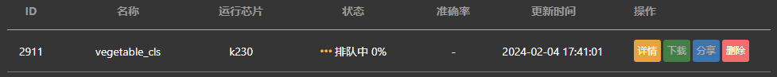
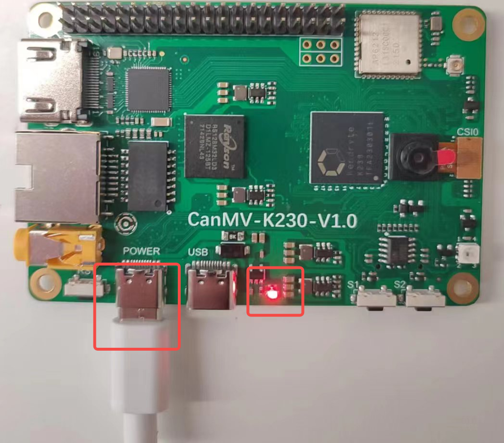
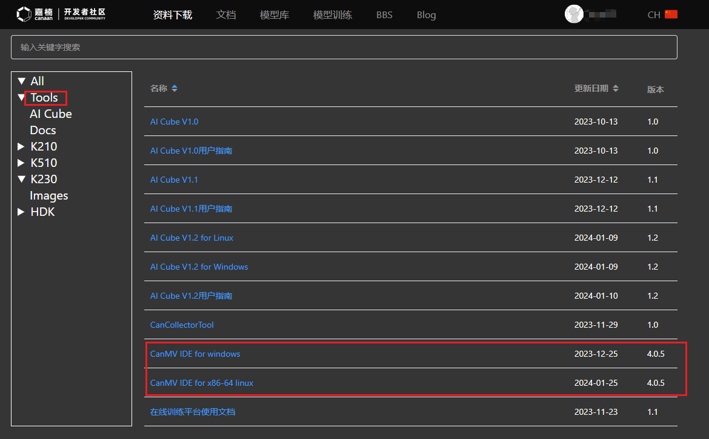
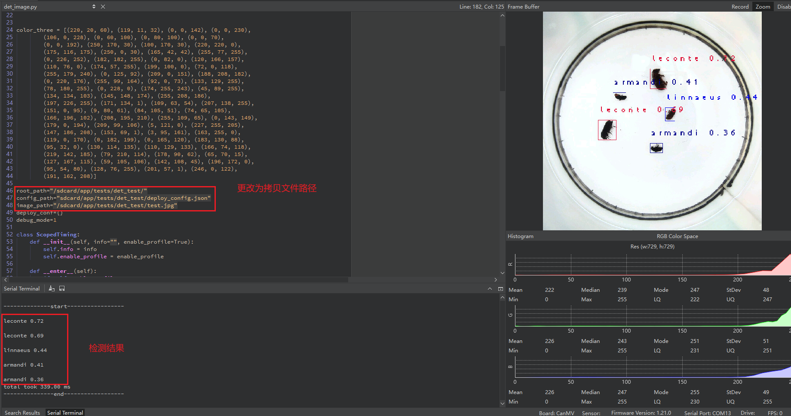
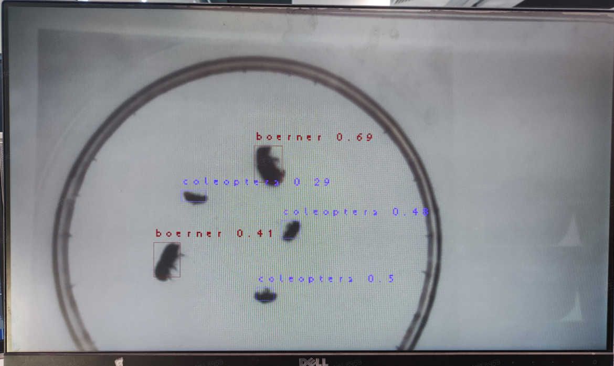

# 8. 使用在线云训练平台开发

> **注：**
>
> - **本章节使用SDK1.1.0版本和nncase2.4.0版本实现，后续更改请参考: [嘉楠开发者社区 (canaan-creative.com)](https://developer.canaan-creative.com/resource)->资料下载->Tools->云训练平台->在线训练平台使用文档V2**。
> - **开发时需要注意版本对应，k230_sdk版本和nncase版本对应关系参考链接：[K230 SDK nncase版本对应关系 — K230 文档 (canaan-creative.com)](https://developer.canaan-creative.com/k230/dev/zh/03_other/K230_SDK_nncase版本对应关系.html)。**
> - **MicroPython开发时需要注意版本对应，k230_canmv(MicroPython开发)版本和k230_sdk、nncase版本对应关系参考链接：[CanMV-K230_SDK_nncase版本对应关系 — K230 CanMV 文档 (canaan-creative.com)](https://developer.canaan-creative.com/k230_canmv/dev/zh/CanMV-K230_SDK_nncase版本对应关系.html)**。
> - **相关教学视频，见参考章节链接。**

本章节对在线训练平台的应用和模型在K230开发板的部署进行了介绍，以图像分类和目标检测为例，提供了详细的使用流程，帮助用户尽快上手，使用在线训练平台将任务在K230开发板上运行成功。在线训练平台适合没有计算资源，并不关注训练过程的用户使用。

## 8.1 使用在线平台实现图像分类任务

### 8.1.1 平台注册

首先，新用户需要进入[嘉楠开发者社区 (canaan-creative.com)](https://developer.canaan-creative.com/model/training) 注册，注册完成后登录系统。

### 8.1.2 创建项目

点击“创建项目”按钮，创建一个蔬菜分类项目。


然后单击选中该项目作为当前项目。

### 8.1.3 创建数据集

选择“数据集”选项卡，点击“创建数据集”按钮。


点击“绑定”按钮，将新创建的数据集和当前选中的项目绑定。然后进行图片上传，并完成标注。请按下图步骤完成。

每次选择一个类别的所有图片，添加标签并选中，然后点击开始上传，重复上述过程。数据上传示例如下图：


数据集上传完毕后，可以点击“数据集”选项卡进行预览。


### 8.1.4 创建训练任务

进入“训练记录”选项卡，点击“创建任务”按钮。


配置训练参数，创建新任务。


注意：标注框限制是目标检测任务的训练参数，在创建图像分类参数时可以使用默认值。

新任务创建后等待任务训练完成，点击“详情”按钮可以查看任务执行情况。



当云端服务器训练资源可用时，该任务会进入训练阶段。点击“详情”按钮可以查看任务的训练情况，如下图所示。


训练结束后可以下载部署包，同时部署包也会发送给您注册的邮箱。

部署包解压后，目录如下：


目录说明：

```
|-cls_result # 此目录存放分类正确的示例图片
|-*.kmodel # 开发板部署所用kmodel
|-deploy_config.json # 部署配置文件
|-deployment_source.zip # C++部署资源
|-mp_deployment_source.zip # MicroPython部署资源
```


### 8.1.5 上板准备

现在要将得到的kmodel在CanMV-K230开发板部署。CanMV-K230开发板如下图所示：


在进行上板部署前，您需要准备好：

- CanMV-K230开发板一块；
- USB-TypeC数据线一条；
- SD卡一张；
- 读卡器一个；
- Hdmi显示器一台，满足1080P;
- 网线一根，也可不用网络传输，直接使用SD卡拷贝文件；

#### 8.1.5.1 镜像烧录

首先在[嘉楠开发者社区 (canaan-creative.com)](https://developer.canaan-creative.com/resource)的资料下载页面，选择K230->Images，选择K230_canmv_sdcard_v##_nncase_v###.img.gz，通过查看上一节得到的deploy_config.json中的”nncase_version”字段选择对应版本的镜像。

> **注：**
>
> **k230_sdk版本和nncase版本对应关系请查看链接：**
>
> **[CanMV-K230_SDK_nncase版本对应关系 — K230 CanMV 文档 (canaan-creative.com)](https://developer.canaan-creative.com/k230_canmv/dev/zh/CanMV-K230_SDK_nncase版本对应关系.html)**

**Linux:**

在SD卡插到宿主机之前，输入：

```
ls -l /dev/sd\*
```


查看当前的存储设备。

将TF卡插入宿主机后，再次输入：

```
ls -l /dev/sd\*
```


查看此时的存储设备，新增加的就是TF卡设备节点。

假设/dev/sdc就是TF卡设备节点，执行如下命令烧录TF卡：

```
sudo dd if=sysimage-sdcard.img of=/dev/sdc bs=1M oflag=sync
```


**Windows:**

Windows下可通过rufus工具对TF卡进行烧录，[rufus工具下载地址](http://rufus.ie/downloads/)。

1）将SD卡插入PC，然后启动rufus工具，点击工具界面的”选择”按钮，选择待烧写的固件。


2）点击“开始”按钮开始烧写，烧写过程有进度条展示，烧写结束后会提示“准备就绪”。


烧录结束后，将SD卡插入开发板上电启动：


显示器连接HDMI连接口，需要使用网络可以连接网口。

#### 8.1.5.2 网络配置

如果您选择离线使用读卡器拷贝文件可以跳过此步骤。

- 串口工具调试

安装串口调试工具：MobaXterm安装：在https://mobaxterm.mobatek.net/download.html下载安装。

MobaXterm启动后，选择Session–>Serial:

Serial Port选择两个连续的串口，波特率Speed(bps)选择115200。

需要登录的是小核串口，进入后输入root登录；不需要登录的是大核串口，进入后按”q”回车，退出自启人脸识别程序。


- Windows系统PC端网络配置

控制面板->网络和共享中心->更改适配器设置->以太网网卡->右键属性->选中(TCP/IPv4)->属性

配置IP地址、掩码、网关，配置DNS服务器地址：


- 开发板网络配置

进入小核命令行，执行：

```
# 查看是否有eth0
ifconfig
# 配置开发板IP，和PC在同一网段下
ifconfig eth0 192.168.1.22
# 查看IP配置
ifconfig
```


注意：每次断电后都需要重新执行网络配置命令。

#### 8.1.5.3 文件拷贝

- **sharefs目录说明**

```
# 进入小核根目录
cd /
# 查看目录
ls
# sharefs目录是大小核共用目录，因此从小核拷贝到sharefs目录下的文件对大核也可见
```


- **离线读卡器拷贝**

断电拔出SD卡，是用读卡器从PC拷贝文件至大小核共享目录sharefs下，SD卡默认根目录对应就是sharefs目录，拷贝到此处即可。

- **本地网络TFTP拷贝**

安装tftp通信工具，下载地址：https://bitbucket.org/phjounin/tftpd64/downloads/

启动tftpd64，配置待传输文件存放目录和服务网卡


```
# 以下代码在小核串口执行
# 将PC上tftpd64配置文件存放目录中的文件传输至开发板的当前目录
tftp -g -r your_file 192.168.1.2
# 将开发板当前目录下的文件传输至tftpd64配置文件存放目录
tftp -p -r board_file 192.168.1.2
```


- **scp拷贝**

在Linux系统中，PC正常连接网络，开发板可以通过网线连接PC所在网关下其他网口，通过scp命令实现文件传输。

开发板上电，进入大小核COM界面，在小核执行scp传输命令：

```
# 从PC拷贝文件至开发板
scp 用户名@域名或IP:文件所在目录 开发板目的目录
#拷贝文件夹
scp -r 用户名@域名或IP:文件所在目录 开发板目的目录
# 从开发板拷贝文件至PC
scp 开发板待拷贝目录 用户名@域名或IP:PC目的目录
# 拷贝文件夹
scp -r 开发板待拷贝目录 用户名@域名或IP:PC目的目录
```


- 需要拷贝的文件

| 文件                                           | 说明                 |
| ---------------------------------------------- | -------------------- |
| *.kmodel                                       | 项目生成的kmode      |
| deploy_config.json                             | 部署配置文件         |
| deployment_source.zip解压，elfs/main_canmv.elf | 已编译好的可执行文件 |
| test.jpg                                       | 静态图测试图片       |

对于上述图像分类任务，可以在sharefs目录下新建子文件夹test_cls，需要拷贝：

kmodel文件、main_canmv.elf、选择一张测试样本test.jpg、deploy_config.json文件到test_cls目录下。

### 8.1.6 上板运行

- 静态图推理

连接大核串口，执行下述命令：

```
cd /sharefs/test_cls
# .elf <deploy_config.json> <input_path> <debug_mode>
# deploy_config.json：部署配置文件；
# input_path：推理图片路径，如果是视频流推理，设为None；
# debug_mode：调试模式，0为不调试，1为简单调试，2为详细调试；
./main_canmv.elf deploy_config.json test.jpg 0
```


静态图推理效果：


- 视频流推理

连接大核串口，执行下述命令：

```
cd /sharefs/test_cls
# .elf <deploy_config.json> <input_path> <debug_mode>
# deploy_config.json：部署配置文件；
# input_path：推理图片路径，视频流推理设为None；
# debug_mode：调试模式，0为不调试，1为简单调试，2为详细调试；
./main_canmv.elf deploy_config.json None 0
```


视频流推理效果：


### 8.1.7 MicroPython运行

#### 8.1.7.1 镜像烧录

烧录MicroPython的镜像，在[嘉楠开发者社区 (canaan-creative.com)](https://developer.canaan-creative.com/resource)的资料下载页面，点击左侧的K230/Images，选择CanMV-K230_micropython_v##_sdk_v##__nncase_v###.img.gz下载。版本选择请参考deploy_config.json文件中的“nncase_version”字段。并使用8.1.5.1章节的方法进行烧录。

> **注：**
>
> **k230_canmv和k230_sdk、nncase的版本对应关系请查看链接：**
>
> **[CanMV-K230_SDK_nncase版本对应关系 — K230 CanMV 文档 (canaan-creative.com)](https://developer.canaan-creative.com/k230_canmv/dev/zh/CanMV-K230_SDK_nncase版本对应关系.html)**

#### 8.1.7.2 文件拷贝

使用读卡器进行离线拷贝，将kmodel文件、deploy_config.json和测试图片文件拷贝到SD卡中的某一目录中并记下这一目录。

#### 8.1.7.3 安装IDE

安装CanMV IDE，在[嘉楠开发者社区 (canaan-creative.com)](https://developer.canaan-creative.com/resource)的资料下载页面，点击左侧的Tools，根据您的系统下载图中CanMV IDE不同版本的安装包安装。


#### 8.1.7.4 上电启动

按照下图连接开发板，上电启动：


启动CanMV IDE，打开文件，选择解压后的mp_deployment_source.zip中的cls_image.py文件，修改下图红框中的文件路径为您自行拷贝的文件路径，进行单图推理:


或者打开cls_video.py文件，修改文件路径为您文件拷贝的目录，进行视频推理，视频推理效果如下图：


当左下角连接状态变为如下图状态时： 

点击该按钮连接串口。选择除大小核串口外的第三路串口：

 连接后点击绿色三角按钮运行。

单图推理结果如图所示：


视频推理结果如图所示：


## 8.2 使用在线平台实现目标检测任务

### 8.2.1 平台注册

首先，新用户需要进入[嘉楠开发者社区 (canaan-creative.com)](https://developer.canaan-creative.com/model/training) 注册，注册完成后登录系统。

### 8.2.2 创建项目

点击“创建项目”按钮，创建一个昆虫检测项目。


然后单击选中该项目作为当前项目。

### 8.2.3 创建数据集

选择“数据集”选项卡，点击“创建数据集”按钮。


点击“绑定”按钮，将新创建的数据集和当前选中的项目绑定。


然后进行图片上传和标注。请按下图步骤完成。


如果您选择图片类型上传，请选择图片，点击“开始上传”：


然后点击“标注数据”，完成上传数据集的标注：


如果您选择压缩包格式上传，请按照要求组织您的数据：


数据集上传完毕后，可以点击“数据集”选项卡进行预览。


### 8.2.4 创建训练任务

进入“训练记录”选项卡，点击“创建任务”按钮。


配置训练参数，创建新任务。


注意：标注框限制是目标检测任务的训练参数，表示每个标注框最小应为5*5的框，单位为px。

新任务创建后等待任务训练完成，点击“详情”按钮可以查看任务执行情况。

当云端服务器训练资源可用时，该任务会进入训练阶段。点击“详情”按钮可以查看任务的训练情况，如下图所示。


训练结束后可以下载部署包，同时部署包也会发送给您注册的邮箱。

部署包解压后，目录如下：


目录说明：

```
|-det_result # 此目录存放部分测试样本检测结果
|-*.kmodel # 开发板部署所用kmodel
|-deploy_config.json # 部署配置文件
|-deployment_source.zip # C++部署资源
|-mp_deployment_source.zip # MicroPython部署资源
```


### 8.2.5 上板准备

现在要将得到的kmodel在CanMV-K230开发板部署。CanMV-K230开发板如下图所示：


在进行上板部署前，您需要准备好：

- CanMV-K230开发板一块；
- USB-TypeC数据线一条；
- SD卡一张；
- 读卡器一个；
- Hdmi显示器一台，满足1080P;
- 网线一根，也可不用网络传输，直接使用SD卡拷贝文件；

#### 8.2.5.1 镜像烧录

首先在[嘉楠开发者社区 (canaan-creative.com)](https://developer.canaan-creative.com/resource)的资料下载页面，选择K230->Images，选择K230_canmv_sdcard_v##_nncase_v###.img.gz，通过查看上一节得到的deploy_config.json中的”nncase_version”字段选择对应版本的镜像。

> **注：**
>
> **k230_sdk版本和nncase版本对应关系请查看链接：**
>
> **[CanMV-K230_SDK_nncase版本对应关系 — K230 CanMV 文档 (canaan-creative.com)](https://developer.canaan-creative.com/k230_canmv/dev/zh/CanMV-K230_SDK_nncase版本对应关系.html)**

**Linux:**

在SD卡插到宿主机之前，输入：

```
ls -l /dev/sd\*
```


查看当前的存储设备。

将TF卡插入宿主机后，再次输入：

```
ls -l /dev/sd\*
```


查看此时的存储设备，新增加的就是TF卡设备节点。

假设/dev/sdc就是TF卡设备节点，执行如下命令烧录TF卡：

```
sudo dd if=sysimage-sdcard.img of=/dev/sdc bs=1M oflag=sync
```


**Windows:**

Windows下可通过rufus工具对TF卡进行烧录，[rufus工具下载地址](http://rufus.ie/downloads/)。

1）将SD卡插入PC，然后启动rufus工具，点击工具界面的”选择”按钮，选择待烧写的固件。


2）点击“开始”按钮开始烧写，烧写过程有进度条展示，烧写结束后会提示“准备就绪”。


烧录结束后，将SD卡插入开发板上电启动：



显示器连接HDMI连接口，需要使用网络可以连接网口。

#### 8.2.5.2 网络配置

如果您选择离线使用读卡器拷贝文件可以跳过此步骤。

- 串口工具调试

安装串口调试工具：MobaXterm安装：在https://mobaxterm.mobatek.net/download.html下载安装。

MobaXterm启动后，选择Session–>Serial:

Serial Port选择两个连续的串口，波特率Speed(bps)选择115200。

需要登录的是小核串口，进入后输入root登录；不需要登录的是大核串口，进入后按”q”回车，退出自启人脸识别程序。


- Windows系统PC端网络配置

控制面板->网络和共享中心->更改适配器设置->以太网网卡->右键属性->选中(TCP/IPv4)->属性

配置IP地址、掩码、网关，配置DNS服务器地址：


- 开发板网络配置

进入小核命令行，执行：

```
# 查看是否有eth0
ifconfig
# 配置开发板IP，和PC在同一网段下
ifconfig eth0 192.168.1.22
# 查看IP配置
ifconfig
```


注意：每次断电后都需要重新执行网络配置命令。

#### 8.2.5.3 文件拷贝

- **sharefs目录说明**

```
# 进入小核根目录
cd /
# 查看目录
ls
# sharefs目录是大小核共用目录，因此从小核拷贝到sharefs目录下的文件对大核也可见
```


- **离线读卡器拷贝**

断电拔出SD卡，是用读卡器从PC拷贝文件至大小核共享目录sharefs下，SD卡默认根目录对应就是sharefs目录，拷贝到此处即可。

- **本地网络TFTP拷贝**

安装tftp通信工具，下载地址：https://bitbucket.org/phjounin/tftpd64/downloads/

启动tftpd64，配置待传输文件存放目录和服务网卡


```
# 以下代码在小核串口执行
# 将PC上tftpd64配置文件存放目录中的文件传输至开发板的当前目录
tftp -g -r your_file 192.168.1.2
# 将开发板当前目录下的文件传输至tftpd64配置文件存放目录
tftp -p -r board_file 192.168.1.2
```


- **scp拷贝**

在Linux系统中，PC正常连接网络，开发板可以通过网线连接PC所在网关下其他网口，通过scp命令实现文件传输。

开发板上电，进入大小核COM界面，在小核执行scp传输命令：

```
# 从PC拷贝文件至开发板
scp 用户名@域名或IP:文件所在目录 开发板目的目录
#拷贝文件夹
scp -r 用户名@域名或IP:文件所在目录 开发板目的目录
# 从开发板拷贝文件至PC
scp 开发板待拷贝目录 用户名@域名或IP:PC目的目录
# 拷贝文件夹
scp -r 开发板待拷贝目录 用户名@域名或IP:PC目的目录
```


- 需要拷贝的文件

| 文件                                           | 说明                 |
| ---------------------------------------------- | -------------------- |
| *.kmodel                                       | 项目生成的kmode      |
| deploy_config.json                             | 部署配置文件         |
| deployment_source.zip解压，elfs/main_canmv.elf | 已编译好的可执行文件 |
| test.jpg                                       | 静态图测试图片       |

对于上述图像分类任务，可以在sharefs目录下新建子文件夹test_det，需要拷贝：

kmodel文件、main_canmv.elf、选择一张测试样本test.jpg、deploy_config.json文件到test_det目录下。

### 8.2.6 上板运行

- 静态图推理

连接大核串口，执行下述命令：

```
cd /sharefs/test_det
# .elf <deploy_config.json> <input_path> <debug_mode>
# deploy_config.json：部署配置文件；
# input_path：推理图片路径，如果是视频流推理，设为None；
# debug_mode：调试模式，0为不调试，1为简单调试，2为详细调试；
./main_canmv.elf deploy_config.json test.jpg 0
```


静态图推理效果：


- 视频流推理

连接大核串口，执行下述命令：

```
cd /sharefs/test_det
# .elf <deploy_config.json> <input_path> <debug_mode>
# deploy_config.json：部署配置文件；
# input_path：推理图片路径，视频流推理设为None；
# debug_mode：调试模式，0为不调试，1为简单调试，2为详细调试；
./main_canmv.elf deploy_config.json None 0
```


视频流推理效果：


### 8.2.7 MicroPython运行

#### 8.2.7.1 镜像烧录

烧录MicroPython的镜像，在[嘉楠开发者社区 (canaan-creative.com)](https://developer.canaan-creative.com/resource)的资料下载页面，点击左侧的K230/Images，选择CanMV-K230_micropython_v##_sdk_v##__nncase_v###.img.gz下载。版本选择请参考deploy_config.json文件中的“nncase_version”字段。并使用8.2.5.1章节的方法进行烧录。

> **注：**
>
> **k230_canmv和k230_sdk、nncase的版本对应关系请查看链接：**
>
> **[CanMV-K230_SDK_nncase版本对应关系 — K230 CanMV 文档 (canaan-creative.com)](https://developer.canaan-creative.com/k230_canmv/dev/zh/CanMV-K230_SDK_nncase版本对应关系.html)**

#### 8.2.7.2 文件拷贝

使用读卡器进行离线拷贝，将kmodel文件、deploy_config.json和测试图片文件拷贝到SD卡中的某一目录中并记下这一目录。

#### 8.2.7.3 安装IDE

安装CanMV IDE，在[嘉楠开发者社区 (canaan-creative.com)](https://developer.canaan-creative.com/resource)的资料下载页面，点击左侧的Tools，根据您的系统下载图中CanMV IDE不同版本的安装包安装。



#### 8.2.7.4 上电启动

按照下图连接开发板，上电启动：


启动CanMV IDE，打开文件，选择解压后的mp_deployment_source.zip中的cls_image.py文件，修改下图红框中的文件路径为您自行拷贝的文件路径，进行单图推理：


或者打开cls_video.py文件，修改文件路径为您文件拷贝的目录，进行视频推理：


当左下角连接状态变为如下图状态时： 

点击该按钮连接串口。选择除大小核串口外的第三路串口：

 连接后点击绿色三角按钮运行。

单图推理结果如下：



视频推理结果：

