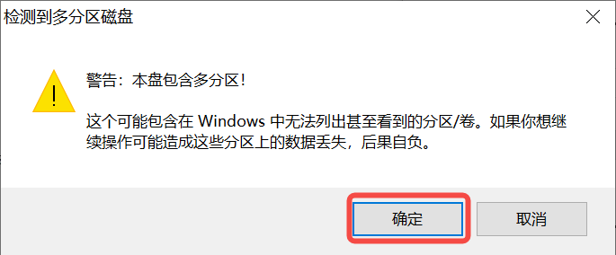

# 9. 使用AI Cube开发

> **注：**
>
> - **本章节使用SDK1.1.0版本和nncase2.4.0版本实现，后续更改请参考: [嘉楠开发者社区 (canaan-creative.com)](https://developer.canaan-creative.com/resource)->资料下载->Tools->AI Cube->AI_Cube_V##_用户指南**。
> - **开发时需要注意版本对应，k230_sdk版本和nncase版本对应关系参考链接：[K230 SDK nncase版本对应关系 — K230 文档 (canaan-creative.com)](https://developer.canaan-creative.com/k230/dev/zh/03_other/K230_SDK_nncase版本对应关系.html)。**
> - **MicroPython开发时需要注意版本对应，k230_canmv(MicroPython开发)版本和k230_sdk、nncase版本对应关系参考链接：[CanMV-K230_SDK_nncase版本对应关系 — K230 CanMV 文档 (canaan-creative.com)](https://developer.canaan-creative.com/k230_canmv/dev/zh/CanMV-K230_SDK_nncase版本对应关系.html)**。
> - **相关教学视频，见参考章节链接。**
> - **AI Cube不支持AMD训练显卡。**

本章节以图像分类和目标检测为例，详细地介绍了AI Cube工具在Ubuntu平台和Windows平台的使用方法，并将任务在K230开发板上部署运行的过程。AI Cube是一款离线训练工具，适合具有计算资源，追求数据安全性，但不关注底层训练代码的用户使用。

## 9.1 使用AI Cube实现图像分类任务

### 9.1.1 软件安装

AI Cube是嘉楠为开发者提供的离线开发工具，该平台保证了数据安全性，实现可视化的本地训练。该平台支持图像分类、目标检测、语义分割、OCR检测、OCR识别、度量学习、多标签分类、异常检测共8个任务。

现在以使用Ubuntu版本AI Cube实现蔬菜分类并在CanMV-K230上部署为例，介绍利用AI Cube快速开发的流程。请准备一台带有界面的ubuntu系统PC，安装cuda驱动。

首先，在[嘉楠开发者社区 (canaan-creative.com)](https://developer.canaan-creative.com/resource)的资料下载页面，选择Tools，下载Linux版本AI Cube，推荐使用V1.2版本。


在安装包下载目录解压安装包：

```
unzip AI_Cube_for_Linux_v1.2.zip
```


解压后，内部目录如下图所示：


打开一个新的Terminal，先按如下步骤安装dotnet sdk 7.0，如果您的计算机已安装dotnet sdk 7.0，请跳过此步骤。

```
wget https://packages.microsoft.com/config/ubuntu/20.04/packages-microsoft-prod.deb -O packages-microsoft-prod.deb
dpkg -i packages-microsoft-prod.deb
apt update
apt install -y apt-transport-https
apt install -y dotnet-sdk-7.0
```


在Terminal进入解压目录，启动AI Cube:

```
./run.sh
```


### 9.1.2 功能页介绍

AI Cube包含5个功能页，“项目”页面主要实现项目管理功能，展示当前项目和最近项目；“图像”页面展示当前项目的数据集信息，便于用户查看数据集的图片；“拆分”页面展示拆分信息，统计拆分类别和不同拆分集的图片；“训练”页面实现训练参数配置，训练信息和训练曲线的显示；“评估”页面实现模型评估和评估信息的展示，并且可以配置部署必要参数生成部署包。

“项目”页面图示：


“图像”页面图示：


“拆分”页面图示：


“训练”页面图示：


“评估”页面图示：


### 9.1.3 创建数据集

按照不同任务的数据集格式组织数据集。对应数据集格式在“项目”页面点击新建项目查看，同时我们提供了不同任务的示例数据集，在AI Cube/example_dataset/目录下，vegetable_cls就是图像分类任务的示例数据集。

关于不同任务的示例数据集，对应关系如下：

| 数据集名称     | 对应任务   | 说明                   |
| -------------- | ---------- | ---------------------- |
| vegetable_cls  | 图像分类   | 蔬菜分类场景           |
| insect         | 目标检测   | 昆虫检测场景           |
| Ocular_lesions | 语义分割   | 眼球病变区域分割场景   |
| dataset_td100  | OCR检测    | OCR文字检测场景        |
| ProductionDate | OCR识别    | 生产日期识别场景       |
| drink          | 度量学习   | 饮料瓶分类场景         |
| multilabel2000 | 多标签分类 | 自然风光多标签分类场景 |
| bottle         | 异常检测   | 瓶口异常检测场景       |

您既可以使用我们提供的示例数据集，也可以自己按照对应格式组织您的数据集。下面是蔬菜分类场景的数据集的结构：


每个类别一个子目录，子目录内是对应类别的所有图片。

### 9.1.4 创建项目

进入“项目”页面—>点击“新建项目”按钮—>选择任务类型—>导入数据集—>选择项目的存储路径—>添加项目的名称—>创建项目。

新建项目界面如下图所示：


项目新建完成后，会自动跳转到“图像”页面，您可以查看您的数据集详情。进入“拆分“页面，您可以按照自定义比例对数据集进行拆分，并查看拆分集的统计信息。

### 9.1.5 启动训练

进入“训练”页面，在左侧配置模型、数据增强和训练参数。

常见参数解析：

| 平台参数名称     | 常用参数定义            | 参数含义解析                                                 |
| ---------------- | ----------------------- | ------------------------------------------------------------ |
| 模型             | model                   | 不同结构的网络模型，用于实现不同的任务；                     |
| Backbone         | model backbone          | 模型中的特征提取部分网络结构，比如检测和分割任务的模型；     |
| 是否预训练       | pretrain                | 是否加载AI Cube提供的预训练模型;                             |
| 预训练模型语言   | pretrain language       | OCR识别的特定任务参数，选择训练预训练模型的样本语言；        |
| 模型大小         | model size              | n、s、m、l、x，同一模型的变体，区别是模型尺寸和输入分辨率，用于平衡准确率和速率； |
| 模型宽度         | model width             | 宽度越大，参数量越大;                                        |
| 图像尺寸         | image size              | 模型输入分辨率，单值表示输入为[x,x]，双值表示输入为[x,y];    |
| ASPP空洞率       | ASPP dilation rate      | 语义分割的参数，不同空洞卷积和池化操作的尺度，不同的空洞率进行空洞卷积可以扩大感受野，获得更广阔的的上下文信息； |
| 编码长度         | embedding length        | 度量学习的特定任务参数，样本被向量化的向量长度；             |
| 自动数据增强     | TrivialAugment          | 无参数单图单次自动数据增强;                                  |
| 其他数据增强方法 | —                       | 亮度、对比度、饱和度、色度、锐度增强，翻转，旋转，随机缩放，随机裁剪，透视变换，高斯模糊，直方图均衡化，灰度世界算法，CutOut，Random Erasing，Mask; |
| 学习率           | learning rate           | 优化算法的参数，每次迭代的调整步长；                         |
| 迭代轮数         | epoch                   | 一个epoch是神经网络使用全部训练样本训练一次的过程；          |
| 训练批大小       | batchsize               | 每次前向和反向传播使用的样本数量；                           |
| 优化器           | optimizer               | 优化网络的时候使用的优化函数，比如SGD、Adam等；              |
| AutoAnchor       | autoanchor              | 目标检测任务中的锚框自适应；                                 |
| NMS选项          | nms option              | 目标检测任务中区别类内和类间的非极大值抑制选项；             |
| 置信度阈值       | confidience threshold   | 用于预测框类别的过滤，低于此阈值的预测框都将被删除；         |
| 交并比阈值       | IOU threshold           | 对多个重叠框进行极大值筛选，计算所有检测框的得分，依次与得分最高的检测框对比，大于此阈值的检测框被删除；OCR检测中的Box阈值类似； |
| 自动混合精度     | AMP                     | 针对不同层采用不同的数据精度，以节省显存并提高计算速度；     |
| 指数移动平均     | EMA                     | 平滑方法，防止异常值的影响，权重随时间指数递减；             |
| 早停             | Early Stopping          | 增加模型泛化性和防止过拟合的方法；                           |
| 预热策略         | WarmUp                  | 操作训练初始阶段的learning rate，使模型更快的收敛；          |
| 多尺度训练       | MST                     | 实现对不同尺度的输入图像进行训练，提高检测模型对不同大小物体的检测泛化性； |
| 损失函数         | loss function           | 用于评估模型预测值和真实值的差距程度，损失越小，模型性能越好； |
| 学习率调度       | learning rate scheduler | 学习率调整策略，训练过程中动态的调整学习率以适应梯度下降过程，包括StepLR、CosineAnnealingLR、LinearLR、MultiStepLR等； |
| 损失刷新步长     | loss refresh step       | 界面Loss曲线绘制频率，以batch为单位；                        |
| GPU索引          | gpu index               | 显卡索引号；                                                 |

按照不同的任务配置好对应参数后，可以点击“增强样本”按钮查看经过数据增强的部分示例样本；点击“学习率曲线”可以查看不同的学习率策略导致的学习率变化；点击“开始训练”按钮，训练的信息会在右上方面板显示，损失曲线和指标曲线会在中间位置绘制；示例样本的预测结果会在右下面板迭代显示每个epoch的变化。训练时界面如下图：


### 9.1.6 模型测试

进入“评估”页面，选择训练好的模型，然后选择测试方式。测试方式如下：

| 测试方式     | 说明                                                         |
| ------------ | ------------------------------------------------------------ |
| 测试集测试   | 对拆分得到的测试集进行测试评估，输出测试指标数据；           |
| 额外数据测试 | 使用和训练数据集相同格式的带标注数据进行测试，输出测试指标数据； |
| 图像目录测试 | 只选择使用训练的模型和参数对图片目录下的所有无标注样本进行推理，无测试指标； |

点击“开始测试”按钮，进行测试，测试结束后，根据评估指标查看您的模型性能；双击测试数据列表的条目可以查看推理结果大图。

### 9.1.7 模型部署

如果模型的性能符合您的需求，您可以在芯片适配面板配置部署参数，主要是模型的输入分辨率和一些基础参数，点击“部署”按钮生成部署包。


部署包生成后您可以在当前项目的根目录下找到如下文件：

- deployment_source.zip
- mp_deployment_source.zip
- *.kmodel
- deploy_config.json


### 9.1.8 上板准备

完成4.1.1~4.1.7步骤后，AI Cube的部分结束，现在要将得到的kmodel在CanMV-K230开发板部署。CanMV-K230开发板如下图所示：


在进行上板部署前，您需要准备好：

- CanMV-K230开发板一块；
- USB-TypeC数据线一条；
- SD卡一张；
- 读卡器一个；
- Hdmi显示器一台，满足1080P;
- 网线一根，也可不用网络传输，直接使用SD卡拷贝文件；

#### 9.1.8.1 镜像烧录

首先在[嘉楠开发者社区 (canaan-creative.com)](https://developer.canaan-creative.com/resource)的资料下载页面，选择K230->Images，选择K230_canmv_sdcard_v##_nncase_v###.img.gz，通过查看9.1.7章节得到的deploy_config.json中的”nncase_version”字段选择对应版本的镜像。

> **注：**
>
> **k230_sdk版本和nncase版本对应关系请查看链接：**
>
> **[CanMV-K230_SDK_nncase版本对应关系 — K230 CanMV 文档 (canaan-creative.com)](https://developer.canaan-creative.com/k230_canmv/dev/zh/CanMV-K230_SDK_nncase版本对应关系.html)**

**Linux:**

在SD卡插到宿主机之前，输入：

```
ls -l /dev/sd\*
```


查看当前的存储设备。

将TF卡插入宿主机后，再次输入：

```
ls -l /dev/sd\*
```


查看此时的存储设备，新增加的就是TF卡设备节点。

假设/dev/sdc就是TF卡设备节点，执行如下命令烧录TF卡：

```
sudo dd if=sysimage-sdcard.img of=/dev/sdc bs=1M oflag=sync
```


**Windows:**

Windows下可通过rufus工具对TF卡进行烧录，[rufus工具下载地址](http://rufus.ie/downloads/)。

1）将SD卡插入PC，然后启动rufus工具，点击工具界面的”选择”按钮，选择待烧写的固件。


2）点击“开始”按钮开始烧写，烧写过程有进度条展示，烧写结束后会提示“准备就绪”。





烧录结束后，将SD卡插入开发板上电启动：


显示器连接HDMI连接口，需要使用网络可以连接网口。

#### 9.1.8.2 网络配置

如果您选择离线使用读卡器拷贝文件可以跳过此步骤。

- 串口工具调试

安装串口调试工具：MobaXterm安装：在https://mobaxterm.mobatek.net/download.html下载安装。

MobaXterm启动后，选择Session–>Serial:

Serial Port选择两个连续的串口，波特率Speed(bps)选择115200。

需要登录的是小核串口，进入后输入root登录；不需要登录的是大核串口，进入后按”q”回车，退出自启人脸识别程序。


- Windows系统PC端网络配置

控制面板->网络和共享中心->更改适配器设置->以太网网卡->右键属性->选中(TCP/IPv4)->属性

配置IP地址、掩码、网关，配置DNS服务器地址：


- 开发板网络配置

进入小核命令行，执行：

```
# 查看是否有eth0
ifconfig
# 配置开发板IP，和PC在同一网段下
ifconfig eth0 192.168.1.22
# 查看IP配置
ifconfig
```


注意：每次断电后都需要重新执行网络配置命令。

#### 9.1.8.3 文件拷贝

- **sharefs目录说明**

```
# 进入小核根目录
cd /
# 查看目录
ls
# sharefs目录是大小核共用目录，因此从小核拷贝到sharefs目录下的文件对大核也可见
```


- **离线读卡器拷贝**

断电拔出SD卡，是用读卡器从PC拷贝文件至大小核共享目录sharefs下，SD卡默认根目录对应就是sharefs目录，拷贝到此处即可。

- **本地网络TFTP拷贝**

安装tftp通信工具，下载地址：https://bitbucket.org/phjounin/tftpd64/downloads/

启动tftpd64，配置待传输文件存放目录和服务网卡。


```
# 以下代码在小核串口执行
# 将PC上tftpd64配置文件存放目录中的文件传输至开发板的当前目录
tftp -g -r your_file 192.168.1.2
# 将开发板当前目录下的文件传输至tftpd64配置文件存放目录
tftp -p -r board_file 192.168.1.2
```


- **scp拷贝**

在Linux系统中，PC正常连接网络，开发板可以通过网线连接PC所在网关下其他网口，通过scp命令实现文件传输。

开发板上电，进入大小核COM界面，在小核执行scp传输命令：

```
# 从PC拷贝文件至开发板
scp 用户名@域名或IP:文件所在目录 开发板目的目录
#拷贝文件夹
scp -r 用户名@域名或IP:文件所在目录 开发板目的目录
# 从开发板拷贝文件至PC
scp 开发板待拷贝目录 用户名@域名或IP:PC目的目录
# 拷贝文件夹
scp -r 开发板待拷贝目录 用户名@域名或IP:PC目的目录
```


- 需要拷贝的文件

| 文件                                               | 说明                                                         |
| -------------------------------------------------- | ------------------------------------------------------------ |
| AICube项目目录/*.kmodel                            | 项目生成的kmodel                                             |
| AICube项目目录/deploy_config.json                  | 部署配置文件                                                 |
| AI Cube安装目录/on_board/elfs/canmv/main_canmv.elf | 已编译好的可执行文件                                         |
| test.jpg                                           | 静态图测试图片                                               |
| deployment_source.zip解压后的其他文件              | 比如ocr任务需要拷贝字库Asci0816.zf、HZKf2424.hz，还有对应的字典文件。 |

对于上述图像分类任务，可以在sharefs目录下新建子文件夹test_cls，需要拷贝：

kmodel文件、main_canmv.elf、选择一张测试样本test.jpg、deploy_config.json文件到test_cls目录下。

### 9.1.9 上板运行

- 静态图推理

连接大核串口，执行下述命令：

```
cd /sharefs/test_cls
# .elf <deploy_config.json> <input_path> <debug_mode>
# deploy_config.json：部署配置文件；
# input_path：推理图片路径，如果是视频流推理，设为None；
# debug_mode：调试模式，0为不调试，1为简单调试，2为详细调试；
./main_canmv.elf deploy_config.json test.jpg 0
```


静态图推理效果：


- 视频流推理

连接大核串口，执行下述命令：

```
cd /sharefs/test_cls
# .elf <deploy_config.json> <input_path> <debug_mode>
# deploy_config.json：部署配置文件；
# input_path：推理图片路径，视频流推理设为None；
# debug_mode：调试模式，0为不调试，1为简单调试，2为详细调试；
./main_canmv.elf deploy_config.json None 0
```


视频流推理效果：


### 9.1.10 MicroPython运行

#### 9.1.10.1 镜像烧录

烧录MicroPython的镜像，在[嘉楠开发者社区 (canaan-creative.com)](https://developer.canaan-creative.com/resource)的资料下载页面，点击左侧的K230/Images，选择CanMV-K230_micropython_v##_sdk_v##__nncase_v###.img.gz下载。版本选择请参考deploy_config.json文件中的“nncase_version”字段。并使用9.1.8.1章节的方法进行烧录。

> **注：**
>
> **k230_canmv和k230_sdk、nncase的版本对应关系请查看链接：**
>
> **[CanMV-K230_SDK_nncase版本对应关系 — K230 CanMV 文档 (canaan-creative.com)](https://developer.canaan-creative.com/k230_canmv/dev/zh/CanMV-K230_SDK_nncase版本对应关系.html)**

#### 9.1.10.2 文件拷贝

使用读卡器进行离线拷贝，将kmodel文件、deploy_config.json和测试图片文件拷贝到SD卡中的某一目录中并记下这一目录。

#### 9.1.10.3 安装IDE

安装CanMV IDE，在[嘉楠开发者社区 (canaan-creative.com)](https://developer.canaan-creative.com/resource)的资料下载页面，点击左侧的Tools，根据您的系统下载图中CanMV IDE不同版本的安装包安装。


#### 9.1.10.4 上电启动

按照下图连接开发板，上电启动：


启动CanMV IDE，打开文件，选择解压后的mp_deployment_source.zip中的cls_image.py文件，修改下图红框中的文件路径为您自行拷贝的文件路径，进行单图推理：


或者打开cls_video.py文件，修改文件路径为您文件拷贝的目录，进行视频推理：


当左下角连接状态变为如下图状态时： 

点击该按钮连接串口。选择除大小核串口外的第三路串口：

 连接后点击绿色三角按钮运行。

单图推理结果如图所示：


视频推理结果如图所示：


## 9.2 使用AI Cube实现目标检测任务

### 9.2.1 软件安装

使用Windows版本AI Cube完成目标检测任务并在CanMV-K230上部署为例，介绍利用AI Cube快速开发的流程。请准备一台安装Windows系统的PC，安装cuda驱动。

首先安装dotnet sdk 7.0，下载地址：[.NET 下载(Linux、macOS 和 Windows) (microsoft.com)](https://dotnet.microsoft.com/zh-cn/download/dotnet)，请您按照系统下载对应版本安装并添加至环境变量。


首先，在[嘉楠开发者社区 (canaan-creative.com)](https://developer.canaan-creative.com/resource)的资料下载页面，选择Tools，下载Windows版本AI Cube，推荐使用V1.2版本。


下载安装包后解压，解压后目录结构如下：


双击AI_Cube.exe启动软件。具体操作可以参考用户指南。example_dataset目录是提供的八类任务的示例数据集；example_projects是提供的八类任务的示例项目；on_board目录内包含CanMV-k230开发板烧录镜像、MicroPython烧录镜像、EVB开发板烧录镜像和在CanMV-k230开发板和EVB开发板的可执行elf文件；canmv_ide-4.0.5.exe是使用MicroPython开发的IED软件。

### 9.2.2 功能页介绍

AI Cube包含5个功能页，“项目”页面主要实现项目管理功能，展示当前项目和最近项目；“图像”页面展示当前项目的数据集信息，便于用户查看数据集的图片；“拆分”页面展示拆分信息，统计拆分类别和不同拆分集的图片；“训练”页面实现训练参数配置，训练信息和训练曲线的显示；“评估”页面实现模型评估和评估信息的展示，并且可以配置部署必要参数生成部署包。

“项目”页面图示：


“图像”页面图示：


“拆分”页面图示：


“训练”页面图示：


“评估”页面图示：


### 9.2.3 创建数据集

按照不同任务的数据集格式组织数据集。对应数据集格式在“项目”页面点击新建项目查看，同时我们提供了不同任务的示例数据集，在AI Cube/example_dataset/目录下，insect就是目标检测任务的示例数据集。

您既可以使用我们提供的示例数据集，也可以自己按照对应格式组织您的数据集。下面是昆虫检测场景的数据集的结构，格式满足VOC数据集格式：

```
insect
|---JPEGImages
    |---0001.jpg
    |---0002.jpg
    |---0003.jpg
    |---...
|---Annotations
    |---0001.xml
    |---0002.xml
    |---0003.xml
    |---...
```


注意：目标检测数据集也支持YOLO数据格式和CoCo数据格式，具体请参考软件新建项目。

### 9.2.4 创建项目

进入“项目”页面—>点击“新建项目”按钮—>选择任务类型—>导入数据集—>选择项目的存储路径—>添加项目的名称—>创建项目。

新建项目界面如下图所示：


项目新建完成后，会自动跳转到“图像”页面，您可以查看您的数据集详情。进入“拆分“页面，您可以按照自定义比例对数据集进行拆分，并查看拆分集的统计信息。

### 9.2.5 启动训练

训练参数说明及其配置见4.1.5章节。

配置好对应参数后，可以点击“增强样本”按钮查看经过数据增强的部分示例样本；点击“学习率曲线”可以查看不同的学习率策略导致的学习率变化；点击“开始训练”按钮，训练的信息会在右上方面板显示，损失曲线和指标曲线会在中间位置绘制；示例样本的预测结果会在右下面板迭代显示每个epoch的变化。训练时界面如下图：


### 9.2.6 模型测试

进入“评估”页面，选择训练好的模型，然后选择测试方式。测试方式如下：

| 测试方式     | 说明                                                         |
| ------------ | ------------------------------------------------------------ |
| 测试集测试   | 对拆分得到的测试集进行测试评估，输出测试指标数据；           |
| 额外数据测试 | 使用和训练数据集相同格式的带标注数据进行测试，输出测试指标数据； |
| 图像目录测试 | 只选择使用训练的模型和参数对图片目录下的所有无标注样本进行推理，无测试指标； |

点击“开始测试”按钮，进行测试，测试结束后，根据评估指标查看您的模型性能；双击测试数据列表的条目可以查看推理结果大图。

### 9.2.7 模型部署

如果模型的性能符合您的需求，您可以在芯片适配面板配置部署参数，主要是模型的输入分辨率和一些基础参数，点击“部署”按钮生成部署包。


部署包生成后您可以在当前项目的根目录下找到如下文件：

- deployment_source.zip
- mp_deployment_source.zip
- *.kmodel
- deploy_config.json


### 9.2.8 上板准备

完成4.2.1~4.2.7步骤后，AI Cube的部分结束，现在要将得到的kmodel在CanMV-K230开发板部署。CanMV-K230开发板如下图所示：


在进行上板部署前，您需要准备好：

- CanMV-K230开发板一块；
- USB-TypeC数据线一条；
- SD卡一张；
- 读卡器一个；
- Hdmi显示器一台，满足1080P;
- 网线一根，也可不用网络传输，直接使用SD卡拷贝文件；

#### 9.2.8.1 镜像烧录

首先在[嘉楠开发者社区 (canaan-creative.com)](https://developer.canaan-creative.com/resource)的资料下载页面，选择K230->Images，选择K230_canmv_sdcard_v##_nncase_v###.img.gz，通过查看9.2.7章节得到的deploy_config.json中的”nncase_version”字段选择对应版本的镜像。

> **注：**
>
> **k230_sdk版本和nncase版本对应关系请查看链接：**
>
> **[CanMV-K230_SDK_nncase版本对应关系 — K230 CanMV 文档 (canaan-creative.com)](https://developer.canaan-creative.com/k230_canmv/dev/zh/CanMV-K230_SDK_nncase版本对应关系.html)**

**Linux:**

在SD卡插到宿主机之前，输入：

```
ls -l /dev/sd\*
```


查看当前的存储设备。

将TF卡插入宿主机后，再次输入：

```
ls -l /dev/sd\*
```


查看此时的存储设备，新增加的就是TF卡设备节点。

假设/dev/sdc就是TF卡设备节点，执行如下命令烧录TF卡：

```
sudo dd if=sysimage-sdcard.img of=/dev/sdc bs=1M oflag=sync
```


**Windows:**

Windows下可通过rufus工具对TF卡进行烧录，[rufus工具下载地址](http://rufus.ie/downloads/)。

1）将SD卡插入PC，然后启动rufus工具，点击工具界面的”选择”按钮，选择待烧写的固件。


2）点击“开始”按钮开始烧写，烧写过程有进度条展示，烧写结束后会提示“准备就绪”。


烧录结束后，将SD卡插入开发板上电启动：


显示器连接HDMI连接口，需要使用网络可以连接网口。

#### 9.2.8.2 网络配置

如果您选择离线使用读卡器拷贝文件可以跳过此步骤。

- 串口工具调试

安装串口调试工具：MobaXterm安装：在https://mobaxterm.mobatek.net/download.html下载安装。

MobaXterm启动后，选择Session–>Serial:

Serial Port选择两个连续的串口，波特率Speed(bps)选择115200。

需要登录的是小核串口，进入后输入root登录；不需要登录的是大核串口，进入后按”q”回车，退出自启人脸识别程序。


- Windows系统PC端网络配置

控制面板->网络和共享中心->更改适配器设置->以太网网卡->右键属性->选中(TCP/IPv4)->属性

配置IP地址、掩码、网关，配置DNS服务器地址：


- 开发板网络配置

进入小核命令行，执行：

```
# 查看是否有eth0
ifconfig
# 配置开发板IP，和PC在同一网段下
ifconfig eth0 192.168.1.22
# 查看IP配置
ifconfig
```


注意：每次断电后都需要重新执行网络配置命令。

#### 9.2.8.3 文件拷贝

- **sharefs目录说明**

```
# 进入小核根目录
cd /
# 查看目录
ls
# sharefs目录是大小核共用目录，因此从小核拷贝到sharefs目录下的文件对大核也可见
```


- **离线读卡器拷贝**

断电拔出SD卡，是用读卡器从PC拷贝文件至大小核共享目录sharefs下，SD卡默认根目录对应就是sharefs目录，拷贝到此处即可。

- **本地网络TFTP拷贝**

安装tftp通信工具，下载地址：https://bitbucket.org/phjounin/tftpd64/downloads/

启动tftpd64，配置待传输文件存放目录和服务网卡


```
# 以下代码在小核串口执行
# 将PC上tftpd64配置文件存放目录中的文件传输至开发板的当前目录
tftp -g -r your_file 192.168.1.2
# 将开发板当前目录下的文件传输至tftpd64配置文件存放目录
tftp -p -r board_file 192.168.1.2
```


- **scp拷贝**

在Linux系统中，PC正常连接网络，开发板可以通过网线连接PC所在网关下其他网口，通过scp命令实现文件传输。

开发板上电，进入大小核COM界面，在小核执行scp传输命令：

```
# 从PC拷贝文件至开发板
scp 用户名@域名或IP:文件所在目录 开发板目的目录
#拷贝文件夹
scp -r 用户名@域名或IP:文件所在目录 开发板目的目录
# 从开发板拷贝文件至PC
scp 开发板待拷贝目录 用户名@域名或IP:PC目的目录
# 拷贝文件夹
scp -r 开发板待拷贝目录 用户名@域名或IP:PC目的目录
```


- 需要拷贝的文件

| 文件                                               | 说明                                                         |
| -------------------------------------------------- | ------------------------------------------------------------ |
| AICube项目目录/*.kmodel                            | 项目生成的kmodel                                             |
| AICube项目目录/deploy_config.json                  | 部署配置文件                                                 |
| AI Cube安装目录/on_board/elfs/canmv/main_canmv.elf | 已编译好的可执行文件                                         |
| test.jpg                                           | 静态图测试图片                                               |
| deployment_source.zip解压后的其他文件              | 比如ocr任务需要拷贝字库Asci0816.zf、HZKf2424.hz，还有对应的字典文件。 |

对于上述图像分类任务，可以在sharefs目录下新建子文件夹test_det，需要拷贝：

kmodel文件、main_canmv.elf、选择一张测试样本test.jpg、deploy_config.json文件到test_det目录下。

如果您想自己修改C++源码进行编译，可以参考：[kendryte/k230_sdk: Kendryte K230 SDK (github.com)](https://github.com/kendryte/k230_sdk)搭建编译环境，将部署包deployment_source.zip解压后的“canmv/example_code_k230”目录拷贝到“k230_sdk根目录/src/big/nncase”下，并进入到example_code_k230目录，赋予编译脚本权限并进行编译：

```
chmod +x build_app.sh
./build_app.sh
```


如果您不想自己编译，可以略过上述编译步骤，直接使用我们提供的elf文件。

### 9.2.9 上板运行

- 静态图推理

连接大核串口，执行下述命令：

```
cd /sharefs/test_det
# .elf <deploy_config.json> <input_path> <debug_mode>
# deploy_config.json：部署配置文件；
# input_path：推理图片路径，如果是视频流推理，设为None；
# debug_mode：调试模式，0为不调试，1为简单调试，2为详细调试；
./main_canmv.elf deploy_config.json test.jpg 0
```


静态图推理效果：


- 视频流推理

连接大核串口，执行下述命令：

```
cd /sharefs/test_det
# .elf <deploy_config.json> <input_path> <debug_mode>
# deploy_config.json：部署配置文件；
# input_path：推理图片路径，视频流推理设为None；
# debug_mode：调试模式，0为不调试，1为简单调试，2为详细调试；
./main_canmv.elf deploy_config.json None 0
```


视频流推理效果：


### 9.2.10 MicroPython运行

#### 9.2.10.1 镜像烧录

烧录MicroPython的镜像，在[嘉楠开发者社区 (canaan-creative.com)](https://developer.canaan-creative.com/resource)的资料下载页面，点击左侧的K230/Images，选择CanMV-K230_micropython_v##_sdk_v##__nncase_v###.img.gz下载。版本选择请参考deploy_config.json文件中的“nncase_version”字段。并使用9.2.8.1章节的方法进行烧录。

> **注：**
>
> **k230_canmv和k230_sdk、nncase的版本对应关系请查看链接：**
>
> **[CanMV-K230_SDK_nncase版本对应关系 — K230 CanMV 文档 (canaan-creative.com)](https://developer.canaan-creative.com/k230_canmv/dev/zh/CanMV-K230_SDK_nncase版本对应关系.html)**

#### 9.2.10.2 文件拷贝

使用读卡器进行离线拷贝，将kmodel文件、deploy_config.json和测试图片文件拷贝到SD卡中的某一目录中并记下这一目录。

#### 9.2.10.3 安装IDE

安装CanMV IDE，在[嘉楠开发者社区 (canaan-creative.com)](https://developer.canaan-creative.com/resource)的资料下载页面，点击左侧的Tools，根据您的系统下载图中CanMV IDE不同版本的安装包安装。


#### 9.2.10.4 上电启动

按照下图连接开发板，上电启动：


启动CanMV IDE，打开文件，选择解压后的mp_deployment_source.zip中的cls_image.py文件，修改下图红框中的文件路径为您自行拷贝的文件路径，进行单图推理：


或者打开cls_video.py文件，修改文件路径为您文件拷贝的目录，进行视频推理：


当左下角连接状态变为如下图状态时： 

点击该按钮连接串口。选择除大小核串口外的第三路串口：

 连接后点击绿色三角按钮运行。

单图推理结果如下：


视频推理结果：

