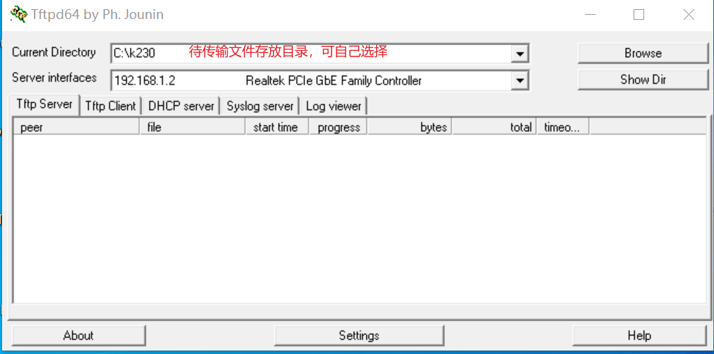

# 10. 源码级应用开发

> **注：**
>
> - **本章节使用SDK1.1.0版本和nncase2.4.0版本实现，后续更改请参考: [kendryte/K230_training_scripts (github.com)](https://github.com/kendryte/K230_training_scripts)**。
> - **开发时需要注意版本对应，k230_sdk版本和nncase版本对应关系参考链接：[K230 SDK nncase版本对应关系 — K230 文档 (canaan-creative.com)](https://developer.canaan-creative.com/k230/dev/zh/03_other/K230_SDK_nncase版本对应关系.html)。**
> - **相关教学视频，见参考章节链接。**

本章节介绍了KTS(k230_training_scripts)工具的使用方法和模型上板部署过程。KTS提供了分类、检测、翻译、关键词唤醒共四个任务从训练到部署的源码，覆盖cv、nlp、语音等多个模态。用户对源码可见，感兴趣的用户可以对源码进行修改，实现更换数据集、更换模型等部分。本工具适合对深度学习的不同模态的任务有比较成熟的了解，并希望使用k230开发板完成部署的用户。

## 10.1 使用KTS实现图像分类任务

k230_training_scripts(KTS)提供了源码级的详细的k230开发案例，覆盖cv、nlp和audio相关的AI任务。KTS的github地址：[kendryte/K230_training_scripts (github.com)](https://github.com/kendryte/K230_training_scripts)。KTS相比于上面的两个工具更为灵活，对用户的代码能力要求也更高，用户可以自行修改配置对应步骤，用户可以更换模型，调整参数，从源码实现k230应用的快速开发和部署。

使用KTS进行AI开发需要实现环境搭建、数据准备、模型训练和测试、CANMV k230镜像编译和烧录、C++代码编译、网络配置和文件传输、k230端部署等环节。以蔬菜分类场景为例，代码参见:[kendryte/K230_training_scripts](https://github.com/kendryte/K230_training_scripts/tree/main/end2end_cls_doc)。

### 10.1.1 环境搭建

（1）Linux系统；

（2）安装显卡驱动；

（3）安装Anaconda，用于创建模型训练环境；

（4）安装Docker，用于创建SDK镜像编译环境；

（5）安装dotnet SDK;

### 10.1.2 数据准备

图像分类任务自定义数据集按照如下图格式组织：


注意：图像分类必须按照上述格式进行组织。

### 10.1.3 模型训练和测试

本节内容在训练环境中实现。

#### 10.1.3.1 创建虚拟环境

开启命令终端：

```
conda create -n myenv python=3.9
conda activate myenv
```


#### 10.1.3.2 安装python依赖库

按照项目内的requriements.txt安装训练所用的python库,等待安装：

```
pip install -r requriements.txt
```


在requriments.txt中会安装模型转换的包nncase和nncase-kpu，nncase 是一个为 AI 加速器设计的神经网络编译器。

编译镜像和使用nncase转换kmodel时请注意版本对应关系，k230_sdk版本和nncase版本对应关系参考下述链接：

**[K230 SDK nncase版本对应关系 — K230 文档 (canaan-creative.com)](https://developer.canaan-creative.com/k230/dev/zh/03_other/K230_SDK_nncase版本对应关系.html)**

您可以按照对应版本更换nncase和nncase-kpu的版本，比如更换nncase版本为2.7.0：

```
pip install nncase==2.7.0
pip install nncase-kpu==2.7.0
```


#### 10.1.3.3 配置训练参数

给出的训练脚本中配置文件yaml/config.yaml设置如下：

```
dataset:
  root_folder: ../data/veg_cls # 分类数据集路径
  split: true # 是否重新执行拆分，第一次执行必须为true
  train_ratio: 0.7 # 训练集比例
  val_ratio: 0.15 # 验证集比例
  test_ratio: 0.15 # 测试集比例

train:
  device: cuda
  txt_path: ../gen # 拆分过程生成的训练集、验证集、测试集txt文件，标签名称文件、校正集文件
  image_size: [ 224,224 ] # 分辨率
  mean: [ 0.485, 0.456, 0.406 ]
  std: [ 0.229, 0.224, 0.225 ]
  epochs: 10
  batchsize: 8
  learningrate: 0.001
  save_path: ../checkpoints # 模型保存路径

inference:
  mode: image # 推理模式，分为image和video; image模式下可推理单张图片和目录下所有图片，video调用摄像头实现推理
  inference_model: best # 分为best和last，分别调用checkpoints下的best.pth和last.pth进行推理
  images_path: ../data/veg_cls/bocai # 如果该路径为图片路径，则进行单张图片推理；如果该路径为目录，则对目录下所有图片进行推理

deploy:
  chip: k230 # 芯片类型，分为“k230”和“cpu”两种
  ptq_option: 0 # 量化类型，0为uint8，1，2，3，4为uint16的不同形式
```


#### 10.1.3.4 模型训练

进入到工程的scripts目录，执行训练代码：

```
python3 main.py
```


如果训练成功，在配置文件的model_save_dir目录下可以找到训练好的last.pth、best.pth、best.onnx、best.kmodel。

#### 10.1.3.5 模型测试

设置配置文件中的inference部分，设置测试配置，执行测试代码：

```
python3 inference.py
```


#### 10.1.3.6 准备文件

后面部署步骤需要用到的文件包括：

（1）checkpoints/best.kmodel;

（2）gen/labels.txt;

（3）待测试图片test.jpg;

### 10.1.4 K230_SDK镜像编译和烧录

编译镜像和使用nncase转换kmodel时请注意版本对应关系，k230_sdk版本和nncase版本对应关系参考下述链接：

**[K230 SDK nncase版本对应关系 — K230 文档 (canaan-creative.com)](https://developer.canaan-creative.com/k230/dev/zh/03_other/K230_SDK_nncase版本对应关系.html)**

如果您选择使用[嘉楠开发者社区 (canaan-creative.com)](https://developer.canaan-creative.com/resource)资料下载->K230->Images部分提供的镜像，请您注意版本对应关系下载烧录。

#### 10.1.4.1 Docker环境搭建

```
# 下载docker编译镜像
docker pull ghcr.io/kendryte/k230_sdk
# 可以使用以下命令确认docker镜像是否拉取成功
docker images | grep ghcr.io/kendryte/k230_sdk
# 下载sdk源码
git clone https://github.com/kendryte/k230_sdk.git
cd k230_sdk
# 下载工具链Linux和RT-Smart toolchain, buildroot package, AI package等
make prepare_sourcecode
# 创建docker容器，$(pwd):$(pwd)表示系统当前目录映射到docker容器内部的相同目录下，将系统下的工具链目录映射到docker容器内部的/opt/toolchain目录下
docker run -u root -it -v $(pwd):$(pwd) -v $(pwd)/toolchain:/opt/toolchain -w $(pwd) ghcr.io/kendryte/k230_sdk /bin/bash
```


#### 10.1.4.2 镜像编译

如果您使用开发者社区下载的镜像，请在k230_sdk根目录下执行：

```
make mpp
```


该步骤相比于编译镜像耗时较短。

如果您不使用开发者社区的镜像，想体验镜像编译的完整过程，请在k230_sdk根目录下执行下述命令：

```
# 在docker容器中编译镜像耗时较长，请耐心等待完成
make CONF=k230_canmv_defconfig
```


#### 10.1.4.3 镜像烧录

编译结束后在output/k230_canmv_defconfig/images目录下可以找到编译好的镜像文件：

```
k230_canmv_defconfig/images
 ├── big-core
 ├── little-core
 ├── sysimage-sdcard.img    # SD卡启动镜像
 └── sysimage-sdcard.img.gz # SD卡启动镜像压缩包
```


CANMV K230 支持SDCard启动方式。为方便开发，建议您准备一张TF卡(Micro SD卡)。

**Linux:**

在SD卡插到宿主机之前，输入：

```
ls -l /dev/sd\*
```


查看当前的存储设备。

将TF卡插入宿主机后，再次输入：

```
ls -l /dev/sd\*
```


查看此时的存储设备，新增加的就是TF卡设备节点。

假设/dev/sdc就是TF卡设备节点，执行如下命令烧录TF卡：

```
sudo dd if=sysimage-sdcard.img of=/dev/sdc bs=1M oflag=sync
```


**Windows:**

Windows下可通过rufus工具对TF卡进行烧录，[rufus工具下载地址](http://rufus.ie/downloads/)。

1）将SD卡插入PC，然后启动rufus工具，点击工具界面的”选择”按钮，选择待烧写的固件。


2）点击“开始”按钮开始烧写，烧写过程有进度条展示，烧写结束后会提示“准备就绪”。


#### 10.1.4.4 上电启动开发板

安装MobaXterm实现串口通信，MobaXterm下载地址:[https://mobaxterm.mobatek.net](https://mobaxterm.mobatek.net/)。


将烧录完成的SD卡插入进开板板卡槽中，HDMI输出连显示器，百兆网口连以太网，POWER连串口并供电。系统上电后，默认会有**两个串口设备**，可分别用于访问小核Linux和大核RTSmart

小核Linux默认用户名root，密码为空。大核RTSmart系统中开机会自动启动一个应用程序，可按`q`键退出至命令提示符终端。

### 10.1.5 C++代码编译

完成上述开发板的准备工作后，我们可以使用C++编写自己的代码，下面以图像分类任务为例，给出相关图像分类任务的示例代码，并进行解析。示例代码参考:[kendryte/K230_training_scripts](https://github.com/kendryte/K230_training_scripts/tree/main/end2end_cls_doc/k230_code)。

#### 10.1.5.1 代码结构

```
k230_code
├── cmake
│    ├── link.lds #链接脚本
│    ├── Riscv64.cmake
├── k230_deploy
│    ├── ai_base.cc # 模型部署基类实现
│    ├── ai_base.h # 模型部署基类，封装了nncase加载、input设置、模型推理、获取output操作，后续具体任务开发只需关注模型的前处理、后处理即可
│    ├── classification.cc # 图像分类code类实现
│    ├── classification.h # 图像分类任务类定义，继承AIBase，用于封装模型推理的前后处理
│    ├── main.cc # 主函数，参数解析，初始化Classification类示例，实现上板功能
│    ├── scoped_timing.hpp # 时间测试工具
│    ├── utils.cc # 工具类实现
│    ├── utils.h # 工具类, 封装了图像预处理和图像分类的常用函数，包括读取二进制文件、保存图片、图像处理、结果绘制等，用户可根据自己需求丰富该文件
│    ├── vi_vo.h # 视频输入输出头文件
│    ├── CMakeLists.txt # CMake脚本用于构建一个使用C/C++源文件的可执行文件，并链接到各种库
├── build_app.sh # 编译脚本，使用交叉编译工具链编译k230_deploy工程
└── CMakeLists.txt # CMake脚本用于构建 nncase_sdk 的项目工程
```


#### 10.1.5.2 核心代码

当您得到kmodel模型之后，具体AI上板代码包括：sensor&display初始化、kmodel加载、模型输入输出设置、获取图像、输入数据加载、输入数据预处理、模型推理、模型输出获取、输出后处理、OSD显示等步骤。如图所示：


图中黄框部分在vi_vo.h中给出了给出了接口，下面针对红框部分，介绍如何实现AI应用开发。

在上述过程中，kmodel加载、模型输入设置、模型推理、模型输出获取是所有任务的共有步骤。我们对此做了封装，ai_base.h和ai_base.cc可以直接拷贝使用。

ai_base.h定义了AIBase基类以及共有操作的接口：

```
#ifndef AI_BASE_H
#define AI_BASE_H
#include <vector>
#include <string>
#include <fstream>
#include <nncase/runtime/interpreter.h>
#include "scoped_timing.hpp"

using std::string;
using std::vector;
using namespace nncase::runtime;

/**
 * @brief AI基类，封装nncase相关操作
 * 主要封装了nncase的加载、设置输入、运行、获取输出操作，后续开发demo只需要关注模型的前处理、后处理即可
 */
class AIBase
{
public:
    /**
     * @brief AI基类构造函数，加载kmodel,并初始化kmodel输入、输出
     * @param kmodel_file kmodel文件路径
     * @param debug_mode  0（不调试）、 1（只显示时间）、2（显示所有打印信息）None
     * @return None
     */
    AIBase(const char *kmodel_file,const string model_name, const int debug_mode = 1);
    /**
     * @brief AI基类析构函数
     * @return None
    */
    ~AIBase();

    /**
     * @brief 设置kmodel输入
     * @param buf 输入数据指针
     * @param size 输入数据大小
     * @return None
     */
    void set_input(const unsigned char *buf, size_t size);

    /**
     * @brief 根据索引获取kmodel输入tensor
     * @param idx 输入数据索引
     * @return None
     */
    runtime_tensor get_input_tensor(size_t idx);

    /**
     * @brief 设置模型的输入tensor
     * @param idx 输入数据索引
     * @param tensor 输入tensor
     */
    void set_input_tensor(size_t idx, runtime_tensor &tensor);

    /**
     * @brief 初始化kmodel输出
     * @return None
     */
    void set_output();

    /**
     * @brief 推理kmodel
     * @return None
     */
    void run();

    /**
     * @brief 获取kmodel输出，结果保存在对应的类属性中
     * @return None
     */
    void get_output();


protected:
    string model_name_;                    // 模型名字
    int debug_mode_;                       // 调试模型，0（不打印），1（打印时间），2（打印所有）
    vector<float *> p_outputs_;            // kmodel输出对应的指针列表
    vector<vector<int>> input_shapes_;     //{{N,C,H,W},{N,C,H,W}...}
    vector<vector<int>> output_shapes_;    //{{N,C,H,W},{N,C,H,W}...}} 或 {{N,C},{N,C}...}}等
    vector<int> each_input_size_by_byte_;  //{0,layer1_length,layer1_length+layer2_length,...}
    vector<int> each_output_size_by_byte_; //{0,layer1_length,layer1_length+layer2_length,...}
    
private:
    /**
     * @brief 首次初始化kmodel输入，并获取输入shape
     * @return None
     */
    void set_input_init();

    /**
     * @brief 首次初始化kmodel输出，并获取输出shape
     * @return None
     */
    void set_output_init();

    vector<unsigned char> kmodel_vec_; // 通过读取kmodel文件得到整个kmodel数据，用于传给kmodel解释器加载kmodel
    interpreter kmodel_interp_; // kmodel解释器，从kmodel文件构建，负责模型的加载、输入输出设置和推理
};
#endif
```


ai_base.cc是ai_base.h中定义所有接口的具体实现。

```
/*
ai_base.h中AIBase类定义接口的具体实现
*/
#include "ai_base.h"
#include <iostream>
#include <cassert>
#include "utils.h"

using std::cout;
using std::endl;
using namespace nncase;
using namespace nncase::runtime::detail;

/*AIBase构造函数*/
AIBase::AIBase(const char *kmodel_file,const string model_name, const int debug_mode) : debug_mode_(debug_mode),model_name_(model_name)
{
    if (debug_mode > 1)
        cout << "kmodel_file:" << kmodel_file << endl;
    std::ifstream ifs(kmodel_file, std::ios::binary);//读入kmodel
    kmodel_interp_.load_model(ifs).expect("Invalid kmodel");//kmodel解释器加载kmodel
    set_input_init();
    set_output_init();
}

/*析构函数*/
AIBase::~AIBase()
{
}

/*
首次初始化kmodel输入
*/
void AIBase::set_input_init()
{
    ScopedTiming st(model_name_ + " set_input init", debug_mode_);//计时
    int input_total_size = 0;
    each_input_size_by_byte_.push_back(0); 
    for (int i = 0; i < kmodel_interp_.inputs_size(); ++i)
    {
        auto desc = kmodel_interp_.input_desc(i);//索引为i的输入描述
        auto shape = kmodel_interp_.input_shape(i);//索引为i的输入shape
        auto tensor = host_runtime_tensor::create(desc.datatype, shape, hrt::pool_shared).expect("cannot create input tensor");//创建输入tensor
        kmodel_interp_.input_tensor(i, tensor).expect("cannot set input tensor");//绑定tensor到模型输入
        vector<int> in_shape = {shape[0], shape[1], shape[2], shape[3]};
        input_shapes_.push_back(in_shape);//存储输入shape
        int dsize = shape[0] * shape[1] * shape[2] * shape[3];//输入总字节数
        if (debug_mode_ > 1)
            cout << "input shape:" << shape[0] << " " << shape[1] << " " << shape[2] << " " << shape[3] << endl;
        if (desc.datatype == 0x06)//输入数据为uint8类型
        {
            input_total_size += dsize;
            each_input_size_by_byte_.push_back(input_total_size);
        }
        else if (desc.datatype == 0x0B)//输入数据为float32类型
        {
            input_total_size += (dsize * 4);
            each_input_size_by_byte_.push_back(input_total_size);
        }
        else
            assert(("kmodel input data type supports only uint8, float32", 0));
    }
    each_input_size_by_byte_.push_back(input_total_size); // 最后一个保存总大小
}

/*
设置模型的输入数据,加载模型输入的具体数据
*/
void AIBase::set_input(const unsigned char *buf, size_t size)
{
    //检查输入数据大小是否和模型要求大小相匹配
    if (*each_input_size_by_byte_.rbegin() != size)
        cout << "set_input:the actual input size{" + std::to_string(size) + "} is different from the model's required input size{" + std::to_string(*each_input_size_by_byte_.rbegin()) + "}" << endl;
    assert((*each_input_size_by_byte_.rbegin() == size));
    //计时
    ScopedTiming st(model_name_ + " set_input", debug_mode_);
    //循环遍历模型输入
    for (size_t i = 0; i < kmodel_interp_.inputs_size(); ++i)
    {
        //获取模型的输入描述和形状
        auto desc = kmodel_interp_.input_desc(i);
        auto shape = kmodel_interp_.input_shape(i);
        //创建tensor
        auto tensor = host_runtime_tensor::create(desc.datatype, shape, hrt::pool_shared).expect("cannot create input tensor");
        //将输入tensor映射到可写区域
        auto mapped_buf = std::move(hrt::map(tensor, map_access_::map_write).unwrap()); // mapped_buf实际是有缓存数据的
        //拷贝数据到tensor的缓冲区
        memcpy(reinterpret_cast<void *>(mapped_buf.buffer().data()), buf, each_input_size_by_byte_[i + 1] - each_input_size_by_byte_[i]);
        //解除映射
        auto ret = mapped_buf.unmap();
        ret = hrt::sync(tensor, sync_op_t::sync_write_back, true);
        if (!ret.is_ok())
        {
            std::cerr << "hrt::sync failed" << std::endl;
            std::abort();
        }
        //将tensor和模型的输入绑定
        kmodel_interp_.input_tensor(i, tensor).expect("cannot set input tensor");
    }
}

/*
按照索引获取模型的输入tensor
*/
runtime_tensor AIBase::get_input_tensor(size_t idx)
{
    return kmodel_interp_.input_tensor(idx).expect("cannot get input tensor");
}

/*
按照索引设置模型的输入tensor
*/
void AIBase::set_input_tensor(size_t idx, runtime_tensor &tensor)
{
    ScopedTiming st(model_name_ + " set_input_tensor", debug_mode_);
    kmodel_interp_.input_tensor(idx, tensor).expect("cannot set input tensor");
}

/*
首次初始化kmodel输出
*/
void AIBase::set_output_init()
{
    //计时
    ScopedTiming st(model_name_ + " set_output_init", debug_mode_);
    each_output_size_by_byte_.clear();
    int output_total_size = 0;
    each_output_size_by_byte_.push_back(0);
    //循环遍历模型的输出
    for (size_t i = 0; i < kmodel_interp_.outputs_size(); i++)
    {
        //获取输出描述和形状
        auto desc = kmodel_interp_.output_desc(i);
        auto shape = kmodel_interp_.output_shape(i);
        vector<int> out_shape;
        int dsize = 1;
        for (int j = 0; j < shape.size(); ++j)
        {
            out_shape.push_back(shape[j]);
            dsize *= shape[j];
            if (debug_mode_ > 1)
                cout << shape[j] << ",";
        }
        if (debug_mode_ > 1)
            cout << endl;
        output_shapes_.push_back(out_shape);
        //获取数据的总大小
        if (desc.datatype == 0x0B)
        {
            output_total_size += (dsize * 4);
            each_output_size_by_byte_.push_back(output_total_size);
        }
        else
            assert(("kmodel output data type supports only float32", 0));
        //创建tensor
        auto tensor = host_runtime_tensor::create(desc.datatype, shape, hrt::pool_shared).expect("cannot create output tensor");
        //将tensor和模型的输出绑定
        kmodel_interp_.output_tensor(i, tensor).expect("cannot set output tensor");
    }
}

/*
设置kmodel模型的输出
*/
void AIBase::set_output()
{
    ScopedTiming st(model_name_ + " set_output", debug_mode_);
    //循环将输出tensor和模型的输出绑定
    for (size_t i = 0; i < kmodel_interp_.outputs_size(); i++)
    {
        auto desc = kmodel_interp_.output_desc(i);
        auto shape = kmodel_interp_.output_shape(i);
        auto tensor = host_runtime_tensor::create(desc.datatype, shape, hrt::pool_shared).expect("cannot create output tensor");
        kmodel_interp_.output_tensor(i, tensor).expect("cannot set output tensor");
    }
}

/*
调用kmodel_interp_.run()实现模型推理
*/
void AIBase::run()
{
    ScopedTiming st(model_name_ + " run", debug_mode_);
    kmodel_interp_.run().expect("error occurred in running model");
}

/*
获取模型的输出(float指针形式，后处理时由后处理的具体要求取出)，为后续后处理做准备
*/
void AIBase::get_output()
{
    ScopedTiming st(model_name_ + " get_output", debug_mode_);
    //p_outputs_存储模型的输出的指针，可以有多个输出
    p_outputs_.clear();
    for (int i = 0; i < kmodel_interp_.outputs_size(); i++)
    {
        //获取输出tensor
        auto out = kmodel_interp_.output_tensor(i).expect("cannot get output tensor");
        //将输出tensor映射到主机内存
        auto buf = out.impl()->to_host().unwrap()->buffer().as_host().unwrap().map(map_access_::map_read).unwrap().buffer();
        //将映射后的数据转换为float指针
        float *p_out = reinterpret_cast<float *>(buf.data());
        p_outputs_.push_back(p_out);
    }
}
```


不同任务场景的前处理和后处理有所不同，比如分类使用softmax计算类别概率，目标检测要做nms；因此您可以定义您的任务场景类继承AIBase类，将针对该任务的前处理和后处理代码进行封装。以图像分类为例：

classification.h中的Classification类继承自AIBase类，实现了图像分类任务的类定义，主要定义了图像分类模型的前处理、推理、后处理接口。初始化ai2d构建器实现图像预处理。还定义了一些图像分类任务的变量，比如分类阈值、类别名称、类别数等。

```
#ifndef _CLASSIFICATION_H
#define _CLASSIFICATION_H
#include "utils.h"
#include "ai_base.h" 

/**
 * @brief 分类任务
 * 主要封装了对于每一帧图片，从预处理、运行到后处理给出结果的过程
 */
class Classification : public AIBase
{
    public:
    /**
    * @brief Classification构造函数，加载kmodel,并初始化kmodel输入、输出分类阈值
    * @param kmodel_path kmodel路径
    * @param image_path 推理图片路径（静态图使用）
    * @param labels 类别名称列表
    * @param cls_thresh 分类阈值
    * @param debug_mode  0（不调试）、 1（只显示时间）、2（显示所有打印信息）
    * @return None
    */
    Classification(string &kmodel_path, string &image_path,std::vector<std::string> labels, float cls_thresh,const int debug_mode);

    /**
    * @brief Classification构造函数，加载kmodel,并初始化kmodel输入、输出分类阈值
    * @param kmodel_path kmodel路径
    * @param image_path  推理图片路径（静态图使用）
    * @param labels      类别名称列表
    * @param cls_thresh  分类阈值
    * @param isp_shape   isp输入大小（chw）
    * @param vaddr       isp对应虚拟地址
    * @param paddr       isp对应物理地址
    * @param debug_mode  0（不调试）、 1（只显示时间）、2（显示所有打印信息）
    * @return None
    */
    Classification(string &kmodel_path, string &image_path,std::vector<std::string> labels,float cls_thresh, FrameCHWSize isp_shape, uintptr_t vaddr, uintptr_t paddr,const int debug_mode);
    
    /**
    * @brief Classification析构函数
    * @return None
    */
    ~Classification();

    /**
    * @brief 静态图片预处理
    * @param ori_img 原始图片
    * @return None
    */
    void pre_process(cv::Mat ori_img);

    /**
    * @brief 视频流预处理（ai2d for isp）
    * @return None
    */
    void pre_process();

    /**
    * @brief kmodel推理
    * @return None
    */
    void inference();

    /**
    * @brief kmodel推理结果后处理
    * @param results 后处理之后的基于原始图像的分类结果集合
    * @return None
    */
    void post_process(vector<cls_res> &results);
    
    private:

    /**
    * @brief 计算exp
    * @param x 自变量值
    * @return 返回计算exp后的结果
    */
    float fast_exp(float x);

    /**
    * @brief 计算sigmoid
    * @param x 自变量值
    * @return 返回计算sigmoid后的结果
    */
    float sigmoid(float x);

    std::unique_ptr<ai2d_builder> ai2d_builder_; // ai2d构建器
    runtime_tensor ai2d_in_tensor_;              // ai2d输入tensor
    runtime_tensor ai2d_out_tensor_;             // ai2d输出tensor
    uintptr_t vaddr_;                            // isp的虚拟地址
    FrameCHWSize isp_shape_;                     // isp对应的地址大小

    float cls_thresh;      //分类阈值
    vector<string> labels; //类别名字
    int num_class;         //类别数

    float* output;         //读取kmodel输出，float指针类型
};
#endif
```


在classification.cc中实现上述接口：

```
#include "classification.h"

/*
静态图推理，构造函数
*/
Classification::Classification(std::string &kmodel_path, std::string &image_path,std::vector<std::string> labels_,float cls_thresh_,const int debug_mode)
:AIBase(kmodel_path.c_str(),"Classification", debug_mode)
{   
    cls_thresh=cls_thresh_;
    labels=labels_;
    num_class = labels.size();
    ai2d_out_tensor_ = this -> get_input_tensor(0);//继承自AIBase的接口
}

/*
视频流推理，构造函数
*/
Classification::Classification(std::string &kmodel_path, std::string &image_path,std::vector<std::string> labels_,float cls_thresh_, FrameCHWSize isp_shape, uintptr_t vaddr, uintptr_t paddr,const int debug_mode)
:AIBase(kmodel_path.c_str(),"Classification", debug_mode)
{
    cls_thresh=cls_thresh_;
    labels=labels_;
    num_class = labels.size();
    vaddr_ = vaddr;
    isp_shape_ = isp_shape;
    dims_t in_shape{1, isp_shape.channel, isp_shape.height, isp_shape.width};
    ai2d_in_tensor_ = hrt::create(typecode_t::dt_uint8, in_shape, hrt::pool_shared).expect("create ai2d input tensor failed");
    ai2d_out_tensor_ = this -> get_input_tensor(0);
    Utils::resize(ai2d_builder_, ai2d_in_tensor_, ai2d_out_tensor_);
}

/*
析构函数
*/
Classification::~Classification()
{
}

/*
静态图预处理函数
*/
void Classification::pre_process(cv::Mat ori_img)
{
    //计时
    ScopedTiming st(model_name_ + " pre_process image", debug_mode_);
    std::vector<uint8_t> chw_vec;
    //bgr转rgb,hwc转chw
    Utils::bgr2rgb_and_hwc2chw(ori_img, chw_vec);
    //resize
    Utils::resize({ori_img.channels(), ori_img.rows, ori_img.cols}, chw_vec, ai2d_out_tensor_);
}

/*
视频流预处理，具体参见ai2d应用部分
*/
void Classification::pre_process()
{
    ScopedTiming st(model_name_ + " pre_process video", debug_mode_);
    size_t isp_size = isp_shape_.channel * isp_shape_.height * isp_shape_.width;
    auto buf = ai2d_in_tensor_.impl()->to_host().unwrap()->buffer().as_host().unwrap().map(map_access_::map_write).unwrap().buffer();
    memcpy(reinterpret_cast<char *>(buf.data()), (void *)vaddr_, isp_size);
    hrt::sync(ai2d_in_tensor_, sync_op_t::sync_write_back, true).expect("sync write_back failed");
    ai2d_builder_->invoke(ai2d_in_tensor_, ai2d_out_tensor_).expect("error occurred in ai2d running");
}

/*
推理函数，run()和get_output()继承自AIBase
*/
void Classification::inference()
{
    this->run();
    this->get_output();
}

/*
后处理计算 exp
*/
float Classification::fast_exp(float x)
{
    union {
        uint32_t i;
        float f;
    } v{};
    v.i = (1 << 23) * (1.4426950409 * x + 126.93490512f);
    return v.f;
}

/*
后处理计算 sigmoid
*/
float Classification::sigmoid(float x)
{
    return 1.0f / (1.0f + fast_exp(-x));
}

/*
后处理函数
*/
void Classification::post_process(vector<cls_res> &results)
{
    ScopedTiming st(model_name_ + " post_process", debug_mode_);
    //p_outputs_中存放的是float类型指针，指向输出
    output = p_outputs_[0];
    cls_res b;
    //如果是多分类
    if(num_class > 2){
        float sum = 0.0;
        for (int i = 0; i < num_class; i++){
            sum += exp(output[i]);
        }
        b.score = cls_thresh;
        int max_index;
        //softmax处理
        for (int i = 0; i < num_class; i++)
        {
            output[i] = exp(output[i]) / sum;
        }
        max_index = max_element(output,output+num_class) - output; 
        if (output[max_index] >= b.score)
        {
            b.label = labels[max_index];
            b.score = output[max_index];
            results.push_back(b);
        }
    }
    else// 2分类
    {
        float pre = sigmoid(output[0]);
        if (pre > cls_thresh)
        {
            b.label = labels[0];
            b.score = pre;
        }
        else{
            b.label = labels[1];
            b.score = 1 - pre;
        }
        results.push_back(b);
    }
}
```


在上述代码中的预处理部分，使用了一些工具函数，我们将其封装在utils.h中：

```
#ifndef UTILS_H
#define UTILS_H
#include <algorithm>
#include <vector>
#include <iostream>
#include <fstream>
#include <opencv2/core.hpp>
#include <opencv2/highgui.hpp>
#include <opencv2/imgcodecs.hpp>
#include <opencv2/imgproc.hpp>
#include <nncase/functional/ai2d/ai2d_builder.h>
#include <string>
#include <string.h>
#include <cmath>
#include <stdio.h>
#include <stdlib.h>
#include <sys/types.h>
#include <sys/stat.h>
#include <fcntl.h>
#include <sys/ioctl.h>
#include <unistd.h>
#include <stdint.h>
#include <random>


using namespace nncase;
using namespace nncase::runtime;
using namespace nncase::runtime::k230;
using namespace nncase::F::k230;


using namespace std;
using namespace cv;
using cv::Mat;
using std::cout;
using std::endl;
using std::ifstream;
using std::vector;

#define STAGE_NUM 3
#define STRIDE_NUM 3
#define LABELS_NUM 1

/**
 * @brief 分类结果结构
 */
typedef struct cls_res
{
    float score;//分类分数
    string label;//分类标签结果
}cls_res;

/**
 * @brief 单张/帧图片大小
 */
typedef struct FrameSize
{
    size_t width;  // 宽
    size_t height; // 高
} FrameSize;

/**
 * @brief 单张/帧图片大小
 */
typedef struct FrameCHWSize
{
    size_t channel; // 通道
    size_t height;  // 高
    size_t width;   // 宽
} FrameCHWSize;

/**
 * @brief AI工具类
 * 封装AI常用的函数，包括二进制文件读取、文件保存、图片预处理等操作
 */
class Utils
{
public:
    /**
     * @brief 对图片resize
     * @param ori_img             原始图片
     * @param frame_size      需要resize图像的宽高
     * @param padding         需要padding的像素，默认是cv::Scalar(104, 117, 123),BGR
     * @return                处理后图像
     */
    static cv::Mat resize(const cv::Mat ori_img, const FrameSize &frame_size);


    /**
     * @brief 将BGR图片从hwc转为chw
     * @param ori_img          原始图片
     * @param chw_vec          转为chw后的数据
     * @return None
     */
    static void bgr2rgb_and_hwc2chw(cv::Mat &ori_img, std::vector<uint8_t> &chw_vec);

    /*************************for ai2d ori_img process********************/
    // resize
    /**
     * @brief resize函数，对chw数据进行resize
     * @param ori_shape        原始数据chw
     * @param chw_vec          原始数据
     * @param ai2d_out_tensor  ai2d输出
     * @return None
     */
    static void resize(FrameCHWSize ori_shape, std::vector<uint8_t> &chw_vec, runtime_tensor &ai2d_out_tensor);

    /**
     * @brief resize函数
     * @param builder          ai2d构建器，用于运行ai2d
     * @param ai2d_in_tensor   ai2d输入
     * @param ai2d_out_tensor  ai2d输出
     * @return None
     */
    static void resize(std::unique_ptr<ai2d_builder> &builder, runtime_tensor &ai2d_in_tensor, runtime_tensor &ai2d_out_tensor);

    /**
     * @brief 将分类任务的结果绘制到图像上
     * @param frame         原始图像
     * @param results       分类的结果
     * @return None
     */
    static void draw_cls_res(cv::Mat& frame, vector<cls_res>& results);

    /**
     * @brief 将分类任务的结果绘制到屏幕的osd中
     * @param frame                 原始图像
     * @param results               分类的结果
     * @param osd_frame_size        osd的宽高
     * @param sensor_frame_size     sensor的宽高
     * @return None
     */
    static void draw_cls_res(cv::Mat& frame, vector<cls_res>& results, FrameSize osd_frame_size, FrameSize sensor_frame_size);
};
#endif
```


如果您有需要还可以添加其他的工具函数。下面是utils.cc文件，完成工具类接口的实现：

```
#include <iostream>
#include "utils.h"

using std::ofstream;
using std::vector;

auto cache = cv::Mat::zeros(1, 1, CV_32FC1);

cv::Mat Utils::resize(const cv::Mat img, const FrameSize &frame_size)
{
    cv::Mat cropped_img;
    cv::resize(img, cropped_img, cv::Size(frame_size.width, frame_size.height), cv::INTER_LINEAR);
    return cropped_img;
}

void Utils::bgr2rgb_and_hwc2chw(cv::Mat &ori_img, std::vector<uint8_t> &chw_vec)
{
    // for bgr format
    std::vector<cv::Mat> bgrChannels(3);
    cv::split(ori_img, bgrChannels);
    for (auto i = 2; i > -1; i--)
    {
        std::vector<uint8_t> data = std::vector<uint8_t>(bgrChannels[i].reshape(1, 1));
        chw_vec.insert(chw_vec.end(), data.begin(), data.end());
    }
}

void Utils::resize(FrameCHWSize ori_shape, std::vector<uint8_t> &chw_vec, runtime_tensor &ai2d_out_tensor)
{
    // build ai2d_in_tensor
    dims_t in_shape{1, ori_shape.channel, ori_shape.height, ori_shape.width};
    runtime_tensor ai2d_in_tensor = host_runtime_tensor::create(typecode_t::dt_uint8, in_shape, hrt::pool_shared).expect("cannot create input tensor");

    auto input_buf = ai2d_in_tensor.impl()->to_host().unwrap()->buffer().as_host().unwrap().map(map_access_::map_write).unwrap().buffer();
    memcpy(reinterpret_cast<char *>(input_buf.data()), chw_vec.data(), chw_vec.size());
    hrt::sync(ai2d_in_tensor, sync_op_t::sync_write_back, true).expect("write back input failed");

    // run ai2d
    // ai2d_datatype_t ai2d_dtype{ai2d_format::NCHW_FMT, ai2d_format::NCHW_FMT, typecode_t::dt_uint8, typecode_t::dt_uint8};
    ai2d_datatype_t ai2d_dtype{ai2d_format::NCHW_FMT, ai2d_format::NCHW_FMT, ai2d_in_tensor.datatype(), ai2d_out_tensor.datatype()};
    ai2d_crop_param_t crop_param { false, 30, 20, 400, 600 };
    ai2d_shift_param_t shift_param{false, 0};
    ai2d_pad_param_t pad_param{false, {{0, 0}, {0, 0}, {0, 0}, {0, 0}}, ai2d_pad_mode::constant, {114, 114, 114}};
    ai2d_resize_param_t resize_param{true, ai2d_interp_method::tf_bilinear, ai2d_interp_mode::half_pixel};
    ai2d_affine_param_t affine_param{false, ai2d_interp_method::cv2_bilinear, 0, 0, 127, 1, {0.5, 0.1, 0.0, 0.1, 0.5, 0.0}};

    dims_t out_shape = ai2d_out_tensor.shape();
    ai2d_builder builder { in_shape, out_shape, ai2d_dtype, crop_param, shift_param, pad_param, resize_param, affine_param };
    builder.build_schedule();
    builder.invoke(ai2d_in_tensor,ai2d_out_tensor).expect("error occurred in ai2d running");
}

void Utils::resize(std::unique_ptr<ai2d_builder> &builder, runtime_tensor &ai2d_in_tensor, runtime_tensor &ai2d_out_tensor)
{
    // run ai2d
    ai2d_datatype_t ai2d_dtype{ai2d_format::NCHW_FMT, ai2d_format::NCHW_FMT, ai2d_in_tensor.datatype(), ai2d_out_tensor.datatype()};
    ai2d_crop_param_t crop_param { false, 30, 20, 400, 600 };
    ai2d_shift_param_t shift_param{false, 0};
    ai2d_pad_param_t pad_param{false, {{0, 0}, {0, 0}, {0, 0}, {0, 0}}, ai2d_pad_mode::constant, {114, 114, 114}};
    ai2d_resize_param_t resize_param{true, ai2d_interp_method::tf_bilinear, ai2d_interp_mode::half_pixel};
    ai2d_affine_param_t affine_param{false, ai2d_interp_method::cv2_bilinear, 0, 0, 127, 1, {0.5, 0.1, 0.0, 0.1, 0.5, 0.0}};

    dims_t in_shape = ai2d_in_tensor.shape();
    dims_t out_shape = ai2d_out_tensor.shape();
    builder.reset(new ai2d_builder(in_shape, out_shape, ai2d_dtype, crop_param, shift_param, pad_param, resize_param, affine_param));
    builder->build_schedule();
    builder->invoke(ai2d_in_tensor,ai2d_out_tensor).expect("error occurred in ai2d running");
}


void Utils::draw_cls_res(cv::Mat& frame, vector<cls_res>& results)
{
    double fontsize = (frame.cols * frame.rows * 1.0) / (300 * 250);
    if (fontsize > 2)
    {
        fontsize = 2;
    }

    for(int i = 0; i < results.size(); i++)
    {   
        std::string text = "class: " + results[i].label + ", score: " + std::to_string(round(results[i].score * 100) / 100.0).substr(0, 4);

        cv::putText(frame, text, cv::Point(1, 40), cv::FONT_HERSHEY_SIMPLEX, 0.8, cv::Scalar(255, 255, 0), 2);
        std::cout << text << std::endl;
    }
}

void Utils::draw_cls_res(cv::Mat& frame, vector<cls_res>& results, FrameSize osd_frame_size, FrameSize sensor_frame_size)
{
    double fontsize = (frame.cols * frame.rows * 1.0) / (1100 * 1200);
    for(int i = 0; i < results.size(); i++)
    {   
        std::string text = "class: " + results[i].label + ", score: " + std::to_string(round(results[i].score * 100) / 100.0).substr(0, 4);
        cv::putText(frame, text, cv::Point(1, 40), cv::FONT_HERSHEY_SIMPLEX, 0.8, cv::Scalar(255, 255, 255, 0), 2);
        std::cout << text << std::endl;
    }
}
```


为了便于调试，我们在scoped_timing.hpp中封装了计时类ScopedTiming，用于统计在该类实例生命周期内的耗时。

```
#include <chrono>
#include <string>
#include <iostream>

/**
 * @brief 计时类
 * 统计在该类实例生命周期内的耗时
 */
class ScopedTiming
{
public:
    /**
     * @brief ScopedTiming 构造函数,初始化计时对象名称并开始计时
     * @param info 计时对象名称
     * @param enable_profile 是否开始计时
     * @return None
     */
    ScopedTiming(std::string info = "ScopedTiming", int enable_profile = 1)
    : m_info(info), enable_profile(enable_profile)
    {
        if (enable_profile)
        {
            m_start = std::chrono::steady_clock::now();
        }
    }

    /**
     * @brief ScopedTiming析构,结束计时，并打印耗时
     * @return None
     */ 
     ~ScopedTiming()
    {
        if (enable_profile)
        {
            m_stop = std::chrono::steady_clock::now();
            double elapsed_ms = std::chrono::duration<double, std::milli>(m_stop - m_start).count();
            std::cout << m_info << " took " << elapsed_ms << " ms" << std::endl;
        }
    }

private:
    int enable_profile;                            // 是否统计时间
    std::string m_info;                            // 计时对象名称
    std::chrono::steady_clock::time_point m_start; // 计时开始时间
    std::chrono::steady_clock::time_point m_stop;  // 计时结束时间
};
```


main.cc是实现板端推理的主要代码，主要实现解析传入参数，打印使用说明，实现两个不同分支的推理。如果输入的第二个参数是推理图像路径，则调用image_proc函数进行图像推理；如果传入的是None，则调用video_proc函数进行视频流推理。

- 静态图推理代码

```
void image_proc_cls(string &kmodel_path, string &image_path,vector<string> labels,float cls_thresh ,int debug_mode)
{
    cv::Mat ori_img = cv::imread(image_path);
    int ori_w = ori_img.cols;
    int ori_h = ori_img.rows;
    //创建任务类实例
    Classification cls(kmodel_path,image_path,labels,cls_thresh,debug_mode);
    //前处理
    cls.pre_process(ori_img);
    //推理
    cls.inference();
    vector<cls_res> results;
    //后处理
    cls.post_process(results);
    Utils::draw_cls_res(ori_img,results);
    cv::imwrite("result_cls.jpg", ori_img);
    
}
```


上述代码是main.cc中的静态图像推理代码部分，首先从图片路径初始化cv::Mat对象ori_img，然后初始化Classification实例cls，调用cls预处理函数pre_process，推理函数reference，后处理函数post_process，最后调用utils.h中的draw_cls_res将结果绘制在图片上并保存为result_cls.jpg。如您需要修改前后处理部分，可在Classification.cc中进行修改，如您想添加其他工具方法，可在utils中定义，并在utils.cc中实现。

- 视频流推理代码可以参考**SDK编译章节**的示例2部分代码。其中AI开发的核心代码为：

```
void video_proc_cls(string &kmodel_path, string &image_path,vector<string> labels,float cls_thresh , int debug_mode)
{
    // 启动video capture
    vivcap_start();
    // 创建一帧数据对象
    k_video_frame_info vf_info;
    // osd
    void *pic_vaddr = NULL;       
    memset(&vf_info, 0, sizeof(vf_info));
    vf_info.v_frame.width = osd_width;
    vf_info.v_frame.height = osd_height;
    vf_info.v_frame.stride[0] = osd_width;
    vf_info.v_frame.pixel_format = PIXEL_FORMAT_ARGB_8888;
    block = vo_insert_frame(&vf_info, &pic_vaddr);

    // alloc memory
    size_t paddr = 0;
    void *vaddr = nullptr;
    size_t size = SENSOR_CHANNEL * SENSOR_HEIGHT * SENSOR_WIDTH;
    int ret = kd_mpi_sys_mmz_alloc_cached(&paddr, &vaddr, "allocate", "anonymous", size);
    if (ret)
    {
        std::cerr << "physical_memory_block::allocate failed: ret = " << ret << ", errno = " << strerror(errno) << std::endl;
        std::abort();
    }
 
    // 初始化图像分类任务任务实例
    Classification cls(kmodel_path,image_path,labels,cls_thresh, {SENSOR_CHANNEL, SENSOR_HEIGHT, SENSOR_WIDTH}, reinterpret_cast<uintptr_t>(vaddr), reinterpret_cast<uintptr_t>(paddr), debug_mode);
 // 分类结果
    vector<cls_res> results;
 
    // 当没有停止时，对每一帧图像进行推理
    while (!isp_stop)
    {
        ScopedTiming st("total time", debug_mode);
        {
            ScopedTiming st("read capture", debug_mode);
            // VICAP_CHN_ID_1 out rgb888p
            memset(&dump_info, 0 , sizeof(k_video_frame_info));
            // dump一帧图像到dump_info
            ret = kd_mpi_vicap_dump_frame(vicap_dev, VICAP_CHN_ID_1, VICAP_DUMP_YUV, &dump_info, 1000);
            if (ret) {
                printf("sample_vicap...kd_mpi_vicap_dump_frame failed.\n");
                continue;
            }
        }
            

        {
            ScopedTiming st("isp copy", debug_mode);
            auto vbvaddr = kd_mpi_sys_mmap_cached(dump_info.v_frame.phys_addr[0], size);
            memcpy(vaddr, (void *)vbvaddr, SENSOR_HEIGHT * SENSOR_WIDTH * 3); 
            kd_mpi_sys_munmap(vbvaddr, size);
        }
  // results清空，准备保存推理结果
        results.clear();
        //预处理
        cls.pre_process();
        // 推理
        cls.inference();
  // 后处理
        cls.post_process(results);
  // 创建osd帧
        cv::Mat osd_frame(osd_height, osd_width, CV_8UC4, cv::Scalar(0, 0, 0, 0));
  //在osd上绘制结果
        {
            ScopedTiming st("osd draw", debug_mode);
            Utils::draw_cls_res(osd_frame, results, {osd_width, osd_height}, {SENSOR_WIDTH, SENSOR_HEIGHT});
        }

    // 将绘制的osd帧插入输出显示通道
        {
            ScopedTiming st("osd copy", debug_mode);
            memcpy(pic_vaddr, osd_frame.data, osd_width * osd_height * 4);
            //显示通道插入帧
            kd_mpi_vo_chn_insert_frame(osd_id+3, &vf_info);  //K_VO_OSD0
            printf("kd_mpi_vo_chn_insert_frame success \n");
            ret = kd_mpi_vicap_dump_release(vicap_dev, VICAP_CHN_ID_1, &dump_info);
            if (ret) {
                printf("sample_vicap...kd_mpi_vicap_dump_release failed.\n");
            }
        }
    }
 
    // 终止
    vo_osd_release_block();
    vivcap_stop();
    // free memory
    ret = kd_mpi_sys_mmz_free(paddr, vaddr);
    if (ret)
    {
        std::cerr << "free failed: ret = " << ret << ", errno = " << strerror(errno) << std::endl;
        std::abort();
    }
}
```


为了使用方便，我们对视频流处理部分做了封装，您可以参考示例代码：[K230_training_scripts/end2end_cls_doc at main · kendryte/K230_training_scripts (github.com)](https://github.com/kendryte/K230_training_scripts/tree/main/end2end_cls_doc)中k230_code中的vi_vo.h文件和main.cc中的具体实现。

- k230_code/k230_deploy/CMakeLists.txt说明

这是k230_code/k230_deploy目录下的CMakeLists.txt脚本，设置编译的C++文件和生成的elf可执行文件名称，由下面：

```
set(src main.cc utils.cc ai_base.cc classification.cc) 
set(bin main.elf)
#添加项目的根目录到头文件搜索路径中。
include_directories(${PROJECT_SOURCE_DIR})
#添加 nncase RISC-V 向量库的头文件目录
include_directories(${nncase_sdk_root}/riscv64/rvvlib/include)
#添加 k230 SDK 中的用户应用程序 API 头文件目录
include_directories(${k230_sdk}/src/big/mpp/userapps/api/)
#添加 k230 SDK 的mpp(Media Process Platform)头文件目录
include_directories(${k230_sdk}/src/big/mpp/include)
# 添加与mpp相关的头文件目录
include_directories(${k230_sdk}/src/big/mpp/include/comm)
#添加示例 VO（视频输出）应用程序头文件目录
include_directories(${k230_sdk}/src/big/mpp/userapps/sample/sample_vo)
#添加链接器搜索路径，指向 nncase RISC-V 向量库的目录
link_directories(${nncase_sdk_root}/riscv64/rvvlib/)
#创建一个可执行文件，将之前设置的源文件列表作为输入
add_executable(${bin} ${src})
#设置可执行文件需要链接的库。列表中列出了各种库，包括 nncase 相关的库、k230 SDK 的库，以及其他一些库
target_link_libraries(${bin} ...)
#将一些 OpenCV相关的库和其他一些第三方库链接到可执行文件中
target_link_libraries(${bin} opencv_imgproc opencv_imgcodecs opencv_core zlib libjpeg-turbo libopenjp2 libpng libtiff libwebp csi_cv)
# 安装生成的可执行文件到指定的目标路径（bin 目录）中
install(TARGETS ${bin} DESTINATION bin)
```


- k230_code/CMakeLists.txt说明

```
cmake_minimum_required(VERSION 3.2)
project(nncase_sdk C CXX)

# 设置nncase的根目录，在src/big/nncase目录下，您也可设置为绝对路径
set(nncase_sdk_root "${PROJECT_SOURCE_DIR}/../../nncase/")
# 设置k230_sdk的根目录，当前是从nncase目录的三级父目录得到，您也可设置为绝对路径
set(k230_sdk ${nncase_sdk_root}/../../../)
#设置链接脚本路径，链接脚本放于k230_code/cmake下
set(CMAKE_EXE_LINKER_FLAGS "-T ${PROJECT_SOURCE_DIR}/cmake/link.lds --static")

# set opencv
set(k230_opencv ${k230_sdk}/src/big/utils/lib/opencv)
include_directories(${k230_opencv}/include/opencv4/)
link_directories(${k230_opencv}/lib ${k230_opencv}/lib/opencv4/3rdparty)

# set mmz
link_directories(${k230_sdk}/src/big/mpp/userapps/lib)

# set nncase
include_directories(${nncase_sdk_root}/riscv64)
include_directories(${nncase_sdk_root}/riscv64/nncase/include)
include_directories(${nncase_sdk_root}/riscv64/nncase/include/nncase/runtime)
link_directories(${nncase_sdk_root}/riscv64/nncase/lib/)

# 添加待编译子项目
add_subdirectory(k230_deploy)
```


- k230_code/build_app.sh说明

```
#!/bin/bash
set -x

# set cross build toolchain
# 将交叉编译工具链的路径添加到系统的 PATH 环境变量中，以便在后续的命令中使用。该工具链是使用的大核编译工具链。
export PATH=$PATH:/opt/toolchain/riscv64-linux-musleabi_for_x86_64-pc-linux-gnu/bin/

clear
rm -rf out
mkdir out
pushd out
cmake -DCMAKE_BUILD_TYPE=Release                 \
      -DCMAKE_INSTALL_PREFIX=`pwd`               \
      -DCMAKE_TOOLCHAIN_FILE=cmake/Riscv64.cmake \
      ..

make -j && make install
popd

# 生成的main.elf可以在k230_code目录下的k230_bin文件夹下找到
k230_bin=`pwd`/k230_bin
rm -rf ${k230_bin}
mkdir -p ${k230_bin}

if [ -f out/bin/main.elf ]; then
      cp out/bin/main.elf ${k230_bin}
fi
```


#### 10.1.5.3 代码编译

将项目中的k230_code文件夹拷贝到k230_sdk目录下的src/big/nncase下，执行编译脚本，将C++代码编译成main.elf可执行文件。

```
# 在k230_SDK根目录下执行
make CONF=k230_canmv_defconfig prepare_memory
# 回到当前项目目录，赋予权限
chmod +x build_app.sh
./build_app.sh
```


#### 10.1.5.4 准备ELF文件

后面部署步骤需要用到的文件包括：

1. k230_code/k230_bin/main.elf;

### 10.1.6 网络配置与文件拷贝

将待使用文件拷贝到开发板上有三种方式可供选择。

#### 10.1.6.1 离线文件拷贝

通过插拔SD卡，将所需文件拷贝到相应位置，SD卡根目录映射到大小核的/sharefs目录下。

#### 10.1.6.2 tftp文件传输

- Windows系统PC端网络配置

控制面板->网络和共享中心->更改适配器设置->以太网网卡->右键属性->选中(TCP/IPv4)->属性

配置IP地址、掩码、网关，配置DNS服务器地址：


- 开发板网络配置

进入小核命令行，执行：

```
# 查看是否有eth0
ifconfig
# 配置开发板IP，和PC在同一网段下
ifconfig eth0 192.168.1.22
# 查看IP配置
ifconfig
```


- 工具：tftpd64

安装tftp通信工具，下载地址：https://bitbucket.org/phjounin/tftpd64/downloads/

启动tftpd64，配置待传输文件存放目录和服务网卡


- sharefs说明

```
# 进入小核根目录
cd /
# 查看目录
ls
# sharefs目录是大小核共用目录，因此从小核拷贝到sharefs目录下的文件对大核也可见
```


- 文件传输

```
# 以下代码在小核串口执行
# 将PC上tftpd64配置文件存放目录中的文件传输至开发板的当前目录
tftp -g -r your_file 192.168.1.2
# 将开发板当前目录下的文件传输至tftpd64配置文件存放目录
tftp -p -r board_file 192.168.1.2
```


#### 10.1.6.2 scp文件传输

在Linux系统中，PC正常连接网络，开发板可以通过网线连接PC所在网关下其他网口，通过scp命令实现文件传输。

开发板上电，进入大小核COM界面，在小核执行scp传输命令：

```
# 从PC拷贝文件至开发板
scp 用户名@域名或IP:文件所在目录 开发板目的目录
#拷贝文件夹
scp -r 用户名@域名或IP:文件所在目录 开发板目的目录
# 从开发板拷贝文件至PC
scp 开发板待拷贝目录 用户名@域名或IP:PC目的目录
# 拷贝文件夹
scp -r 开发板待拷贝目录 用户名@域名或IP:PC目的目录
```


### 10.1.7 K230端部署

#### 10.1.7.1 板端部署过程

按照上节配置好的文件传输过程，在MobaXterm上的小核界面进入/sharefs，创建测试文件夹：

```
cd /sharefs
mkdir test_cls
cd test_cls
```


将模型训练和测试部分准备好的文件和C++代码编译部分准备好的elf文件拷贝到开发板。

```
test_cls
 ├──best.kmodel
 ├──labels.txt
 ├──main.elf
 ├──test.jpg
```


在大核COM口进入到/sharefs/test_cls目录下，

执行静态图推理，执行下述代码(注意：代码需在大核下执行，文件拷贝需在小核下完成)：

```
# "模型推理时传参说明："
# "<kmodel_path> <image_path> <labels_txt> <debug_mode>"
# "Options:"
# "  kmodel_path     Kmodel的路径\n"
# "  image_path      待推理图片路径/摄像头(None)\n"
# "  labels_txt      类别标签文件路径\n"
# "  debug_mode      是否需要调试，0、1、2分别表示不调试、简单调试、详细调试\n"
main.elf best.kmodel test.jpg labels.txt 2 
```


如执行摄像头视频流推理，执行下述代码：

```
main.elf best.kmodel None labels.txt 2 
```


#### 10.1.7.2 上板部署效果

静态图推理图示：


视频流推理图示：


## 10.2 使用KTS实现目标检测任务

### 10.2.1 环境搭建

（1）Linux系统；

（2）安装显卡驱动；

（3）安装Anaconda，用于创建模型训练环境；

（4）安装Docker，用于创建SDK镜像编译环境；

（5）安装dotnet SDK;

### 10.2.2 数据准备

目标检测任务自定义数据集按照如下格式组织，根目录下包括：以类别名称命名的子目录，子目录中是其类别的所有图像样本。


### 10.2.3 模型训练和测试

本节内容在训练环境中实现。

#### 10.2.3.1 创建虚拟环境

开启命令终端：

```
conda create -n myenv python=3.9
conda activate myenv
```


#### 10.2.3.2 安装python依赖库

按照项目内的requriements.txt安装训练所用的python库,等待安装：

```
pip install -r requriements.txt
```


在requriments.txt中会安装模型转换的包nncase和nncase-kpu，nncase 是一个为 AI 加速器设计的神经网络编译器。

编译镜像和使用nncase转换kmodel时请注意版本对应关系，k230_sdk版本和nncase版本对应关系参考下述链接：

**[K230 SDK nncase版本对应关系 — K230 文档 (canaan-creative.com)](https://developer.canaan-creative.com/k230/dev/zh/03_other/K230_SDK_nncase版本对应关系.html)**

您可以按照对应版本更换nncase和nncase-kpu的版本，比如更换nncase版本为2.7.0：

```
pip install nncase==2.7.0
pip install nncase-kpu==2.7.0
```


#### 10.2.3.3 配置训练参数

给出的训练脚本中配置文件yaml/config.yaml设置如下：

```
dataset:
  root_folder: ../data/fruit # 目标检测数据集路径
  origion_json: labels.json # 目标检测数据集标注json文件
  split: true # 是否重新执行拆分，第一次执行必须为true
  val_ratio: 0.1 # 验证集比例
  test_ratio: 0.1 # 测试集比例

train_val_test:
  json_dir: ../gen # 拆分过程生成的训练集、验证集、测试集json文件，标签名称文件、校正集文件
  model_save_dir: ../checkpoints # 模型保存路径
  gpu_index: 0 # 调用的gpu索引，如果gpu不可用，会使用cpu
  img_size: 640 # 分辨率
  learningrate: 0.001 #学习率
  mean: [ 0.485, 0.456, 0.406 ] # 图像标准化均值
  std: [ 0.229, 0.224, 0.225 ] # 图像标准化标准差
  epochs: 300 # 训练迭代次数
  nms_option: false #类内或者类间做nms false代表类内
  pre_train_dir: pre_pth # 预训练模型存放路径
  train_batch_size: 32 # 训练迭代batch
  val_batch_size: 8 # 验证迭代batch
  test_batch_size: 8 # 测试迭代batch

inference:
  mode: image # 推理模式，分为image和video; image模式下可推理单张图片和目录下所有图片，video调用摄像头实现推理
  inference_model: best # 分为best和last，分别调用checkpoints下的best.pth和last.pth进行推理
  image_path: ../data/fruit/test.jpg # 如果该路径为图片路径，则进行单张图片推理；如果该路径为目录，则对目录下所有图片进行推理
  deploy_json: deploy.json # 后续kmodel需要读取的参数文件
  confidence_threshold: 0.55 # 检测框阈值
  nms_threshold: 0.2 # 最大值抑制阈值

deploy:
  onnx_img_size: [640,640] # 转onnx输入分辨率 [w , h]  必须是32的倍数
  chip: k230 # 芯片类型，分为“k230”和“cpu”两种
  ptq_option: 0 # 量化类型，0为uint8，1，2，3，4为uint16的不同形式
```


#### 10.2.3.4 模型训练

进入到工程的scripts目录，执行训练代码：

```
python3 main.py
```


如果训练成功，在配置文件的model_save_dir目录下可以找到训练好的last.pth、best.pth、best.onnx、best.kmodel。

#### 10.2.3.5 模型测试

设置配置文件中的inference部分，设置测试配置，执行测试代码：

```
python3 inference.py
```


#### 10.2.3.6 准备文件

后面部署步骤需要用到的文件包括：

（1）checkpoints/best.kmodel;

（2）gen/deploy.json

（3）待测试图片test.jpg;

### 10.2.4 K230_SDK镜像编译和烧录

编译镜像和使用nncase转换kmodel时请注意版本对应关系，k230_sdk版本和nncase版本对应关系参考下述链接：

**[K230 SDK nncase版本对应关系 — K230 文档 (canaan-creative.com)](https://developer.canaan-creative.com/k230/dev/zh/03_other/K230_SDK_nncase版本对应关系.html)**

如果您选择使用[嘉楠开发者社区 (canaan-creative.com)](https://developer.canaan-creative.com/resource)资料下载->K230->Images部分提供的镜像，请您注意版本对应关系下载烧录。

#### 10.2.4.1 Docker环境搭建

```
# 下载docker编译镜像
docker pull ghcr.io/kendryte/k230_sdk
# 可以使用以下命令确认docker镜像是否拉取成功
docker images | grep ghcr.io/kendryte/k230_sdk
# 下载sdk源码
git clone https://github.com/kendryte/k230_sdk.git
cd k230_sdk
# 下载工具链Linux和RT-Smart toolchain, buildroot package, AI package等
make prepare_sourcecode
# 创建docker容器，$(pwd):$(pwd)表示系统当前目录映射到docker容器内部的相同目录下，将系统下的工具链目录映射到docker容器内部的/opt/toolchain目录下
docker run -u root -it -v $(pwd):$(pwd) -v $(pwd)/toolchain:/opt/toolchain -w $(pwd) ghcr.io/kendryte/k230_sdk /bin/bash
```


#### 10.2.4.2 镜像编译

如果您使用开发者社区下载的镜像，请在k230_sdk根目录下执行：

```
make mpp
```


该步骤相比于编译镜像耗时较短。

如果您不使用开发者社区的镜像，想体验镜像编译的完整过程，请在k230_sdk根目录下执行下述命令：

```
# 在docker容器中编译镜像耗时较长，请耐心等待完成
make CONF=k230_canmv_defconfig
```


#### 10.2.4.3 镜像烧录

编译结束后在output/k230_canmv_defconfig/images目录下可以找到编译好的镜像文件：

```
k230_canmv_defconfig/images
 ├── big-core
 ├── little-core
 ├── sysimage-sdcard.img    # SD卡启动镜像
 └── sysimage-sdcard.img.gz # SD卡启动镜像压缩包
```


CANMV K230 支持SDCard启动方式。为方便开发，建议您准备一张TF卡(Micro SD卡)。

**Linux:**

在SD卡插到宿主机之前，输入：

```
ls -l /dev/sd\*
```


查看当前的存储设备。

将TF卡插入宿主机后，再次输入：

```
ls -l /dev/sd\*
```


查看此时的存储设备，新增加的就是TF卡设备节点。

假设/dev/sdc就是TF卡设备节点，执行如下命令烧录TF卡：

```
sudo dd if=sysimage-sdcard.img of=/dev/sdc bs=1M oflag=sync
```


**Windows:**

Windows下可通过rufus工具对TF卡进行烧录，[rufus工具下载地址](http://rufus.ie/downloads/)。

1）将SD卡插入PC，然后启动rufus工具，点击工具界面的”选择”按钮，选择待烧写的固件。


2）点击“开始”按钮开始烧写，烧写过程有进度条展示，烧写结束后会提示“准备就绪”。


#### 10.2.4.4 上电启动开发板

安装MobaXterm实现串口通信，MobaXterm下载地址:[https://mobaxterm.mobatek.net](https://mobaxterm.mobatek.net/)。


将烧录完成的SD卡插入进开板板卡槽中，HDMI输出连显示器，百兆网口连以太网，POWER连串口并供电。系统上电后，默认会有**两个串口设备**，可分别用于访问小核Linux和大核RTSmart

小核Linux默认用户名root，密码为空。大核RTSmart系统中开机会自动启动一个应用程序，可按`q`键退出至命令提示符终端。

### 10.2.5 C++代码编译

#### 10.2.5.1 代码结构

完成上述开发板的准备工作后，我们可以使用C++编写自己的代码，下面就目标检测任务的示例代码进行解析。本教程给出相关目标检测任务的示例代码，并进行解析。示例代码参考:[kendryte/K230_training_scripts](https://github.com/kendryte/K230_training_scripts/tree/main/end2end_det_doc/k230_code)

```
k230_code
├──cmake
 ├──link.lds #链接脚本
   ├──Riscv64.cmake
├──k230_deploy
   ├──ai_base.cc # 模型部署基类实现
   ├──ai_base.h # 模型部署基类，封装了nncase加载、input设置、模型推理、获取output操作，后续具体任务开发只需关注模型的前处理、后处理即可
   ├──anchorbase_det.cc # 目标检测code类实现
   ├──anchorbase_det.h # 目标检测类定义，继承AIBase，用于加载kmodel实现目标检测任务,封装模型推理的前后处理
   ├──main.cc # 主函数，参数解析，初始化AnchorBaseDet类示例，实现上板功能
   ├──scoped_timing.hpp # 时间测试工具
   ├──utils.cc # 工具类实现 
   ├──utils.h # 工具类, 封装了图像预处理和目标检测任务的常用函数，包括读取二进制文件、保存图片、图像处理、结果绘制等，用户可根据自己需求丰富该文件
   ├──vi_vo.h # 视频输入输出头文件
   ├──json.h # json文件解析头文件
   ├──json.cpp # json文件解析接口实现
   ├──CMakeLists.txt # CMake脚本用于构建一个使用C/C++源文件的可执行文件，并链接到各种库
├──build_app.sh # 编译脚本，使用交叉编译工具链编译k230_deploy工程
├──CMakeLists.txt # CMake脚本用于构建 nncase_sdk 的项目工程
```


#### 10.2.5.2 核心代码

当您得到kmodel模型之后，具体AI上板代码包括：sensor&display初始化、kmodel加载、模型输入输出设置、获取图像、输入数据加载、输入数据预处理、模型推理、模型输出获取、输出后处理、OSD显示等步骤。如图所示：


图中黄框部分在vi_vo.h中给出了给出了接口，下面针对红框部分，介绍如何实现AI应用开发。

在上述过程中，kmodel加载、模型输入设置、模型推理、模型输出获取是所有任务的共有步骤。我们对此做了封装，ai_base.h和ai_base.cc可以直接拷贝使用。

ai_base.h定义了AIBase基类以及共有操作的接口：

```
#ifndef AI_BASE_H
#define AI_BASE_H
#include <vector>
#include <string>
#include <fstream>
#include <nncase/runtime/interpreter.h>
#include "scoped_timing.hpp"

using std::string;
using std::vector;
using namespace nncase::runtime;

/**
 * @brief AI基类，封装nncase相关操作
 * 主要封装了nncase的加载、设置输入、运行、获取输出操作，后续开发demo只需要关注模型的前处理、后处理即可
 */
class AIBase
{
public:
    /**
     * @brief AI基类构造函数，加载kmodel,并初始化kmodel输入、输出
     * @param kmodel_file kmodel文件路径
     * @param debug_mode  0（不调试）、 1（只显示时间）、2（显示所有打印信息）None
     * @return None
     */
    AIBase(const char *kmodel_file,const string model_name, const int debug_mode = 1);
    /**
     * @brief AI基类析构函数
     * @return None
    */
    ~AIBase();

    /**
     * @brief 设置kmodel输入
     * @param buf 输入数据指针
     * @param size 输入数据大小
     * @return None
     */
    void set_input(const unsigned char *buf, size_t size);

    /**
     * @brief 根据索引获取kmodel输入tensor
     * @param idx 输入数据索引
     * @return None
     */
    runtime_tensor get_input_tensor(size_t idx);

    /**
     * @brief 设置模型的输入tensor
     * @param idx 输入数据索引
     * @param tensor 输入tensor
     */
    void set_input_tensor(size_t idx, runtime_tensor &tensor);

    /**
     * @brief 初始化kmodel输出
     * @return None
     */
    void set_output();

    /**
     * @brief 推理kmodel
     * @return None
     */
    void run();

    /**
     * @brief 获取kmodel输出，结果保存在对应的类属性中
     * @return None
     */
    void get_output();


protected:
    string model_name_;                    // 模型名字
    int debug_mode_;                       // 调试模型，0（不打印），1（打印时间），2（打印所有）
    vector<float *> p_outputs_;            // kmodel输出对应的指针列表
    vector<vector<int>> input_shapes_;     //{{N,C,H,W},{N,C,H,W}...}
    vector<vector<int>> output_shapes_;    //{{N,C,H,W},{N,C,H,W}...}} 或 {{N,C},{N,C}...}}等
    vector<int> each_input_size_by_byte_;  //{0,layer1_length,layer1_length+layer2_length,...}
    vector<int> each_output_size_by_byte_; //{0,layer1_length,layer1_length+layer2_length,...}
    
private:
    /**
     * @brief 首次初始化kmodel输入，并获取输入shape
     * @return None
     */
    void set_input_init();

    /**
     * @brief 首次初始化kmodel输出，并获取输出shape
     * @return None
     */
    void set_output_init();

    vector<unsigned char> kmodel_vec_; // 通过读取kmodel文件得到整个kmodel数据，用于传给kmodel解释器加载kmodel
    interpreter kmodel_interp_; // kmodel解释器，从kmodel文件构建，负责模型的加载、输入输出设置和推理
};
#endif
```


ai_base.cc是ai_base.h中定义所有接口的具体实现。

```
/*
ai_base.h中AIBase类定义接口的具体实现
*/
#include "ai_base.h"
#include <iostream>
#include <cassert>
#include "utils.h"

using std::cout;
using std::endl;
using namespace nncase;
using namespace nncase::runtime::detail;

/*AIBase构造函数*/
AIBase::AIBase(const char *kmodel_file,const string model_name, const int debug_mode) : debug_mode_(debug_mode),model_name_(model_name)
{
    if (debug_mode > 1)
        cout << "kmodel_file:" << kmodel_file << endl;
    std::ifstream ifs(kmodel_file, std::ios::binary);//读入kmodel
    kmodel_interp_.load_model(ifs).expect("Invalid kmodel");//kmodel解释器加载kmodel
    set_input_init();
    set_output_init();
}

/*析构函数*/
AIBase::~AIBase()
{
}

/*
首次初始化kmodel输入
*/
void AIBase::set_input_init()
{
    ScopedTiming st(model_name_ + " set_input init", debug_mode_);//计时
    int input_total_size = 0;
    each_input_size_by_byte_.push_back(0); // 先补0,为之后做准备
    for (int i = 0; i < kmodel_interp_.inputs_size(); ++i)
    {
        auto desc = kmodel_interp_.input_desc(i);//索引为i的输入描述
        auto shape = kmodel_interp_.input_shape(i);//索引为i的输入shape
        auto tensor = host_runtime_tensor::create(desc.datatype, shape, hrt::pool_shared).expect("cannot create input tensor");//创建输入tensor
        kmodel_interp_.input_tensor(i, tensor).expect("cannot set input tensor");//绑定tensor到模型输入
        vector<int> in_shape = {shape[0], shape[1], shape[2], shape[3]};
        input_shapes_.push_back(in_shape);//存储输入shape
        int dsize = shape[0] * shape[1] * shape[2] * shape[3];//输入总字节数
        if (debug_mode_ > 1)
            cout << "input shape:" << shape[0] << " " << shape[1] << " " << shape[2] << " " << shape[3] << endl;
        if (desc.datatype == 0x06)//输入数据为uint8类型
        {
            input_total_size += dsize;
            each_input_size_by_byte_.push_back(input_total_size);
        }
        else if (desc.datatype == 0x0B)//输入数据为float32类型
        {
            input_total_size += (dsize * 4);
            each_input_size_by_byte_.push_back(input_total_size);
        }
        else
            assert(("kmodel input data type supports only uint8, float32", 0));
    }
    each_input_size_by_byte_.push_back(input_total_size); // 最后一个保存总大小
}

/*
设置模型的输入数据,加载模型输入的具体数据
*/
void AIBase::set_input(const unsigned char *buf, size_t size)
{
    //检查输入数据大小是否和模型要求大小相匹配
    if (*each_input_size_by_byte_.rbegin() != size)
        cout << "set_input:the actual input size{" + std::to_string(size) + "} is different from the model's required input size{" + std::to_string(*each_input_size_by_byte_.rbegin()) + "}" << endl;
    assert((*each_input_size_by_byte_.rbegin() == size));
    //计时
    ScopedTiming st(model_name_ + " set_input", debug_mode_);
    //循环遍历模型输入
    for (size_t i = 0; i < kmodel_interp_.inputs_size(); ++i)
    {
        //获取模型的输入描述和形状
        auto desc = kmodel_interp_.input_desc(i);
        auto shape = kmodel_interp_.input_shape(i);
        //创建tensor
        auto tensor = host_runtime_tensor::create(desc.datatype, shape, hrt::pool_shared).expect("cannot create input tensor");
        //将输入tensor映射到可写区域
        auto mapped_buf = std::move(hrt::map(tensor, map_access_::map_write).unwrap()); // mapped_buf实际是有缓存数据的
        //拷贝数据到tensor的缓冲区
        memcpy(reinterpret_cast<void *>(mapped_buf.buffer().data()), buf, each_input_size_by_byte_[i + 1] - each_input_size_by_byte_[i]);
        //解除映射
        auto ret = mapped_buf.unmap();
        ret = hrt::sync(tensor, sync_op_t::sync_write_back, true);
        if (!ret.is_ok())
        {
            std::cerr << "hrt::sync failed" << std::endl;
            std::abort();
        }
        //将tensor和模型的输入绑定
        kmodel_interp_.input_tensor(i, tensor).expect("cannot set input tensor");
    }
}

/*
按照索引获取模型的输入tensor
*/
runtime_tensor AIBase::get_input_tensor(size_t idx)
{
    return kmodel_interp_.input_tensor(idx).expect("cannot get input tensor");
}

/*
按照索引设置模型的输入tensor
*/
void AIBase::set_input_tensor(size_t idx, runtime_tensor &tensor)
{
    ScopedTiming st(model_name_ + " set_input_tensor", debug_mode_);
    kmodel_interp_.input_tensor(idx, tensor).expect("cannot set input tensor");
}

/*
首次初始化kmodel输出
*/
void AIBase::set_output_init()
{
    //计时
    ScopedTiming st(model_name_ + " set_output_init", debug_mode_);
    each_output_size_by_byte_.clear();
    int output_total_size = 0;
    each_output_size_by_byte_.push_back(0);
    //循环遍历模型的输出
    for (size_t i = 0; i < kmodel_interp_.outputs_size(); i++)
    {
        //获取输出描述和形状
        auto desc = kmodel_interp_.output_desc(i);
        auto shape = kmodel_interp_.output_shape(i);
        vector<int> out_shape;
        int dsize = 1;
        for (int j = 0; j < shape.size(); ++j)
        {
            out_shape.push_back(shape[j]);
            dsize *= shape[j];
            if (debug_mode_ > 1)
                cout << shape[j] << ",";
        }
        if (debug_mode_ > 1)
            cout << endl;
        output_shapes_.push_back(out_shape);
        //获取数据的总大小
        if (desc.datatype == 0x0B)
        {
            output_total_size += (dsize * 4);
            each_output_size_by_byte_.push_back(output_total_size);
        }
        else
            assert(("kmodel output data type supports only float32", 0));
        //创建tensor
        auto tensor = host_runtime_tensor::create(desc.datatype, shape, hrt::pool_shared).expect("cannot create output tensor");
        //将tensor和模型的输出绑定
        kmodel_interp_.output_tensor(i, tensor).expect("cannot set output tensor");
    }
}

/*
设置kmodel模型的输出
*/
void AIBase::set_output()
{
    ScopedTiming st(model_name_ + " set_output", debug_mode_);
    //循环将输出tensor和模型的输出绑定
    for (size_t i = 0; i < kmodel_interp_.outputs_size(); i++)
    {
        auto desc = kmodel_interp_.output_desc(i);
        auto shape = kmodel_interp_.output_shape(i);
        auto tensor = host_runtime_tensor::create(desc.datatype, shape, hrt::pool_shared).expect("cannot create output tensor");
        kmodel_interp_.output_tensor(i, tensor).expect("cannot set output tensor");
    }
}

/*
调用kmodel_interp_.run()实现模型推理
*/
void AIBase::run()
{
    ScopedTiming st(model_name_ + " run", debug_mode_);
    kmodel_interp_.run().expect("error occurred in running model");
}

/*
获取模型的输出(float指针形式，后处理时由后处理的具体要求取出)，为后续后处理做准备
*/
void AIBase::get_output()
{
    ScopedTiming st(model_name_ + " get_output", debug_mode_);
    //p_outputs_存储模型的输出的指针，可以有多个输出
    p_outputs_.clear();
    for (int i = 0; i < kmodel_interp_.outputs_size(); i++)
    {
        //获取输出tensor
        auto out = kmodel_interp_.output_tensor(i).expect("cannot get output tensor");
        //将输出tensor映射到主机内存
        auto buf = out.impl()->to_host().unwrap()->buffer().as_host().unwrap().map(map_access_::map_read).unwrap().buffer();
        //将映射后的数据转换为float指针
        float *p_out = reinterpret_cast<float *>(buf.data());
        p_outputs_.push_back(p_out);
    }
}
```


不同任务场景的前处理和后处理有所不同，比如分类使用softmax计算类别概率，目标检测要做nms；因此您可以定义您的任务场景类继承AIBase类，将针对该任务的前处理和后处理代码进行封装。

anchorbase_det.h定义了和目标检测任务相关的模型前处理、后处理接口，在anchorbase_det.cc中实现了接口。

```
#ifndef _ANCHORBASE_DET_H
#define _ANCHORBASE_DET_H

#include "utils.h"
#include "ai_base.h"

#define STRIDE_NUM 3

/**
 * @brief 多目标检测
 * 主要封装了对于每一帧图片，从预处理、运行到后处理给出结果的过程
 */
class AnchorBaseDet : public AIBase
{
    public:

    /**
    * @brief AnchorBaseDet构造函数，加载kmodel,并初始化kmodel输入、输出和多目标检测阈值
    * @param args        构建对象需要的参数，config.json文件（包含检测阈值等）
    * @param kmodel_file  kmodel路径
    * @param debug_mode  0（不调试）、 1（只显示时间）、2（显示所有打印信息）
    * @return None
    */
    AnchorBaseDet(config_args args, const char *kmodel_file, const int debug_mode = 1);

    /**
    * @brief AnchorBaseDet构造函数，加载kmodel,并初始化kmodel输入、输出和多目标检测阈值
    * @param args        构建对象需要的参数，config.json文件（包含检测阈值，kmodel路径等）
    * @param kmodel_file  kmodel路径
    * @param isp_shape   isp输入大小（chw）
    * @param vaddr       isp对应虚拟地址
    * @param paddr       isp对应物理地址
    * @param debug_mode  0（不调试）、 1（只显示时间）、2（显示所有打印信息）
    * @return None
    */
    AnchorBaseDet(config_args args, const char *kmodel_file, FrameCHWSize isp_shape, uintptr_t vaddr, uintptr_t paddr,const int debug_mode);
   
    /**
    * @brief AnchorBaseDet析构函数
    * @return None
    */
    ~AnchorBaseDet();

    /**
    * @brief 图片预处理
    * @param ori_img 原始图片
    * @return None
    */
    void pre_process(cv::Mat ori_img);

    /**
    * @brief 视频流预处理（ai2d for isp）
    * @return None
    */
    void pre_process();

    /**
    * @brief kmodel推理
    * @return None
    */
    void inference();

    /**
    * @brief kmodel推理结果后处理
    * @param frame_size 原始图像/帧宽高，用于将结果放到原始图像大小
    * @param results 后处理之后的基于原始图像的检测结果集合
    * @return None
    */
    void post_process(FrameSize frame_size, vector<ob_det_res> &results);

    private:

    /**
    * @brief 检查结果的初步处理
    * @param data 模型输出一层的头指针
    * @param frame_size 原始图像/帧宽高，用于将结果放到原始图像大小
    * @param k 模型的第k层索引
    * @return 处理后的检测框集合
    */
    vector<ob_det_res> decode_infer(float* data, FrameSize frame_size, int k);

    /**
    * @brief 检查结果的初步处理
    * @param data 模型输出一层的头指针
    * @param frame_size 原始图像/帧宽高，用于将结果放到原始图像大小
    * @param k 模型的第k层索引
    * @return 处理后的检测框集合
    */
    vector<vector<ob_det_res>> decode_infer_class(float* data, FrameSize frame_size, int k);

    /**
    * @brief 对检测结果进行非最大值抑制
    * @param input_boxes 检测框集合
    * @return None
    */
 void nms(vector<ob_det_res>& input_boxes);
    
    std::unique_ptr<ai2d_builder> ai2d_builder_; // ai2d构建器
    runtime_tensor ai2d_in_tensor_;              // ai2d输入tensor
    runtime_tensor ai2d_out_tensor_;             // ai2d输出tensor
    uintptr_t vaddr_;                            // isp的虚拟地址
    FrameCHWSize isp_shape_;                     // isp对应的地址大小

    float ob_det_thresh;   //检测框分数阈值
    float ob_nms_thresh;   //nms阈值
    vector<string> labels; //类别名字
    int num_class;         //类别数
 int strides[STRIDE_NUM]; //每层检测结果的分辨率缩减被数
 float anchors[3][3][2];  //检测的预设anchor
    bool nms_option;

    int input_height;      //模型输入高
    int input_width;       //模型输入宽

    float *output_0;    //读取kmodel输出
    float *output_1;    //读取kmodel输出
    float *output_2;    //读取kmodel输出
};
#endif
```


anchorbase_det.cc是anchorbase_det.h中目标检测相关前后处理接口的具体实现。

```
#include "anchorbase_det.h"

/*
*静态图推理构造函数，继承AIBase，参数初始化
*/
AnchorBaseDet::AnchorBaseDet(config_args args, const char *kmodel_file, const int debug_mode)
:ob_det_thresh(args.obj_thresh),ob_nms_thresh(args.nms_thresh),labels(args.labels), AIBase(kmodel_file,"AnchorBaseDet", debug_mode)
{
    nms_option = args.nms_option;
    num_class = labels.size();
    memcpy(this->strides, args.strides, sizeof(args.strides));
    memcpy(this->anchors, args.anchors, sizeof(args.anchors));

    input_width = input_shapes_[0][3];
    input_height = input_shapes_[0][2];

    ai2d_out_tensor_ = this -> get_input_tensor(0);
}

/*
*视频流推理的构造函数，继承自AIBase,参数初始化
*/
AnchorBaseDet::AnchorBaseDet(config_args args, const char *kmodel_file, FrameCHWSize isp_shape, uintptr_t vaddr, uintptr_t paddr,const int debug_mode)
:ob_det_thresh(args.obj_thresh),ob_nms_thresh(args.nms_thresh),labels(args.labels), AIBase(kmodel_file,"AnchorBaseDet", debug_mode)
{
    nms_option = args.nms_option;
    num_class = labels.size();
    memcpy(this->strides, args.strides, sizeof(args.strides));
    memcpy(this->anchors, args.anchors, sizeof(args.anchors));

    input_width = input_shapes_[0][3];
    input_height = input_shapes_[0][2];

    vaddr_ = vaddr;

    isp_shape_ = isp_shape;
    dims_t in_shape{1, isp_shape.channel, isp_shape.height, isp_shape.width};

    ai2d_in_tensor_ = hrt::create(typecode_t::dt_uint8, in_shape, hrt::pool_shared).expect("create ai2d input tensor failed");

    ai2d_out_tensor_ = this -> get_input_tensor(0);

    Utils::padding_resize(isp_shape, {input_shapes_[0][3], input_shapes_[0][2]}, ai2d_builder_, ai2d_in_tensor_, ai2d_out_tensor_, cv::Scalar(114, 114, 114));
}

/*
*析构函数
*/
AnchorBaseDet::~AnchorBaseDet()
{

}

// 目标检测任务的单图推理预处理
void AnchorBaseDet::pre_process(cv::Mat ori_img)
{
    ScopedTiming st(model_name_ + " pre_process image", debug_mode_);
    std::vector<uint8_t> chw_vec;
    Utils::bgr2rgb_and_hwc2chw(ori_img, chw_vec);
    Utils::padding_resize({ori_img.channels(), ori_img.rows, ori_img.cols}, chw_vec, {input_shapes_[0][3], input_shapes_[0][2]}, ai2d_out_tensor_, cv::Scalar(114, 114, 114));
}

// 使用ai2d实现目标检测任务的视频流推理预处理
void AnchorBaseDet::pre_process()
{
    ScopedTiming st(model_name_ + " pre_process video", debug_mode_);
    size_t isp_size = isp_shape_.channel * isp_shape_.height * isp_shape_.width;
    auto buf = ai2d_in_tensor_.impl()->to_host().unwrap()->buffer().as_host().unwrap().map(map_access_::map_write).unwrap().buffer();
    memcpy(reinterpret_cast<char *>(buf.data()), (void *)vaddr_, isp_size);
    hrt::sync(ai2d_in_tensor_, sync_op_t::sync_write_back, true).expect("sync write_back failed");
    ai2d_builder_->invoke(ai2d_in_tensor_, ai2d_out_tensor_).expect("error occurred in ai2d running");
}

//推理
void AnchorBaseDet::inference()
{
    this->run();
    this->get_output();
}

// 目标检测任务的后处理，包括从模型输出解析位置，解析类别，做NMS
void AnchorBaseDet::post_process(FrameSize frame_size, vector<ob_det_res> &results)
{
    ScopedTiming st(model_name_ + " post_process", debug_mode_);
    
    output_0 = p_outputs_[0];
    output_1 = p_outputs_[1];
    output_2 = p_outputs_[2];

    if (nms_option)
    {
        vector<ob_det_res> box0, box1, box2;

        box0 = decode_infer(output_0, frame_size, 0);
        box1 = decode_infer(output_1, frame_size, 1);
        box2 = decode_infer(output_2, frame_size, 2);

        results.insert(results.begin(), box0.begin(), box0.end());
        results.insert(results.begin(), box1.begin(), box1.end());
        results.insert(results.begin(), box2.begin(), box2.end());
        
        nms(results);
    }
    else
    {
        vector<vector<ob_det_res>> box0, box1, box2;

        box0 = decode_infer_class(output_0, frame_size, 0);
        box1 = decode_infer_class(output_1, frame_size, 1);
        box2 = decode_infer_class(output_2, frame_size, 2);

        for(int i = 0; i < num_class; i++)
        {
            box0[i].insert(box0[i].begin(), box1[i].begin(), box1[i].end());
            box0[i].insert(box0[i].begin(), box2[i].begin(), box2[i].end());
            nms(box0[i]);
            results.insert(results.begin(), box0[i].begin(), box0[i].end());
        }
    }
}

vector<ob_det_res> AnchorBaseDet::decode_infer(float* data, FrameSize frame_size, int k)
{
    int stride = strides[k];
    float ratiow = (float)input_width / frame_size.width;
    float ratioh = (float)input_height / frame_size.height;
    float gain = ratiow < ratioh ? ratiow : ratioh;
    std::vector<ob_det_res> result;
    int grid_size_w = input_width / stride;
    int grid_size_h = input_height / stride;
    int one_rsize = num_class + 5;
    float cx, cy, w, h;
    for (int shift_y = 0; shift_y < grid_size_h; shift_y++)
    {
        for (int shift_x = 0; shift_x < grid_size_w; shift_x++)
        {
            int loc = shift_x + shift_y * grid_size_w;
            for (int i = 0; i < 3; i++)
            {
                float* record = data + (loc * 3 + i) * one_rsize;
                float* cls_ptr = record + 5;
                for (int cls = 0; cls < num_class; cls++)
                {
                    float score = (cls_ptr[cls]) * (record[4]);
                    if (score > ob_det_thresh)
                    {
                        cx = ((record[0]) * 2.f - 0.5f + (float)shift_x) * (float)stride;
                        cy = ((record[1]) * 2.f - 0.5f + (float)shift_y) * (float)stride;
                        w = pow((record[2]) * 2.f, 2) * anchors[k][i][0];
                        h = pow((record[3]) * 2.f, 2) * anchors[k][i][1];
                        cx -= ((input_width - frame_size.width * gain) / 2);
                        cy -= ((input_height - frame_size.height * gain) / 2);
                        cx /= gain;
                        cy /= gain;
                        w /= gain;
                        h /= gain;
                        ob_det_res box;
                        box.x1 = std::max(0, std::min(int(frame_size.width), int(cx - w / 2.f)));
                        box.y1 = std::max(0, std::min(int(frame_size.height), int(cy - h / 2.f)));
                        box.x2 = std::max(0, std::min(int(frame_size.width), int(cx + w / 2.f)));
                        box.y2 = std::max(0, std::min(int(frame_size.height), int(cy + h / 2.f)));
                        box.score = score;
                        box.label_index = cls;
                        box.label = labels[cls];
                        result.push_back(box);
                    }
                }
            }
        }
    }
    return result;
}

vector<vector<ob_det_res>> AnchorBaseDet::decode_infer_class(float* data, FrameSize frame_size, int k)
{
    int stride = strides[k];
    float ratiow = (float)input_width / frame_size.width;
    float ratioh = (float)input_height / frame_size.height;
    float gain = ratiow < ratioh ? ratiow : ratioh;
    std::vector<std::vector<ob_det_res>> result;
    for (int i = 0; i < num_class; i++)
    {
        result.push_back(vector<ob_det_res>());//不断往v2d里加行 
    }
    int grid_size_w = input_width / stride;
    int grid_size_h = input_height / stride;
    int one_rsize = num_class + 5;
    float cx, cy, w, h;
    for (int shift_y = 0; shift_y < grid_size_h; shift_y++)
    {
        for (int shift_x = 0; shift_x < grid_size_w; shift_x++)
        {
            int loc = shift_x + shift_y * grid_size_w;
            for (int i = 0; i < 3; i++)
            {
                float* record = data + (loc * 3 + i) * one_rsize;
                float* cls_ptr = record + 5;
                for (int cls = 0; cls < num_class; cls++)
                {
                    float score = (cls_ptr[cls]) * (record[4]);
                    if (score > ob_det_thresh)
                    {
                        cx = ((record[0]) * 2.f - 0.5f + (float)shift_x) * (float)stride;
                        cy = ((record[1]) * 2.f - 0.5f + (float)shift_y) * (float)stride;
                        w = pow((record[2]) * 2.f, 2) * anchors[k][i][0];
                        h = pow((record[3]) * 2.f, 2) * anchors[k][i][1];
                        cx -= ((input_width - frame_size.width * gain) / 2);
                        cy -= ((input_height - frame_size.height * gain) / 2);
                        cx /= gain;
                        cy /= gain;
                        w /= gain;
                        h /= gain;
                        ob_det_res box;
                        box.x1 = std::max(0, std::min(int(frame_size.width), int(cx - w / 2.f)));
                        box.y1 = std::max(0, std::min(int(frame_size.height), int(cy - h / 2.f)));
                        box.x2 = std::max(0, std::min(int(frame_size.width), int(cx + w / 2.f)));
                        box.y2 = std::max(0, std::min(int(frame_size.height), int(cy + h / 2.f)));
                        box.score = score;
                        box.label_index = cls;
                        box.label = labels[cls];
                        result[cls].push_back(box);
                    }
                }
            }
        }
    }
    return result;
}

void AnchorBaseDet::nms(vector<ob_det_res>& input_boxes)
{
    std::sort(input_boxes.begin(), input_boxes.end(), [](ob_det_res a, ob_det_res b) { return a.score > b.score; });
    std::vector<float> vArea(input_boxes.size());
    for (int i = 0; i < int(input_boxes.size()); ++i)
    {
        vArea[i] = (input_boxes.at(i).x2 - input_boxes.at(i).x1 + 1)
            * (input_boxes.at(i).y2 - input_boxes.at(i).y1 + 1);
    }
    for (int i = 0; i < int(input_boxes.size()); ++i)
    {
        for (int j = i + 1; j < int(input_boxes.size());)
        {
            float xx1 = std::max(input_boxes[i].x1, input_boxes[j].x1);
            float yy1 = std::max(input_boxes[i].y1, input_boxes[j].y1);
            float xx2 = std::min(input_boxes[i].x2, input_boxes[j].x2);
            float yy2 = std::min(input_boxes[i].y2, input_boxes[j].y2);
            float w = std::max(float(0), xx2 - xx1 + 1);
            float h = std::max(float(0), yy2 - yy1 + 1);
            float inter = w * h;
            float ovr = inter / (vArea[i] + vArea[j] - inter);
            if (ovr >= ob_nms_thresh)
            {
                input_boxes.erase(input_boxes.begin() + j);
                vArea.erase(vArea.begin() + j);
            }
            else
            {
                j++;
            }
        }
    }
}
```


其他文件中，utils.h是工具结构体和函数的声明头文件，utils.cc是工具函数的具体实现；vi_vo.h是实现视频输入输出的头文件；json.h是json文件解析的头文件，程序运行的时候需要实现解析部署配置文件deploy.json，json.cpp是其接口的实现；scoped_timing.hpp是计时工具，用于统计运行时间。

main.cc是主函数，实现启动命令参数解析和静态图、视频流的推理。

```
/*
*实现静态图推理
*/
void image_proc_ob_det(config_args args, char *argv[])
{
    //从参数中的静态图路径读取图片，创建cv::Mat
    cv::Mat ori_img = cv::imread(argv[3]);
    int ori_w = ori_img.cols;
    int ori_h = ori_img.rows;
    vector<ob_det_res> results;
    // 实例初始化
    AnchorBaseDet ob_det(args, argv[2], atoi(argv[4]));
    //预处理
    ob_det.pre_process(ori_img);
    //推理
    ob_det.inference();
    //后处理
    ob_det.post_process({ori_w, ori_h}, results);
    //在结果上绘制检测框和类别
    Utils::draw_ob_det_res(ori_img,results);
    //保存检测结果图片
    cv::imwrite("result_ob_det.jpg", ori_img);
}
```


下述代码是视频流推理的过程。

```
/*
*视频流推理
*/
void video_proc_ob_det(config_args args, char *argv[])
{
    //启动video capture
    vivcap_start();
 //创建一帧的数据结构实例用于osd显示
    k_video_frame_info vf_info;
    void *pic_vaddr = NULL;       
    memset(&vf_info, 0, sizeof(vf_info));
 //数据初始化
    vf_info.v_frame.width = osd_width;
    vf_info.v_frame.height = osd_height;
    vf_info.v_frame.stride[0] = osd_width;
    vf_info.v_frame.pixel_format = PIXEL_FORMAT_ARGB_8888;
    block = vo_insert_frame(&vf_info, &pic_vaddr);

    // alloc memory
    size_t paddr = 0;
    void *vaddr = nullptr;
    size_t size = SENSOR_CHANNEL * SENSOR_HEIGHT * SENSOR_WIDTH;
    int ret = kd_mpi_sys_mmz_alloc_cached(&paddr, &vaddr, "allocate", "anonymous", size);
    if (ret)
    {
        std::cerr << "physical_memory_block::allocate failed: ret = " << ret << ", errno = " << strerror(errno) << std::endl;
        std::abort();
    }
 //声明检测结果变量results,用于存放检测结果
    vector<ob_det_res> results;
 //实例初始化
    AnchorBaseDet ob_det(args, argv[2], {SENSOR_CHANNEL, SENSOR_HEIGHT, SENSOR_WIDTH}, reinterpret_cast<uintptr_t>(vaddr), reinterpret_cast<uintptr_t>(paddr), atoi(argv[4]));
    //while循环内依次获取一帧图像，经过AI模型推理过程输出并后处理，在OSD帧上绘制结果并插入到显示
    while (!isp_stop)
    {
        ScopedTiming st("total time", 1);
        {
            ScopedTiming st("read capture", atoi(argv[4]));
            // VICAP_CHN_ID_1 out rgb888p
            memset(&dump_info, 0 , sizeof(k_video_frame_info));
            // 将camera的当前帧dump到dump_info中
            ret = kd_mpi_vicap_dump_frame(vicap_dev, VICAP_CHN_ID_1, VICAP_DUMP_YUV, &dump_info, 1000);
            if (ret) {
                printf("sample_vicap...kd_mpi_vicap_dump_frame failed.\n");
                continue;
            }
        }
            

        {
            //将dump_info内的数据拷贝到AnchorBaseDet实例化时用到的地址vaddr
            ScopedTiming st("isp copy", atoi(argv[4]));
            auto vbvaddr = kd_mpi_sys_mmap_cached(dump_info.v_frame.phys_addr[0], size);
            memcpy(vaddr, (void *)vbvaddr, SENSOR_HEIGHT * SENSOR_WIDTH * 3); 
            kd_mpi_sys_munmap(vbvaddr, size);
        }

        //检测结果清空
        results.clear();
  //预处理
        ob_det.pre_process();
        //推理
        ob_det.inference();
  //模型输出后处理
        ob_det.post_process({SENSOR_WIDTH, SENSOR_HEIGHT},results);
  //创建osd帧数据
        cv::Mat osd_frame(osd_height, osd_width, CV_8UC4, cv::Scalar(0, 0, 0, 0));
        {
            //在osd的一帧上绘制检测框和检测类别
            ScopedTiming st("osd draw", atoi(argv[4]));
            Utils::draw_ob_det_res(osd_frame, results, {osd_width, osd_height}, {SENSOR_WIDTH, SENSOR_HEIGHT});
        }


        {
            //将osd_frame中的数据拷贝到pic_vaddr
            ScopedTiming st("osd copy", atoi(argv[4]));
            memcpy(pic_vaddr, osd_frame.data, osd_width * osd_height * 4);
            //显示通道插入帧
            kd_mpi_vo_chn_insert_frame(osd_id+3, &vf_info);  
            printf("kd_mpi_vo_chn_insert_frame success \n");
            ret = kd_mpi_vicap_dump_release(vicap_dev, VICAP_CHN_ID_1, &dump_info);
            if (ret) {
                printf("sample_vicap...kd_mpi_vicap_dump_release failed.\n");
            }
        }
    }
    //释放句柄
    vo_osd_release_block();
    //停止video capture
    vivcap_stop();


    // free memory
    ret = kd_mpi_sys_mmz_free(paddr, vaddr);
    if (ret)
    {
        std::cerr << "free failed: ret = " << ret << ", errno = " << strerror(errno) << std::endl;
        std::abort();
    }
}
```


- k230_code/k230_deploy/CMakeLists.txt说明

这是k230_code/k230_deploy目录下的CMakeLists.txt脚本，设置编译的C++文件和生成的elf可执行文件名称，由下面：

```
set(src main.cc utils.cc ai_base.cc json.cpp anchorbase_det.cc)
set(bin main.elf)
#添加项目的根目录到头文件搜索路径中。
include_directories(${PROJECT_SOURCE_DIR})
#添加 nncase RISC-V 向量库的头文件目录
include_directories(${nncase_sdk_root}/riscv64/rvvlib/include)
#添加 k230 SDK 中的用户应用程序 API 头文件目录
include_directories(${k230_sdk}/src/big/mpp/userapps/api/)
#添加 k230 SDK 的mpp(Media Process Platform)头文件目录
include_directories(${k230_sdk}/src/big/mpp/include)
# 添加与mpp相关的头文件目录
include_directories(${k230_sdk}/src/big/mpp/include/comm)
#添加示例 VO（视频输出）应用程序头文件目录
include_directories(${k230_sdk}/src/big/mpp/userapps/sample/sample_vo)
#添加链接器搜索路径，指向 nncase RISC-V 向量库的目录
link_directories(${nncase_sdk_root}/riscv64/rvvlib/)
#创建一个可执行文件，将之前设置的源文件列表作为输入
add_executable(${bin} ${src})
#设置可执行文件需要链接的库。列表中列出了各种库，包括 nncase 相关的库、k230 SDK 的库，以及其他一些库
target_link_libraries(${bin} ...)
#将一些 OpenCV相关的库和其他一些第三方库链接到可执行文件中
target_link_libraries(${bin} opencv_imgproc opencv_imgcodecs opencv_core zlib libjpeg-turbo libopenjp2 libpng libtiff libwebp csi_cv)
# 安装生成的可执行文件到指定的目标路径（bin 目录）中
install(TARGETS ${bin} DESTINATION bin)
```


- k230_code/CMakeLists.txt说明

```
cmake_minimum_required(VERSION 3.2)
project(nncase_sdk C CXX)

# 设置nncase的根目录，在src/big/nncase目录下，您也可设置为绝对路径
set(nncase_sdk_root "${PROJECT_SOURCE_DIR}/../../nncase/")
# 设置k230_sdk的根目录，当前是从nncase目录的三级父目录得到，您也可设置为绝对路径
set(k230_sdk ${nncase_sdk_root}/../../../)
#设置链接脚本路径，链接脚本放于k230_code/cmake下
set(CMAKE_EXE_LINKER_FLAGS "-T ${PROJECT_SOURCE_DIR}/cmake/link.lds --static")

# set opencv
set(k230_opencv ${k230_sdk}/src/big/utils/lib/opencv)
include_directories(${k230_opencv}/include/opencv4/)
link_directories(${k230_opencv}/lib ${k230_opencv}/lib/opencv4/3rdparty)

# set mmz
link_directories(${k230_sdk}/src/big/mpp/userapps/lib)

# set nncase
include_directories(${nncase_sdk_root}/riscv64)
include_directories(${nncase_sdk_root}/riscv64/nncase/include)
include_directories(${nncase_sdk_root}/riscv64/nncase/include/nncase/runtime)
link_directories(${nncase_sdk_root}/riscv64/nncase/lib/)

# 添加待编译子项目
add_subdirectory(k230_deploy)
```


- k230_code/build_app.sh说明

```
#!/bin/bash
set -x

# set cross build toolchain
# 将交叉编译工具链的路径添加到系统的 PATH 环境变量中，以便在后续的命令中使用。该工具链是使用的大核编译工具链。
export PATH=$PATH:/opt/toolchain/riscv64-linux-musleabi_for_x86_64-pc-linux-gnu/bin/

clear
rm -rf out
mkdir out
pushd out
cmake -DCMAKE_BUILD_TYPE=Release                 \
      -DCMAKE_INSTALL_PREFIX=`pwd`               \
      -DCMAKE_TOOLCHAIN_FILE=cmake/Riscv64.cmake \
      ..

make -j && make install
popd

# 生成的main.elf可以在k230_code目录下的k230_bin文件夹下找到
k230_bin=`pwd`/k230_bin
rm -rf ${k230_bin}
mkdir -p ${k230_bin}

if [ -f out/bin/main.elf ]; then
      cp out/bin/main.elf ${k230_bin}
fi
```


#### 10.2.5.3 代码编译

将项目中的k230_code文件夹拷贝到k230_sdk目录下的src/big/nncase下，执行编译脚本，将C++代码编译成main.elf可执行文件。

```
# 在k230_SDK根目录下执行
make CONF=k230_canmv_defconfig prepare_memory
# 回到当前项目目录，赋予权限
chmod +x build_app.sh
./build_app.sh
```


#### 10.2.5.4 准备ELF文件

后面部署步骤需要用到的文件包括：

1. k230_code/k230_bin/main.elf;

### 10.2.6 网络配置与文件拷贝

将待使用文件拷贝到开发板上有三种方式可供选择。

#### 10.2.6.1 离线文件拷贝

通过插拔SD卡，将所需文件拷贝到相应位置，SD卡根目录映射到大小核的/sharefs目录下。

#### 10.2.6.2 tftp文件传输

- Windows系统PC端网络配置

控制面板->网络和共享中心->更改适配器设置->以太网网卡->右键属性->选中(TCP/IPv4)->属性

配置IP地址、掩码、网关，配置DNS服务器地址：


- 开发板网络配置

进入小核命令行，执行：

```
# 查看是否有eth0
ifconfig
# 配置开发板IP，和PC在同一网段下
ifconfig eth0 192.168.1.22
# 查看IP配置
ifconfig
```


- 工具：tftpd64

安装tftp通信工具，下载地址：https://bitbucket.org/phjounin/tftpd64/downloads/

启动tftpd64，配置待传输文件存放目录和服务网卡



- sharefs说明

```
# 进入小核根目录
cd /
# 查看目录
ls
# sharefs目录是大小核共用目录，因此从小核拷贝到sharefs目录下的文件对大核也可见
```


- 文件传输

```
# 以下代码在小核串口执行
# 将PC上tftpd64配置文件存放目录中的文件传输至开发板的当前目录
tftp -g -r your_file 192.168.1.2
# 将开发板当前目录下的文件传输至tftpd64配置文件存放目录
tftp -p -r board_file 192.168.1.2
```


#### 10.2.6.2 scp文件传输

在Linux系统中，PC正常连接网络，开发板可以通过网线连接PC所在网关下其他网口，通过scp命令实现文件传输。

开发板上电，进入大小核COM界面，在小核执行scp传输命令：

```
# 从PC拷贝文件至开发板
scp 用户名@域名或IP:文件所在目录 开发板目的目录
#拷贝文件夹
scp -r 用户名@域名或IP:文件所在目录 开发板目的目录
# 从开发板拷贝文件至PC
scp 开发板待拷贝目录 用户名@域名或IP:PC目的目录
# 拷贝文件夹
scp -r 开发板待拷贝目录 用户名@域名或IP:PC目的目录
```


### 10.2.7 K230端部署

#### 10.2.7.1 板端部署过程

按照上节配置好的文件传输过程，在MobaXterm上的小核界面进入/sharefs，创建测试文件夹：

```
cd /sharefs
mkdir test_det
cd test_det
```


将模型训练和测试部分准备好的文件和C++代码编译部分准备好的elf文件拷贝到开发板。

```
test_cls
 ├──best.kmodel
 ├──deploy.json
 ├──main.elf
 ├──test.jpg
```


在大核COM口进入到/sharefs/test_det目录下，

执行静态图推理，执行下述代码(注意：代码需在大核下执行，文件拷贝需在小核下完成)：

```
"模型推理时传参说明：<config_file> <kmodel_det> <input_mode> <debug_mode>"
"Options:"
"  config_file     部署所用json配置文件,默认为 deploy_config.json"
"  kmodel_det      kmodel路径"
"  input_mode      本地图片(图片路径)/ 摄像头(None)"
"  debug_mode      是否需要调试，0、1、2分别表示不调试、简单调试、详细调试"
main.elf deploy.json best.kmodel test.jpg 2 
```


如执行摄像头视频流推理，执行下述代码：

```
main.elf deploy.json best.kmodel None 2 
```


#### 10.2.7.2 上板部署效果

静态图推理图示：


视频流推理图示：

