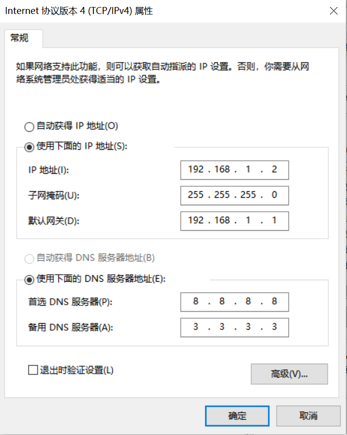
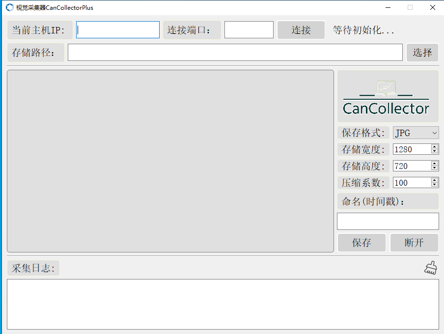

# 11. CanCollectorPlus

## 11.1 CanCollectorPlus简介

嘉楠科技针对K230的开发的在线训练平台[嘉楠开发者社区 (canaan-creative.com)](https://developer.canaan-creative.com/model/training)和[AI CUBE](https://kendryte-download.canaan-creative.com/developer/common/AI_Cube_V1.0.tar.gz)是协助用户实现具体视觉场景从数据到部署的高效工具。用户只需要准备相关场景的数据，就可以实现端到端的全流程上板部署。用户数据质量和数据分布直接影响部署的效果，有时选择经过整理的公开数据集进行训练，导致在K230开发板部署效果难以达到预期效果，甚至差距很大。这一现象主要是因为开发板camera设备和公开数据集采集设备不同，因此部署时开发板采集的数据和训练数据分布不一致或者颜色、光照、视角、分辨率等存在差异。

为了解决上述问题，可以使用开发板手动采集数据，人工标注后进行训练，这样在部署时开发板推理数据和训练数据分布基本一致，差异性较小，部署效果能够得到提升。CanCollectorPlus是基于CANMV-K230开发板开发的视觉采集器的2.0版本，实现视频流预览功能，可以使采集者灵活的调整采集位置。

## 11.2 快速上手

### 11.2.1 准备

- 在SD卡烧录CANMV-K230开发板镜像：[k230_canmv_sdcard_v1.1.0_nncase_v2.4.0.img.gz](https://kendryte-download.canaan-creative.com/developer/k230/k230_canmv_sdcard_V1.1_nncase_V2.4.0.img.gz) ，也可选择其他版本的canmv镜像，该工具不依赖于固定版本，任何版本的canmv镜像均可运行。
- 下载CanCollectorPlus免安装资源包，下载地址：https://kendryte-download.canaan-creative.com/developer/common/CanCollectorPlus.zip
- 安装MobaXterm进行串口通信，下载地址：[https://mobaxterm.mobatek.net](https://mobaxterm.mobatek.net/)

### 11.2.2 网络配置

#### 11.2.2.1 PC端网络配置

控制面板->网络和共享中心->更改适配器设置->以太网网卡->右键属性->选中(TCP/IPv4)->属性

配置IP地址、掩码、网关，配置DNS服务器地址：



#### 11.2.2.2 开发板网络配置

开发板上电，进入大小核通信串口。进入小核命令行，执行：

```
# 查看是否有eth0
ifconfig
# 配置开发板IP，和PC在同一网段下
ifconfig eth0 192.168.1.22
# 查看IP配置
ifconfig
```


### 11.2.3 文件拷贝

解压工具包CanCollectorPlus.zip，将cancollectorplus_onboard.zip解压后的文件拷贝到开发板的/sharefs下。

#### 11.2.3.1 离线拷贝

如果您选择离线拷贝，断电，取出SD卡插入读卡器，将cancollectorplus_onboard.zip解压，从PC端直接复制粘贴即可。

#### 11.2.3.2 局域网拷贝

如果您选择局域网拷贝，请先安装tftpd64，下载地址：https://bitbucket.org/phjounin/tftpd64/downloads/Tftpd64-4.64-setup.exe

网线连接PC和CanMV-K230开发板。

启动tftpd64，配置待传输文件存放目录和服务网卡:


- sharefs说明

```
# 进入小核根目录
cd /
# 查看目录
ls
# sharefs目录是大小核共用目录，因此从小核拷贝到sharefs目录下的文件对大核也可见
cd /sharefs
```


- 文件传输

```
# 配置网络
ifconfig eth0 192.168.1.22
# 以下代码在小核串口执行
cd /sharefs
# 将PC上tftpd64配置文件存放目录中的传输cancollector_onboard.zip至开发板的当前目录
tftp -g -r cancollectorplus_onboard.zip 192.168.1.2
```


解压：

```
unzip cancollectorplus_onboard.zip
```


### 11.2.4 PC端启动

解压工具包CanCollectorPlus.zip，进入CanCollectorPlus目录下：

```
# 命令行执行
start CanCollectorPlus.exe
# 或者双击CanCollectorPlus.exe启动PC端采集界面
```


启动界面后设置当前PC的IP和端口，设置采集图片存储路径：



### 11.2.5 板端启动

小核执行：

```
# ./sender <PC IP> <Port>
./sender 192.168.1.2 8080
```


大核执行：

```
# ./main.elf <debug_mode>
# debug_mode:0为不调式，1为简单调试，2为复杂调试
./main.elf 1
```


### 11.2.6 数据采集

在PC端配置主机IP和端口，或者直接点击连接按钮采用默认配置，建立PC端和K230端的连接。左侧会实时显示K230视频流，

配置采集参数，选择合适的图片，点击保存按钮完成采集。采集的图片会保存在选择的目录下。

采集示例：


保存结果：


退出采集，点击断开按钮，大核命令行输入q并回车，小核输入q并回车。

得到开发板camera的采集图像后可以自行标注并在在线平台或AI CUBE上完成训练得到部署包，完成在K230端部署过程。

### 11.2.7 效果对比

针对眼球病变分割任务，分别使用公开的数据集和使用CanCollectorPlus采集的数据进行训练得到的模型部署效果对比如下：

1. 使用公开数据集训练得到的模型的上板效果如下：


1. 使用CanCollectorPlus采集数据训练得到模型的上板效果如下：


通过上图的对比，我们可以明显看到，使用公开数据集进行训练得到的模型效果较差；而使用CanCollector采集数据标注后进行训练得到的模型在部署时可以比较精确的将中心病变区域分割出来。