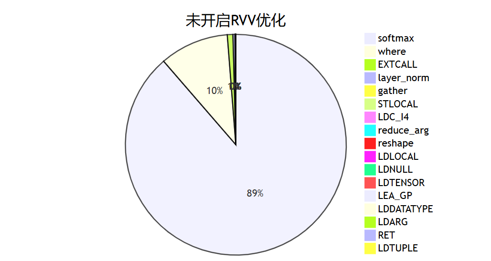
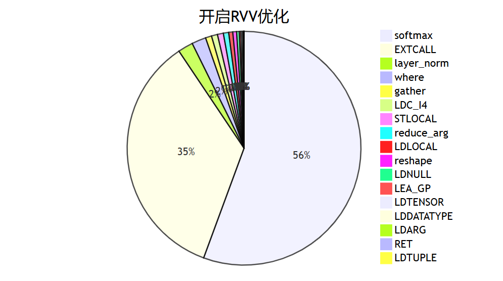
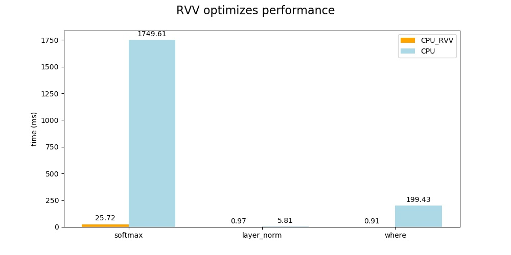

# K230 RVV优化性能说明

## 1. 概述

近些年AI领域的快速发展，衍生出各种各样的神经网络模型，不断出现新的算子。但是AI芯片的迭代周期相比AI模型会长很多，这些新出现的算子多数不能直接使用AI芯片进行推理加速，同时旧的算子中也有一部分不适合使用AI芯片进行推理加速。因此CPU成为这部分算子的执行载体，这也意味着CPU的性能会成为模型部署时影响最终性能的一个因素，而RVV扩展就是RISC-V CPU提升性能的一个重要手段。K230 中采用的玄铁C908双核处理器中大核具备RVV1.0扩展的特性，能够大幅度提升CPU算子推理时的表现。

K230进行模型推理时需要使用 `.kmodel`格式的模型，`.kmodel`是由[nncase](https://github.com/kendryte/nncase) 对 `ONNX`和 `TFLite`模型进行编译后的模型格式，适用于本公司及相关合作企业生产的开发板。nncase支持目前常见的神经网络算子，但是部分算子无法通过K230进行推理加速，这部分算子只能使用CPU进行推理。

## 2. RVV应用场景

目前研究应用最广泛的神经网络 `Transformer`中，模型结构与 `CNN`存在较大差异，很多基于 `CNN`设计的AI芯片无法完全对 `Transformer`进行加速。以下为 `Transformer`中 `Decoder`模型在开启RVV优化和不开启RVV优化的算子执行情况。

### 2.1 未开启RVV优化

| stackvm tensor op | count | time consumption(ms) | percentage(%) |
| ----------------- | ----- | -------------------- | ------------- |
| softmax           | 5     | 1749.61              | 88.6574       |
| where             | 4     | 199.432              | 10.1058       |
| EXTCALL           | 65    | 16.099               | 0.815779      |
| layer_norm        | 7     | 5.81                 | 0.294408      |
| gather            | 2     | 0.393                | 0.0199144     |
| STLOCAL           | 212   | 0.391                | 0.019813      |
| LDC_I4            | 241   | 0.388                | 0.019661      |
| reduce_arg        | 1     | 0.336                | 0.017026      |
| reshape           | 26    | 0.281                | 0.014239      |
| LDLOCAL           | 149   | 0.26                 | 0.0131749     |
| LDNULL            | 106   | 0.166                | 0.00841166    |
| LDTENSOR          | 29    | 0.103                | 0.00521929    |
| LEA_GP            | 58    | 0.097                | 0.00491525    |
| LDDATATYPE        | 29    | 0.07                 | 0.00354709    |
| LDARG             | 5     | 0.008                | 0.000405381   |
| RET               | 1     | 0.004                | 0.000202691   |
| LDTUPLE           | 1     | 0.003                | 0.000152018   |
| total             | 941   | 1973.45              | 100           |

### 2.2 开启RVV优化

| stackvm tensor op | count | time consumption(ms) | percentage(%) |
| ----------------- | ----- | -------------------- | ------------- |
| softmax           | 5     | 25.722               | 55.6175       |
| EXTCALL           | 65    | 16.179               | 34.9831       |
| layer_norm        | 7     | 0.967                | 2.0909        |
| where             | 4     | 0.912                | 1.97198       |
| gather            | 2     | 0.39                 | 0.84328       |
| LDC_I4            | 241   | 0.386                | 0.834631      |
| STLOCAL           | 212   | 0.379                | 0.819495      |
| reduce_arg        | 1     | 0.34                 | 0.735167      |
| LDLOCAL           | 149   | 0.259                | 0.560024      |
| reshape           | 26    | 0.243                | 0.525428      |
| LDNULL            | 106   | 0.17                 | 0.367583      |
| LEA_GP            | 58    | 0.103                | 0.222712      |
| LDTENSOR          | 29    | 0.103                | 0.222712      |
| LDDATATYPE        | 29    | 0.076                | 0.164331      |
| LDARG             | 5     | 0.011                | 0.0237848     |
| RET               | 1     | 0.005                | 0.0108113     |
| LDTUPLE           | 1     | 0.003                | 0.00648677    |
| total             | 941   | 46.248               | 100           |

### 2.3 性能分析及说明

上述模型推理中，K230的KPU单元不支持对 `softmax`、`layer_norm`、`where`、`gather`，`reduce_arg`，`reshape` 进行硬件推理加速，因此需要使用C908实现推理，目前已经完成了对 `softmax`、`layer_norm`、`where`的RVV优化，性能提升明显。

以下为使用RVV优化前后各算子在模型推理时间中的占比图。





以下为使用RVV优化前后相关算子的性能对比。



从以上的对比结果可以看出，在开启RVV优化后能够极大的提升CPU算子的推理性能，缩短整个模型的推理时间(1973–> 46)ms，RVV优化后占据大部分时间的 `softmax`算子时间减少到25ms，`layer_norm`算子时间减少到0.97ms，`where`算子时间减少到0.91ms，整个模型的推理时间缩短了97.6%，在实际模型部署时具有很高的应用价值。

### 2.4 RVV优化示例

#### 2.4.1 RVV代码

具体实现请参考 `nncase`中的[layer_norm](https://github.com/kendryte/nncase/blob/master/src/Native/src/kernels/stackvm/optimized/riscv64/layer_norm.cpp)，需要具备一定RV指令和V扩展指令知识。

`layer_norm`的计算公式如下：

```
y= (x−E[x])/sqrt(Var[x]+ϵ)∗γ+β
```

整体计算流程详见 `layernorm_impl`函数，为了代码具备更高的可读性，该流程中将RVV优化代码拆分成三个部分：

1. 计算 `E[x]`，具体请参考 `get_mean`函数。
2. 计算 `Var[x]`，具体请参考 `get_var`函数。
3. 按照上述公式进行layer_norm的计算，具体请参考 `layer_norm_update1`函数。

由于乘法相比除法耗时更短，第3步的计算中进行了公式变换，使用 `rsqrt`代替 `sqrt`，再用乘法替代除法。

#### 2.4.2 核心代码说明

以下为 `get_mean`中核心代码的说明，这段代码实现了对a1处数组的循环加载求和,求和结果存储在v0,最后求平均值保存在ret中。它利用RVV的向量加载,向量累加指令来实现求和,从而提高计算性能。

```
"vle32.v v8, (a1);"   // 加载a1地址处的32bit向量到v8寄存器
"sub a0,a0, t0;"      // a0 -= t0,用于循环控制计数
"slli t1, t0, 2;"     // t1 = t0 << 2,因为每个float32是4字节,所以地址增加4*t0
"vfredsum.vs v0,v8,v0;"  // v0 += v8,向量累加求和到v0

"add a1, a1, t1;"      // a1 += t1,更新加载地址
"bnez a0, XXXXXX%=;"   // 如果a0!=0,跳转至循环开始地址
"vfmv.f.s f0, v0;"     // 把v0向量累加结果移动到f0
"fcvt.s.w f1, %[avl];"  // 将avl转换为float保存到f1 
"fdiv.s %[ret], f0, f1;" // ret = f0/f1,即求平均值
```

#### 2.4.3 添加RVV算子流程

以下流程中路径均以[nncase](https://github.com/kendryte/nncase)作为根目录

1. 函数声明：src/Native/src/kernels/stackvm/optimized/opt_ops.h
2. 算子实现：
   - 通用优化 src/Native/src/kernels/stackvm/optimized
   - x86优化 src/Native/src/kernels/stackvm/optimized/x86_64
   - RVV优化 src/Native/src/kernels/stackvm/optimized/riscv64
3. 逻辑调用：src/Native/src/kernels/stackvm/tensor_ops.cpp
4. 修改CMakeLists：src/Native/src/kernels/stackvm/optimized/CMakeLists.txt
   - 通用优化：15行增加源文件名
   - 特定平台优化：44行增加源文件名

### 2.5 tips

如果遇到尚未支持RVV优化的算子，且需要进行支持的，欢迎在[nncase提issue和PR](https://github.com/kendryte/nncase/issues)。