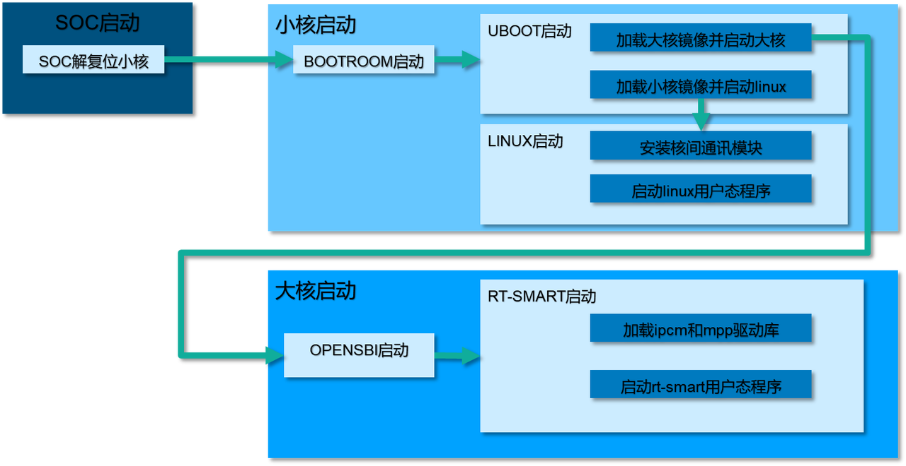
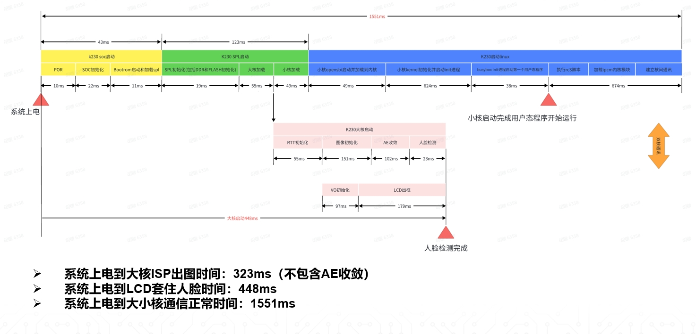

# K230 启动优化指南

## 1.k230启动顺序

k230整体启动流程如下图所示



## 2.启动时间测量

### 2.1 软件测量

k230的CPU核为RISCV，用户可以在大小核的任意软件内使用以下代码获取当前时间。

```
uint64_t perf_get_smodecycles(void)
{
    uint64_t cnt;
    __asm__ __volatile__(
        "rdcycle %0" : "=r"(cnt)
    );
    return cnt;
}
```

获取的值为当前CPU运行的时钟周期数，除以CPU的频率即为当前运行的时间。k230_sdk默认大核的时钟频率为1.6GHz，小核的时钟频率为800MHz。

### 2.2 硬件测量

在需要测量的点加入GPIO的边沿变化，通过逻辑分析仪或示波器可获得更精准的时间。 可通过K230_EVB_LPDDR3_UNSIP板J1的14脚检测开发板上电信号(需要用跳线帽短接15、16脚)。 

### 2.3 外部观测

视频录制整个系统启动过程，板载电源灯亮代表系统上电，VO显示VI图像代表视频pipeline完成建立且可以显示。出现画框框住人脸表示完成人脸识别。 

## 3.系统裁剪

从上一节的图中看出bootrom启动后第一步就是要加载大小核的镜像，所以优化启动时间的第一步就是要先裁剪大小核镜像。

### 3.1 小核裁剪

#### 3.1.1 linux镜像裁剪

请参考文档 中的Linux模块删除章节。

#### 3.1.2 rootfs裁剪

删除rootfs中不会被使用的程序或库，对于门锁POC项目主要包括如下内容，裁剪过程参考文件`k230_sdk/board/k230_evb_doorlock/gen_image_script/gen_doorlock_image.sh`

```
rm -rf usr/bin/fio;
rm -rf usr/bin/lvgl_demo_widgets;
rm -rf usr/bin/ssh*
rm -rf usr/bin/sftp
rm -rf usr/bin/lat*
rm -rf usr/bin/hostapd_cli
rm -rf usr/bin/*test*
rm -rf usr/bin/k230_timer_demo
rm -rf usr/bin/gpio_keys_demo
rm -rf lib/modules/5.10.4+/kernel/drivers/gpu/
rm -rf lib/tuning-server;
rm -rf usr/bin/stress-ng  bin/bash usr/sbin/sshd usr/bin/trace-cmd usr/bin/lvgl_demo_widgets;
```

#### 3.1.3 文件系统选型

当前nor flash支持的文件系统有ubifs和jffs2，门锁POC默认使用ubifs的镜像。他们都是压缩文件系统，ubifs的读写性能要强于jffs2。注意使用ubifs文件系统时，系统下电前，小核需要先输入halt命令，再进行断电否则可能会对文件系统造成破坏

### 3.2大核裁剪

#### 3.2.1 大核应用程序裁剪

strip会去掉应用程序与库的符号信息和调试信息，大大减少空间占用。编译门锁POC时，会在`k230_sdk/board/k230_evb_doorlock/gen_image_script/gen_doorlock_image.sh`中裁剪大核应用程序。

```
/opt/toolchain/riscv64-linux-musleabi_for_x86_64-pc-linux-gnu/bin/riscv64-unknown-linux-musl-strip fastboot_app.elf;
```

### 3.3 裁剪效果

门锁POC项目默认使用的是裁剪后的镜像，各镜像大小如下

- 小核rootfs.ubifs 11M
- 小核系统压缩镜像linux_system.bin(opensbi + image + dtb) 3.8M
- 大核系统压缩镜像rtt_system.bin(opensbi + rtthread.bin) 1.2M
- 大核应用程序fastboot_app.elf 11M
- 大核AI模型 mbface.kmodel + retinaface.kmodel 1.9M

## 4.uboot启动优化

k230_sdk针对uboot代码，集成了快启配置，uboot本身的运行分为俩段SPL+UBOOT，当使能快启时SPL会负责加载后续的大小核镜像并运行，当没有使能快启时，SPL会加载后半段的UBOOT代码运行。代码位置`little/uboot/board/canaan/common/k230_spl.c`

```
int spl_board_init_f(void)
{
    int ret = 0;
    device_disable();
    g_bootmod = sysctl_boot_get_boot_mode();
    ddr_init_training();
    memset(__bss_start, 0, (ulong)&__bss_end - (ulong)__bss_start);
    if(quick_boot()){//默认快起
        //record_boot_time_info("ls");
        ret += k230_img_load_boot_sys(BOOT_SYS_AUTO);
    }
    ret = k230_img_load_boot_sys(BOOT_SYS_UBOOT);
    if(ret )
        printf("uboot boot failed\n");

    return ret;
}
```

quick_boot的返回结果受uboot的环境变量quick_boot影响，用户可手动在uboot下通过setenv命令配置，也可以在k230_sdk中通过`make menuconfig-->board configuration`配置quick_boot。

## 5.linux启动优化

### 5.1 删除内核启动打印

在uboot的默认环境变量配置中，把flash启动时的bootargs中的fw_devlink设置为off，代码文件位置为`src/little/uboot/board/canaan/common/k230_img.c`。linux启动时控制台不再打印启动日志，进入linux命令行后，可以通过dmesg查看内核启动日志。

```
char *board_fdt_chosen_bootargs(void){
    char *bootargs = env_get("bootargs");
    if(NULL == bootargs) {
        if(g_bootmod == SYSCTL_BOOT_SDIO0)
            bootargs = "root=/dev/mmcblk0p3 loglevel=8 rw rootdelay=4 rootfstype=ext4 console=ttyS0,115200 crashkernel=256M-:128M earlycon=sbi";
        else if(g_bootmod == SYSCTL_BOOT_SDIO1)
            bootargs = "root=/dev/mmcblk1p3 loglevel=8 rw rootdelay=4 rootfstype=ext4 console=ttyS0,115200 crashkernel=256M-:128M earlycon=sbi";
        else  if(g_bootmod == SYSCTL_BOOT_NORFLASH)
            //bootargs = "root=/dev/mtdblock9 rw rootwait rootfstype=jffs2 console=ttyS0,115200 earlycon=sbi";
            //bootargs = "ubi.mtd=9 rootfstype=ubifs rw root=ubi0_0 console=ttyS0,115200 earlycon=sbi";
            bootargs = "ubi.mtd=9 rootfstype=ubifs rw root=ubi0_0 console=ttyS0,115200 earlycon=sbi fw_devlink=off quiet";
    }
    //printf("%s\n",bootargs);
    return bootargs;
```

### 5.2 将耗时的驱动编为模块

门锁POC需要用到usb驱动用来连接网络，以及mmc驱动用来导入人脸数据。这俩个驱动probe较为耗时，且会触发外设驱动的probe流程，所以需要将这些驱动编译成模块，内核启动后会使用modprobe机制自动加载他们。config配置可参考`k230_sdk/src/little/linux/arch/riscv/configs/k230_evb_doorlock_defconfig`

```
CONFIG_MMC=m
# CONFIG_MMC_TEST is not set
CONFIG_MMC_SDHCI=m
CONFIG_MMC_SDHCI_PLTFM=m
CONFIG_MMC_SDHCI_OF_KENDRYTE=m
CONFIG_USB=y
CONFIG_USB_ANNOUNCE_NEW_DEVICES=y
CONFIG_USB_STORAGE=y
CONFIG_USB_DWC2=m
CONFIG_USB_TEST=m
CONFIG_USB_GADGET=m
CONFIG_USB_SNP_UDC_PLAT=m
CONFIG_USB_CONFIGFS=m
CONFIG_USB_CONFIGFS_MASS_STORAGE=y
CONFIG_USB_CONFIGFS_F_LB_SS=y
CONFIG_USB_CONFIGFS_F_UVC=y
```

### 5.3 应用程序启动优化

将应用程序的运行时间提前，修改根文件系统中的/etc/inittab文件，使其运行的第一个进程为我们需要率先启动的程序。例如在`k230_sdk/board/k230_evb_doorlock/inittab`文件中，系统第一个启动的进程为`sysinit:nice -n -20 /app/door_lock/ui/ui &`。这个initab文件在编译门锁镜像时，会替换调rootfs中原来的/etc/inittab文件。其中ui程序是门锁POC的小核应用程序

## 6.大核启动优化

### 6.1 rt-smart启动

修改rt-smart内核源码，在shell线程建立前先运行一个init.sh脚本，在脚本中定义要运行的大核程序。代码位置`big/rt-smart/kernel/rt-thread/components/finsh/shell.c`

```
if(shell_thread_first_run) {
    shell_thread_first_run = 0;
    msh_exec("/bin/init.sh", 13);
    continue;
}
```

### 6.2 应用程序优化

以门锁poc为例:`k230_sdk/src/reference/business_poc/doorlock/big/`

应用程序可以通过多线程并行的方式初始化各设备。例如将核间通讯以及vo的初始化单独放在不同的线程中进行。

```
    pthread_create(&ipc_message_handle, NULL, ipc_msg_server, NULL);
    pthread_create(&exit_thread_handle, NULL, exit_app, NULL);
    pthread_create(&vo_thread_handle, NULL, sample_vo_thread, NULL);
```

## 7.其他优化

- k230内置了硬件解压单元，SDK编译的flash镜像为压缩镜像，uboot会使用硬件解压单元对后续的各大小核镜像进行解压，已提高加载速度。

## 8.优化效果

门锁POC的启动时间统计，该统计数据的测量时间为6月9日，与当前最新的sdk版本数据可能存在误差