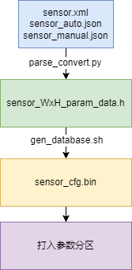
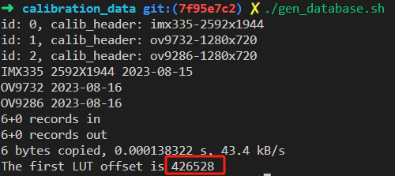

# K230 VICAP SENSOR 参数分区参考

## 1. 概述

### 1.1 概述

ISP对sensor输出的信号进行实时处理的过程中，调优参数和标定参数对ISP处理方式以及图像的复原、增强有着关键的作用。在SDK中默认使用标定xml、auto json、manual json文件作为VICAP运行时导入的调优参数和标定参数配置。在快速启动模式下，默认参数导入方式耗时较高，因此提供了参数分区导入配置参数的方案。

本文档主要描述了制作参数分区及VICAP使用该分区的方法。

## 2. 制作流程参考

### 2.1 流程图

制作流程图如下：



图2-1 参数分区制作流程图

制作步骤如下：

- [第一步，转换头文件](https://developer.canaan-creative.com/k230/zh/dev/01_software/board/mpp/K230_VICAP_SENSOR_参数分区参考.html#id6)
- [第二步，转换二进制文件](https://developer.canaan-creative.com/k230/zh/dev/01_software/board/mpp/K230_VICAP_SENSOR_参数分区参考.html#id7)
- [第三步，使用方法](https://developer.canaan-creative.com/k230/zh/dev/01_software/board/mpp/K230_VICAP_SENSOR_参数分区参考.html#id12)
- [注意事项](https://developer.canaan-creative.com/k230/zh/dev/01_software/board/mpp/K230_VICAP_SENSOR_参数分区参考.html#id13)

### 2.2 制作步骤

#### 2.2.1 转换头文件

以senosr：IMX335，分辨率：2592x1944为例

拷贝参数文件到转换头文件的目录

```
cp k230_sdk/src/big/mpp/userapps/src/sensor/config/imx335-2592x1944.xml k230_sdk/src/big/mpp/userapps/src/vicap/src/isp/sdk/t_frameworks/t_database_c/calibration_data/
cp k230_sdk/src/big/mpp/userapps/src/sensor/config/imx335-2592x1944_auto.json k230_sdk/src/big/mpp/userapps/src/vicap/src/isp/sdk/t_frameworks/t_database_c/calibration_data/
cp k230_sdk/src/big/mpp/userapps/src/sensor/config/imx335-2592x1944_manual.json k230_sdk/src/big/mpp/userapps/src/vicap/src/isp/sdk/t_frameworks/t_database_c/calibration_data/
```

跳转至转换操作目录（工具源码及脚本存放目录）

```
cd k230_sdk/src/big/mpp/userapps/src/vicap/src/isp/sdk/t_frameworks/t_database_c/calibration_data/
```

执行转换头文件工具 *parse_convert.py* ，将拷贝的三个配置文件解析并转换为一个参数头文件（转换工具建议使用python3.x）


```
python parse_convert.py -s imx335 -x imx335-2592x1944.xml -a imx335-2592x1944_auto.json -m imx335-2592x1944_manual.json > imx335_2592x1944_param_data.h
```

```
#ifndef __IMX335_CALIBRATION_H__
#define __IMX335_CALIBRATION_H__

#include "isp_database.h"
#include "k_autoconf_comm.h"
static const TUNING_PARAM_T database_tuning_param =
{
    /* calib data */
    ...
    /* auto data */
    ...
    /* manual data */
    ...
    /* dewarp data */
    ...
    /* version_info */
}
#endif
```

转换后将得到如上的结构体，共五个部分：

calib data、auto data、manual data分别由外部指定的配置文件解析生成

dewarp data需要根据实际配置替换在结构体中，参考[dewarp参数配置](https://developer.canaan-creative.com/k230/zh/dev/01_software/board/mpp/K230_VICAP_SENSOR_参数分区参考.html#dewarp)

version info为转变换工具自动生成，描述sensor name以及创建日期

#### 2.2.2 转换二进制文件

二进制文件由header、配置参数、padding、dewarp参数四个文件拼接而成，考虑到参数分区的实际分配大小，建议最多添加三组配置文件

- [第一步，header制作](https://developer.canaan-creative.com/k230/zh/dev/01_software/board/mpp/K230_VICAP_SENSOR_参数分区参考.html#header)
- [第二步，配置参数二进制文件制作](https://developer.canaan-creative.com/k230/zh/dev/01_software/board/mpp/K230_VICAP_SENSOR_参数分区参考.html#id8)
- [第三步，padding文件制作](https://developer.canaan-creative.com/k230/zh/dev/01_software/board/mpp/K230_VICAP_SENSOR_参数分区参考.html#padding)
- [第四步，dewarp参数配置](https://developer.canaan-creative.com/k230/zh/dev/01_software/board/mpp/K230_VICAP_SENSOR_参数分区参考.html#dewarp)
- [第五步，合并文件](https://developer.canaan-creative.com/k230/zh/dev/01_software/board/mpp/K230_VICAP_SENSOR_参数分区参考.html#id9)
- [其他，脚本化制作方法（推荐使用）](https://developer.canaan-creative.com/k230/zh/dev/01_software/board/mpp/K230_VICAP_SENSOR_参数分区参考.html#id10)

##### 2.2.2.1 header制作

修改 *gen_database_param_bin_calib_header.c* 中的FILENAME_00、FILENAME_01、FILENAME_02的定义，示例如下：

```
#define FILENAME_00 "imx335-2592x1944"
#define FILENAME_01 "ov9732-1280x720"
#define FILENAME_02 "ov9286-1280x720"
```

格式要求为驱动中对应的sensor名称-宽x高，如imx335-2592x1944的配置在驱动中对应的sensor name为imx335且分辨率为2592x1944，则修改FILENAME_0X为”imx335-2592x1944”，该定义将作为使用参数分区时的校验头，如果校验头不匹配，则会默认使用配置文件加载的方式进行读取，并在log中打印相应的警告提示，且校验头定义的名称唯一，不能重复。

可添加三组校验头，一旦顺序固定，则参数分区的顺序也需要与校验头同步，同步方法参考后文[二进制文件制作](https://developer.canaan-creative.com/k230/zh/dev/01_software/board/mpp/K230_VICAP_SENSOR_参数分区参考.html#id8)。

修改定义后将该源码编译为可执行程序并执行，得到header: sensor_cfg_calib_header.bin

```
gcc -o main_header gen_database_param_bin_calib_header.c
./main_header
# 得到sensor_cfg_calib_header.bin
```

##### 2.2.2.2 配置参数二进制文件制作

修改 *gen_database_param_bin.c* 中的 DATABASE_SELECT定义，通过外部编译时传入不同参数制作不同的配置二进制文件，示例如下：

```
#if DATABASE_SELECT == 0
#include "imx335_2592x1944_param_data.h"
#elif DATABASE_SELECT == 1
#include "ov9732_param_data.h"
#elif DATABASE_SELECT == 2
#include "ov9286_param_data.h"
// will append new header file to convert bin, you can make DATABASE_SELECT++, build need add flag "-DDATABASE_SELECT=?, ?:0, 1, 2..."
#endif
```

DATABASE_SELECT的编号决定了不同sensor配置参数的排列顺序，此顺序需要与header的顺序进行同步。示例中imx335_2592x1944_param_data.h、ov9732_param_data.h、ov9286_param_data.h由三组xml json生成。

编译源码并执行

```
DATABASE_CURRENT_DIR=$PWD
DATABASE_CFLAGS="-I$DATABASE_CURRENT_DIR/../include \
 -I$DATABASE_CURRENT_DIR/../../t_common_c/include/  \
 -I$DATABASE_CURRENT_DIR/../../t_json_c/include/    \
 -I$DATABASE_CURRENT_DIR/../../t_mxml_c/mxml-3.3.1/ \
 -I$DATABASE_CURRENT_DIR/../../../../../../../../../include/comm"
gcc -o main_01 gen_database_param_bin.c $DATABASE_CFLAGS -DDATABASE_SELECT=0
gcc -o main_02 gen_database_param_bin.c $DATABASE_CFLAGS -DDATABASE_SELECT=1
gcc -o main_03 gen_database_param_bin.c $DATABASE_CFLAGS -DDATABASE_SELECT=2
$DATABASE_CURRENT_DIR/main_01 0
$DATABASE_CURRENT_DIR/main_02 1
$DATABASE_CURRENT_DIR/main_03 2
# 得到文件sensor_cfg_00.bin(imx335)、sensor_cfg_01.bin(ov9732)、sensor_cfg_02.bin(ov9286)
```

编译多个执行程序，并执行，执行时传入的0 1 2参数为生成的二进制文件名中的序号。

##### 2.2.2.3 padding生成

padding文件存在的目的是为了后续dewarp参数的对齐，方便使用，padding长度会根据header+参数结构体的总长度进行变化，由脚本自动生成。

##### 2.2.2.4 dewarp参数配置

参数分区中定义了dewarp的lut表基本参数，根据此参数可在使用分区时正确的找到dewarp对应的lut文件

```
typedef struct {
    uint8_t has_lut;
    uint64_t lut_offset;
    uint8_t split_enable;
    uint16_t split_horizon_line;
    uint16_t split_vertical_line_up;
    uint16_t split_vertical_line_down;
} DEWARP_SPLIT_T;
```

has_lut: 是否存在dewarp lut文件，此成员设置为0则表示不需要使用dewarp参数，设置为1时表示需要使用dewarp参数

lut_offset: 当has_lut设置为1时，该成员生效，值将对应dewarp参数在参数分区中所在地址的偏移量，具体计算方法为 参数分区基地址 + header size + 参数结构体size + padding size，参数分区基地址在k_autoconf_comm.h中定义为*CONFIG_MEM_SENSOR_CFG_BASE*，该定义随编译的硬件不同有所改变。可通过sdk提供的*gen_database.sh*脚本进行计算，执行时会进行打印：



图2-2 参数分区自动计算dewarp偏移量

split_enable: 默认设置为0

split_horizon_line: 默认8191

split_vertical_line_up: 默认8191

split_vertical_line_down: 默认8191

dewarp的参数文件需要在制作脚本中指定路径，参考后文

示例如下分别为使用dewarp和不使用dewarp时的配置

```
// 使用dewarp的配置
/* dewarp data */
{
    /* has_lut */
    1,
    /* lut_offset */
    CONFIG_MEM_SENSOR_CFG_BASE + 426528, // 426528通过脚本计算得出
    /* split_enable */
    0,
    /* split_horizon_line */
    8191,
    /* split_vertical_line_up */
    8191,
    /* split_vertical_line_down */
    8191,
},

// 不使用dewarp的配置
/* dewarp data */
{
    /* has_lut */
    0,
    /* lut_offset */
    0,
    /* split_enable */
    0,
    /* split_horizon_line */
    8191,
    /* split_vertical_line_up */
    8191,
    /* split_vertical_line_down */
    8191,
},
```

##### 2.2.2.5 合并文件

通过2.2.2.1 - 2.2.2.4产出的文件如下：

| **文件名**                  | **描述**                                   |
| --------------------------- | ------------------------------------------ |
| sensor_cfg_calib_header.bin | header文件                                 |
| sensor_cfg_0X.bin           | 配置参数文件                               |
| padding.bin                 | 用于对齐的文件                             |
| imx335-2592x1944.bin        | dewarp参数文件，生成方法参考dewarp使用指南 |

合并上述文件得到最终用于参数分区的二进制文件 *sensor_cfg.bin*

```
cat sensor_cfg_calib_header.bin \
    sensor_cfg_00.bin sensor_cfg_01.bin \
    sensor_cfg_02.bin \
    padding.bin \
    ../../../../../../../sensor/dewarp/imx335-2592x1944.bin > sensor_cfg.bin
```

按顺序最后合并的文件为k230_sdk/src/big/mpp/userapps/src/sensor/dewarp中生成的dewarp参数文件，若添加新的dewarp参数文件，按顺序在末尾追加即可。

##### 2.2.2.6 脚本化制作二进制文件

sdk中提供了串联流程2.2.2.1 - 2.2.2.5的半自动化脚本 *gen_database.sh* ，用户在完成header、dewarp、参数解析的源码定义后，可通过执行该脚本进行制作，甚至不需要手动执行该脚本，直接编译sdk即可。

```
#!/bin/sh
DATABASE_CURRENT_DIR=$PWD
DATA_SAVE_PATH=../../../../../../../../../../../../tools/gen_image_cfg/data/
DATABASE_CFLAGS="-I$DATABASE_CURRENT_DIR/../include \
 -I$DATABASE_CURRENT_DIR/../../t_common_c/include/  \
 -I$DATABASE_CURRENT_DIR/../../t_json_c/include/    \
 -I$DATABASE_CURRENT_DIR/../../t_mxml_c/mxml-3.3.1/ \
 -I$DATABASE_CURRENT_DIR/../../../../../../../../../include/comm"

# DATABASE_SELECT 0: imx335 2592x1944, 1: ov9732 1280x720, 2: ov9286 1280x720, ...
echo -n

gcc -o main_01 gen_database_param_bin.c $DATABASE_CFLAGS -DDATABASE_SELECT=0
gcc -o main_02 gen_database_param_bin.c $DATABASE_CFLAGS -DDATABASE_SELECT=1
gcc -o main_03 gen_database_param_bin.c $DATABASE_CFLAGS -DDATABASE_SELECT=2

gcc -o main_header gen_database_param_bin_calib_header.c

$DATABASE_CURRENT_DIR/main_header
$DATABASE_CURRENT_DIR/main_01 0
$DATABASE_CURRENT_DIR/main_02 1
$DATABASE_CURRENT_DIR/main_03 2

rm $DATABASE_CURRENT_DIR/main_header
rm $DATABASE_CURRENT_DIR/main_01
rm $DATABASE_CURRENT_DIR/main_02
rm $DATABASE_CURRENT_DIR/main_03

FILE_LENGTH=$(wc -c < sensor_cfg_calib_header.bin)
FILE_LENGTH=$(expr $FILE_LENGTH + $(wc -c < sensor_cfg_00.bin))
FILE_LENGTH=$(expr $FILE_LENGTH + $(wc -c < sensor_cfg_01.bin))
FILE_LENGTH=$(expr $FILE_LENGTH + $(wc -c < sensor_cfg_02.bin))
PADDING_LENGTH=$(expr 16 - $FILE_LENGTH % 16)
dd if=/dev/zero of=padding.bin bs=1 count=$PADDING_LENGTH
echo "The first LUT offset is "$(expr $PADDING_LENGTH + $FILE_LENGTH)

cat sensor_cfg_calib_header.bin\
    sensor_cfg_00.bin sensor_cfg_01.bin\
    sensor_cfg_02.bin\
    padding.bin\
    ../../../../../../../sensor/dewarp/imx335-2592x1944.bin > sensor_cfg.bin
```

##### 2.2.2.6 打入参数分区

制作二进制文件完成后，需要将该文件置于参数分区存放位置，该操作由sdk编译脚本完成，不需要用户自行操作。只需要在k230_sdk/src/big/mpp/userapps/src/vicap/src/isp/sdk/t_frameworks/t_database_c/calibration_data/中制作好文件即可在编译时自动打入。

#### 2.2.3 使用方法

在完成正确的制作流程后，通过VICAP提供的API进行使用

【说明】vicap 解析配置参数的模式

【定义】

```
typedef enum {
    VICAP_DATABASE_PARSE_XML_JSON = 0,
    VICAP_DATABASE_PARSE_HEADER = 1,
} k_vicap_database_parse_mode;
```

【成员】

| **成员名称**                  | 值   | **描述**                            |
| ----------------------------- | ---- | ----------------------------------- |
| VICAP_DATABASE_PARSE_XML_JSON | 0    | 使用xml、auto json、manual json模式 |
| VICAP_DATABASE_PARSE_HEADER   | 1    | 使用参数分区加载模式                |

【注意事项】 内部只校验0和1，其他值无效

【说明】vicap设置参数加载模式

【描述】

根据dev_num，设置不同vicap设备加载ISP参数的方式，默认为0

【语法】

k_s32 kd_mpi_vicap_set_database_parse_mode(k_vicap_dev dev_num, k_vicap_database_parse_mode parse_mode)

【参数】

| **参数名称** | **描述**     | **输入/输出** |
| ------------ | ------------ | ------------- |
| dev_num      | VICAP设备号  | 输入          |
| parse_mode   | 参数加载模式 | 输入          |

【返回值】

| **返回值** | **描述**               |
| ---------- | ---------------------- |
| 正值       | 成功。返回设备描述符   |
| 负值       | 失败，参考错误码定义。 |

【芯片差异】

无。

【需求】

- 头文件：mpi_vicap_api.h
- 库文件：libvicap.a

【注意】

需要在kd_mpi_vicap_init之前完成调用

【举例】

```
typedef enum {
    VICAP_DEV_ID_0 = 0,
    VICAP_DEV_ID_1 = 1,
    VICAP_DEV_ID_2 = 2,
    VICAP_DEV_ID_MAX,
} k_vicap_dev;

int ret = 0;
k_vicap_dev vicap_dev = VICAP_DEV_ID_0;
ret = kd_mpi_vicap_set_database_parse_mode(vicap_dev, VICAP_DATABASE_PARSE_HEADER);
if (ret) {
    printf("kd_mpi_vicap_set_database_parse_mode failed, %d\n", ret);
    return ret;
}
```

#### 2.2.4 注意事项

1. 在生成参数头文件时，dewarp的结构体为默认值，需要根据实际情况填入，并计算偏移值，偏移值可以通过执行 *gen_database.sh* 来自动计算，计算后填入对应的位置
2. *gen_database_param_bin.c* 根据gcc -D的编译选项定义DATABASE_SELECT的值来决定包含哪组头文件并将其制作为参数文件，顺序要与header中定义的顺序编号相同
3. 参数分区功能目前仅在spi nor flash模式下使用，其他模式无参数分区，即使加载也无法使用
4. header制作源码中对于FILENAME_0X的定义格式为：sensor_name-宽x高，该header会在VICAP内部使用时进行校验，VICAP内部采用拼接方式生成校验头进行对比，校验头格式为 驱动配置中使用的sensor_name-输入宽x输入高
5. 转换工具与标定xml、auto json、manual json以及vicap版本匹配，不同版本不兼容
6. 使用参数分区时，VICAP会根据当前使用的sensor配置以及设置的解析模式自行对参数分区进行校验，当校验成功后会取出该组参数进行加载，无需用户额外设置。当校验头对比失败时，自动切换回默认配置参数解析模式