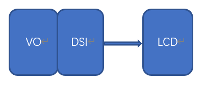

# K230 LCD适配指南

## 1. 概述

本文档主要描述K230平台LCD基本框架以及如何新增支持一款新的LCD。

K230平台支持MIPI-DSI接口的LCD。LCD与主控平台的硬件连接示意图如下：



主控通过MIPI-DSI接口下发配置信息给LCD，同时传输图像数据给LCD。

## 2. LCD适配准备工作

用户在适配新的LCD之前需要做以下准备工作：

1. 从正规渠道获取LCD Datasheet和初始化序列
2. 仔细分析LCD Datasheet获得LCD的输出时序，具体包括：pixelclock、vtotal、vactive、vfp、vbp、vsa、htotal、hactive、hfp、hbp、hsa等等
3. 参考《K230_视频输出_API参考》计算TxDPHY时钟参数

## 3. LCD适配实例

这里以hx8399驱动作为实例进行说明，对应的驱动文件源码路径如下：

```
src/big/mpp/kernel/connector/src/hx8399.c
```

### 3.1 定义支持的LCD类型

在src/big/mpp/include/comm/k_connector_comm.h文件中定义如下枚举变量：

```
typedef enum {
    HX8377_V2_MIPI_4LAN_1080X1920_30FPS = 0,
    LT9611_MIPI_4LAN_1920X1080_30FPS = 1,
    ST7701_V1_MIPI_2LAN_480X800_30FPS = 2,
    ST7701_V1_MIPI_2LAN_480X854_30FPS = 3,
    LT9611_MIPI_ADAPT_RESOLUTION = 100,
    LT9611_MIPI_4LAN_1920X1080_60FPS,
    LT9611_MIPI_4LAN_1920X1080_50FPS,
    LT9611_MIPI_4LAN_1920X1080_25FPS,
    LT9611_MIPI_4LAN_1920X1080_24FPS,
    LT9611_MIPI_4LAN_1280X720_60FPS = 110,
    LT9611_MIPI_4LAN_1280X720_50FPS,
    LT9611_MIPI_4LAN_1280X720_30FPS,
    LT9611_MIPI_4LAN_640X480_60FPS = 120,
} k_connector_type;
```

用户需要增加新的LCD支持类型时，首先需要在这里增加对应类型的定义，**该类型是应用程序获取LCD配置的唯一标志**

### 3.2 LCD驱动适配

LCD驱动适配在整个环节中最重要的环节，用户可以通过拷贝现有的LCD驱动文件来修改

#### 3.2.1 添加LCD初始化代码

```
k_s32 hx8399_init(void *ctx, k_connector_info *info)
{
    k_s32 ret = 0;
    struct connector_driver_dev* dev = ctx;

    ret |= hx8399_set_phy_freq(&info->phy_attr);
    ret |= hx8399_dsi_resolution_init(info);
    ret |= hx8399_dsi_resolution_init(&info->resolution, info->bg_color, info->intr_line);

    return ret;
}
```

1. hx8399_set_phy_freq会初始化TxDPHY输出时序
2. hx8399_dsi_resolution_init初始化MIPI-DSI控制器，包括LCD的初始化固件数据
3. hx8399_dsi_resolution_init初始化显示控制器

#### 3.2.2 实现LCD操作接口

LCD的操作接口由数据类型k_connector_function定义，用户根据实际情况实现相关的操作接口，不是所有接口都必须实现。

```
typedef struct {
    k_s32 (*connector_power) (void *ctx, k_s32 on);
    k_s32 (*connector_init) (void *ctx, k_connector_info *info);
    k_s32 (*connector_get_chip_id) (void *ctx, k_u32 *chip_id);
    k_s32 (*connector_get_negotiated_data) (void *ctx, k_connector_negotiated_data *negotiated_data);
    k_s32 (*connector_conn_check)(void *ctx, k_s32 *conn);
} k_connector_function;
```

以下是LCD的支持的操作集

```
    .connector_func = {
        .connector_power = hx8399_power_on,
        .connector_init = hx8399_init,
        .connector_get_chip_id = hx8399_get_chip_id,
        .connector_conn_check = hx8399_conn_check,
    },
```

#### 3.2.3 定义LCD驱动结构体

LCD驱动结构体由struct connector_driver_dev定义，主要包括LCD驱动名称、GPIO复位信号和LCD操作集合

```
struct connector_driver_dev
{
    struct rt_device  parent;
    struct rt_mutex   connector_mutex;
    k_u8 *connector_name;
    k_connector_function connector_func;

    k_s32 backlight_gpio;
    k_s32 reset_gpio;

    void *driver_data;
};
```

LCD驱动结构体定义及初始化内容如下：

```
struct connector_driver_dev hx8399_connector_drv = {
    .connector_name = "hx8399",
    .connector_func = {
        .connector_power = hx8399_power_on,
        .connector_init = hx8399_init,
        .connector_get_chip_id = hx8399_get_chip_id,
        .connector_conn_check = hx8399_conn_check,
    },
};
```

#### 3.2.4 更新LCD驱动列表

将上一节定义的LCD驱动结构体添加到connector_drv_list数组中。 当前系统支持的LCD列表如下：

```
src/big/mpp/kernel/connector/src/connector_comm.c
extern struct connector_driver_dev hx8399_connector_drv;
extern struct connector_driver_dev lt9611_connector_drv;

struct connector_driver_dev *connector_drv_list[CONNECTOR_NUM_MAX] = {
    &hx8399_connector_drv,
    &lt9611_connector_drv,
};
```

### 3.3 更新LCD配置信息列表

LCD配置信息有结构体k_connector_info定义：

```
typedef struct
{
    k_u32 n;
    k_u32 m;
    k_u32 voc;
    k_u32 hs_freq;
} k_connectori_phy_attr;


typedef struct {
    const char *connector_name;
    k_u32 screen_test_mode;
    k_u32 dsi_test_mode;
    k_u32 bg_color;
    k_u32 intr_line;
    k_dsi_lan_num lan_num;
    k_dsi_work_mode work_mode;
    k_vo_dsi_cmd_mode cmd_mode;
    k_connectori_phy_attr phy_attr;
    k_vo_display_resolution resolution;
    k_connector_type type;
} k_connector_info;
```

以下是HX8399对应的配置信息：

```
src/big/mpp/userapps/src/connector/mpi_connector.c
const k_connector_info connector_info_list[] = {
    {
        "hx8399",
        0,
        0,
        BACKGROUND_BLACK_COLOR,
        11,
        K_DSI_4LAN,
        K_BURST_MODE,
        K_VO_LP_MODE,
        {15, 295, 0x17, 0x96},
        {74250, 445500, 1160, 1080, 20, 20, 40, 2134, 1920, 5, 8, 206},
        HX8377_V2_MIPI_4LAN_1080X1920_30FPS,
    },
```

用户每增加一个LCD配置模式，就需要在sensor_info_list这个结构体中增加一项对应模式的配置。

下面咱们以HX8399 LCD为例进行讲解：

1. {15, 295, 0x17, 0x96} 参数需要参考文档《K230_视频输出_API参考》，进而计算出TxDPHY时钟参数
2. {74250, 445500, 1160, 1080, 20, 20, 40, 2134, 1920, 5, 8, 206} 参数需要参考LCD datasheet
3. HX8377_V2_MIPI_4LAN_1080X1920_30FPS 即咱们在src/big/mpp/include/comm/k_connector_comm.h文件中定义的k_connector_type