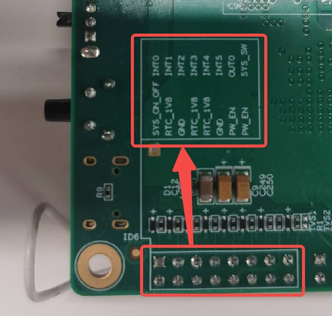

# K230 PMU使用指南

## 1. 功能介绍

PMU模块提供了6个输入和2个输出端口，每个端口功能如下：

1. INT0被默认用作开关机按键，支持长按开机、长按关机事件上报、超长按强制关机、电平或边沿事件上报，支持去抖动，两种长按时间可配
2. INT1支持电平或边沿检测、边沿计数检测，均支持触发开机和上报事件，支持去抖动，边沿计数值可配（建议不要同时打开两种检测模式，边沿检测功能会被覆盖）
3. INT2支持电平或边沿检测，支持触发开机和上报事件，支持去抖动
4. INT3支持电平或边沿检测，支持触发开机和上报事件，支持去抖动
5. INT4支持电平或边沿检测，支持触发开机和上报事件（建议使用边沿检测）
6. INT5支持电平或边沿检测，支持触发开机和上报事件（建议使用边沿检测）
7. OUTPUT0用于控制PMIC
8. OUTPUT1暂未使用

PMU模块还提供了64Byte的log存储功能，其中最后4Byte被驱动使用，剩余60Byte留给用户

## 2. 用户控制

用户可通过设备树和sysfs来控制PMU，系统启动时通过设备树来配置PMU，启动后用户还可通过sysfs动态配置PMU

### 2.1 PMU设备树配置

```
pmu: pmu@0x91000000 {
    compatible = "kendryte, k230-pmu";
    reg = <0x0 0x91000000 0x0 0xb0>;
    interrupt-parent = <&intc>;
    interrupts = <175>;
    status = "disabled";
    /*
    int0 {
        force-powerdown-value = <320000>;
        power-event-value = <96000>;
        debounce-value = <256>;
        type = <IRQ_TYPE_EDGE_RISING>;
        wakeup;
        event;
    };
    int1 {
        debounce-value = <256>;
        edge-cnt-type = <IRQ_TYPE_EDGE_RISING>;
        edge-cnt-value = <1>;
        edge-cnt-wakeup;
        edge-cnt-event;
        type = <IRQ_TYPE_EDGE_RISING>;
        wakeup;
        event;
    };
    int2 {
        debounce-value = <256>;
        type = <IRQ_TYPE_EDGE_RISING>;
        wakeup;
        event;
    };
    int3 {
        debounce-value = <256>;
        type = <IRQ_TYPE_EDGE_RISING>;
        wakeup;
        event;
    };
    int4 {
        type = <IRQ_TYPE_EDGE_FALLING>;
        wakeup;
        event;
    };
    int5 {
        type = <IRQ_TYPE_EDGE_RISING>;
        wakeup;
        event;
    };
    rtc {
        alarm-wakeup;
        alarm-event;
        tick-wakeup;
        tick-event;
    };
    */
};
```

主要字段含义：

- `force-powerdown-value` 超长按强制关机时间
- `power-event-value` 长按开机及长按关机事件时间
- `debounce-value` 去抖动时间
- `type` 检测类型，支持上升沿、下降沿、高电平、低电平
- `wakeup` 使能开机唤醒红能
- `event` 使能事件上报功能
- `edge-cnt-type` 检测类型，支持上升沿、下降沿
- `edge-cnt-value` 边沿计数值

所有时间以(1/32768)秒为单位，例如327680代表10秒

### 2.2 PMU文件控制

PMU sysfs位于`/sys/devices/platform/soc/91000000.pmu`目录下，文件结构如下：

```
.
|-- driver -> ../../../../bus/platform/drivers/k230-pmu
|-- driver_override
|-- int0
|   |-- debounce_value
|   |-- event
|   |-- force_powerdown_value
|   |-- power_event_value
|   |-- type
|   `-- wakeup
|-- int1
|   |-- debounce_value
|   |-- edge_cnt_event
|   |-- edge_cnt_type
|   |-- edge_cnt_value
|   |-- edge_cnt_wakeup
|   |-- event
|   |-- type
|   `-- wakeup
|-- int2
|   |-- debounce_value
|   |-- event
|   |-- type
|   `-- wakeup
|-- int3
|   |-- debounce_value
|   |-- event
|   |-- type
|   `-- wakeup
|-- int4
|   |-- event
|   |-- type
|   `-- wakeup
|-- int5
|   |-- event
|   |-- type
|   `-- wakeup
|-- modalias
|-- of_node -> ../../../../firmware/devicetree/base/soc/pmu@0x91000000
|-- pmu
|   |-- pmu_logs
|   |-- pmu_regs
|   |-- pmu_status
|   `-- wakeup_source
|-- rtc
|   |-- alarm_event
|   |-- alarm_wakeup
|   |-- tick_event
|   `-- tick_wakeup
|-- subsystem -> ../../../../bus/platform
`-- uevent
```

主要文件功能：

- `pmu/pmu_status` PMU状态（只读）
  - `PMU_RESET` PMU被断电
  - `SOC_FORCE_PD` SoC被强制断电
  - `SOC_NORMAL_PD` SoC被正常断电
  - `SOC_RESET` SoC被复位
- `pmu/wakeup_source` 系统唤醒源（只读） INT0，INT1，INT2，INT3，INT4，INT5，RTC_ALARM，RTC_TICK
- `pmu/pmu_logs` 用户LOG文件（二进制文件，读写需要4字节对齐）
- `pmu/pmu_regs` PMU调试（二进制文件，读写需要4字节对齐）
- `int0/force_powerdown_value` 超长按强制关机时间
- `int0/power_event_value` 长按开机及长按关机事件时间
- `int1/edge_cnt_type` 检测类型，有效值”rising”、”falling”
- `int1/edge_cnt_value` 边沿计数值
- `*/debounce_value` 去抖动时间
- `*/type` 检测类型，有效值”rising”、”falling”、”low”、”high”
- `*/*wakeup` 开机唤醒，有效值”enabled”、”disabled”
- `*/*event` 事件上报，有效值”enabled”、”disabled”

例如使能INT1上升沿开机唤醒：

```
cd /sys/devices/platform/soc/91000000.pmu/int1
echo rising > type
echo enabled > wakeup
```

例如使能INT2下降沿事件上报：

```
cd /sys/devices/platform/soc/91000000.pmu/int2
echo falling > type
echo enabled > event
```

### 2.3 PMU事件上报

PMU上报事件使用input子系统，上报事件码为`EV_KEY`，用户可在收到相应事件后进行业务处理。例如收到`KEY_POWER`键值，用户可以执行关机准备和调用`poweroff`命令关机

可以使用`evtest`工具进行测试，事件表如下：

| 动作                     | 按键值    |
| ------------------------ | --------- |
| INT0长按关机             | KEY_POWER |
| INT0电平或边沿           | BTN_0     |
| INT1电平或边沿或边沿计数 | BTN_1     |
| INT2电平或边沿           | BTN_2     |
| INT3电平或边沿           | BTN_3     |
| INT4电平或边沿           | BTN_4     |
| INT5电平或边沿           | BTN_5     |
| RTC_ALARM                | BTN_6     |
| RTC_TICK                 | BTN_7     |

### 2.4 PMU关机控制

1. 使用`poweroff`命令关机
2. 通过超长按INT0按键来强制关机（不推荐，除非系统宕机。*系统宕机后强制关机，会导致不能PMU唤醒*）

## 3. 硬件连接

使用PMU时需要按照以下方式设置EVB板

1. 使用跳线帽连接J1接口的PIN13(OUT0)和PIN14(PW_EN)，注意要断开PIN15(SYS_SW)和PIN16(PW_EN)

2. 根据使用不同的唤醒源使用跳线连接PIN2(SYS_ON_OFF)与对应的PIN，这时按键K1可控制INT的状态，按下按键为高电平，松开为低电平

   | 唤醒源 | PIN  | 标签 |
   | ------ | ---- | ---- |
   | INT0   | 1    | INT0 |
   | INT1   | 3    | INT1 |
   | INT2   | 5    | INT2 |
   | INT3   | 7    | INT3 |
   | INT4   | 9    | INT4 |
   | INT5   | 11   | INT5 |

使用INT0用作唤醒源的连接示意图:

​                                



## 4. 注意事项

1. PMU模块在设备树中默认是未使能的，如果需要使用请在设备树中使能
2. 使用PMU模块时一定要通过任意INT唤醒PMU模块，否则kernel初始化驱动时会卡死