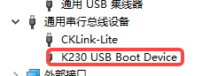
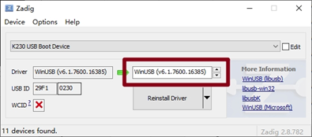
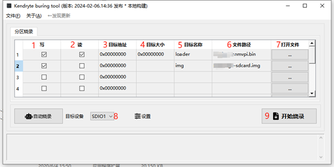
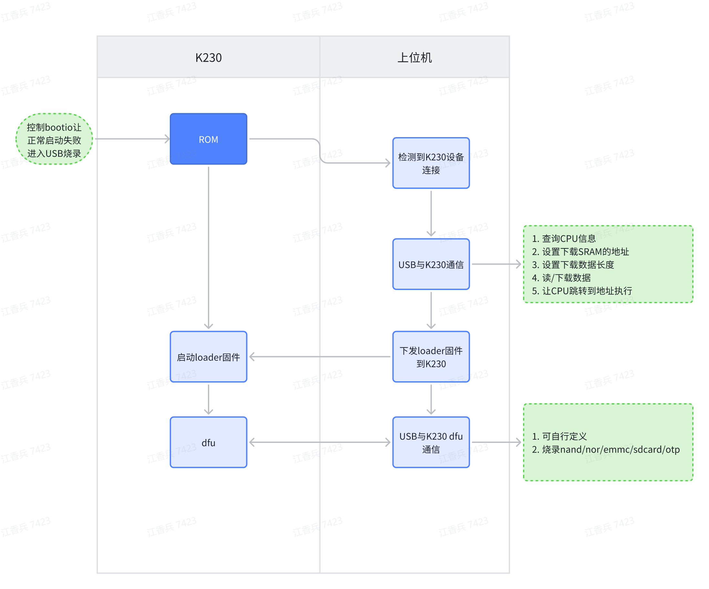

# K230 SDK Burntool使用指南

## 1. K230烧录工具的用途

1. 对于存储器为SD卡的设备，用户可以拔出SD卡烧录镜像。但是对于存储器为emmc/nand/nor设备，用户不能这么做，所以K230提供了通过USB烧录的机制。
2. otp为One Time Programmable，也就是一次性可编程的器件。K230芯片提供了768bytes的空间给用户使用。可以存放MAC地址这种需要与产品永久绑定的信息。顺带提示一下k230芯片是自带随机唯一chipid的，不需要使用otp来存储chipid信息。
3. K230烧录工具v3版本已经支持烧录SD/emmc/nand/nor/otp。支持分区烧录，支持从存储介质读数据。

## 2. K230烧录工具如何使用

k230芯片上电从存储介质启动失败，且检查到连接了usb线，则会进入usb烧录模式。

此时电脑上可以看到k230设备



如果是下面这样的情况，则需要使用zadig-2.8.exe安装usb驱动




下载k230_burntool软件包，打开软件



第一行为loader.bin选择，可以通过打开文件，选择对应设备使用的loader.bin（软件包里面包含了package_canmvpi package_evb package_canmvzero等loader） 。loader.bin是必须要有的，所以第一行除了文件选择，其他的编辑权限都禁止了，避免用户选择困难。

**1** ，第一列,，选择是否写操作，如果只是需要从设备存储介质读数据，则不用勾选。

**2** ，第二列，选择是否读操作，如果只是需要对设备存储介质写数据，则不用勾选。读数据保存文件名为“文件路径+.目标名称”，如fn_ug_u-boot.bin.uboot_a

**3** ，第三列，目标地址,，存储介质的分区起始地址，无论flash还是sd/emmc，都是以字节为单位。sd/emmc固件的分区情况，是与K230_sdk/board/common/gen_image_cfg/genimage-sdcard.cfg 相关的。

**4**，第四列，目标大小。对于sd/emmc/nor烧录，如果 该项为空，则软件会使用文件的实际大小。对于nand，由于有跳过坏块的机制，所以需要用户指定一个分区大小。

**5**，第五列，目标名称。除了第一行的loader是固定的，其他的分区可以随意输入，只要不重复就可以。

**6**，第六列，文件路径。也就是烧录分区文件的路径

**7**，第七列，打开文件。选择烧录分区文件

**8**，目标设备选择，SDIO0/SDIO1既可以接SD卡，也可以接emmc。NOR/NAND可以是接spi0，也可以是接spi1/spi2

**9**，开始烧录。前面的选项配置好后，且让k230芯片处于usb烧录模式后，点击就会开始烧录。

## 3. K230 USB 烧录机制



K230的usb烧录功能是在bootrom中实现的。当bootrom启动过程中启动失败，就会跳转到usb烧录模式。例如，设备使用SD卡作为存储介质，一种方案是通过bootio切换到其他的介质启动，这样k230启动失败就会进入usb烧录模式。另一种方案是拔出SD卡，这样k230启动失败也会进入usb烧录模式。对于emmc/nand/nor的设备，就只能是采用第一种方案了。

ROM只是提供了USB下载数据到SRAM和让CPU执行程序的功能。具体针对存储介质的读写驱动，是由loader.bin来实现的。loader.bin还做了ddr training的操作。

不同的设备DDR training不一样，且存储介质方案可能不一样，所以不同的设备会对应各自的loader.bin。

## 4. K230 烧录工具loader.bin如何开发

sdk1.5的uboot包含了loader.bin的源码。支持以下几款设备。客户自己设计的设备可以参考这些配置文件做修改。

```
k230_canmv_burntool_defconfig
k230d_canmv_burntool_defconfig
k230_evb_burntool_defconfig
```


执行编译

```
cd uboot
export ARCH=riscv
export CROSS_COMPILE=riscv64-unknown-linux-gnu-
make k230_canmv_burntool_defconfig O=out
make -C out -j
```


生成的u-boot.bin就是loader.bin