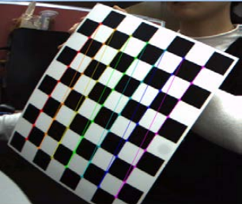
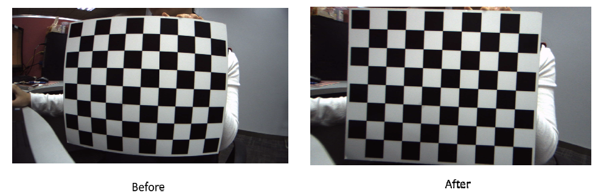
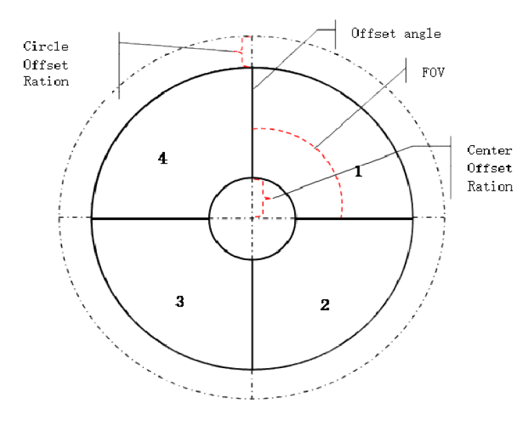

# K230 SDK Dewarp 使用指南

## 1. Dewarp 标定介绍

Dewarp 标定过程产生一个包含相机矩阵和畸变系数的 YAML 文件，K230 SDK 在构建时会通过这个 YAML 文件来生成 remap 文件，并放入大核根文件系统的 `/bin` 目录下，在配置 VICAP 时将 `k_vicap_dev_attr` 结构体的 `dw_enable` 设为1来启用 Dewarp，VICAP 会在当前路径下查找 `<sensor_name>-<width>x<height>.bin` （例如对于 IMX335 全分辨率，即为 `imx335-2592x1944.bin`）文件作为 Dewarp 配置文件进行畸变矫正。

### 1.1 抓取图像

1. 在同一平面上旋转棋盘并拍摄至少 20 张图片
2. 选择涵盖所有角度至少10张照片保存到一个固定目录，推荐选择差异较大的图片



可以使用 sample_vicap.elf 这个程序进行抓取，将保存的YUV文件通过ffmpeg转换为 png/bmp 等易于OpenCV读取的图像格式，参考如下命令

```
ffmpeg -f rawvideo -pixel_format nv12 -video_size 2592x1944 -i dev_00_chn_00_2592x1944_0000.yuv420sp 0.png
```


### 1.3 Dewarp 模式介绍

Dewarp 有多种模式，这里介绍两种，镜头校正(lens correction)和分屏(split screen)。

#### 镜头校正

镜头校正实际上是使用Brown-Conrady畸变模型。输入参数包括相机内部矩阵中的u0、v0、fx和fy，畸变系数中的k1、k2、p1、p2、k3、k4、k5和k6，以及fovRatio，这些参数都可以通过上一步的表标定得到，校正效果如下



#### 分屏

分屏模式不需要标定相机。

下图中的每个扇形图像都被校正为一个小的矩形分屏图像。每个小分屏图像的计算方法类似。在计算每个小图像之后，需要将每个小图像的相应坐标数组拼接成大图像的坐标数组。例如，其中一个小图像的坐标计算过程如下所示。输入参数包括CenterOffsetRatio、CircleOffsetRatio、maxRadius、图像宽度和图像高度，这些参数是每个小输出图像的尺寸，以及输入图像的中心点centerX和centerY。输出的outputX和outputY是相对于输出小图像的坐标。



### 1.2 执行标定程序

创建包含图片路径的xml文件，例如 `imx335-2592x1944-0.xml`，填入上一步保存的图片路径，形如

```
<?xml version="1.0"?>
<opencv_storage>
<images>
images/imx335-2592x1944-0/0.png
...
</images>
</opencv_storage>
```


编辑 `run.bat`，将最后一个参数改为刚才创建的 XML 文件路径，将 -o 参数改为保存输出的 YAML 文件路径，然后执行 `run.bat`

## 2. Dewarp 与 VICAP 模块配合使用

VICAP 通过加载 Dewarp 配置文件来控制畸变校正，K230 SDK编译后生成的Dewarp配置文件放置在 `<K230 SDK> src/big/mpp/userapps/src/sensor/config` 下，后缀名为 .bin 的都是 dewarp 配置文件，其内容的前8个字节为分屏参数，之后全部的内容都是映射表，VICAP会根据文件名匹配当前sensor进行加载。

### 镜头校正模式

注意：**打开Dewarp需要一个额外的vb pool，并将设备属性的 buf_size改为sensor输出buffer大小，可以参考 `sample_vicap.c` 中 `sample_vicap_vb_init` 函数的做法来初始化vb pool。**

在上一步中生成的 YAML 文件需要放入 `<K230 SDK>/src/big/mpp/userapps/src/sensor/dewarp` 目录下，编译 K230 SDK。

如果之前已经编译过 K230 SDK，那么可以不用完整重新编译，放置好 YAML 文件后直接运行 `make mpp-apps` 即可，如果需要制作镜像则还需要运行 `make build-image`。

### 分屏模式

在 K230 SDK 中内置了一个用于生成分屏模式配置文件的程序，源码放在 `<K230 SDK>/src/big/mpp/userapps/src/sensor/dewarp/k230dwmapgen/exe/split_screen.c`，K230 SDK完整编译后会在 `<K230 SDK>/src/big/mpp/userapps/src/sensor/build` 目录生成一个 `k230dwmapgen-splitscreen` 的程序，运行后会将配置文件通过标准输出打印，如果需要保留可以将其重定向到文件，此程序默认为1280x720的相机配置分屏，如果需要修改参数可以修改其源码中 `CreateUpdateWarpPolarMap` 函数的参数，重新编译和运行。