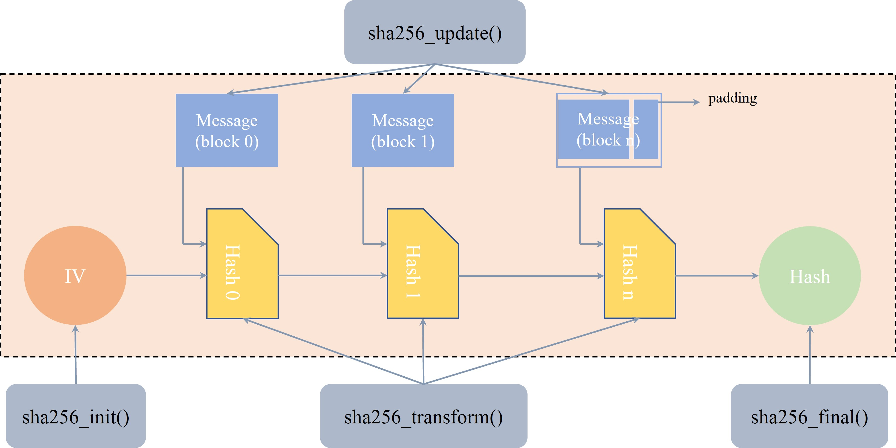

# K230 SHA256 API参考

## 1. 功能介绍

SHA256 主要用于计算数据的 hash 值，大核 rt-smart 中实现了 SHA256 算法，用于计算数据的 hash 值，代码逻辑如下图所示：



## 2. API 参考

SHA256模块主要提供了以下 API：

- [kd_mpi_cipher_sha256](#21-kd_mpi_cipher_sha256)

### 2.1 kd_mpi_cipher_sha256

【描述】

根据传入的消息计算消息的 hash 值。

【语法】

kd_mpi_cipher_sha256(const void \*data, k_u32 len, k_u8 \*hash);

【参数】

| 参数名称        | 描述                          | 输入/输出 |
|-----------------|-------------------------------|-----------|
| data            | 传入的消息                      | 输入      |
| len            | 传入消息的长度                    | 输入      |
| hash            | 计算得到的 hash 值               | 输出      |

【返回值】

| 返回值  | 描述                            |
|---------|---------------------------------|
| 0       | 成功。                          |
| 非 0    | 失败，参考错误码定义 |

【芯片差异】

无

【需求】

- 头文件：mpi_cipher_api.h
- 库文件：libcipher.a

【注意】

无

【举例】

无

【相关主题】

无

## 3. 调试及打印信息

写一个用户态应用程序 *sample_cipher.c* 来测试 SHA256 功能。

测试代码已经写好，位于 *mpp/userapps/sample/sample_cipher* 目录下，具体的调试方法如下：

1. 大核启动之后，进入 *bin* 目录；
1. 运行 *sample_cipher.elf* 程序；
1. 打印信息。

具体的打印信息如下所示：

```shell
msh />cd bin/
msh /bin>./sample_cipher.elf
input = ''
digest: e3b0c442 98fc1c14 9afbf4c8 996fb924 27ae41e4 649b934c a495991b 7852b855
result: PASS

input = 'abc'
digest: ba7816bf 8f01cfea 414140de 5dae2223 b00361a3 96177a9c b410ff61 f20015ad
result: PASS

input = 'abcdbcdecdefdefgefghfghighijhijkijkljklmklmnlmnomnopnopq'
digest: 248d6a61 d20638b8 e5c02693 0c3e6039 a33ce459 64ff2167 f6ecedd4 19db06c1
result: PASS

input = 'The quick brown fox jumps over the lazy dog'
digest: d7a8fbb3 07d78094 69ca9abc b0082e4f 8d5651e4 6d3cdb76 2d02d0bf 37c9e592
result: PASS

input = 'The quick brown fox jumps over the lazy cog'
digest: e4c4d8f3 bf76b692 de791a17 3e053211 50f7a345 b46484fe 427f6acc 7ecc81be
result: PASS

input = 'bhn5bjmoniertqea40wro2upyflkydsibsk8ylkmgbvwi420t44cq034eou1szc1k0mk46oeb7ktzmlxqkbte2sy'
digest: 9085df2f 02e0cc45 5928d0f5 1b27b4bf 1d9cd260 a66ed1fd a11b0a3f f5756d99
result: PASS
```
