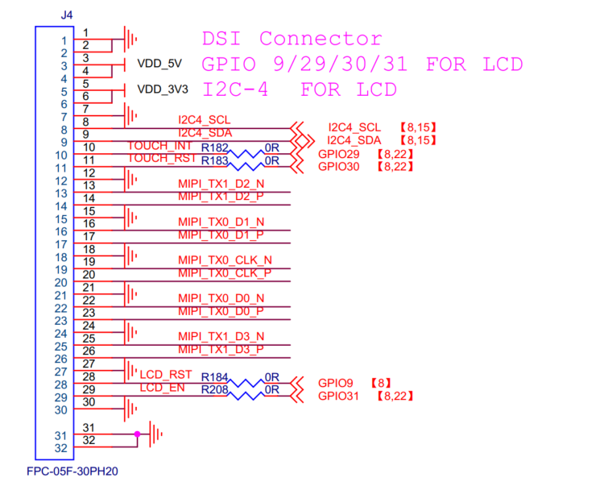
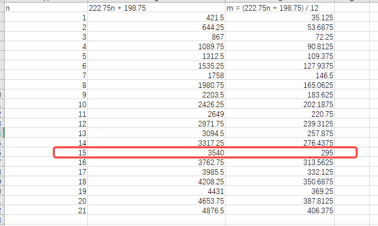
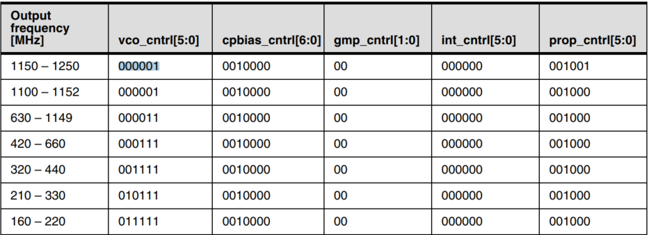
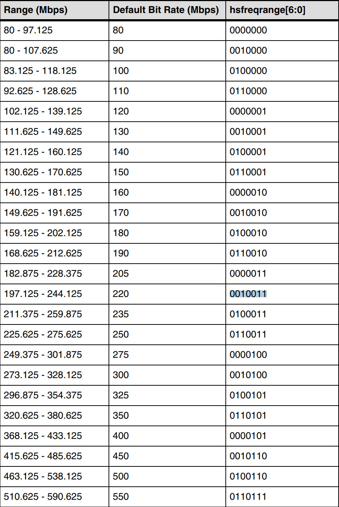
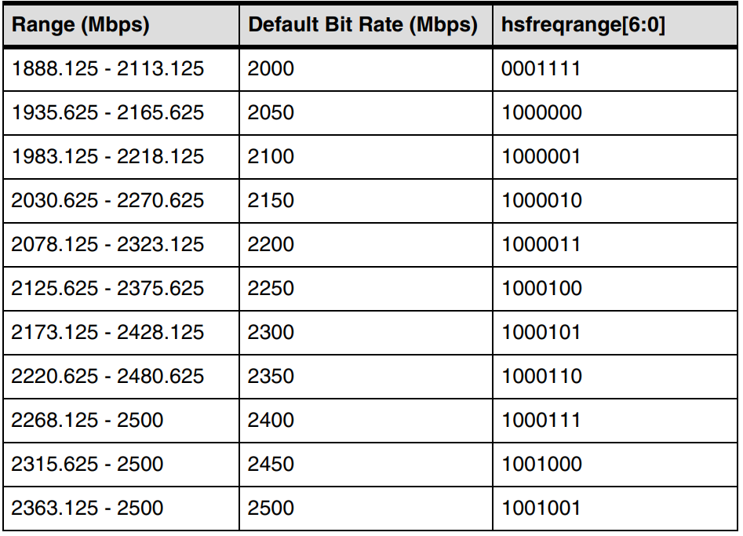
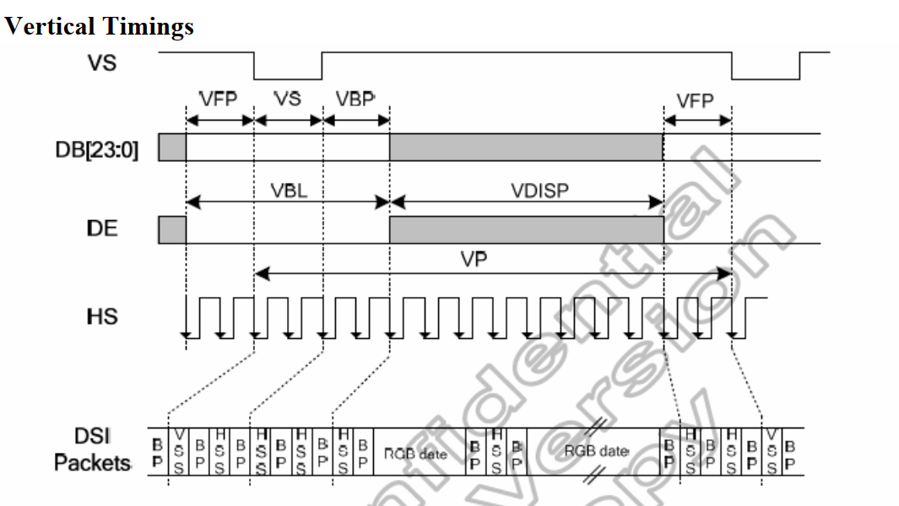
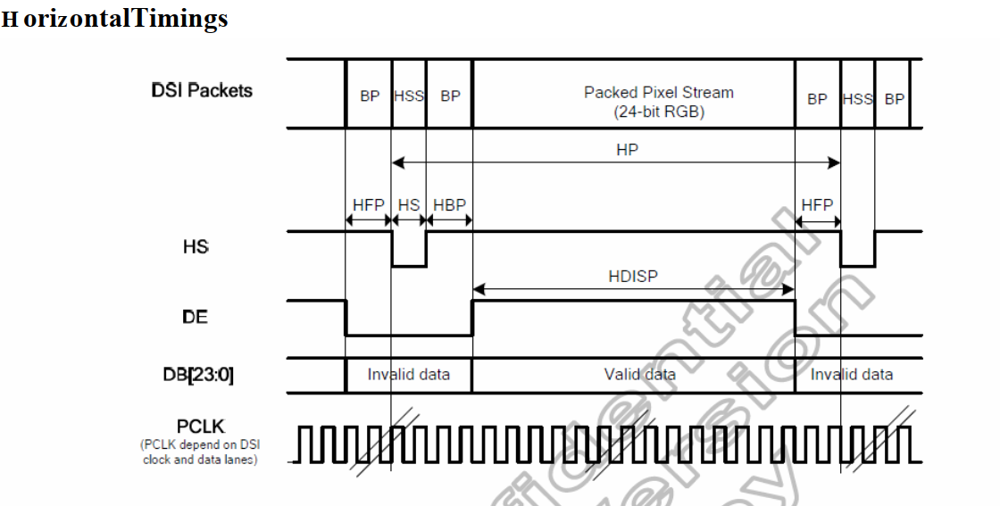

# K230视频输出API参考

## 1. 概述

VO（Video Output，视频输出）模块主动从内存相应位置读取视频和图形数据，并通过相应的显示设备输出视频和图形。芯片支持的显示/回写设备、视频层和图形层情况。

LAYER层支持：

|            | LAYER0             | LAYER1             | LAYER2                    |
|------------|--------------------|--------------------|---------------------------|
| 输入格式   | YUV420 NV12        | YUV420 NV12        | YUV420 NV12 YUV422 NV16 ? |
| 最大分辨率 | 1920x1080          | 1920x1080          | 1920x1080                 |
| 叠加显示   | 支持可配置叠加顺序 | 支持可配置叠加顺序 | 支持可配置叠加顺序        |
| Rotation   | √                  | √                  | -                         |
| Scaler     | √                  | -                  | -                         |
| Mirror     | √                  | √                  | -                         |
| Gray       | √                  | √                  | -                         |
| 独立开关   | √                  | √                  | √                         |

OSD 层支持

|                    | OSD0                                                      | OSD1                                                      | OSD2                                                      | OSD3                                                      |
|--------------------|-----------------------------------------------------------|-----------------------------------------------------------|-----------------------------------------------------------|-----------------------------------------------------------|
| 输入格式           | RGB888  RGB565 ARGB8888 Monochrome-8-bit RGB4444 RGB1555  | RGB888  RGB565 ARGB8888 Monochrome-8-bit RGB4444 RGB1555  | RGB888  RGB565 ARGB8888 Monochrome-8-bit RGB4444 RGB1555  | RGB888  RGB565 ARGB8888 Monochrome-8-bit RGB4444 RGB1555  |
| 最大分辨率         | 1920x1080                                                 | 1920x1080                                                 | 1920x1080                                                 | 1920x1080                                                 |
| 叠加显示           | 支持可配置叠加顺序                                        | 支持可配置叠加顺序                                        | 支持可配置叠加顺序                                        | 支持可配置叠加顺序                                        |
| ARGB 265 等级ALPHA | √                                                         | √                                                         | √                                                         | √                                                         |
| 独立开关           | √                                                         | √                                                         | √                                                         | √                                                         |

### 1.1 硬件描述

本次硬件介绍是以evblp3 做的介绍

#### 1.1.1 Mipi接口

在evblp3 上的硬件引脚如下：



- 屏幕触摸iic用的iic4 （scl：gpio7，sda gpio8）
- 屏幕触摸 rst：gpio29， int：gpio30
- 屏幕的rst：gpio9，backlight：gpio31
- Mipi的引脚和屏幕的引脚一一对应

#### 1.1.2 实物图


- 图中1为mipi接口，采用的是软排线
- 图中2为mipi信号测试点、包含四路data线和一路clk线

### 1.2 软件描述

视频输出软件配置分为3部分配置：phy 配置、dsi配置、VO配置，

#### 1.2.1 PHY的配置流程

phy的频率需要配置三个参数、计算PLL、配置voc、配置freq，根据这三个参数就可以确定txphy的频率，每一个的参数计算如下。

##### 1.2.1.1 计算phy的pll

数据速率由 PLL 输出时钟相位频率的两倍给出：数据速率 (Gbps) = PLL Fout(GHz) \* 2，输出频率是输入参考频率和倍频/分频比的函数。 计算phy 的pll共分为4种范围做的计算，不同的频率对应着不同的频率，它可以通过以下方式确定：

| M      | m+2 |
|--------|-----|
| N      | n+1 |
| Fclkin | 24M |

For：


然而在这个需要遵循下边的限制：


For：


For：


For：


上边的每一个for 对应着一个pll的等级、不同的等级对应着不同的计算公式和限制，计算示例如下：

Example：

mipi 的速率为 445.5M：所以pll的速率就是222.75M，应该选择第二个公式，计算如下

222750000 = 1M / 2N = (m+2) / 2(n+1) \* 24000000 , 整理完成公式如下：

222.75n + 198.75 = 12m ，通过excel 计算如下：



得出来的m = 295 ，n = 15。

配置pll中的m 和n都是整数值、如果所有的值都不是整数，就需要在m 和 n的值做加1和减1处理、反推回去看哪个频率理你需要的最近，再去验证是否可用，不可以就重复上边的操作。

##### 1.2.1.2 配置phy的voc

配置phy 的voc 可以根据表格查询即可：




Example：

mipi 的速率为 445.5M：所以pll的速率就是222.75M，voc = 010111 = 0x17

##### 1.2.1.3 配置freq

配置phy 的freq 可以根据表格查询即可：






Example：

mipi 的速率为 445.5M：pll的速率就是222.75M，freq 选择0100101, 配置这个的时候需要将最高位bit\[7\] = 1，所有freq = 10100101= 0xa5

#### 1.2.2 DSI的配置

DSI（Display Serial Interface）是MIPI 定义的一组通信协议的一部分联盟，主要实现 MIPI DSI 规范中定义的所有协议功能的数字控制器，包含了具有两个和四个通道的双向 PHY。

DSI在软件中主要配置屏幕显示用的timing和发送命令的功能。

##### 1.2.2.1 配置显示器的timing

每个厂家的屏幕都会有一组时序用来做屏幕的控制，主要包含了帧的控制时序和一行的控制时序，如下图所示：





DSI中也会用到这些参数、配置的时序和屏幕一致即可。

##### 1.2.2.2 DSI的命令下发

需要dsi 先进入lp模式、然后就可以发送命令，需要的api如下：

- [kd_mpi_dsi_set_lp_mode_send_cmd](#226-kd_mpi_dsi_set_lp_mode_send_cmd)
- [kd_mpi_dsi_send_cmd](#223-kd_mpi_dsi_send_cmd)

发送的数据是按照8位发送的，会根据数量自动选择发送长包还是短包。

##### 1.2.2.3 DSI 的自测模式

DSI 自测模式会按照自己配置的dsi timing 产生color bar 的数据发送出去，这样不依赖vo从ddr读取数据，测试模式显示如下图：


DSI 和vo之间采用的是24位接口，所以配置出来的color bar 是上图的效果，使用方法只需要配置完成dsi之后使能color bar即可，api如下

- [kd_mpi_dsi_set_test_pattern](#225-kd_mpi_dsi_set_test_pattern)

#### 1.2.3 VO的配置

VO（video output）主要是VO（Video Output，视频输出）模块主动从内存相应位置读取视频和图形数据，并通过相应的显示设备输出视频和图形，VO这部分包含两个配置、一个是timing 的配置、另一个是视频层的配置

##### 1.2.3.1 VO 时序配置

VO的时序配置和dsi 的时序配置采用的一样的配置参数，具体的行和列一样，看dsi timing 介绍即可

##### V1.2.3.2 O的layer层配置

VO layer 层目前支持3个layer层、4个osd层。Layer层只能显示yuv的图像格式（layer0 和 layer1 支持的功能在[概述](#概述)中的图表）。

##### 1.2.3.3 VO 的回写功能配置

VO 还支持回写功能、这个可以验证VO配置的是否正确，VO配置完成之后会将数据写回到ddr 当中，方便验证VO的配置是否出现异常

#### 1.2.4 VO模块的调试方法

##### 1.2.4.1 屏幕的测试方法

- 可以通过LP命令配置屏幕进入自测模式、看产生的图像是否正常
- 通过LP命令读取屏幕寄存器看是否有返回

##### 1.2.4.2 DSI 的测试方法

- 配置完dsi之后，让屏幕进入自测模式，量取信号看时候正常，也可以看屏幕是否产生color bar 的图像
- 查看phy的err 状态寄存器、看是否有err 状态，可以通过proc查看

##### 1.2.4.3 VO的测试方法

- VO配置完成之后、打开writeback 功能，查看是否和配置的要求一致
- 读取DSI的err状态寄存器，查看VO和dsi之间数据传输是否出现underflow和overflow，如果出现、适当的调整timing再次尝试

## 2. API 参考

### 2.1 TXPHY

该功能模块提供以下API：

- [kd_mpi_set_mipi_phy_attr](#211-kd_mpi_set_mipi_phy_attr)

#### 2.1.1 kd_mpi_set_mipi_phy_attr

【描述】

设置phy 的频率

【语法】

k_s32 kd_mpi_set_mipi_phy_attr(k_vo_mipi_phy_attr \*attr)

【参数】

| 参数名称 | 描述               | 输入/输出 |
|----------|--------------------|-----------|
| attr     | Phy 的频率结构描述 | 输入      |

【返回值】

| 返回值 | 描述               |
|--------|--------------------|
| 0      | 成功。             |
| 非0    | 失败，参见错误码。 |

【芯片差异】

无

【需求】

- 头文件： mpi_vo_api.h k_vo_comm.h
- 库文件：libvo.a

【注意】

无

【举例】

无

【相关主题】

无

### 2.2 DSI

该功能模块提供以下API：

- [kd_mpi_dsi_set_attr](#221-kd_mpi_dsi_set_attr)
- [kd_mpi_dsi_enable](#222-kd_mpi_dsi_enable)
- [kd_mpi_dsi_send_cmd](#223-kd_mpi_dsi_send_cmd)
- [kd_mpi_dsi_read_pkg](#224-kd_mpi_dsi_read_pkg)
- [kd_mpi_dsi_set_test_pattern](#225-kd_mpi_dsi_set_test_pattern)
- [kd_mpi_dsi_set_lp_mode_send_cmd](#226-kd_mpi_dsi_set_lp_mode_send_cmd)

#### 2.2.1 kd_mpi_dsi_set_attr

【描述】

配置dsi 属性参数

【语法】

k_s32 kd_mpi_dsi_set_attr(k_display_mode \*attr)【参数】

| 参数名称 | 描述         | 输入/输出 |
|----------|--------------|-----------|
| attr     | dsi 属性参数 | 输入      |

【返回值】

| 返回值 | 描述               |
|--------|--------------------|
| 0      | 成功。             |
| 非0    | 失败，参见错误码。 |

【芯片差异】

无

【需求】

- 头文件： mpi_vo_api.h k_vo_comm.h
- 库文件：libvo.a

【注意】

无

【举例】

无

【相关主题】

无

#### 2.2.2 kd_mpi_dsi_enable

【描述】

打开dsi

【语法】

k_s32 kd_mpi_dsi_enable(void)

【参数】

无

【返回值】

| 返回值 | 描述               |
|--------|--------------------|
| 0      | 成功。             |
| 非0    | 失败，参见错误码。 |

【芯片差异】

无

【需求】

- 头文件： mpi_vo_api.h
- 库文件：libvo.a

【注意】

无

【举例】

无

【相关主题】

无

#### 2.2.3 kd_mpi_dsi_send_cmd

【描述】

Dsi 发送命令

【语法】

k_s32 kd_mpi_dsi_send_cmd(k_u8 \*data, k_s32 cmd_len)

【参数】

| 参数名称 | 描述       | 输入/输出 |
|----------|------------|-----------|
| data     | 发送的数据 | 输入      |
| cmd_len  | 数据长度   | 输入      |

【返回值】

| 返回值 | 描述               |
|--------|--------------------|
| 0      | 成功。             |
| 非0    | 失败，参见错误码。 |

【芯片差异】

无

【需求】

- 头文件： mpi_vo_api.h
- 库文件：libvo.a

【注意】

无

【举例】

无

【相关主题】

无

#### 2.2.4 kd_mpi_dsi_read_pkg

【描述】

Dsi 读取命令

【语法】

k_s32 kd_mpi_dsi_read_pkg(k_u8 \*rx_buf, k_s32 cmd_len)

【参数】

| 参数名称 | 描述       | 输入/输出 |
|----------|------------|-----------|
| rx_buf,  | 接受的数据 | 输入      |
| cmd_len  | 数据长度   | 输入      |

【返回值】

| 返回值 | 描述               |
|--------|--------------------|
| 0      | 成功。             |
| 非0    | 失败，参见错误码。 |

【芯片差异】

无

【需求】

- 头文件： mpi_vo_api.h
- 库文件：libvo.a

【注意】

无

【举例】

无

【相关主题】

无

#### 2.2.5 kd_mpi_dsi_set_test_pattern

【描述】

配置dsi 进入自测模式

【语法】

k_s32 kd_mpi_dsi_set_test_pattern(void)

【参数】、

无

【返回值】

| 返回值 | 描述               |
|--------|--------------------|
| 0      | 成功。             |
| 非0    | 失败，参见错误码。 |

【芯片差异】

无

【需求】

- 头文件： mpi_vo_api.h
- 库文件：libvo.a

【注意】

无

【举例】

无

【相关主题】

无

#### 2.2.6 kd_mpi_dsi_set_lp_mode_send_cmd

【描述】

配置dsi 进入lp mode 发送命令

【语法】

k_s32 kd_mpi_dsi_set_lp_mode_send_cmd(void)

【参数】

无

【返回值】

| 返回值 | 描述               |
|--------|--------------------|
| 0      | 成功。             |
| 非0    | 失败，参见错误码。 |

【芯片差异】

无

【需求】

- 头文件： mpi_vo_api.h
- 库文件：libvo.a

【注意】

无

【举例】

无

【相关主题】

无

### 2.3 VO

- [kd_mpi_vo_init](#231-kd_mpi_vo_init)
- [kd_mpi_vo_set_dev_param](#232-kd_mpi_vo_set_dev_param)
- [kd_mpi_vo_enable_video_layer](#233-kd_mpi_vo_enable_video_layer)
- [kd_mpi_vo_disable_video_layer](#234-kd_mpi_vo_disable_video_layer)
- [kd_mpi_vo_enable](#235-kd_mpi_vo_enable)
- [kd_mpi_vo_chn_insert_frame](#236-kd_mpi_vo_chn_insert_frame)
- [kd_mpi_vo_chn_dump_frame](#237-kd_mpi_vo_chn_dump_frame)
- [kd_mpi_vo_chn_dump_release](#238-kd_mpi_vo_chn_dump_release)
- [kd_mpi_vo_osd_enable](#239-kd_mpi_vo_osd_enable)
- [kd_mpi_vo_osd_disable](#2310-kd_mpi_vo_osd_disable)
- [kd_mpi_vo_set_video_osd_attr](#2311-kd_mpi_vo_set_video_osd_attr)
- [kd_mpi_vo_set_wbc_attr](#2312-kd_mpi_vo_set_wbc_attr)
- [kd_mpi_vo_enable_wbc](#2313-kd_mpi_vo_enable_wbc)
- [kd_mpi_vo_disable_wbc](#2314-kd_mpi_vo_disable_wbc)
- [kd_display_reset](#2315-kd_display_reset)
- [kd_display_set_backlight](#2316-kd_display_set_backlight)
- [kd_mpi_vo_set_user_sync_info](#2317-kd_mpi_vo_set_user_sync_info)
- kd_mpi_vo_draw_frame

#### 2.3.1 kd_mpi_vo_init

【描述】

Vo 初始化默认参数

【语法】

k_s32 kd_mpi_vo_init(void);

【参数】

无

【返回值】

| 返回值 | 描述               |
|--------|--------------------|
| 0      | 成功。             |
| 非0    | 失败，参见错误码。 |

【芯片差异】

无

【需求】

- 头文件： mpi_vo_api.h
- 库文件：libvo.a

【注意】

无

【举例】

无

【相关主题】

无

#### 2.3.2 kd_mpi_vo_set_dev_param

【描述】

Dsi 发送命令

【语法】

k_s32 kd_mpi_vo_set_dev_param(k_vo_pub_attr \*attr)

【参数】

| 参数名称 | 描述                             | 输入/输出 |
|----------|----------------------------------|-----------|
| attr     | 视频输出设备公共属性结构体指针。 | 输入      |

【返回值】

| 返回值 | 描述               |
|--------|--------------------|
| 0      | 成功。             |
| 非0    | 失败，参见错误码。 |

【芯片差异】

无

【需求】

- 头文件： mpi_vo_api.h k_vo_comm.h
- 库文件：libvo.a

【注意】

无

【举例】

无

【相关主题】

无

#### 2.3.3 kd_mpi_vo_enable_video_layer

【描述】

配置layer 层属性参数

【语法】

k_s32 kd_mpi_vo_enable_video_layer([k_vo_layer](#315-k_vo_layer) layer)

【参数】

| 参数名称 | 描述                                                 | 输入/输出 |
|----------|------------------------------------------------------|-----------|
| layer    | 视频输出视频层号 取值范围 【0 – K_MAX_VO_LAYER_NUM】 |  输入     |
| attr     | 视频层属性结构体指针                                 | 输入      |

【返回值】

| 返回值 | 描述               |
|--------|--------------------|
| 0      | 成功。             |
| 非0    | 失败，参见错误码。 |

【芯片差异】

无

【需求】

- 头文件： mpi_vo_api.h
- 库文件：libvo.a

【注意】

无

【举例】

无

【相关主题】

无

#### 2.3.4 kd_mpi_vo_disable_video_layer

【描述】

关闭视频层

【语法】

k_s32 kd_mpi_vo_disable_video_layer([k_vo_layer](#315-k_vo_layer) layer)

【参数】

| 参数名称 | 描述                                                 | 输入/输出 |
|----------|------------------------------------------------------|-----------|
| layer    | 视频输出视频层号 取值范围 【0 – K_MAX_VO_LAYER_NUM】 | 输入      |

【返回值】

| 返回值 | 描述               |
|--------|--------------------|
| 0      | 成功。             |
| 非0    | 失败，参见错误码。 |

【芯片差异】

无

【需求】

- 头文件：
- 库文件：

【注意】

无

【举例】

无

【相关主题】

无

#### 2.3.5 kd_mpi_vo_enable

【描述】

打开vo

【语法】

k_u8 kd_mpi_vo_enable(void);

【参数】

无

【返回值】

| 返回值 | 描述               |
|--------|--------------------|
| 0      | 成功。             |
| 非0    | 失败，参见错误码。 |

【芯片差异】

无

【需求】

- 头文件：
- 库文件：

【注意】

无

【举例】

无

【相关主题】

无

#### 2.3.6 kd_mpi_vo_chn_insert_frame

【描述】

插入帧到vo的通道

【语法】

k_s32 kd_mpi_vo_chn_insert_frame(k_u32 chn_num, [k_video_frame_info](#3119-k_video_frame_info) \*vf_info)

【参数】

| 参数名称 | 描述                 | 输入/输出 |
|----------|----------------------|-----------|
| chn_num  | 通道数量             | 输入      |
| vf_info  | 视频帧的结构体指针。 | 输入      |

【返回值】

| 返回值 | 描述               |
|--------|--------------------|
| 0      | 成功。             |
| 非0    | 失败，参见错误码。 |

【芯片差异】

无

【需求】

- 头文件： mpi_vo_api.h k_video_comm.h
- 库文件：libvo.a

【注意】

无

【举例】

无

【相关主题】

无

#### 2.3.7 kd_mpi_vo_chn_dump_frame

【描述】

从vo 的通道中抓取一帧数据

【语法】

k_s32 kd_mpi_vo_chn_dump_frame(k_u32 chn_num, [k_video_frame_info](#3119-k_video_frame_info) \*vf_info, k_u32 timeout_ms);

【参数】

| 参数名称   | 描述               | 输入/输出 |
|------------|--------------------|-----------|
| chn_num    | 通道id             | 输入      |
| vf_info    | 视频帧的结构体指针 | 输入      |
| timeout_ms | 超时时间           | 输入      |

【返回值】

| 返回值 | 描述               |
|--------|--------------------|
| 0      | 成功。             |
| 非0    | 失败，参见错误码。 |

【芯片差异】

无

【需求】

- 头文件： mpi_vo_api.h k_video_comm.h
- 库文件：libvo.a

【注意】

无

【举例】

无

【相关主题】

无

#### 2.3.8 kd_mpi_vo_chn_dump_release

【描述】

释放抓取帧

【语法】

k_s32 kd_mpi_vo_chn_dump_release(k_u32 chn_num, const [k_video_frame_info](#3119-k_video_frame_info) \*vf_info);

【参数】

| 参数名称 | 描述               | 输入/输出 |
|----------|--------------------|-----------|
| chn_num  | 通道id             | 输入      |
| vf_info  | 视频帧的结构体指针 | 输入      |

【返回值】

| 返回值 | 描述               |
|--------|--------------------|
| 0      | 成功。             |
| 非0    | 失败，参见错误码。 |

【芯片差异】

无

【需求】

- 头文件： mpi_vo_api.h k_video_comm.h
- 库文件：libvo.a

【注意】

无

【举例】

无

【相关主题】

无

#### 2.3.9 kd_mpi_vo_osd_enable

【描述】

打开osd层

【语法】

k_s32 kd_mpi_vo_osd_enable([k_vo_osd](#314-k_vo_osd) layer)

【参数】

| 参数名称 | 描述                                               | 输入/输出 |
|----------|----------------------------------------------------|-----------|
| layer    | 视频输出视频层号 取值范围 【0 – K_MAX_VO_OSD_NUM】 | 输入      |

【返回值】

| 返回值 | 描述               |
|--------|--------------------|
| 0      | 成功。             |
| 非0    | 失败，参见错误码。 |

【芯片差异】

无

【需求】

- 头文件：mpi_vo_api.h k_vo_comm.h
- 库文件：libvo.a

【注意】

无

【举例】

无

【相关主题】

无

#### 2.3.10 kd_mpi_vo_osd_disable

【描述】

关闭osd层

【语法】

k_s32 kd_mpi_vo_osd_disable([k_vo_osd](#314-k_vo_osd) layer)

【参数】

| 参数名称 | 描述                                               | 输入/输出 |
|----------|----------------------------------------------------|-----------|
| layer    | 视频输出视频层号 取值范围 【0 – K_MAX_VO_OSD_NUM】 | 输入      |

【返回值】

| 返回值 | 描述               |
|--------|--------------------|
| 0      | 成功。             |
| 非0    | 失败，参见错误码。 |

【芯片差异】

无

【需求】

- 头文件：mpi_vo_api.h k_vo_comm.h
- 库文件：libvo.a

【注意】

无

【举例】

无

【相关主题】

无

#### 2.3.11 kd_mpi_vo_set_video_osd_attr

【描述】

设置osd层属性

【语法】

k_s32 kd_mpi_vo_set_video_osd_attr([k_vo_osd](#314-k_vo_osd) layer, [k_vo_video_osd_attr](#3118-k_vo_video_osd_attr) \*attr)

【参数】

| 参数名称       | 描述                                               | 输入/输出 |
|----------------|----------------------------------------------------|-----------|
| layer          | 视频输出视频层号 取值范围 【0 – K_MAX_VO_OSD_NUM】 | 输入      |
| osd 层属性参数 | osd 层属性参数                                     | 输入      |

【返回值】

| 返回值 | 描述               |
|--------|--------------------|
| 0      | 成功。             |
| 非0    | 失败，参见错误码。 |

【芯片差异】

无

【需求】

- 头文件：mpi_vo_api.h k_vo_comm.h
- 库文件：libvo.a

【注意】

无

【举例】

无

【相关主题】

无

#### 2.3.12 kd_mpi_vo_set_wbc_attr

【描述】

设置回写属性

【语法】

k_s32 kd_mpi_vo_set_wbc_attr([k_vo_wbc_attr](#3112-k_vo_wbc_attr) \*attr)

【参数】

| 参数名称 | 描述               | 输入/输出 |
|----------|--------------------|-----------|
| attr     | writeback 属性参数 | 输入      |

【返回值】

| 返回值 | 描述               |
|--------|--------------------|
| 0      | 成功。             |
| 非0    | 失败，参见错误码。 |

【芯片差异】

无

【需求】

- 头文件：mpi_vo_api.h k_vo_comm.h
- 库文件：libvo.a

【注意】

无

【举例】

无

【相关主题】

无

#### 2.3.13 kd_mpi_vo_enable_wbc

【描述】

使能writeback

【语法】

k_s32 kd_mpi_vo_enable_wbc(void)

【参数】

无

【返回值】

| 返回值 | 描述               |
|--------|--------------------|
| 0      | 成功。             |
| 非0    | 失败，参见错误码。 |

【芯片差异】

无

【需求】

- 头文件：mpi_vo_api.h k_vo_comm.h
- 库文件：libvo.a

【注意】

无

【举例】

无

【相关主题】

无

#### 2.3.14 kd_mpi_vo_disable_wbc

【描述】

关闭writeback

【语法】

k_s32 kd_mpi_vo_disable_wbc(void)

【参数】

无

【返回值】

| 返回值 | 描述               |
|--------|--------------------|
| 0      | 成功。             |
| 非0    | 失败，参见错误码。 |

【芯片差异】

无

【需求】

- 头文件：mpi_vo_api.h k_vo_comm.h
- 库文件：libvo.a

【注意】

无

【举例】

无

【相关主题】

无

#### 2.3.15 kd_display_reset

【描述】

复位视频输出子系统

【语法】

k_s32 kd_display_reset(void)

【参数】

无

【返回值】

| 返回值 | 描述               |
|--------|--------------------|
| 0      | 成功。             |
| 非0    | 失败，参见错误码。 |

【芯片差异】

无

【需求】

- 头文件：mpi_vo_api.h k_vo_comm.h
- 库文件：libvo.a

【注意】

无

【举例】

无

【相关主题】

无

#### 2.3.16 kd_display_set_backlight

【描述】

复位屏幕和打开背光

【语法】

k_s32 kd_display_set_backlight(void)

【参数】

无

【返回值】

| 返回值 | 描述               |
|--------|--------------------|
| 0      | 成功。             |
| 非0    | 失败，参见错误码。 |

【芯片差异】

无

【需求】

- 头文件：mpi_vo_api.h k_vo_comm.h
- 库文件：libvo.a

【注意】

无

【举例】

无

【相关主题】

无

#### 2.3.17 kd_mpi_vo_set_user_sync_info

【描述】

设置用户接口时序信息，用于配置时钟源、时钟大小和时钟分频比

【语法】

k_s32 kd_mpi_vo_set_user_sync_info([k_vo_user_sync_info](#318-k_vo_user_sync_info) \*sync_info)

【参数】

| 参数名称 | 描述            | 输入/输出 |
| -------- | --------------- | --------- |
| pre_div  | 用户分频数      | 输入      |
| clk_en   | 分频enable 使能 |           |

【返回值】

| 返回值 | 描述               |
|--------|--------------------|
| 0      | 成功。             |
| 非0    | 失败，参见错误码。 |

【芯片差异】

无

【需求】

- 头文件：mpi_vo_api.h k_vo_comm.h
- 库文件：libvo.a

【注意】

无

【举例】

无

【相关主题】

无

#### 2.3.18 kd_mpi_vo_draw_frame

【描述】

画框

【语法】

k_s32 kd_mpi_vo_draw_frame([k_vo_draw_frame](#3115-k_vo_draw_frame) \*frame)

【参数】

| 参数名称 | 描述           | 输入/输出 |
|----------|----------------|-----------|
| frame    | 画框的属性参数 | 输入      |

【返回值】

| 返回值 | 描述               |
|--------|--------------------|
| 0      | 成功。             |
| 非0    | 失败，参见错误码。 |

【芯片差异】

无

【需求】

- 头文件：mpi_vo_api.h k_vo_comm.h
- 库文件：libvo.a

【注意】

无

【举例】

无

【相关主题】

无

## 3. 数据类型

### 3.1 VO

#### 3.1.1 k_vo_intf_sync

【说明】

定义视频中的分辨率和帧率

【定义】

```c
typedef enum {
K_VO_OUT_1080P30,
K_VO_OUT_1080P60,
}k_vo_intf_sync;
```

【成员】

| 成员名称               | 描述                                           |
|------------------------|------------------------------------------------|
| K_VO_OUT_1080P30       | 1080 是表示1920x1080 个pix。30 表示 30fps      |
| K_VO_OUT_1080P60       | 1080 是表示1920x1080 个pix。60 表示 60fps      |
| K_VO_OUT_1080x1920P30  | 1080x1920 是表示1080x1920 个pix。30 表示 30fps |
| K_VO_OUT_11080x1920P60 | 1080x1920 是表示1080x1920 个pix。60 表示 60fps |

【注意事项】

无

【相关数据类型及接口】

#### 3.1.2 k_vo_intf_type

【说明】

定义视频中的分辨率和帧率

【定义】
```
typedef enum {
&emsp;K_VO_INTF_MIPI = 0,
}k_vo_intf_type;
```
【成员】

| 成员名称       | 描述      |
|----------------|-----------|
| K_VO_INTF_MIPI | Mipi 接口 |

【注意事项】

无

【相关数据类型及接口】

#### 3.1.3 k_pixel_format

【说明】

显示中layer 支持的数据格式，下边结构体中只列举了显示支持的数据格式，并不是所有的数据格式

【定义】
```
typedef enum {  
/\*yuv\*/  
&emsp;PIXEL_FORMAT_YVU_PLANAR_420,
&emsp;PIXEL_FORMAT_YVU_PLANAR_422,
/\*RGB\*/  
&emsp;PIXEL_FORMAT_RGB_565,
&emsp;PIXEL_FORMAT_RGB_888,
/\*ARGB\*/  
&emsp;PIXEL_FORMAT_ARGB_8888,
&emsp;PIXEL_FORMAT_ARGB_4444,
&emsp;PIXEL_FORMAT_ARGB_1555,
&emsp;PIXEL_FORMAT_RGB_MONOCHROME_8BPP,
}k_pixel_format;
```
【成员】

| 成员名称                         | 描述        |
|----------------------------------|-------------|
| PIXEL_FORMAT_YVU_PLANAR_420      | YUV420 NV12 |
| PIXEL_FORMAT_YVU_PLANAR_422      | YUV422 NV16 |
| PIXEL_FORMAT_RGB_565             | RGB565      |
| PIXEL_FORMAT_RGB_888             | RGB888      |
| PIXEL_FORMAT_RGB_MONOCHROME_8BPP |  8 BIT RGB  |
| PIXEL_FORMAT_ARGB_8888           | ARGB8888    |
| PIXEL_FORMAT_ARGB_4444           | ARGB4444    |
| PIXEL_FORMAT_ARGB_1555           | ARGB1444    |

【注意事项】

无

【相关数据类型及接口】

无

#### 3.1.4 k_vo_osd

【说明】

OSD 的数量和每一个osd 的编号

【定义】
```
typedef enum {  
&emsp;K_VO_OSD0,
&emsp;K_VO_OSD1,
&emsp;K_VO_OSD2,
&emsp;K_VO_OSD3,
&emsp;K_MAX_VO_OSD_NUM,
}k_vo_osd;
```
【成员】

| 成员名称         | 描述                |
|------------------|---------------------|
| K_VO_OSD0        | 第0层osd            |
| K_VO_OSD1        | 第1层osd            |
| K_VO_OSD2        | 第2层osd            |
| K_VO_OSD3        | 第3层osd            |
| K_MAX_VO_OSD_NUM |  Osd 层最大数量标志 |

【注意事项】

无

【相关数据类型及接口】

无

#### 3.1.5 k_vo_layer

【说明】

layer 的数量和每一个layer的编号

【定义】
```
typedef enum {  
&emsp;K_VO_LYAER0 = 0,
&emsp;K_VO_LYAER1,
&emsp;K_VO_LYAER2,
&emsp;K_MAX_VO_LAYER_NUM,
}k_vo_layer;
```
成员】

| 成员名称           | 描述                  |
|--------------------|-----------------------|
| K_VO_LYAER0        | 第0层layer            |
| K_VO_LYAER1        | 第1层layer            |
| K_VO_LYAER2        | 第2层layer            |
| K_VO_LYAER3        | 第3层layer            |
| K_MAX_VO_LAYER_NUM |  layer 层最大数量标志 |

【注意事项】

无

【相关数据类型及接口】

无

#### 3.1.6 k_vo_rotation

【说明】

Layer rotation 支持的功能

【定义】
```
typedef enum {
&emsp;K_ROTATION_0 = (0x01L \<\< 0),
&emsp;K_ROTATION_90 = (0x01L \<\< 1),
&emsp;K_ROTATION_180 = (0x01L \<\< 2),
&emsp;K_ROTATION_270 = (0x01L \<\< 3),
} k_vo_rotation;
```
【注意事项】

无

【相关数据类型及接口】

无

#### 3.1.7 k_vo_mirror_mode

【说明】

Layer mirror 支持的功能。

【定义】
```
typedef enum {
&emsp;K_VO_MIRROR_NONE = (0x01L \<\< 4),
&emsp;K_VO_MIRROR_HOR = (0x01L \<\< 5),
&emsp;K_VO_MIRROR_VER = (0x01L \<\< 6),
&emsp;K_VO_MIRROR_BOTH = (0x01L \<\< 7),
} k_vo_mirror_mode;
```
【成员】

| 成员名称         | 描述                    |
|------------------|-------------------------|
| K_VO_MIRROR_NONE | Layer 不做mirror        |
| K_VO_MIRROR_HOR  | Layer 只做水平mirrot    |
| K_VO_MIRROR_VER  | Layer只做垂直mirror     |
| K_VO_MIRROR_BOTH | Layer做垂直和水平mirror |

【注意事项】

无

【相关数据类型及接口】

无

#### 3.1.8 k_vo_user_sync_info

【说明】

用户自定义做时钟分频。

【定义】
```
typedef struct {
&emsp;k_u32 ext_div;
&emsp;k_u32 dev_div;
&emsp;k_u32 clk_en;
} k_vo_user_sync_info;
```
【成员】

| 成员名称 | 描述             |
|----------|------------------|
| ext_div; | Clkext 分频      |
| dev_div  | Clk 分频         |
| clk_en   | Display 时钟使能 |

【注意事项】

无

【相关数据类型及接口】

无

#### 3.1.9 k_vo_point

【说明】

定义坐标信息结构体。

【定义】
```
typedef struct {
&emsp;k_u32 x;
&emsp;k_u32 y;
}k_vo_point;
```
【成员】

| 成员名称 | 描述   |
|----------|--------|
| x        | 横坐标 |
| y        | 纵坐标 |

【注意事项】

无

【相关数据类型及接口】

无

#### 3.1.10 k_vo_size

【说明】

定义大小信息结构体。

【定义】
```
typedef struct {
&emsp;k_u32 width;
&emsp;k_u32 height;
} k_vo_size;
```
【成员】

| 成员名称 | 描述 |
|----------|------|
| width    | 宽度 |
| height   | 高度 |

【注意事项】

无

【相关数据类型及接口】

无

#### 3.1.11 k_vo_video_layer_attr

【说明】

定义 display layer 层属性

【定义】
```
typedef struct {
&emsp;k_point display_rect;
&emsp;k_size img_size;
&emsp;k_pixel_format pixel_format;
&emsp;k_u32 stride;
&emsp;k_u32 uv_swap_en;
&emsp;k_u32 alptha_tpye; //only osd use  
} k_vo_video_layer_attr;
```
【成员】

| 成员名称      | 描述                                                                                                                                                            |
|---------------|-----------------------------------------------------------------------------------------------------------------------------------------------------------------|
| display_rect; | OSD图层的的起始位置                                                                                                                                             |
| img_size      | 图像分辨率结构体，即合成画面的尺寸                                                                                                                              |
| pixel_format  | 视频层支持的数据格式                                                                                                                                            |
| stride        | 图像的stride                                                                                                                                                    |
| uv_swap_en    | Uv 交换                                                                                                                                                         |
| alptha_tpye   | Alptha 的类型，仅osd层使用。分为固定alpha（可分为256等级）、以 RGB 中R作为alpha 通道、以 RGB 中G作为alpha 通道、以 RGB 中B作为alpha 通道、以alpha 通道作为alpha |

【注意事项】

alptha_tpye 仅对osd 层使用

【相关数据类型及接口】

无

#### 3.1.12 k_vo_wbc_attr

【说明】

定义 writeback属性。

【定义】
```
typedef struct {
&emsp;[k_vo_size](#3110-k_vo_size) target_size;
&emsp;[k_pixel_format](#313-k_pixel_format) pixel_format;
&emsp;k_u32 stride;
&emsp;k_u32 y_phy_addr;
} k_vo_wbc_attr;
```
【成员】

| 成员名称       | 描述       |
|---------------|------------|
| target_size   | 回写的目标大小  |
| pixel_format  | 回写的数据格式 |
| pixel_format  | 数据格式   |
| stride;       | 回写的stride   |
| y_addr        | 图像回写的物理地址    |

【注意事项】

y_addr 需要分配空间

【相关数据类型及接口】

无

#### 3.1.13 k_vo_pub_attr

【说明】

配置视频输出设备的公共属性。

【定义】
```
typedef struct {
&emsp;k_u32 bg_color; //yuv
&emsp;[k_vo_intf_type](#312-k_vo_intf_type) intf_type;
&emsp;[k_vo_intf_sync](#311-k_vo_intf_sync) intf_sync;
&emsp;[k_vo_display_resolution](#3116-k_vo_display_resolution) \*sync_info;
&emsp;}k_vo_pub_attr; |
```
【成员】

|           |                          |
|-----------|--------------------------|
| 成员名称  | 描述                     |
| bg_color  | 背景色                   |
| type      | 接口类型，目前只支持mipi |
| intf_sync | 视频中的分辨率和帧率     |
| sync_info | 图像输出的时序           |

【注意事项】

无

【相关数据类型及接口】

无

#### 3.1.14 k_vo_scaler_attr

【说明】

定义 scaler 属性

【定义】
```
typedef struct{
&emsp;k_size in_size;
&emsp;k_size out_size;
&emsp;k_u32 stride;
}k_vo_scaler_attr;
```
【成员】

| 成员名称 | 描述               |
|----------|--------------------|
| in_size  | 输入的尺寸         |
| out_size | 输出的尺寸         |
| stride   | 输入的stride       |
| y_addr   | 图像回写的物理地址 |

【注意事项】

无

【相关数据类型及接口】

无

#### 3.1.15 k_vo_draw_frame

【说明】

定义 画框的 属性

【定义】
```
typedef struct {
&emsp;k_u32 draw_en;
&emsp;k_u32 line_x_start;
&emsp;k_u32 line_y_start;
&emsp;k_u32 line_x_end;
&emsp;k_u32 line_y_end;
&emsp;k_u32 frame_num;
}k_vo_draw_frame;
```
【成员】

| 成员名称     | 描述                     |
|--------------|--------------------------|
| draw_en      | 画框使能                 |
| line_x_start | X 方向的起始             |
| line_y_start | y方向的起始              |
| line_x_end   | X方向的终点未知          |
| line_y_end   | y方向的终点未知          |
| frame_num    | 当前框的num号 【0 - 16】 |

【注意事项】

无

【相关数据类型及接口】

无

#### 3.1.16 k_vo_display_resolution

【说明】

Display timing属性。

【定义】
```
typedef struct{
&emsp;k_u32 pclk;
&emsp;k_u32 phyclk;
&emsp;k_u32 htotal;
&emsp;k_u32 hdisplay;
&emsp;k_u32 hsync_len;
&emsp;k_u32 hback_porch;
&emsp;k_u32 hfront_porch;
&emsp;k_u32 vtotal;
&emsp;k_u32 vdisplay;
&emsp;k_u32 vsync_len;
&emsp;k_u32 vback_porch;
&emsp;k_u32 vfront_porch;
} k_vo_display_resolution;
```
【成员】

| 成员名称     | 描述               |
|--------------|--------------------|
| pclk         | Vo 的pix clk 频率  |
| phyclk       |  d-phy 的频率      |
| htotal       | 一行的总像素       |
| hdisplay     | 一行的有效像素个数 |
| hsync_len    | 行同步的像素个数   |
| hback_porch  | 后肩 的像素个数    |
| hfront_porch | 前肩 的像素个数    |
| vtotal       | 总行数             |
| vdisplay     | 一帧有效的行数     |
| vsync_len    | 帧同步的像素个数   |
| vback_porch  | 后肩 的行数        |
| vfront_porch | 前肩 的行数        |

【注意事项】

无

【相关数据类型及接口】

无

#### 3.1.17 k_vo_mipi_phy_attr

]【说明】

定义 mipi phy 频率的结构体

【定义】
```
typedef struct {
&emsp;k_u32 n;
&emsp;k_u32 m;
&emsp;k_u32 voc;
&emsp;k_u32 phy_lan_num;
&emsp;k_u32 hs_freq;
}k_vo_mipi_phy_attr;
```
【成员】

| 成员名称    | 描述           |
|-------------|----------------|
| n           | Pll 系数       |
| m           | Pll 系数       |
| voc         | Pll 系数       |
| hs_freq     | Phy 的频率范围 |
| phy_lan_num | Phy 的lan 数量 |

【注意事项】

无

【相关数据类型及接口】

无

#### 3.1.18 k_vo_video_osd_attr

【说明】

配置osd层的公共属性。

【定义】
```
typedef struct {
&emsp;[k_vo_point](#3110-k_vo_size) display_rect;
&emsp;[k_vo_size](#3110-k_vo_size) img_size;
&emsp;[k_pixel_format](#313-k_pixel_format) pixel_format;
&emsp;k_u32 stride;
&emsp;k_u8 global_alptha;
} k_vo_video_osd_attr;
```
【成员】

| 成员名称      | 描述       |
|---------------|------------|
| display_rect  | 位置信息   |
| img_size      | 有效的size |
| pixel_format  | 数据格式   |
| stride;       | Stride     |
| global_alptha | 透明度     |

【注意事项】

无

【相关数据类型及接口】

无

#### 3.1.19 k_video_frame_info

【说明】

一帧的信息。

【定义】
```
typedef struct {
&emsp;k_video_frame v_frame; /\*\*\< Video picture frame \*/
&emsp;k_u32 pool_id; /\*\*\< VB pool ID \*/
&emsp;k_mod_id mod_id; /\*\*\< Logical unit for generating video frames \*/
} k_video_frame_info;
```
【成员】

| 成员名称 | 描述        |
|----------|-------------|
| v_frame  | 帧的信息    |
| pool_id  | VB pool ID  |
| mod_id   | Video帧的id |

【注意事项】

无

【相关数据类型及接口】

无

## 4. 错误码

表 41 xxx API 错误码

| 错误代码   | 宏定义                 | 描述           |
|------------|------------------------|----------------|
| 0xa00b8006 | K_ERR_VO_NULL_PTR      | 参数空指针错误 |
| 0xa00b8001 | K_ERR_VO_INVALID_DEVID | 无效dev id     |
| 0xa00b8002 | K_ERR_VO_INVALID_CHNID | 无效 chn id    |
| 0xa00b8005 | K_ERR_VO_UNEXIST       | 视频缓存不存在 |
| 0xa00b8004 | K_ERR_VO_EXIST         | 视频缓存存在   |
| 0xa00b8003 | K_ERR_VO_ILLEGAL_PARAM | 参数设置无效   |
| 0xa00b8010 | K_ERR_VO_NOTREADY      | vo还未就绪     |
| 0xa00b8012 | K_ERR_VO_BUSY          | 系统忙         |
| 0xa00b8007 | K_ERR_VO_NOT_CONFIG    | 不允许配置     |
| 0xa00b8008 | K_ERR_VO_NOT_SUPPORT   | 不支持的操作   |
| 0xa00b8009 | K_ERR_VO_NOT_PERM      | 操作不允许     |
| 0xa00b800c | K_ERR_VO_NOMEM         | 分配内存失败   |
| 0xa00b800d | K_ERR_VO_NOBUF         | 没有buff       |
| 0xa00b800e | K_ERR_VO_BUF_EMPTY     | Buf 为空       |
| 0xa00b800f | K_ERR_VO_BUF_FULL      | Buf 为满       |
| 0xa00b8011 | K_ERR_VO_BADADDR       | 错误的地址     |
| 0xa00b8012 | K_ERR_VO_BUSY          | 系统忙         |
