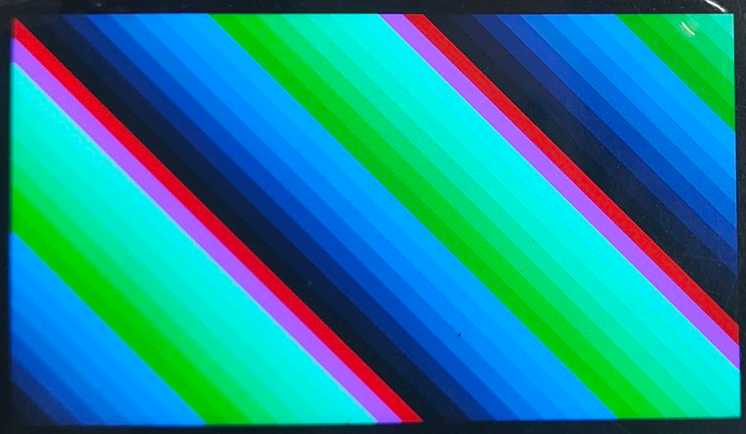

# K230 DRM使用指南

## 1. DRM简介

DRM是linux内核中负责与显卡交互的管理架构，用户程序可以很方便的利用DRM提供的API，实现显示控制、3D渲染、视频编解码、GPU计算等工作

### 1.1 DRM架构特点

DRM是当前Linux内核中主流的图形显示框架，相比于传统的FB架构，具有如下特点：

1. DRM架构原生支持多图层合成，FB架构原生不支持多图层合成
1. DRM架构原生支持VSYNC、DMA_BUF、Fence机制
1. DRM架构统一管理渲染和显示驱动，让软件开发和维护更简单

### 1.2 DRM架构组成

从整体架构来说，DRM主要分成三个部分：

- libdrm

    libdrm会对底层接口进行封装，向用户态提供通用的API接口

    libdrm内部还提供modetest程序，用于查询DRM设备的详细信息，同时还可以进行基本的显示测试
- KMS

    KMS表示内核模式设置，主要设置显示分辨率、颜色空间、刷新率以及显示buffer切换和多图层合成
- GEM

    显存管理，负责显存分配和释放

## 2. modetest使用说明

modetest是由libdrm提供的测试程序，可以查询DRM设备的详细信息，同时还可以进行基本的显示测试

### 2.1 查询K230 DRM详细信息

具体指令如下所示：

```sh
[root@canaan ~ ]#modetest -M canaan-drm
Encoders:
id      crtc    type    possible crtcs  possible clones
37      36      DSI     0x00000001      0x00000001

Connectors:
id      encoder status          name            size (mm)       modes   encoders
38      37      connected       DSI-1           68x120          1       37
  modes:
        index name refresh (Hz) hdisp hss hse htot vdisp vss vse vtot
  #0 1080x1920 30.00 1080 1310 1330 1350 1920 1925 1931 1939 78529 flags: ; type: preferred, driver
  props:
        1 EDID:
                flags: immutable blob
                blobs:

                value:
        2 DPMS:
                flags: enum
                enums: On=0 Standby=1 Suspend=2 Off=3
                value: 0
        5 link-status:
                flags: enum
                enums: Good=0 Bad=1
                value: 0
        6 non-desktop:
                flags: immutable range
                values: 0 1
                value: 0
        4 TILE:
                flags: immutable blob
                blobs:

                value:

CRTCs:
id      fb      pos     size
36      0       (0,0)   (1080x1920)
  #0 1080x1920 30.00 1080 1310 1330 1350 1920 1925 1931 1939 78529 flags: ; type: preferred, driver
  props:
        24 VRR_ENABLED:
                flags: range
                values: 0 1
                value: 0
        28 GAMMA_LUT:
                flags: blob
                blobs:

                value:
        29 GAMMA_LUT_SIZE:
                flags: immutable range
                values: 0 4294967295
                value: 256

Planes:
id      crtc    fb      CRTC x,y        x,y     gamma size      possible crtcs
31      0       0       0,0             0,0     0               0x00000001
  formats: NV12 NV21 NV16 NV61
  props:
        8 type:
                flags: immutable enum
                enums: Overlay=0 Primary=1 Cursor=2
                value: 0
32      0       0       0,0             0,0     0               0x00000001
  formats: AR24 AR12 AR15 RG24 RG16
  props:
        8 type:
                flags: immutable enum
                enums: Overlay=0 Primary=1 Cursor=2
                value: 1
33      0       0       0,0             0,0     0               0x00000001
  formats: AR24 AR12 AR15 RG24 RG16
  props:
        8 type:
                flags: immutable enum
                enums: Overlay=0 Primary=1 Cursor=2
                value: 2
34      0       0       0,0             0,0     0               0x00000001
  formats: AR24 AR12 AR15 RG24 RG16
  props:
        8 type:
                flags: immutable enum
                enums: Overlay=0 Primary=1 Cursor=2
                value: 0
35      0       0       0,0             0,0     0               0x00000001
  formats: AR24 AR12 AR15 RG24 RG16
  props:
        8 type:
                flags: immutable enum
                enums: Overlay=0 Primary=1 Cursor=2
                value: 0

Frame buffers:
id      size    pitch

[root@canaan ~ ]#

```

上述信息即K230 DRM详细信息，以下是简要说明:

| 模块ID | 模块名称 | 模块说明 |
| --- | --- | --- |
| 37 | Encoder | 无 |
| 38 | Connector | 无 |
| 36 | CRTC | 分辨率支持：1080x1920 |
| 31 | video图层 |  颜色空间支持：NV12、NV21、NV16、NV61 |
| 32 | OSD图层 |  颜色空间支持：AR24、AR12、AR15、RG24、RG16 |
| 33 | OSD图层 |  颜色空间支持：AR24、AR12、AR15、RG24、RG16 |
| 34 | OSD图层 |  颜色空间支持：AR24、AR12、AR15、RG24、RG16 |
| 35 | OSD图层 |  颜色空间支持：AR24、AR12、AR15、RG24、RG16 |

AR24表示ARGB8888

AR12表示ARGB4444

AR15表示ARGB1555

RG24表示RGB888

RG16表示RGB565

### 2.2 video图层输出smpte彩条，颜色空间为NV12

具体指令如下所示：

```sh
modetest -M canaan-drm -D 0 -a -s 38@36:1080x1920-30 -P 31@36:1080x1920@NV12 -v -F smpte
```

下图所示为LCD显示内容：


### 2.3 OSD图层输出tiles彩条，颜色空间为AR24，即ARGB8888

具体指令如下

```sh
modetest -M canaan-drm -D 0 -a -s 38@36:1080x1920-30 -P 32@36:1080x1920@AR24 -v -F tiles
```

下图所示为LCD显示内容：


### 2.4 OSD图层输出tiles彩条，颜色空间为RG16，即RGB565

具体指令如下所示：

```sh
modetest -M canaan-drm -D 0 -a -s 38@36:1080x1920-30 -P 32@36:1080x1920@RG16 -v -F tiles
```

下图所示为LCD显示内容：



## 3. DRM API介绍

### 3.1 打开DRM设备

```c
    fd = open("/dev/dri/card0", O_RDWR | O_CLOEXEC);
    if (fd < 0) {
        fprintf(stderr, "open card0 error \n");
        return -1;
    }

```

### 3.2 检索DRM资源

```c
drmModeResPtr drmModeGetResources(int fd);

typedef struct _drmModeRes {

        int count_fbs;
        uint32_t *fbs;

        int count_crtcs;
        uint32_t *crtcs;

        int count_connectors;
        uint32_t *connectors;

        int count_encoders;
        uint32_t *encoders;

        uint32_t min_width, max_width;
        uint32_t min_height, max_height;
} drmModeRes, *drmModeResPtr;

```

代码调用实例如下：

```c
    res = drmModeGetResources(fd);
    if (res == NULL) {
        fprintf(stderr, "drmModeGetResources error \n");
        return -1;
    }
    conn_id = res->connectors[0];
    crtc_id = res->crtcs[0];

```

### 3.3 使能或者禁止DRM相关特性

```c
int drmSetClientCap(int fd, uint64_t capability, uint64_t value);
```

代码调用实例如下：

```c
    ret = drmSetClientCap(fd, DRM_CLIENT_CAP_UNIVERSAL_PLANES, 1);
    if (ret) {
        fprintf(stderr, "drmSetClientCap DRM_CLIENT_CAP_UNIVERSAL_PLANES error \n");
        return -1;
    }

    ret = drmSetClientCap(fd, DRM_CLIENT_CAP_ATOMIC, 1);
    if (ret) {
        fprintf(stderr, "drmSetClientCap DRM_CLIENT_CAP_ATOMIC error \n");
        return -1;
    }
```

### 3.4 检索图层资源

```c
drmModePlaneResPtr drmModeGetPlaneResources(int fd);

typedef struct _drmModePlaneRes {
        uint32_t count_planes;
        uint32_t *planes;
} drmModePlaneRes, *drmModePlaneResPtr;

```

代码调用实例如下：

```c
    plane_res = drmModeGetPlaneResources(fd);
    if (plane_res == NULL) {
        fprintf(stderr, "drmModeGetPlaneResources error \n");
        return -1;
    }
    plane_id = plane_res->planes[1];

```

K230 DRM中，图层对应关系如下所示：

plane_res->planes[0] 表示Video层

plane_res->planes[1] ~ plane_res->planes[4] 表示OSD层

### 3.5 获得Connector

```c
drmModeConnectorPtr drmModeGetConnector(int fd, uint32_t connector_id);

typedef struct _drmModeConnector {
        uint32_t connector_id;
        uint32_t encoder_id; /**< Encoder currently connected to */
        uint32_t connector_type;
        uint32_t connector_type_id;
        drmModeConnection connection;
        uint32_t mmWidth, mmHeight; /**< HxW in millimeters */
        drmModeSubPixel subpixel;

        int count_modes;
        drmModeModeInfoPtr modes;

        int count_props;
        uint32_t *props; /**< List of property ids */
        uint64_t *prop_values; /**< List of property values */

        int count_encoders;
        uint32_t *encoders; /**< List of encoder ids */
} drmModeConnector, *drmModeConnectorPtr;

```

代码调用实例如下：

```c
    conn = drmModeGetConnector(fd, conn_id);
    if (conn == NULL) {
        fprintf(stderr, "drmModeGetConnector error \n");
        return -1;
    }

```

### 3.6 申请DRM DUMB缓冲区

代码调用实例如下：

```c
    creq.width = 1080;
    creq.height = 1920;
    creq.bpp = 32;
    creq.fourcc = DRM_FORMAT_ARGB8888;
    ret = drmIoctl(fd, DRM_IOCTL_MODE_CREATE_DUMB, &creq);
    if (ret < 0) {
        fprintf(stderr, "cannot create dumb buffer (%d): %m\n",
            errno);
        return -errno;
    }

```

### 3.7 提交DRM请求

代码调用实例如下：

```c
int drmModeAtomicCommit(int fd,
                   drmModeAtomicReqPtr req,
                   uint32_t flags,
                   void *user_data);

```

## 4. 注意事项

1. K230 DRM开发测试依赖LCD屏幕

1. K230 DRM内部各个模块ID并不是一成不变的，请根据各模块实际ID进行开发和测试
