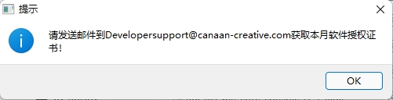
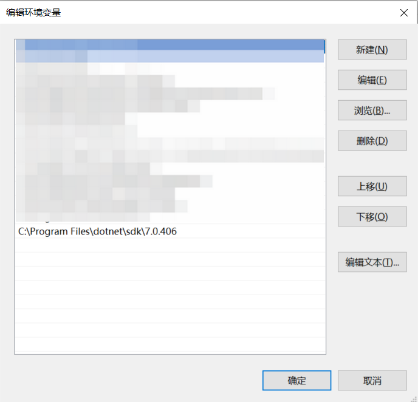

# AI Cube常见问题解答

## 1 AI Cube使用问题

**Notes**： 1、在使用AI Cube前一定要将本月授权License放置在AI Cube安装目录。

2、AI Cube所在的运行环境中必须安装dotnet 7.x SDK，并配置相应环境变量。

3、出现问题后可在AI Cube安装目录中查阅AI_Matrix.log日志信息，可以将该日志信息发送给嘉楠科技技术人员进行问题排查。

问题1：AI Cube在开启页面卡死。

答：需要将本月授权license置于AI Cube安装目录。

问题2：AI Cube打开后遇到license提示。

答：AI Cube内部采用license校验机制，进入AI Cube需要当月的授权license。用户可以向[Developersupport@canaan-creative.com](mailto:Developersupport@canaan-creative.com)发送邮件申请当月授权license，我们的专业团队会为您提供license支持。

问题3： 运行AI Cube时发生闪退，无响应。

答：遇到闪退问题时首先要按照[AI Cube用户指南](https://kendryte-download.canaan-creative.com/developer/common/AI_Cube_V1.2用户指南.pdf)排查是否正确安装Nvidia显卡驱动及dotnet。

其次可能引起原因如下：

- AI Cube首次启动需要等待，用户可进入AI Cube目录手动执行AI Cube.exe来加速打开。
- 系统system32文件夹中缺少libomp.dll。请参考[github issue](https://github.com/kendryte/nncase/issues/451)解决该问题
- dotnet环境变量配置错误。用户可以在系统环境变量部分添加环境变量，例如”C:\Program Files\dotnet\sdk\7.0.406”

